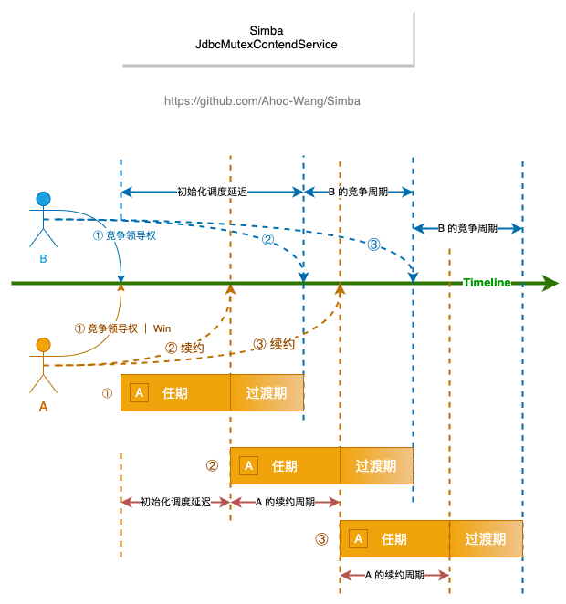

# Simba(Distributed Mutex)

[](https://www.apache.org/licenses/LICENSE-2.0.html)
[](https://github.com/Ahoo-Wang/Simba/releases)
[](https://central.sonatype.com/artifact/me.ahoo.simba/simba-core)
[](https://www.codacy.com/gh/Ahoo-Wang/Simba/dashboard?utm_source=github.com&amp;utm_medium=referral&amp;utm_content=Ahoo-Wang/Simba&amp;utm_campaign=Badge_Grade)
[](https://codecov.io/gh/Ahoo-Wang/Simba)
[](https://deepwiki.com/Ahoo-Wang/Simba)

> [中文文档](https://simba.ahoo.me/zh/) | [English Document](https://simba.ahoo.me/)

## 介绍

Simba 旨在提供易用、灵活的分布式锁服务，支持多种存储后端实现：关系型数据库、Redis、Zookeeper。

## 安装

### Gradle

> Kotlin DSL

``` kotlin
    implementation("me.ahoo.simba:simba-spring-boot-starter:${simbaVersion}")
```

### Maven

```xml
<?xml version="1.0" encoding="UTF-8"?>

<project xmlns="http://maven.apache.org/POM/4.0.0"
         xmlns:xsi="http://www.w3.org/2001/XMLSchema-instance"
         xsi:schemaLocation="http://maven.apache.org/POM/4.0.0 http://maven.apache.org/xsd/maven-4.0.0.xsd">

    <modelVersion>4.0.0</modelVersion>
    <parent>
        <groupId>org.springframework.boot</groupId>
        <artifactId>spring-boot-starter-parent</artifactId>
        <version>4.1.0</version>
        <relativePath/>
    </parent>
    <artifactId>demo</artifactId>
    <properties>
        <simba.version>simbaVersion</simba.version>
    </properties>

    <dependencies>
        <dependency>
            <groupId>me.ahoo.simba</groupId>
            <artifactId>simba-spring-boot-starter</artifactId>
            <version>${simba.version}</version>
        </dependency>
    </dependencies>
    
</project>
```

starter 只提供 Simba 自动配置。请从下文选择并添加一套完整的后端依赖；对应的后端基础设施仍然是必需的。

### application.yaml

```yaml
simba:
  # Required only when more than one backend module is on the classpath.
  backend: jdbc

spring:
  datasource:
    url: jdbc:mysql://localhost:3306/simba_db
    username: root
    password: root
```

### Optional-1: JdbcMutexContendService



> Kotlin DSL

``` kotlin
    implementation("me.ahoo.simba:simba-jdbc:${simbaVersion}")
    implementation("org.springframework.boot:spring-boot-starter-jdbc")
    runtimeOnly("com.mysql:mysql-connector-j")
```

> Maven

```xml
<dependency>
    <groupId>me.ahoo.simba</groupId>
    <artifactId>simba-jdbc</artifactId>
    <version>${simba.version}</version>
</dependency>
<dependency>
    <groupId>org.springframework.boot</groupId>
    <artifactId>spring-boot-starter-jdbc</artifactId>
</dependency>
<dependency>
    <groupId>com.mysql</groupId>
    <artifactId>mysql-connector-j</artifactId>
    <scope>runtime</scope>
</dependency>
```

```sql
create table simba_mutex
(
    mutex             varchar(66)     not null primary key comment 'mutex name',
    acquired_at       bigint unsigned not null,
    ttl_at         bigint unsigned not null,
    transition_at bigint unsigned not null,
    owner_id          varchar(128)    not null,
    version           int unsigned    not null,
    fencing_token     bigint unsigned not null default 0
);
```

### Optional-2: RedisMutexContendService

> Kotlin DSL

``` kotlin
    implementation("me.ahoo.simba:simba-spring-redis:${simbaVersion}")
    implementation("org.springframework.boot:spring-boot-starter-data-redis")
```

> Maven

```xml
<dependency>
    <groupId>me.ahoo.simba</groupId>
    <artifactId>simba-spring-redis</artifactId>
    <version>${simba.version}</version>
</dependency>
<dependency>
    <groupId>org.springframework.boot</groupId>
    <artifactId>spring-boot-starter-data-redis</artifactId>
</dependency>
```

### Optional-3: ZookeeperMutexContendService

> Kotlin DSL

``` kotlin
    implementation("me.ahoo.simba:simba-zookeeper:${simbaVersion}")
```

> Maven

```xml
<dependency>
    <groupId>me.ahoo.simba</groupId>
    <artifactId>simba-zookeeper</artifactId>
    <version>${simba.version}</version>
</dependency>
```

还需按照[快速开始](https://simba.ahoo.me/zh/guide/quick-start.html)注册一个由 Spring 管理的 `CuratorFramework` Bean。

## Examples

[Simba-Examples](https://github.com/Ahoo-Wang/Simba/tree/main/simba-example)

## 使用入门

### MutexContender

```java
        MutexContendService contendService = contendServiceFactory.createMutexContendService(new AbstractMutexContender(mutex) {
            @Override
            public void onAcquired(MutexState mutexState) {
                    log.info("onAcquired");
            }
            
            @Override
            public void onReleased(MutexState mutexState) {
                    log.info("onReleased");
            }
        });
        contendService.start();
        try {
            // 使用互斥保护的服务。
        } finally {
            contendService.stop();
        }
```

### SimbaLocker

```java
        try (Locker locker = new SimbaLocker("mutex-locker", this.mutexContendServiceFactory)) {
            locker.acquire(Duration.ofSeconds(1));
        /**
         * doSomething
         */
        } catch (Exception e) {
            log.error(e.getMessage(), e);
        }
```

### Scheduler

```java
public class ExampleScheduler extends AbstractScheduler implements SmartLifecycle {

    public ExampleScheduler(MutexContendServiceFactory contendServiceFactory) {
        super("example-scheduler", contendServiceFactory);
    }

    @Override
    protected String getWorker() {
        return "ExampleScheduler";
    }

    @Override
    protected ScheduleConfig getConfig() {
        return ScheduleConfig.delay(Duration.ofSeconds(0), Duration.ofSeconds(10));
    }

    @Override
    protected void work() {
        if (log.isInfoEnabled()) {
            log.info("do some work!");
        }
    }
}
```

### Fencing Token

租约只能限定后端授予持有权的时长，限定不了一个被暂停的持有者还会继续操作多久。请把当前任期的 fencing token 传给受保护的资源，由资源拒绝比它见过的最大值更小的 token：

```kotlin
locker.acquire()
repository.save(order, fencingToken = locker.fencingToken)
```

所有后端的 token 都按持有任期严格递增（`0` 表示没有）。Redis 需要持久化计数器（AOF），重启后才能保持单调。

## 升级到 4.0

- **Redis：** 推出 4.0 之前，所有节点都必须先运行 Simba 3.2 或更高版本。
- **JDBC：** fencing token 默认开启。已有的表请执行 [`upgrade-simba-mysql-fencing-token.sql`](simba-jdbc/src/init-script/upgrade-simba-mysql-fencing-token.sql)，或设置 `simba.jdbc.fencing=false`。
- **Spring Boot：** classpath 上有多个后端模块时，请设置 `simba.backend`。
- **API：** `MutexOwner` 改为不可继承的值类型（删除 `MutexOwnerEntity`，`isInTransition` 合并进 `hasOwner()`）；删除 `MutexRetrievalServiceFactory`；`MutexOwnerRepository` 只保留 `acquireAndGetOwner` 和 `release`。`simba-core` 不再引入 Guava 和 cosid。

设计理由参见 [ADR 0003](docs/adr/0003-simba-4.md)。

#### Use Cases

- [Govern-EventBus](https://github.com/Ahoo-Wang/govern-eventbus/tree/master/eventbus-core/src/main/java/me/ahoo/eventbus/core/compensate)
- [CoSky](https://github.com/Ahoo-Wang/CoSky/blob/main/cosky-rest-api/src/main/kotlin/me/ahoo/cosky/rest/stat/StatServiceScheduler.kt)
