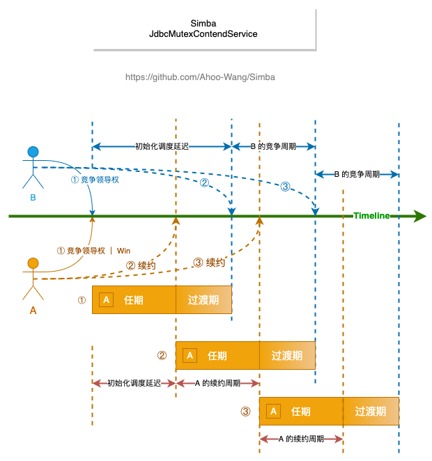

# Simba(Distributed Mutex)

## 介绍

Simba 旨在提供易用、灵活的分布式锁服务，支持多种存储后端实现：关系型数据库、Redis、Zookeeper。

## 安装

### Gradle

> Kotlin DSL

``` kotlin
    val simbaVersion = "0.1.8";
    implementation("me.ahoo.simba:simba-spring-boot-starter:${simbaVersion}")
```

### Maven

```xml
<?xml version="1.0" encoding="UTF-8"?>

<project xmlns="http://maven.apache.org/POM/4.0.0"
         xmlns:xsi="http://www.w3.org/2001/XMLSchema-instance"
         xsi:schemaLocation="http://maven.apache.org/POM/4.0.0 http://maven.apache.org/xsd/maven-4.0.0.xsd">

    <modelVersion>4.0.0</modelVersion>
    <artifactId>demo</artifactId>
    <properties>
        <simba.version>0.1.8</simba.version>
    </properties>

    <dependencies>
        <dependency>
            <groupId>me.ahoo.simba</groupId>
            <artifactId>simba-spring-boot-starter</artifactId>
            <version>${simba.version}</version>
        </dependency>
    </dependencies>
    
</project>
```
### application.yaml

```yaml
simba:
  jdbc:
    enabled: true
#  redis:
#    enabled: true

spring:
  datasource:
    url: jdbc:mysql://localhost:3306/simba_db
    username: root
    password: root
```

### Optional-1: JdbcMutexContendService



> Kotlin DSL

``` kotlin
    val simbaVersion = "0.1.8";
    implementation("me.ahoo.simba:simba-jdbc:${simbaVersion}")
```

```sql
create table simba_mutex
(
    mutex             varchar(66)     not null primary key comment 'mutex name',
    acquired_at       bigint unsigned not null,
    ttl_at         bigint unsigned not null,
    transition_at bigint unsigned not null,
    owner_id          char(32)        not null,
    version           int unsigned    not null
);
```

### Optional-2: RedisMutexContendService

> Kotlin DSL

``` kotlin
    val simbaVersion = "0.1.8";
    implementation("me.ahoo.simba:simba-redis:${simbaVersion}")
```

### Optional-3: ZookeeperMutexContendService

> Kotlin DSL

``` kotlin
    val simbaVersion = "0.1.8";
    implementation("me.ahoo.simba:simba-zookeeper:${simbaVersion}")
```

## Examples

[Simba-Examples](https://github.com/Ahoo-Wang/Simba/tree/main/simba-example)

## 使用入门

### SimbaLocker

```java
        try (Locker locker = new SimbaLocker("mutex-locker", this.mutexContendServiceFactory)) {
            locker.acquire(Duration.ofSeconds(1));
        /**
         * doSomething
         */
        } catch (Exception e) {
            log.error(e.getMessage(), e);
        }
```

### MutexContender

```java
        MutexContendService contendService = contendServiceFactory.createMutexContendService(new AbstractMutexContender(mutex) {
            @Override
            public void onAcquired(MutexState mutexState) {
                    log.info("onAcquired");
            }
            
            @Override
            public void onReleased(MutexState mutexState) {
                    log.info("onReleased");
            }
        });
        contendService.start();
```
