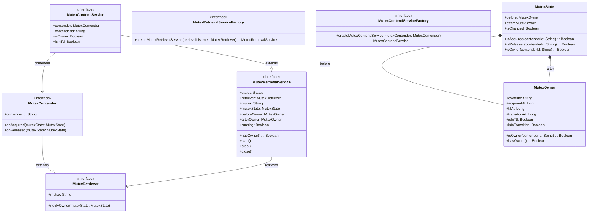
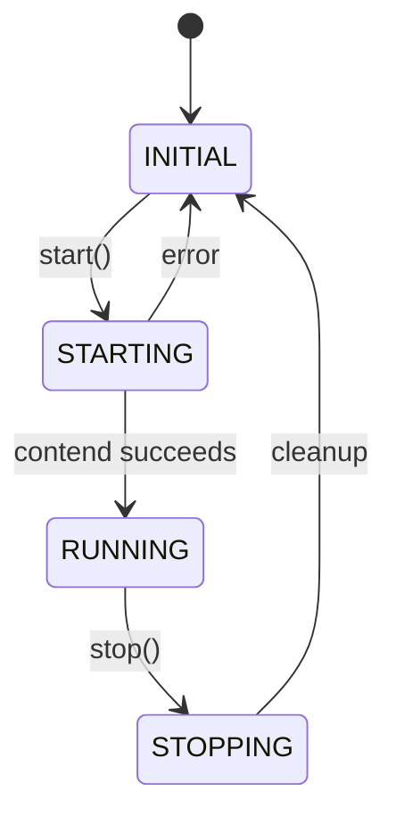
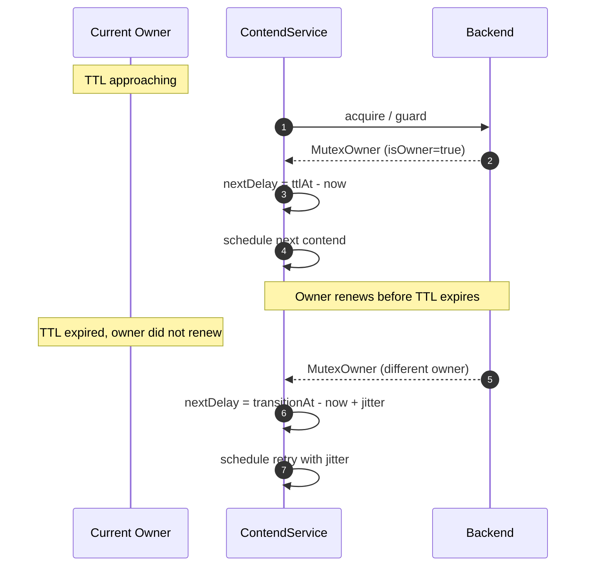
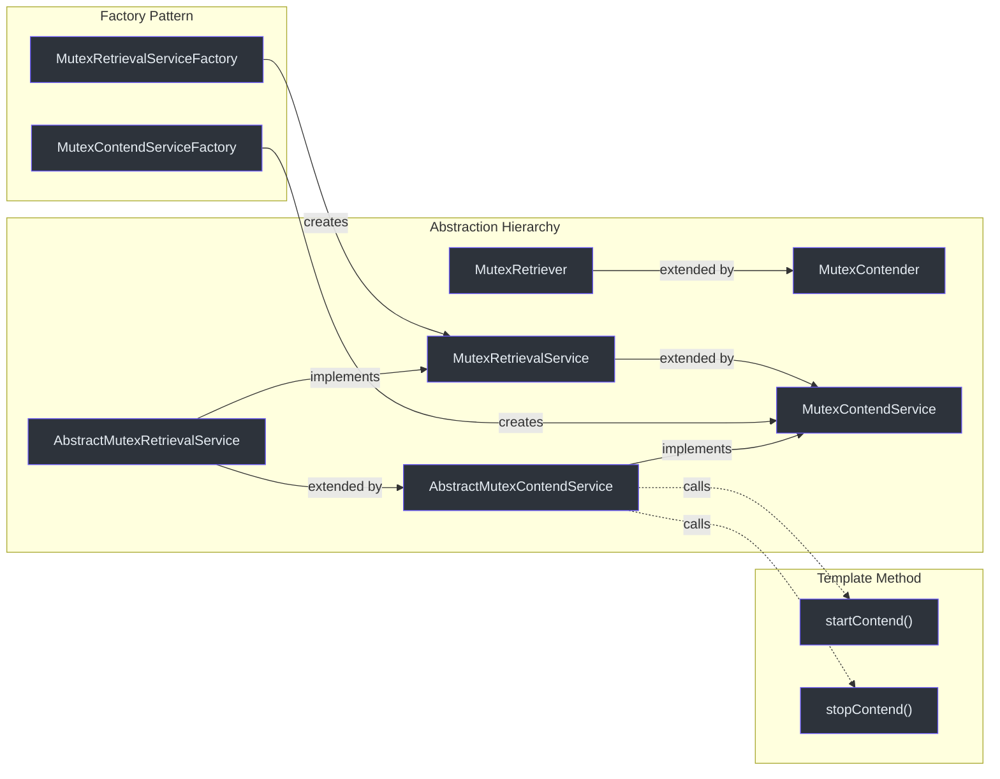

# Core Interfaces

The core contention protocol is defined by a small set of interfaces and abstract classes in the `me.ahoo.simba.core` package. This page documents each type with method signatures, relationships, and usage examples.

## Class Diagram



## MutexRetriever

The most minimal contract in the contention protocol. Any object that wants to participate in mutex contention must implement this interface.

**Source:** [simba-core/.../MutexRetriever.kt:20](https://github.com/Ahoo-Wang/Simba/blob/main/simba-core/src/main/kotlin/me/ahoo/simba/core/MutexRetriever.kt#L20)

```kotlin
interface MutexRetriever {
    val mutex: String
    fun notifyOwner(mutexState: MutexState)
}
```

| Method | Return | Description |
|---|---|---|
| `mutex` | `String` | The logical name of the mutex resource. Must be non-blank. |
| `notifyOwner(mutexState)` | `void` | Called by the retrieval service whenever the mutex owner changes. The `MutexState` contains the previous and current owner. |

## MutexContender

Extends `MutexRetriever` with a contender identity and lifecycle callbacks. This is the primary interface application code implements.

**Source:** [simba-core/.../MutexContender.kt:20](https://github.com/Ahoo-Wang/Simba/blob/main/simba-core/src/main/kotlin/me/ahoo/simba/core/MutexContender.kt#L20)

```kotlin
interface MutexContender : MutexRetriever {
    val contenderId: String
    fun onAcquired(mutexState: MutexState)
    fun onReleased(mutexState: MutexState)
}
```

| Method | Return | Description |
|---|---|---|
| `contenderId` | `String` | Unique identifier for this contender instance. Typically generated by `ContenderIdGenerator`. |
| `onAcquired(mutexState)` | `void` | Called when this contender becomes the mutex owner. Use this to start leader-only work. |
| `onReleased(mutexState)` | `void` | Called when this contender loses the mutex (either due to TTL expiry, explicit stop, or another contender taking over). |
| `notifyOwner(mutexState)` | `void` | Default implementation dispatches to `onAcquired`/`onReleased` based on change detection. |

The default `notifyOwner` implementation inspects the `MutexState`:

```kotlin
override fun notifyOwner(mutexState: MutexState) {
    if (!mutexState.isChanged) return
    if (mutexState.isAcquired(contenderId)) onAcquired(mutexState)
    if (mutexState.isReleased(contenderId)) onReleased(mutexState)
}
```

## MutexRetrievalService

The lifecycle-managed retrieval service. Provides start/stop semantics and exposes the current mutex state.

**Source:** [simba-core/.../MutexRetrievalService.kt:20](https://github.com/Ahoo-Wang/Simba/blob/main/simba-core/src/main/kotlin/me/ahoo/simba/core/MutexRetrievalService.kt#L20)

```kotlin
interface MutexRetrievalService : AutoCloseable {
    val status: Status
    val retriever: MutexRetriever
    val mutex: String
    val mutexState: MutexState
    val beforeOwner: MutexOwner
    val afterOwner: MutexOwner
    fun hasOwner(): Boolean
    val running: Boolean
    fun start()
    fun stop()
}
```

| Method / Property | Return | Description |
|---|---|---|
| `status` | `Status` | Current lifecycle status: `INITIAL`, `STARTING`, `RUNNING`, `STOPPING` |
| `retriever` | `MutexRetriever` | The retriever this service is bound to |
| `mutex` | `String` | The mutex name, delegated from `retriever.mutex` |
| `mutexState` | `MutexState` | Current state snapshot (weakly consistent with backend) |
| `beforeOwner` | `MutexOwner` | The previous owner from the last transition |
| `afterOwner` | `MutexOwner` | The current owner from the last transition |
| `hasOwner()` | `Boolean` | `true` if `afterOwner !== MutexOwner.NONE` |
| `running` | `Boolean` | `true` if `status` is `STARTING` or `RUNNING` |
| `start()` | `void` | Transitions from `INITIAL` to `RUNNING`. Throws if not in `INITIAL`. |
| `stop()` | `void` | Transitions from `RUNNING` to `INITIAL`. Throws if not in `RUNNING`. |
| `close()` | `void` | Delegates to `stop()` |

### Status Enum

```kotlin
enum class Status {
    INITIAL,   // Not started
    STARTING,  // In the process of starting
    RUNNING,   // Actively contending
    STOPPING;  // In the process of stopping

    val isActive: Boolean
        get() = this == STARTING || this == RUNNING
}
```



## MutexContendService

Extends `MutexRetrievalService` with contender-specific ownership queries.

**Source:** [simba-core/.../MutexContendService.kt:20](https://github.com/Ahoo-Wang/Simba/blob/main/simba-core/src/main/kotlin/me/ahoo/simba/core/MutexContendService.kt#L20)

```kotlin
interface MutexContendService : MutexRetrievalService {
    val contender: MutexContender
    val contenderId: String
    val isOwner: Boolean
    val isInTtl: Boolean
}
```

| Method / Property | Return | Description |
|---|---|---|
| `contender` | `MutexContender` | The bound contender instance |
| `contenderId` | `String` | Delegates to `contender.contenderId` |
| `isOwner` | `Boolean` | `true` if `afterOwner.ownerId == contenderId` |
| `isInTtl` | `Boolean` | `true` if the contender is the owner AND the lock has not expired its TTL |

## MutexRetrievalServiceFactory

**Source:** [simba-core/.../MutexRetrievalServiceFactory.kt:20](https://github.com/Ahoo-Wang/Simba/blob/main/simba-core/src/main/kotlin/me/ahoo/simba/core/MutexRetrievalServiceFactory.kt#L20)

```kotlin
interface MutexRetrievalServiceFactory {
    fun createMutexRetrievalService(retrievalListener: MutexRetriever): MutexRetrievalService
}
```

## MutexContendServiceFactory

**Source:** [simba-core/.../MutexContendServiceFactory.kt:20](https://github.com/Ahoo-Wang/Simba/blob/main/simba-core/src/main/kotlin/me/ahoo/simba/core/MutexContendServiceFactory.kt#L20)

```kotlin
interface MutexContendServiceFactory {
    fun createMutexContendService(mutexContender: MutexContender): MutexContendService
}
```

Each backend module provides a concrete implementation:
- `JdbcMutexContendServiceFactory` in `simba-jdbc`
- `SpringRedisMutexContendServiceFactory` in `simba-spring-redis`
- `ZookeeperMutexContendServiceFactory` in `simba-zookeeper`

## AbstractMutexContender

A convenience base class that provides default logging for `onAcquired` and `onReleased`.

**Source:** [simba-core/.../AbstractMutexContender.kt:22](https://github.com/Ahoo-Wang/Simba/blob/main/simba-core/src/main/kotlin/me/ahoo/simba/core/AbstractMutexContender.kt#L22)

```kotlin
abstract class AbstractMutexContender(
    final override val mutex: String,
    final override val contenderId: String = ContenderIdGenerator.HOST.generate()
) : MutexContender
```

| Parameter | Default | Description |
|---|---|---|
| `mutex` | -- | The mutex resource name. Must be non-blank. |
| `contenderId` | `ContenderIdGenerator.HOST.generate()` | Auto-generated `counter:pid@host` format |

## AbstractMutexRetrievalService

Template method base class for retrieval services. Manages the `Status` state machine using `AtomicReferenceFieldUpdater` for thread-safe transitions.

**Source:** [simba-core/.../AbstractMutexRetrievalService.kt:26](https://github.com/Ahoo-Wang/Simba/blob/main/simba-core/src/main/kotlin/me/ahoo/simba/core/AbstractMutexRetrievalService.kt#L26)

```kotlin
abstract class AbstractMutexRetrievalService(
    override val retriever: MutexRetriever,
    protected val handleExecutor: Executor
) : MutexRetrievalService
```

Key behaviors:
- `start()` -- CAS from `INITIAL` to `STARTING`, calls `startRetrieval()`, sets `RUNNING`
- `stop()` -- CAS from `RUNNING` to `STOPPING`, calls `stopRetrieval()`, sets `INITIAL`
- `notifyOwner(newOwner)` -- dispatches `safeNotifyOwner` on `handleExecutor`, which updates `mutexState` and calls `retriever.notifyOwner`

## AbstractMutexContendService

Bridges `AbstractMutexRetrievalService` with backend-specific contention logic.

**Source:** [simba-core/.../AbstractMutexContendService.kt:22](https://github.com/Ahoo-Wang/Simba/blob/main/simba-core/src/main/kotlin/me/ahoo/simba/core/AbstractMutexContendService.kt#L22)

```kotlin
abstract class AbstractMutexContendService(
    override val contender: MutexContender,
    handleExecutor: Executor
) : AbstractMutexRetrievalService(contender, handleExecutor), MutexContendService {

    override fun startRetrieval() {
        resetOwner()
        startContend()
    }

    override fun stopRetrieval() {
        stopContend()
    }

    protected abstract fun startContend()
    protected abstract fun stopContend()
}
```

Backend modules (`simba-jdbc`, `simba-spring-redis`, `simba-zookeeper`) extend this class and implement `startContend()` and `stopContend()`.

## MutexOwner

An immutable value object that represents a snapshot of mutex ownership at a point in time.

**Source:** [simba-core/.../MutexOwner.kt:23](https://github.com/Ahoo-Wang/Simba/blob/main/simba-core/src/main/kotlin/me/ahoo/simba/core/MutexOwner.kt#L23)

```kotlin
@Immutable
open class MutexOwner(
    val ownerId: String,
    val acquiredAt: Long = System.currentTimeMillis(),
    val ttlAt: Long = Long.MAX_VALUE,
    val transitionAt: Long = Long.MAX_VALUE
)
```

| Property | Type | Description |
|---|---|---|
| `ownerId` | `String` | The `contenderId` of the current owner. Empty string (`NONE_OWNER_ID`) means no owner. |
| `acquiredAt` | `Long` | Timestamp (epoch millis) when the lock was acquired |
| `ttlAt` | `Long` | Timestamp when the TTL expires. After this, the owner should renew or another contender may take over. |
| `transitionAt` | `Long` | End of the transition/grace period. During this window the current owner can preferentially renew. |

| Method | Return | Description |
|---|---|---|
| `isOwner(contenderId)` | `Boolean` | Checks if the given ID matches `ownerId` |
| `isInTtl` | `Boolean` | `true` if `ttlAt > System.currentTimeMillis()` |
| `isInTtl(contenderId)` | `Boolean` | `true` if is owner AND within TTL |
| `isInTransition` | `Boolean` | `true` if `transitionAt >= System.currentTimeMillis()` |
| `hasOwner()` | `Boolean` | `true` if `transitionAt >= System.currentTimeMillis()` |
| `MutexOwner.NONE` | `MutexOwner` | Sentinel: `ownerId = ""`, all timestamps `0` |

## MutexState

Represents a transition between two owners. Used as the argument to `notifyOwner`.

**Source:** [simba-core/.../MutexState.kt:20](https://github.com/Ahoo-Wang/Simba/blob/main/simba-core/src/main/kotlin/me/ahoo/simba/core/MutexState.kt#L20)

```kotlin
data class MutexState(
    val before: MutexOwner,
    val after: MutexOwner
)
```

| Method | Return | Description |
|---|---|---|
| `isChanged` | `Boolean` | `true` if `before.ownerId != after.ownerId` |
| `isAcquired(contenderId)` | `Boolean` | `isChanged && after.isOwner(contenderId)` |
| `isReleased(contenderId)` | `Boolean` | `isChanged && before.isOwner(contenderId)` |
| `isOwner(contenderId)` | `Boolean` | `after.isOwner(contenderId)` |
| `MutexState.NONE` | `MutexState` | `MutexState(MutexOwner.NONE, MutexOwner.NONE)` |

## ContendPeriod

Computes the next scheduling delay for the contention loop. Owners renew before TTL; non-owners wait with jitter.

**Source:** [simba-core/.../ContendPeriod.kt:22](https://github.com/Ahoo-Wang/Simba/blob/main/simba-core/src/main/kotlin/me/ahoo/simba/core/ContendPeriod.kt#L22)

```kotlin
class ContendPeriod(private val contenderId: String) {
    fun ensureNextDelay(mutexOwner: MutexOwner): Long
    fun nextDelay(mutexOwner: MutexOwner): Long
}
```

| Scenario | Delay Calculation |
|---|---|
| **Current owner** | `ttlAt - now` (renew just before TTL expiry) |
| **Non-owner (no transition)** | `transitionAt - now + random(0, 1000)` |
| **Non-owner (with transition)** | `transitionAt - now + random(-200, 1000)` |

The random jitter (`-200ms` to `+1000ms`) prevents thundering herd when multiple contenders retry simultaneously.



## ContenderIdGenerator

Generates unique contender identifiers.

**Source:** [simba-core/.../ContenderIdGenerator.kt:24](https://github.com/Ahoo-Wang/Simba/blob/main/simba-core/src/main/kotlin/me/ahoo/simba/core/ContenderIdGenerator.kt#L24)

```kotlin
interface ContenderIdGenerator {
    fun generate(): String
}
```

| Implementation | Pattern | Example |
|---|---|---|
| `ContenderIdGenerator.HOST` (default) | `{counter}:{pid}@{host}` | `0:12345@192.168.1.10` |
| `ContenderIdGenerator.UUID` | UUID without hyphens | `a1b2c3d4e5f6...` |

The `HOST` strategy is preferred because it is human-readable and helps with debugging in logs. The counter is a process-local `AtomicLong` that increments per contender creation.

## Usage Example

```kotlin
import me.ahoo.simba.core.*

class MyService : AbstractMutexContender("order-settlement") {

    override fun onAcquired(mutexState: MutexState) {
        super.onAcquired(mutexState)
        println("[$contenderId] acquired leadership for ${mutex}")
        startSettlementTask()
    }

    override fun onReleased(mutexState: MutexState) {
        super.onReleased(mutexState)
        println("[$contenderId] lost leadership for ${mutex}")
        stopSettlementTask()
    }

    private fun startSettlementTask() { /* ... */ }
    private fun stopSettlementTask() { /* ... */ }
}

// Wire it up
val factory: MutexContendServiceFactory = JdbcMutexContendServiceFactory(
    mutexOwnerRepository = repository,
    initialDelay = Duration.ZERO,
    ttl = Duration.ofSeconds(10),
    transition = Duration.ofSeconds(6)
)

val service = factory.createMutexContendService(MyService())
service.start()
```

## Relationship Summary



## See Also

- [Locker API](./locker-api) -- RAII-style locking built on `MutexContendService`
- [Scheduler API](./scheduler-api) -- Leader-gated scheduled tasks
- [simba-core Module](/modules/simba-core) -- module details and package structure
