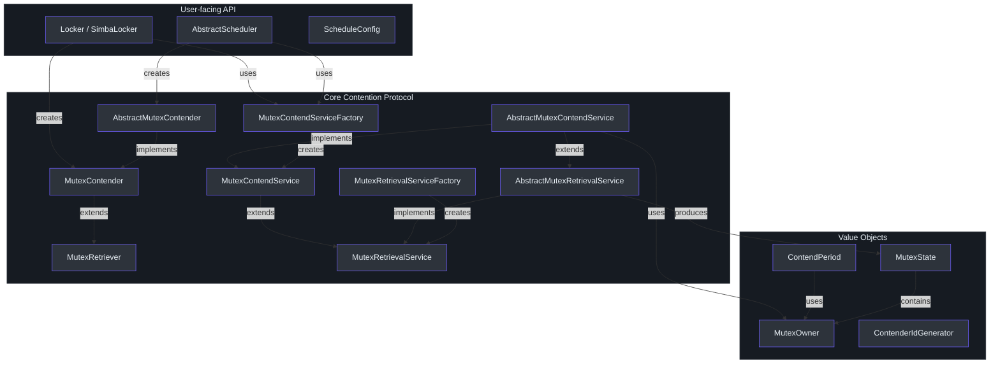
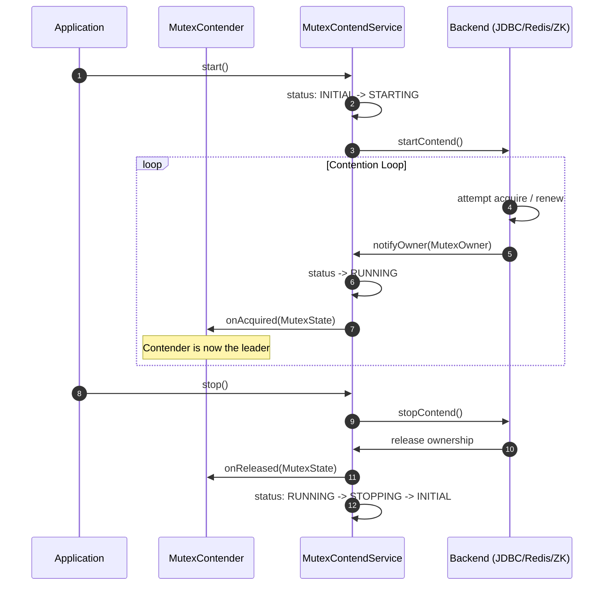
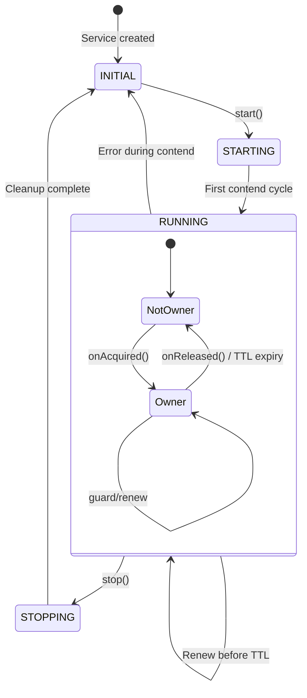
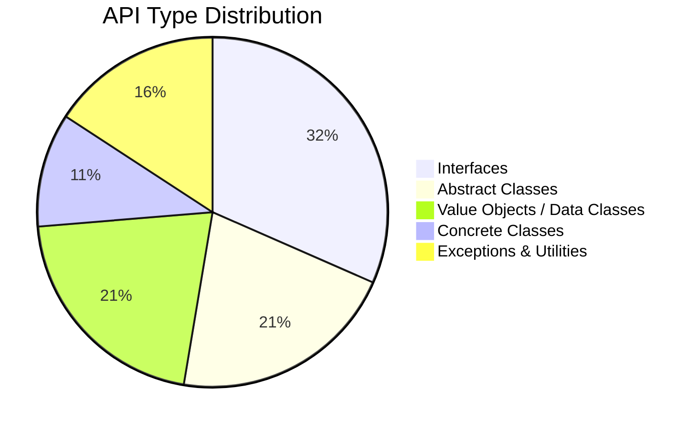

# API Reference

Simba exposes a small, layered API built around the concept of **mutex contention**: multiple service instances compete for exclusive ownership of a named mutex, and the winner receives callbacks when it acquires or loses the lock. All public types live in the `me.ahoo.simba.*` packages under the `simba-core` module.

## API Layer Architecture

The diagram below shows how the public API types are organized into layers. User-facing abstractions (Locker, Scheduler) sit on top, the core contention protocol lives in the middle, and backend-specific factories sit beneath.



## Public Type Catalogue

### Core Interfaces

| Type | Kind | Package | Description |
|---|---|---|---|
| [`MutexRetriever`](./core-interfaces#mutexretriever) | Interface | `me.ahoo.simba.core` | Minimal contract: provides a `mutex` name and receives `notifyOwner` callbacks |
| [`MutexContender`](./core-interfaces#mutexcontender) | Interface | `me.ahoo.simba.core` | Extends `MutexRetriever` with `contenderId` and `onAcquired`/`onReleased` lifecycle |
| [`MutexRetrievalService`](./core-interfaces#mutexretrievalservice) | Interface | `me.ahoo.simba.core` | Lifecycle-managed retrieval service with `start()`/`stop()` and status tracking |
| [`MutexContendService`](./core-interfaces#mutexcontendservice) | Interface | `me.ahoo.simba.core` | Extends retrieval with contender-bound ownership queries (`isOwner`, `isInTtl`) |
| [`MutexRetrievalServiceFactory`](./core-interfaces#mutexretrievalservicefactory) | Interface | `me.ahoo.simba.core` | Factory for creating `MutexRetrievalService` instances |
| [`MutexContendServiceFactory`](./core-interfaces#mutexcontendservicefactory) | Interface | `me.ahoo.simba.core` | Factory for creating `MutexContendService` instances |

### Abstract Base Classes

| Type | Kind | Package | Description |
|---|---|---|---|
| [`AbstractMutexContender`](./core-interfaces#abstractmutexcontender) | Abstract Class | `me.ahoo.simba.core` | Base contender with default logging for `onAcquired`/`onReleased` |
| [`AbstractMutexRetrievalService`](./core-interfaces#abstractmutexretrievalservice) | Abstract Class | `me.ahoo.simba.core` | Template method for retrieval lifecycle and async owner notification |
| [`AbstractMutexContendService`](./core-interfaces#abstractmutexcontendservice) | Abstract Class | `me.ahoo.simba.core` | Delegates to abstract `startContend()`/`stopContend()` implemented by backends |

### Value Objects

| Type | Kind | Package | Description |
|---|---|---|---|
| [`MutexOwner`](./core-interfaces#mutexowner) | Immutable Class | `me.ahoo.simba.core` | Snapshot of lock ownership: `ownerId`, `acquiredAt`, `ttlAt`, `transitionAt` |
| [`MutexState`](./core-interfaces#mutexstate) | Data Class | `me.ahoo.simba.core` | Transition pair: `before` and `after` owners, with change detection |
| [`ContendPeriod`](./core-interfaces#contendperiod) | Class | `me.ahoo.simba.core` | Computes scheduling delays for owner renewal vs. contender retry |
| [`ContenderIdGenerator`](./core-interfaces#contenderidgenerator) | Interface | `me.ahoo.simba.core` | Generates unique contender IDs; provides `HOST` and `UUID` strategies |

### Locker API

| Type | Kind | Package | Description |
|---|---|---|---|
| [`Locker`](./locker-api#locker) | Interface | `me.ahoo.simba.locker` | RAII-style lock interface: `acquire()` with optional timeout, `close()` releases |
| [`SimbaLocker`](./locker-api#simbalocker) | Class | `me.ahoo.simba.locker` | Concrete implementation using `LockSupport.park/unpark` for blocking acquire |

### Scheduler API

| Type | Kind | Package | Description |
|---|---|---|---|
| [`AbstractScheduler`](./scheduler-api#abstractscheduler) | Abstract Class | `me.ahoo.simba.schedule` | Leader-gated scheduled executor: only the mutex owner runs the task |
| [`ScheduleConfig`](./scheduler-api#scheduleconfig) | Data Class | `me.ahoo.simba.schedule` | Scheduling parameters: `FIXED_RATE`/`FIXED_DELAY` strategy, `initialDelay`, `period` |

### Exceptions and Utilities

| Type | Kind | Package | Description |
|---|---|---|---|
| `SimbaException` | Open Class | `me.ahoo.simba` | Root exception type for Simba errors |
| `Simba` | Object | `me.ahoo.simba` | Brand constants: `SIMBA = "simba"`, `SIMBA_PREFIX = "simba."` |
| `Threads` | Object | `me.ahoo.simba.util` | `defaultFactory(domain)` builds a named `ThreadFactory` via Guava |

## Contention Protocol Overview



## Ownership Lifecycle



## Quick Start

The simplest way to use Simba is through the `MutexContendServiceFactory`:

```kotlin
// 1. Obtain a factory (provided by simba-jdbc, simba-spring-redis, or simba-zookeeper)
val factory: MutexContendServiceFactory = ...

// 2. Create a contender with a mutex name and callbacks
val contender = object : AbstractMutexContender("my-resource") {
    override fun onAcquired(mutexState: MutexState) {
        println("I am the leader: ${contenderId}")
    }
    override fun onReleased(mutexState: MutexState) {
        println("Leadership lost: ${contenderId}")
    }
}

// 3. Create and start the contend service
val service = factory.createMutexContendService(contender)
service.start()

// ... later
service.stop()
```

For RAII-style locking, see the [Locker API](./locker-api). For leader-gated scheduled tasks, see the [Scheduler API](./scheduler-api).

## Module Distribution

The interfaces and abstract classes above live entirely in `simba-core`. Concrete factory implementations are in each backend module:

- **simba-jdbc** -- `JdbcMutexContendServiceFactory`
- **simba-spring-redis** -- `SpringRedisMutexContendServiceFactory`
- **simba-zookeeper** -- `ZookeeperMutexContendServiceFactory`

The `simba-spring-boot-starter` auto-configures the appropriate factory bean based on application properties. See [Module Reference](/modules/) for backend details.



## See Also

- [Core Interfaces](./core-interfaces) -- detailed documentation of every interface and its methods
- [Locker API](./locker-api) -- RAII-style distributed locking
- [Scheduler API](./scheduler-api) -- leader-gated periodic task execution
