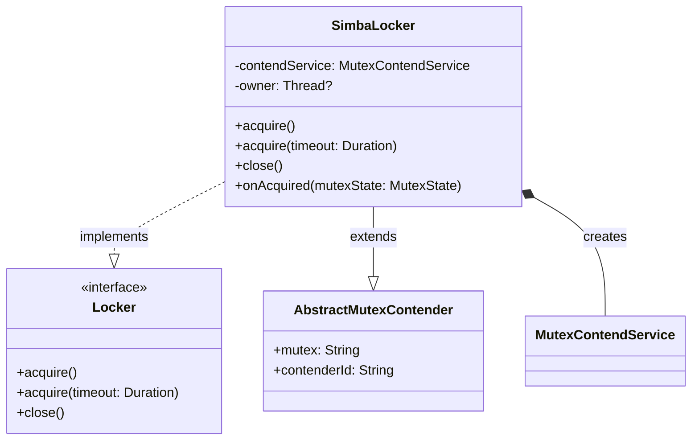
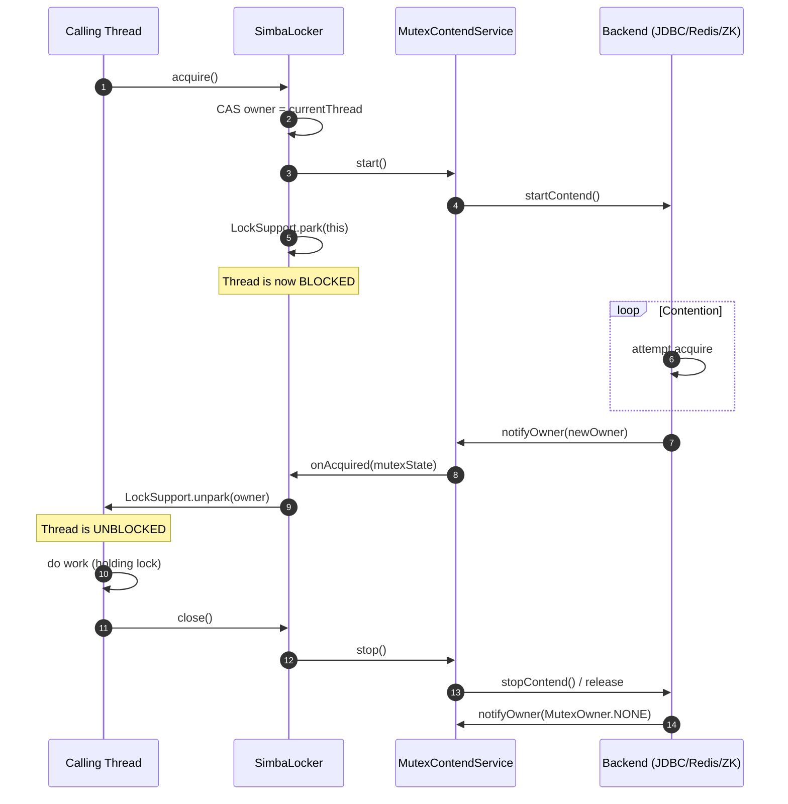
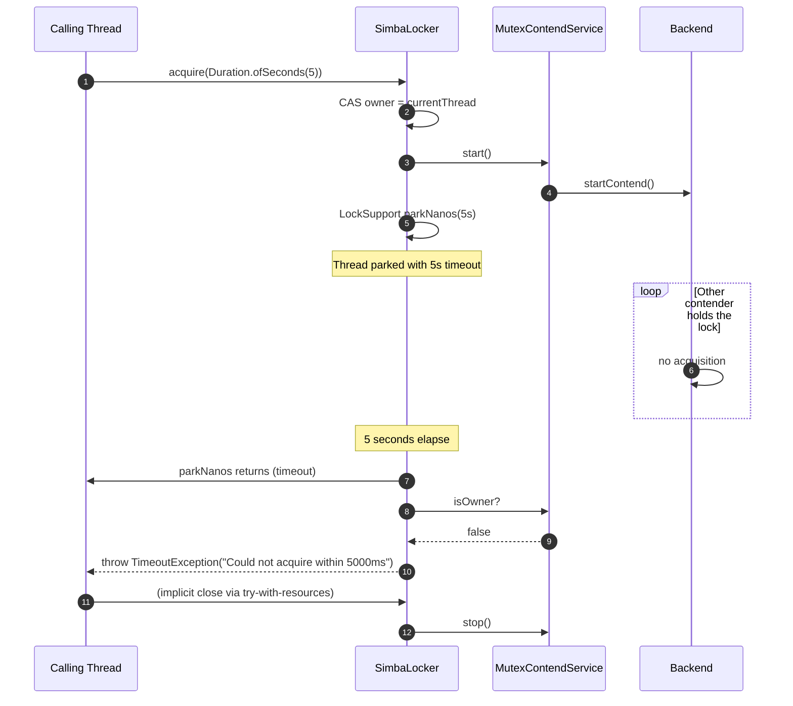
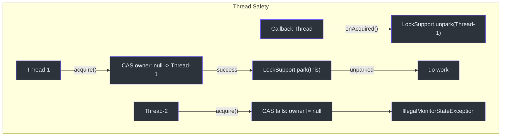

# Locker API

The Locker API provides a traditional RAII-style (Resource Acquisition Is Initialization) distributed lock. It wraps the `MutexContendService` protocol into a familiar `acquire`/`close` pattern that integrates with Kotlin's `use {}` block and Java's try-with-resources.

## Interface

**Source:** [simba-core/.../locker/Locker.kt:33](https://github.com/Ahoo-Wang/Simba/blob/main/simba-core/src/main/kotlin/me/ahoo/simba/locker/Locker.kt#L33)

```kotlin
interface Locker : AutoCloseable {
    fun acquire()
    @Throws(TimeoutException::class)
    fun acquire(timeout: Duration)
}
```

| Method | Description |
|---|---|
| `acquire()` | Blocks the calling thread until the lock is acquired. Calls `close()` when done. |
| `acquire(timeout: Duration)` | Blocks the calling thread up to `timeout`. Throws `TimeoutException` if the lock is not acquired within the timeout. |
| `close()` | Releases the lock and stops the contend service. Called automatically in try-with-resources / `use {}`. |

## SimbaLocker

The concrete implementation uses `LockSupport.park` / `LockSupport.unpark` for thread blocking, ensuring the calling thread stays parked until the contender's `onAcquired` callback fires.

**Source:** [simba-core/.../locker/SimbaLocker.kt:39](https://github.com/Ahoo-Wang/Simba/blob/main/simba-core/src/main/kotlin/me/ahoo/simba/locker/SimbaLocker.kt#L39)

```kotlin
class SimbaLocker(
    mutex: String,
    contendServiceFactory: MutexContendServiceFactory
) : AbstractMutexContender(mutex), Locker
```

| Parameter | Description |
|---|---|
| `mutex` | The logical name of the mutex resource. Must be non-blank. |
| `contendServiceFactory` | The backend-specific factory (JDBC, Redis, or Zookeeper). Injected by the application or Spring. |

### Internal Mechanism



`SimbaLocker` uses an `AtomicReferenceFieldUpdater` on the `owner` field to ensure thread safety:

- **`acquire()`** -- CAS the `owner` field from `null` to the current thread, then `LockSupport.park(this)`. If the CAS fails, throws `IllegalMonitorStateException` (double acquire on same instance).
- **`onAcquired()`** -- Called by the contend service on the callback thread. Calls `LockSupport.unpark(owner)` to wake the parked thread.
- **`acquire(timeout)`** -- Uses `LockSupport.parkNanos(this, timeout)`. After waking, checks `contendService.isOwner` to distinguish between "acquired" and "timeout". Throws `TimeoutException` on timeout.
- **`close()`** -- Stops the contend service (which triggers `onReleased` notification).

## Sequence Diagram -- Acquire Flow



## Sequence Diagram -- Timeout Flow



## Usage Examples

### Kotlin `use {}` Block

```kotlin
val locker = SimbaLocker("order-lock", contendServiceFactory)
locker.use {
    it.acquire()
    // Critical section -- only one instance executes at a time
    processOrders()
}
// Lock is automatically released when the block exits
```

### With Timeout

```kotlin
val locker = SimbaLocker("order-lock", contendServiceFactory)
locker.use {
    try {
        it.acquire(Duration.ofSeconds(10))
        processOrders()
    } catch (e: TimeoutException) {
        println("Could not acquire lock within 10 seconds, skipping")
    }
}
```

### Java Try-with-Resources

```java
try (SimbaLocker locker = new SimbaLocker("order-lock", contendServiceFactory)) {
    locker.acquire(Duration.ofSeconds(10));
    processOrders();
} catch (TimeoutException e) {
    log.warn("Could not acquire lock within 10 seconds");
}
```

### Multiple Contenders

```kotlin
// Multiple instances of the same service competing for one mutex
fun runWorker(id: Int) {
    val locker = SimbaLocker("shared-task", contendServiceFactory)
    locker.use {
        it.acquire(Duration.ofSeconds(30))
        println("Worker $id acquired the lock")
        doExclusiveWork()
    }
}

// Launch 5 workers -- only one runs at a time
repeat(5) { runWorker(it) }
```

## Error Handling

| Situation | Behavior |
|---|---|
| Thread already owns this `SimbaLocker` instance | `IllegalMonitorStateException` from `acquire()` |
| Timeout expires before acquisition | `TimeoutException` from `acquire(timeout)` |
| Backend error during contention | Logged internally; contention loop retries after TTL period |
| `close()` called when not owner | `stop()` on the contend service; safe to call multiple times |

## Concurrency Notes

- Each `SimbaLocker` instance can only be acquired by one thread at a time. The `owner` field uses `AtomicReferenceFieldUpdater` for thread-safe CAS.
- A single `SimbaLocker` instance should **not** be shared across threads for concurrent locking. Create separate instances per mutex.
- The `onAcquired` callback runs on the backend's executor thread, which calls `LockSupport.unpark(owner)` to wake the caller. This is safe because `unpark` can be called before `park` (it acts as a permit).



## See Also

- [Core Interfaces](./core-interfaces) -- `MutexContendService`, `MutexContender`, and supporting types
- [Scheduler API](./scheduler-api) -- leader-gated periodic tasks (alternative to Locker for recurring work)
- [simba-core Module](/modules/simba-core) -- module package structure
