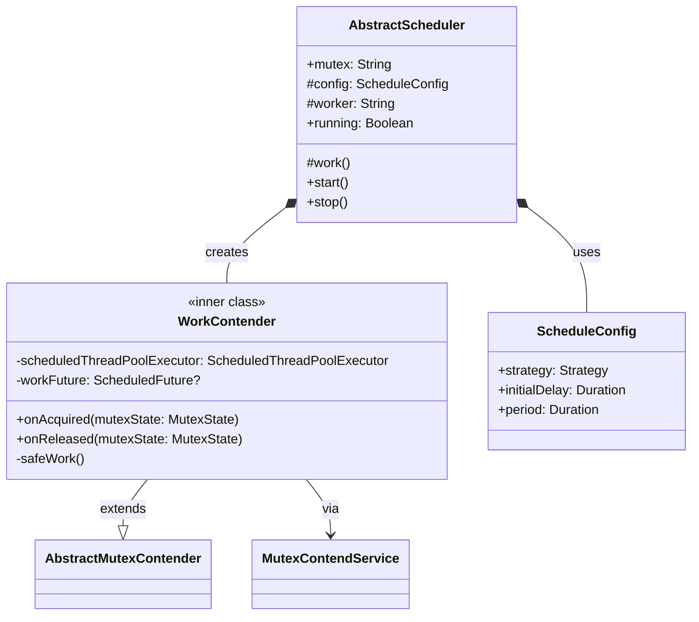
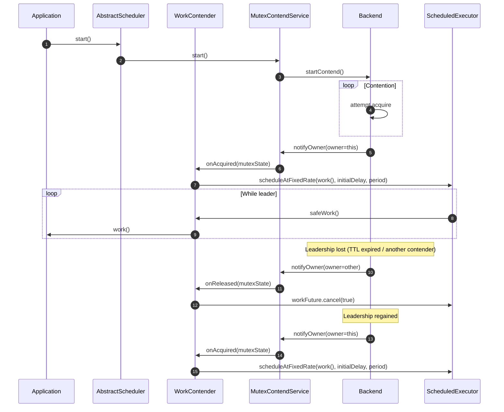
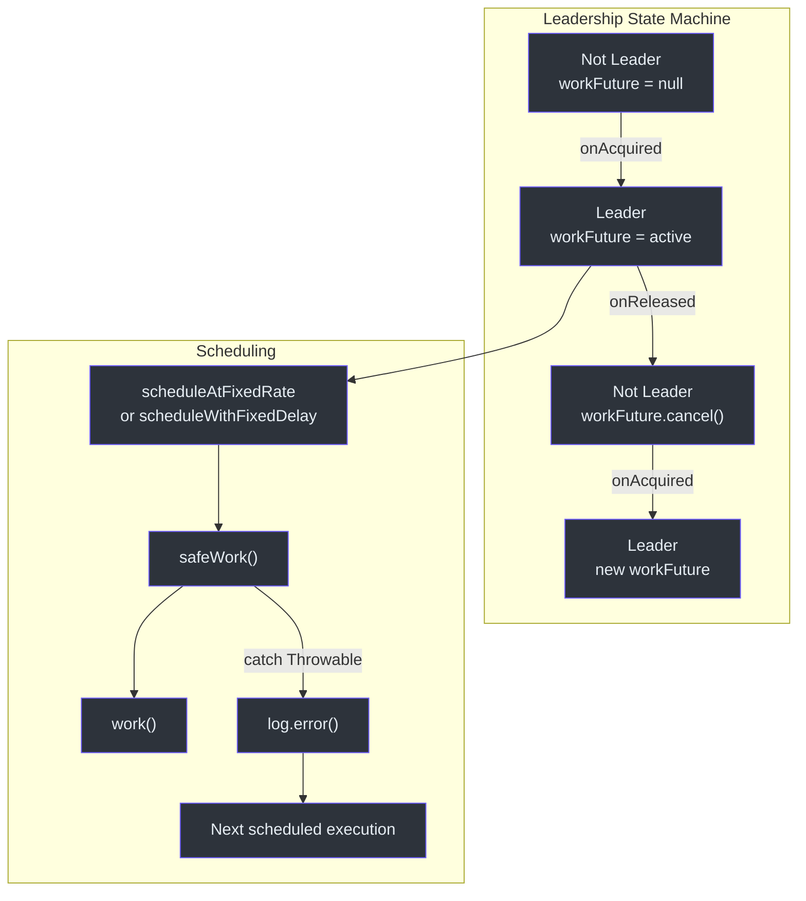

# Scheduler API

The Scheduler API provides leader-gated periodic execution. Only the instance that currently holds the distributed mutex runs the scheduled task. When leadership is lost, the task is cancelled. When leadership is regained, the task resumes.

## AbstractScheduler

**Source:** [simba-core/.../schedule/AbstractScheduler.kt:30](https://github.com/Ahoo-Wang/Simba/blob/main/simba-core/src/main/kotlin/me/ahoo/simba/schedule/AbstractScheduler.kt#L30)

```kotlin
abstract class AbstractScheduler(
    val mutex: String,
    contendServiceFactory: MutexContendServiceFactory
)
```

| Parameter | Description |
|---|---|
| `mutex` | The mutex resource name. All schedulers for the same `mutex` compete for a single leader. |
| `contendServiceFactory` | Backend-specific factory to create the underlying `MutexContendService`. |

### Abstract Members

```kotlin
abstract class AbstractScheduler(...) {
    protected abstract val config: ScheduleConfig
    protected abstract val worker: String
    protected abstract fun work()
}
```

| Member | Type | Description |
|---|---|---|
| `config` | `ScheduleConfig` | Scheduling strategy, initial delay, and period |
| `worker` | `String` | Thread name prefix for the internal `ScheduledThreadPoolExecutor` |
| `work()` | `() -> Unit` | The task to execute. Called periodically only when this instance is the leader. |

### Public API

| Method | Description |
|---|---|
| `start()` | Starts contention for the mutex and begins scheduling `work()` when leadership is acquired. |
| `stop()` | Stops contention and cancels any scheduled work. |
| `running` | `true` if the underlying contend service is active. |

### Internal Design

`AbstractScheduler` creates an inner class `WorkContender` that extends `AbstractMutexContender`. This contender:

- On `onAcquired` -- creates a `ScheduledThreadPoolExecutor` and schedules `work()` at the configured rate/delay.
- On `onReleased` -- cancels the scheduled future, stopping the periodic task.



## ScheduleConfig

**Source:** [simba-core/.../schedule/ScheduleConfig.kt:22](https://github.com/Ahoo-Wang/Simba/blob/main/simba-core/src/main/kotlin/me/ahoo/simba/schedule/ScheduleConfig.kt#L22)

```kotlin
data class ScheduleConfig(
    val strategy: Strategy,
    val initialDelay: Duration,
    val period: Duration
)
```

| Property | Type | Description |
|---|---|---|
| `strategy` | `Strategy` | `FIXED_RATE` or `FIXED_DELAY` |
| `initialDelay` | `Duration` | Delay before the first execution after acquiring leadership |
| `period` | `Duration` | Interval between executions |

### Strategy Enum

```kotlin
enum class Strategy {
    FIXED_DELAY,
    FIXED_RATE
}
```

| Strategy | Behavior |
|---|---|
| `FIXED_RATE` | Each execution begins at regular intervals. If a task takes longer than the period, subsequent tasks may pile up. |
| `FIXED_DELAY` | Each execution begins `period` after the previous one completes. Guarantees at least `period` gap between executions. |

### Factory Methods

```kotlin
// Create a FIXED_RATE config
val config = ScheduleConfig.rate(
    initialDelay = Duration.ZERO,
    period = Duration.ofSeconds(5)
)

// Create a FIXED_DELAY config
val config = ScheduleConfig.delay(
    initialDelay = Duration.ofSeconds(1),
    period = Duration.ofSeconds(10)
)
```

## Sequence Diagram -- Leader-Gated Scheduling



## Usage Example

### Basic Scheduler

```kotlin
class OrderSettlementScheduler(
    mutex: String,
    contendServiceFactory: MutexContendServiceFactory,
    private val settlementService: SettlementService
) : AbstractScheduler(mutex, contendServiceFactory) {

    override val config = ScheduleConfig.delay(
        initialDelay = Duration.ofSeconds(5),
        period = Duration.ofMinutes(1)
    )

    override val worker = "OrderSettlement"

    override fun work() {
        settlementService.settlePendingOrders()
    }
}

// Usage
val scheduler = OrderSettlementScheduler(
    mutex = "order-settlement",
    contendServiceFactory = factory,
    settlementService = settlementService
)

scheduler.start()
// ... application running ...
scheduler.stop()
```

### FIXED_RATE Scheduler

```kotlin
class MetricsCollectorScheduler(
    contendServiceFactory: MutexContendServiceFactory
) : AbstractScheduler("metrics-collector", contendServiceFactory) {

    override val config = ScheduleConfig.rate(
        initialDelay = Duration.ZERO,
        period = Duration.ofSeconds(30)
    )

    override val worker = "MetricsCollector"

    override fun work() {
        val metrics = collectSystemMetrics()
        publishToMonitoring(metrics)
    }
}
```

### With Error Handling

The `work()` method is wrapped in `safeWork()` internally, which catches all `Throwable` and logs the error without crashing the scheduler:

```kotlin
class MyScheduler(
    contendServiceFactory: MutexContendServiceFactory
) : AbstractScheduler("my-task", contendServiceFactory) {

    override val config = ScheduleConfig.delay(
        initialDelay = Duration.ZERO,
        period = Duration.ofMinutes(5)
    )
    override val worker = "MyTask"

    override fun work() {
        // Exceptions here are caught and logged.
        // The scheduler continues running.
        riskyOperation()
    }
}
```

## Scheduling Strategy Comparison

```mermaid
gantt
    title FIXED_RATE vs FIXED_DELAY
    dateFormat X
    axisFormat %s

    section FIXED_RATE
    Task Execution 1  :a1, 0, 4
    Gap               :a2, 4, 5
    Task Execution 2  :a3, 5, 9
    Gap               :a4, 9, 10
    Task Execution 3  :a5, 10, 12

    section FIXED_DELAY
    Task Execution 1  :b1, 0, 4
    Delay (5s)        :b2, 4, 9
    Task Execution 2  :b3, 9, 14
    Delay (5s)        :b4, 14, 19
    Task Execution 3  :b5, 19, 22
```



With `FIXED_RATE` (period = 5s), executions start at 0, 5, 10 regardless of task duration. With `FIXED_DELAY` (period = 5s), each execution starts 5s after the previous one finishes.

## Error Handling

| Situation | Behavior |
|---|---|
| `work()` throws an exception | Caught by `safeWork()`, logged at ERROR level, scheduled execution continues |
| Backend error during contention | Logged internally; contention loop retries after TTL period |
| `stop()` called while `work()` is running | Scheduled future is cancelled; `work()` may complete the current iteration |

## Concurrency Notes

- Each `AbstractScheduler` instance has its own `ScheduledThreadPoolExecutor` with a single thread (thread name: `{worker}-0`).
- Only the mutex leader has an active `workFuture`. Non-leaders have `workFuture = null` or a cancelled future.
- The `scheduledThreadPoolExecutor` is created when leadership is acquired and the thread is a daemon thread (via `Threads.defaultFactory`).



## See Also

- [Core Interfaces](./core-interfaces) -- `MutexContendServiceFactory`, `AbstractMutexContender`
- [Locker API](./locker-api) -- RAII-style one-shot locking
- [simba-core Module](/modules/simba-core) -- module package structure
