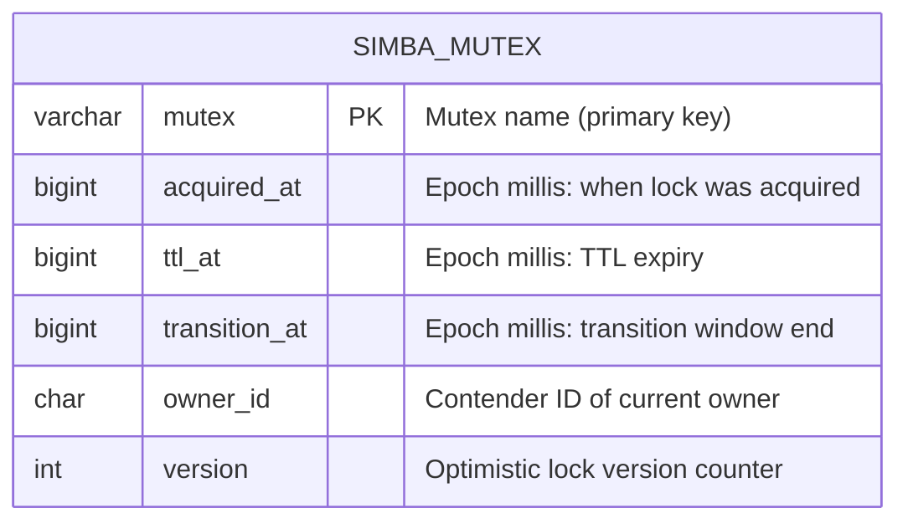
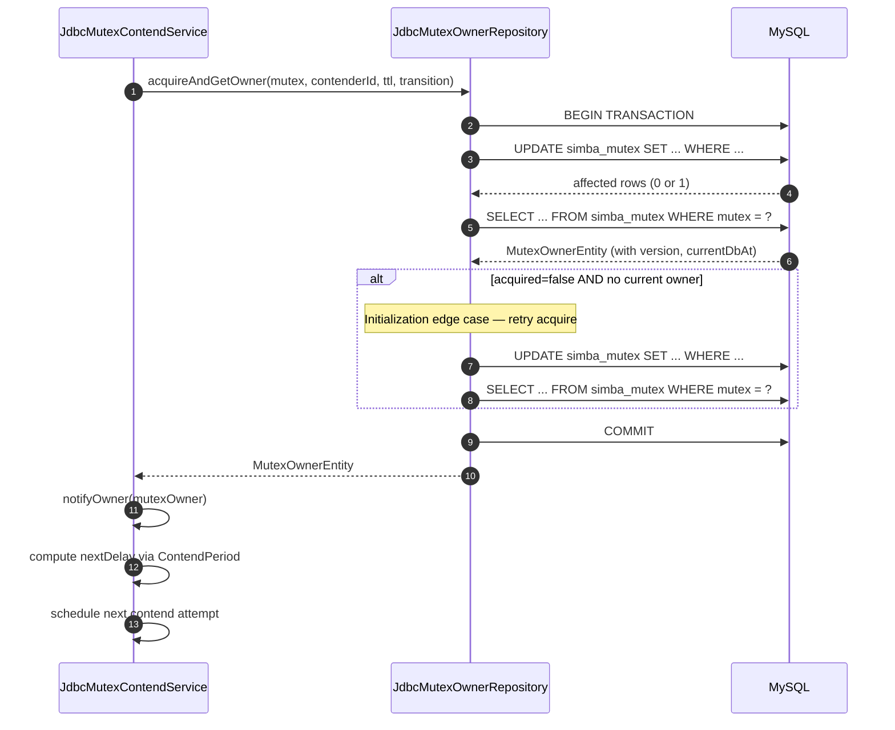
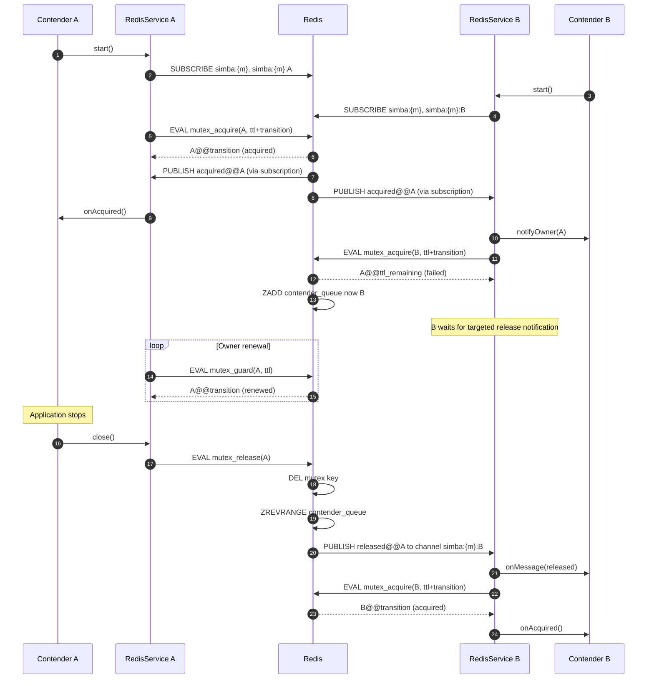
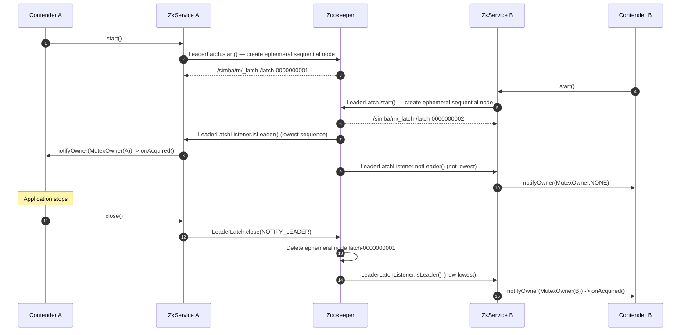
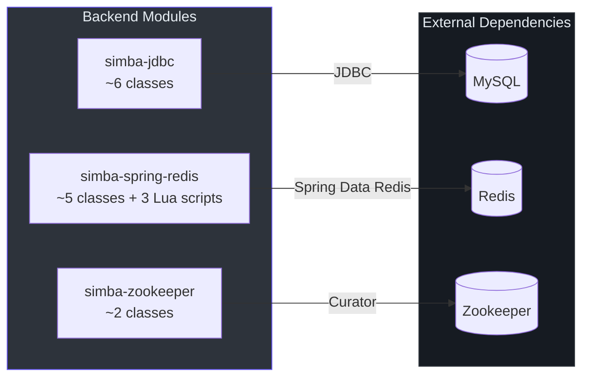
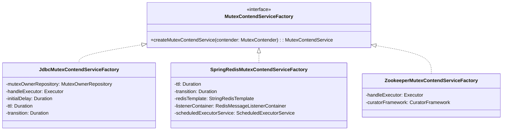
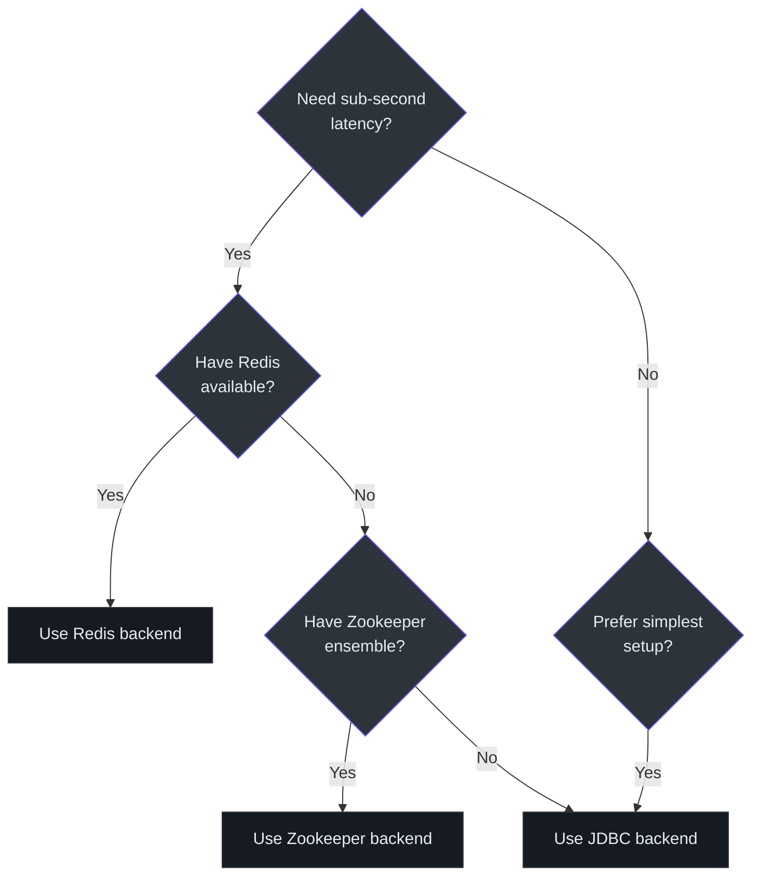

# Backend Implementations

Simba provides three pluggable backends for distributed mutex storage. Each implements
`AbstractMutexContendService` and provides a corresponding `MutexContendServiceFactory`.
The backends differ in latency characteristics, failure detection speed, external
dependencies, and operational complexity.

## JDBC Backend

The JDBC backend uses a MySQL table (`simba_mutex`) with optimistic locking via a `version`
column. Contention is driven by polling through a `ScheduledThreadPoolExecutor`.

### Schema

The init script at
[`simba-jdbc/src/init-script/init-simba-mysql.sql`](https://github.com/Ahoo-Wang/Simba/blob/main/simba-jdbc/src/init-script/init-simba-mysql.sql)
creates the following table:

```sql
CREATE TABLE IF NOT EXISTS simba_mutex (
    mutex         VARCHAR(66)    NOT NULL PRIMARY KEY COMMENT 'mutex name',
    acquired_at   BIGINT UNSIGNED NOT NULL,
    ttl_at        BIGINT UNSIGNED NOT NULL,
    transition_at BIGINT UNSIGNED NOT NULL,
    owner_id      CHAR(32)       NOT NULL,
    version       INT UNSIGNED   NOT NULL
);
```



The `MutexOwnerEntity` class ([`JdbcMutexOwnerRepository.kt`](https://github.com/Ahoo-Wang/Simba/blob/main/simba-jdbc/src/main/kotlin/me/ahoo/simba/jdbc/MutexOwnerRepository.kt))
extends `MutexOwner` with a `version` field for optimistic locking and a `currentDbAt`
field that captures the database server's current timestamp, preventing clock skew issues
between application nodes.

### Atomic Acquire (Optimistic Locking)

The `SQL_ACQUIRE` query in
[`JdbcMutexOwnerRepository`](https://github.com/Ahoo-Wang/Simba/blob/main/simba-jdbc/src/main/kotlin/me/ahoo/simba/jdbc/JdbcMutexOwnerRepository.kt#L43)
performs an atomic `UPDATE ... WHERE` with two conditions:

```sql
UPDATE simba_mutex
SET acquired_at = NOW_MS,
    ttl_at      = NOW_MS + ?,
    transition_at = NOW_MS + ?,
    owner_id    = ?,
    version     = version + 1
WHERE mutex = ?
  AND (
    (transition_at < NOW_MS)             -- transition expired: anyone can acquire
    OR
    (owner_id = ? AND transition_at > NOW_MS)  -- current owner can renew
  );
```

The dual WHERE condition is the core of Simba's fairness guarantee:
1. **Non-owners** can only acquire when `transition_at` has fully passed.
2. **The current owner** can re-acquire (renew/guard) at any time within the transition window.

If the `UPDATE` affects zero rows, the contender did not win. The method then reads the
current owner via `SQL_GET` and returns it so the contender can compute the next delay.

### acquireAndGetOwner Transaction

The `acquireAndGetOwner()` method ([line 185](https://github.com/Ahoo-Wang/Simba/blob/main/simba-jdbc/src/main/kotlin/me/ahoo/simba/jdbc/JdbcMutexOwnerRepository.kt#L185))
wraps the acquire + read operations in a database transaction:



### Release

The `SQL_RELEASE` query ([line 59](https://github.com/Ahoo-Wang/Simba/blob/main/simba-jdbc/src/main/kotlin/me/ahoo/simba/jdbc/JdbcMutexOwnerRepository.kt#L59))
clears the ownership record:

```sql
UPDATE simba_mutex
SET acquired_at=0, ttl_at=0, transition_at=0, owner_id='', version=version+1
WHERE mutex = ? AND owner_id = ?
```

The `WHERE owner_id = ?` clause ensures only the actual owner can release.

### Service Lifecycle

[`JdbcMutexContendService`](https://github.com/Ahoo-Wang/Simba/blob/main/simba-jdbc/src/main/kotlin/me/ahoo/simba/jdbc/JdbcMutexContendService.kt)
creates a `ScheduledThreadPoolExecutor` with a single thread and schedules periodic
`safeHandleContend()` calls. Each invocation runs `acquire()`, notifies the retriever, and
schedules the next attempt based on `ContendPeriod.ensureNextDelay()`.

```kotlin
// JdbcMutexContendService — simplified contention loop
private fun safeHandleContend() {
    val mutexOwner = contend()                // acquireAndGetOwner()
    notifyOwner(mutexOwner)                   // async notification
    val nextDelay = contendPeriod.ensureNextDelay(mutexOwner)
    nextSchedule(nextDelay)                   // schedule next attempt
}
```

On error, the service retries after `ttl` milliseconds ([line 81](https://github.com/Ahoo-Wang/Simba/blob/main/simba-jdbc/src/main/kotlin/me/ahoo/simba/jdbc/JdbcMutexContendService.kt#L81)).

## Redis Backend

The Redis backend uses atomic Lua scripts for lock operations and Redis Pub/Sub for instant
notification of ownership changes. It avoids polling entirely for non-owners.

### Lua Scripts

Three Lua scripts implement the entire lock protocol:

#### mutex_acquire.lua

[`mutex_acquire.lua`](https://github.com/Ahoo-Wang/Simba/blob/main/simba-spring-redis/src/main/resources/mutex_acquire.lua)
attempts to acquire the lock via `SET ... NX PX`:

```lua
-- 1. Try SET NX (atomic acquire)
local succeed = redis.call('set', mutexKey, contenderId, 'nx', 'px', transition)
if succeed then
    -- Publish acquisition event to all listeners
    redis.call('publish', mutexKey, 'acquired@@' .. contenderId)
    return contenderId .. '@@' .. transition
end

-- 2. Failed — add self to wait queue (sorted set, scored by time)
redis.call('zadd', contenderQueueKey, 'nx', nowTime, contenderId)
-- 3. Return current owner and its remaining TTL
local ownerId = redis.call('get', mutexKey)
local ttl = redis.call('pttl', mutexKey)
return ownerId .. '@@' .. ttl
```

Key design decisions:
- Uses `NX` (only set if key does not exist) for atomic acquisition.
- The TTL is set to `ttl + transition` (the full lock validity window).
- On failure, the contender is added to a sorted set (`{mutex}:contender`) scored by timestamp,
  forming a wait queue.

#### mutex_guard.lua

[`mutex_guard.lua`](https://github.com/Ahoo-Wang/Simba/blob/main/simba-spring-redis/src/main/resources/mutex_guard.lua)
renews the lock if the caller is the current owner:

```lua
-- Verify ownership before renewal
if redis.call('get', mutexKey) ~= contenderId then
    return getCurrentOwner(mutexKey)  -- not owner, return current state
end
-- Extend TTL with XX (only if key exists)
if redis.call('set', mutexKey, contenderId, 'xx', 'px', transition) then
    return contenderId .. '@@' .. transition
end
```

The `XX` flag ensures the renewal only succeeds if the key still exists (preventing
accidental lock creation after expiry).

#### mutex_release.lua

[`mutex_release.lua`](https://github.com/Ahoo-Wang/Simba/blob/main/simba-spring-redis/src/main/resources/mutex_release.lua)
releases the lock and notifies the next contender in the wait queue:

```lua
-- 1. Verify ownership
if redis.call('get', mutexKey) ~= contenderId then
    redis.call('zrem', contenderQueueKey, contenderId)
    return 0
end
-- 2. Delete the lock
redis.call('del', mutexKey)
-- 3. Dequeue the next contender and notify via Pub/Sub
local contenderQueue = redis.call('zrevrange', contenderQueueKey, -1, -1)
if #contenderQueue > 0 then
    local nextContender = contenderQueue[1]
    redis.call('zrem', contenderQueueKey, nextContender)
    local channel = mutexKey .. ':' .. nextContender
    redis.call('publish', channel, 'released@@' .. contenderId)
end
```

The release script uses `ZREVRANGE -1 -1` to get the contender with the *lowest* score
(earliest join time), implementing FIFO fairness.

### Pub/Sub Channels

The Redis backend uses two types of channels ([SpringRedisMutexContendService, line 67](https://github.com/Ahoo-Wang/Simba/blob/main/simba-spring-redis/src/main/kotlin/me/ahoo/simba/spring/redis/SpringRedisMutexContendService.kt#L67)):

| Channel | Pattern | Purpose |
|---|---|---|
| `simba:{mutex}` | Broadcast | All contenders subscribe. Published on acquisition. |
| `simba:{mutex}:{contenderId}` | Per-contender | Targeted notification. Published on release to the next waiter. |

The `{mutex}` hash tag ensures that in Redis Cluster, both channels and the lock key
hash to the same slot.

### OwnerEvent Protocol

Messages are encoded as `{event}@@{ownerId}` ([`OwnerEvent`](https://github.com/Ahoo-Wang/Simba/blob/main/simba-spring-redis/src/main/kotlin/me/ahoo/simba/spring/redis/OwnerEvent.kt)):

| Event | Meaning |
|---|---|
| `acquired@@{id}` | A contender has acquired the lock |
| `released@@{id}` | The lock has been released; the addressed contender should attempt acquisition |

### Redis Contention Flow



### Sorted Set Wait Queue

The wait queue uses a Redis sorted set keyed at `simba:{mutex}:contender`:

- **Score**: the contender's join timestamp (seconds, from `TIME` command).
- **NX flag**: only adds if the contender is not already in the queue.
- **Dequeue**: `ZREVRANGE key -1 -1` retrieves the member with the lowest score (earliest join),
  then `ZREM` removes it.

This gives FIFO ordering among waiting contenders while keeping the queue lightweight.

## Zookeeper Backend

The Zookeeper backend delegates entirely to Apache Curator's
[`LeaderLatch`](https://curator.apache.org/curator-recipes/leader-latch.html) recipe. It is
the simplest backend implementation in terms of code.

### Implementation

[`ZookeeperMutexContendService`](https://github.com/Ahoo-Wang/Simba/blob/main/simba-zookeeper/src/main/kotlin/me/ahoo/simba/zookeeper/ZookeeperMutexContendService.kt)
implements `LeaderLatchListener` and translates leader events to Simba's ownership model:

```kotlin
class ZookeeperMutexContendService(
    contender: MutexContender,
    handleExecutor: Executor,
    private val curatorFramework: CuratorFramework
) : AbstractMutexContendService(contender, handleExecutor), LeaderLatchListener {

    private var leaderLatch: LeaderLatch? = null
    private val mutexPath: String = "/simba/" + contender.mutex

    override fun startContend() {
        leaderLatch = LeaderLatch(curatorFramework, mutexPath, contenderId)
        leaderLatch!!.addListener(this)
        leaderLatch!!.start()
    }

    override fun stopContend() {
        leaderLatch!!.close(CloseMode.NOTIFY_LEADER)
    }

    override fun isLeader() {
        notifyOwner(MutexOwner(contenderId))
    }

    override fun notLeader() {
        notifyOwner(MutexOwner.NONE)
    }
}
```

### ZNode Structure

Each mutex maps to a Zookeeper path under `/simba/{mutex}`:

```
/simba/
  my-mutex/
    _latch-
      latch-0000000001  (contender A's ephemeral sequential node)
      latch-0000000002  (contender B's ephemeral sequential node)
```

The node with the lowest sequence number is the leader. When it disconnects or closes,
Zookeeper's ephemeral node mechanism automatically removes it and the next node becomes
leader.

### Zookeeper Contention Flow



No polling, TTL, or transition is needed — Zookeeper's ephemeral sequential nodes and
watch mechanism handle leader election and failure detection natively.

## Backend Comparison



| Feature | JDBC | Redis | Zookeeper |
|---|---|---|---|
| **Acquisition mechanism** | `UPDATE ... WHERE` with optimistic locking | `SET NX PX` atomic Lua script | Curator `LeaderLatch` (ephemeral sequential nodes) |
| **Notification** | Polling via `ScheduledThreadPoolExecutor` | Pub/Sub instant notification | ZNode watches (built into Curator) |
| **Failure detection** | TTL expiry (polling interval) | Key TTL expiry + Pub/Sub | Ephemeral node deletion on session loss |
| **Latency** | Polling interval (typically ttl-based) | Sub-millisecond (Pub/Sub push) | Session timeout (typically 5-30s) |
| **Fairness** | First-come-first-served via DB timestamp | FIFO sorted set wait queue | Sequential node ordering |
| **External dependency** | MySQL (or any JDBC database) | Redis | Zookeeper ensemble |
| **Code complexity** | Medium (~6 Kotlin classes) | High (~5 classes + 3 Lua scripts) | Low (~2 Kotlin classes) |
| **Cluster support** | Via shared database | Via Redis Cluster (hash tags) | Via Zookeeper ensemble |
| **Clock sensitivity** | Uses DB server time to avoid app clock skew | Uses Redis `TIME` command | Uses ZK's zxid (no wall clock) |
| **Best for** | Teams with existing MySQL infrastructure | Low-latency requirements, high throughput | Existing Zookeeper deployments, strong consistency |

## Factory Wiring

Each backend provides a factory that wires the storage-specific dependencies:



| Factory | Required Dependencies | Configurable Parameters |
|---|---|---|
| [`JdbcMutexContendServiceFactory`](https://github.com/Ahoo-Wang/Simba/blob/main/simba-jdbc/src/main/kotlin/me/ahoo/simba/jdbc/JdbcMutexContendServiceFactory.kt) | `MutexOwnerRepository` (wraps `DataSource`) | `initialDelay`, `ttl`, `transition` |
| [`SpringRedisMutexContendServiceFactory`](https://github.com/Ahoo-Wang/Simba/blob/main/simba-spring-redis/src/main/kotlin/me/ahoo/simba/spring/redis/SpringRedisMutexContendServiceFactory.kt) | `StringRedisTemplate`, `RedisMessageListenerContainer` | `ttl`, `transition` |
| [`ZookeeperMutexContendServiceFactory`](https://github.com/Ahoo-Wang/Simba/blob/main/simba-zookeeper/src/main/kotlin/me/ahoo/simba/zookeeper/ZookeeperMutexContendServiceFactory.kt) | `CuratorFramework` | None (TTL/transition managed by ZK) |

## AcquireResult Parsing

The Redis backend parses Lua script results using
[`AcquireResult`](https://github.com/Ahoo-Wang/Simba/blob/main/simba-spring-redis/src/main/kotlin/me/ahoo/simba/spring/redis/AcquireResult.kt):

```
"contenderId@@transitionMs"  ->  AcquireResult(ownerId="contenderId", transitionAt=now+transitionMs)
"@@"                         ->  AcquireResult.NONE (no owner)
```

The `transitionAt` is computed as `System.currentTimeMillis() + keyTtl` where `keyTtl` is
the remaining TTL returned by the Lua script. This allows the contention service to build
a `MutexOwner` with accurate timestamps even though Redis does not store `acquiredAt`.

## Choosing a Backend



For most production deployments, the Redis backend offers the best balance of latency and
operational simplicity. The JDBC backend is ideal when the infrastructure already includes
MySQL and adding Redis is not justified. The Zookeeper backend is the natural choice for
systems that already run a Zookeeper ensemble (e.g., Kafka-based architectures).
