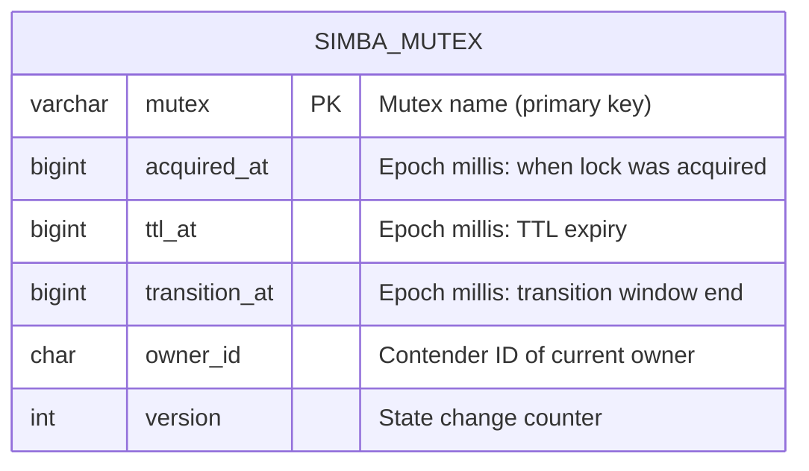
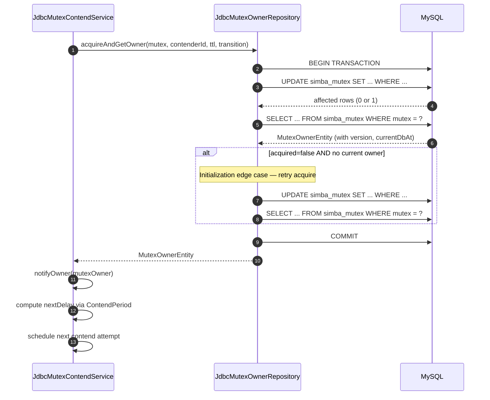
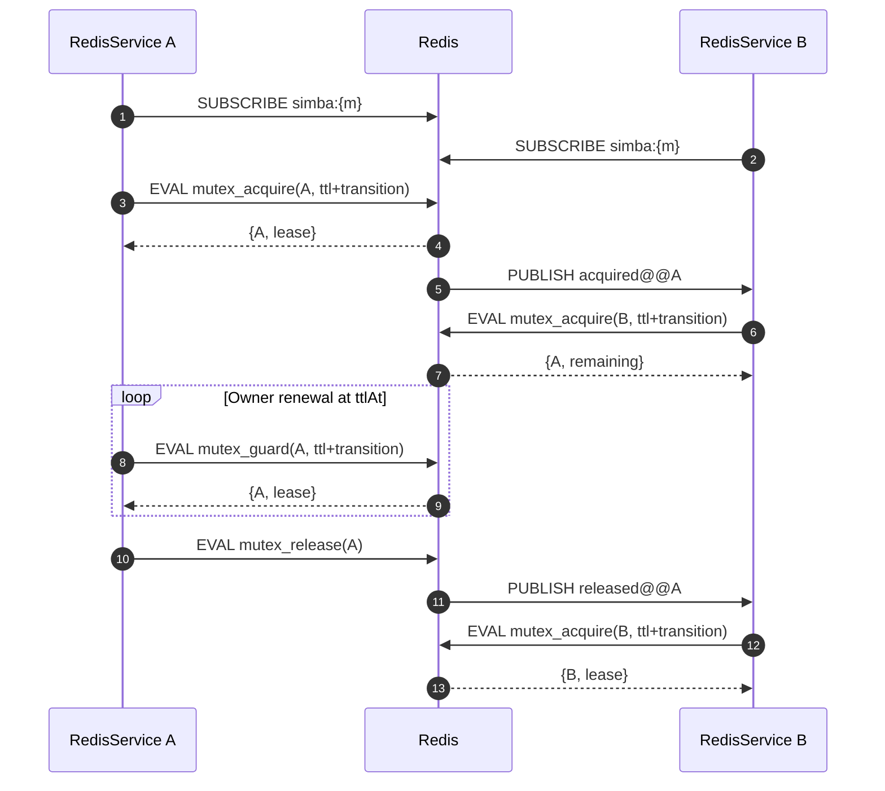
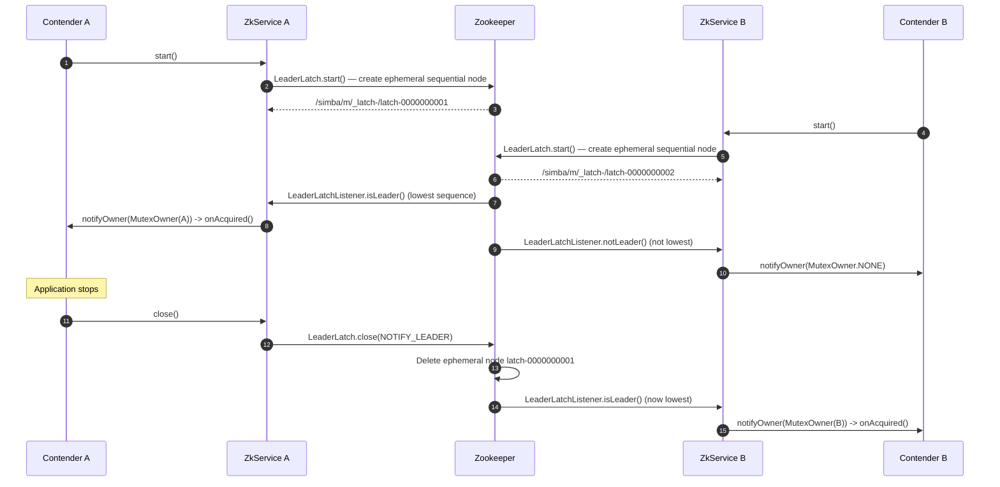
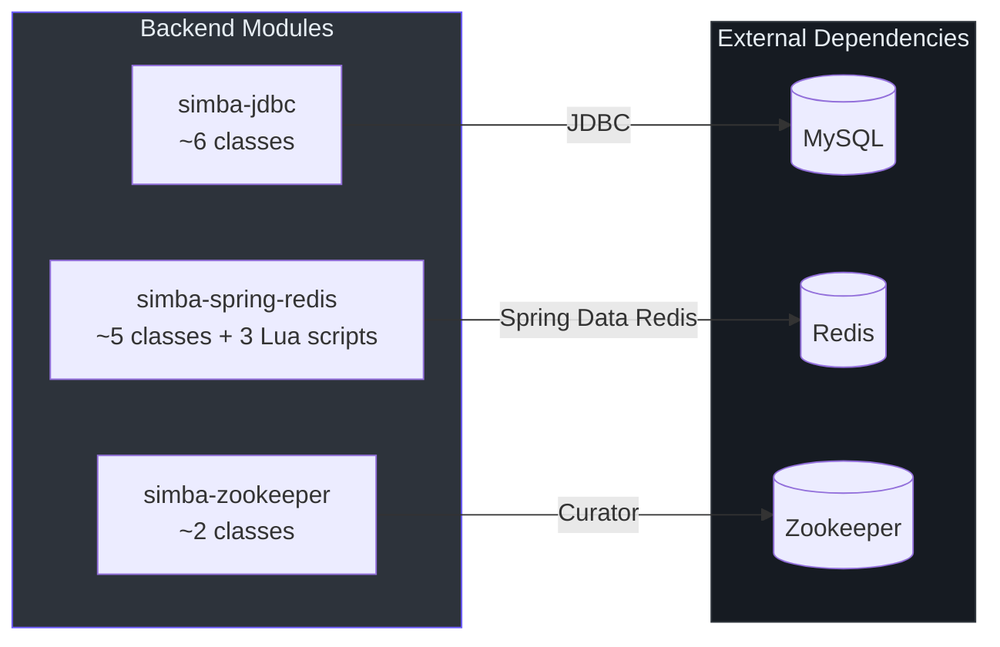
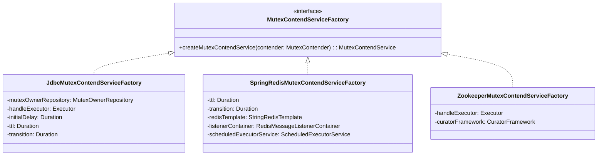
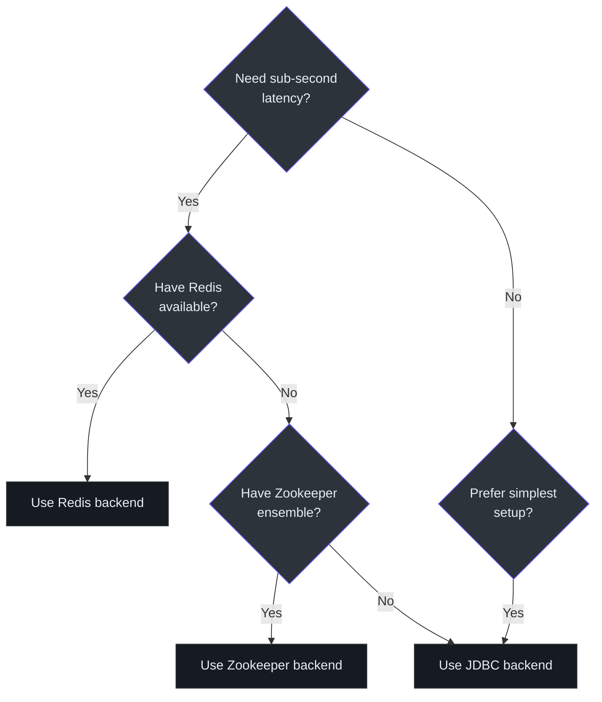

# Backend Implementations

Simba provides three pluggable backends for distributed mutex storage. Each implements
`AbstractMutexContendService` and provides a corresponding `MutexContendServiceFactory`.
The backends differ in latency characteristics, failure detection speed, external
dependencies, and operational complexity.

## JDBC Backend

The JDBC backend uses a MySQL table (`simba_mutex`) with atomic conditional `UPDATE`s guarded by
owner/transition predicates. Contention is driven by polling through a `ScheduledThreadPoolExecutor`.

### Schema

The init script at
[`simba-jdbc/src/init-script/init-simba-mysql.sql`](https://github.com/Ahoo-Wang/Simba/blob/main/simba-jdbc/src/init-script/init-simba-mysql.sql)
creates the following table:

```sql
CREATE TABLE IF NOT EXISTS simba_mutex (
    mutex         VARCHAR(66)    NOT NULL PRIMARY KEY COMMENT 'mutex name',
    acquired_at   BIGINT UNSIGNED NOT NULL,
    ttl_at        BIGINT UNSIGNED NOT NULL,
    transition_at BIGINT UNSIGNED NOT NULL,
    owner_id      VARCHAR(128)   NOT NULL,
    version       INT UNSIGNED   NOT NULL
);
```


```mermaid
erDiagram
    SIMBA_MUTEX {
        varchar mutex PK "Mutex name (primary key)"
        bigint acquired_at "Epoch millis: when lock was acquired"
        bigint ttl_at "Epoch millis: TTL expiry"
        bigint transition_at "Epoch millis: transition window end"
        char owner_id "Contender ID of current owner"
        int version "State change counter"
    }
```

The `MutexOwnerEntity` class ([`JdbcMutexOwnerRepository.kt`](https://github.com/Ahoo-Wang/Simba/blob/main/simba-jdbc/src/main/kotlin/me/ahoo/simba/jdbc/MutexOwnerRepository.kt))
extends `MutexOwner` with a `version` state-change counter and a `currentDbAt`
field that captures the database server's current timestamp, preventing clock skew issues
between application nodes.

### Atomic Acquire (Conditional Update)

The `SQL_ACQUIRE` query in
[`JdbcMutexOwnerRepository`](https://github.com/Ahoo-Wang/Simba/blob/main/simba-jdbc/src/main/kotlin/me/ahoo/simba/jdbc/JdbcMutexOwnerRepository.kt#L43)
performs an atomic `UPDATE ... WHERE` with two conditions:

```sql
UPDATE simba_mutex
SET acquired_at = NOW_MS,
    ttl_at      = NOW_MS + ?,
    transition_at = NOW_MS + ?,
    owner_id    = ?,
    version     = version + 1
WHERE mutex = ?
  AND (
    (transition_at < NOW_MS)             -- transition expired: anyone can acquire
    OR
    (owner_id = ? AND transition_at > NOW_MS)  -- current owner can renew
  );
```

The dual WHERE condition is the core of Simba's fairness guarantee:
1. **Non-owners** can only acquire when `transition_at` has fully passed.
2. **The current owner** can re-acquire (renew/guard) at any time within the transition window.

If the `UPDATE` affects zero rows, the contender did not win. The method then reads the
current owner via `SQL_GET` and returns it so the contender can compute the next delay.

### acquireAndGetOwner Transaction

The `acquireAndGetOwner()` method ([line 185](https://github.com/Ahoo-Wang/Simba/blob/main/simba-jdbc/src/main/kotlin/me/ahoo/simba/jdbc/JdbcMutexOwnerRepository.kt#L185))
wraps the acquire + read operations in a database transaction:


```mermaid
sequenceDiagram
autonumber
    participant CS as JdbcMutexContendService
    participant REPO as JdbcMutexOwnerRepository
    participant DB as MySQL

    CS->>REPO: acquireAndGetOwner(mutex, contenderId, ttl, transition)
    REPO->>DB: BEGIN TRANSACTION
    REPO->>DB: UPDATE simba_mutex SET ... WHERE ...
    DB-->>REPO: affected rows (0 or 1)
    REPO->>DB: SELECT ... FROM simba_mutex WHERE mutex = ?
    DB-->>REPO: MutexOwnerEntity (with version, currentDbAt)

    alt acquired=false AND no current owner
        Note over REPO: Initialization edge case — retry acquire
        REPO->>DB: UPDATE simba_mutex SET ... WHERE ...
        REPO->>DB: SELECT ... FROM simba_mutex WHERE mutex = ?
    end

    REPO->>DB: COMMIT
    REPO-->>CS: MutexOwnerEntity
    CS->>CS: notifyOwner(mutexOwner)
    CS->>CS: compute nextDelay via ContendPeriod
    CS->>CS: schedule next contend attempt
```

### Release

The `SQL_RELEASE` query ([line 59](https://github.com/Ahoo-Wang/Simba/blob/main/simba-jdbc/src/main/kotlin/me/ahoo/simba/jdbc/JdbcMutexOwnerRepository.kt#L59))
clears the ownership record:

```sql
UPDATE simba_mutex
SET acquired_at=0, ttl_at=0, transition_at=0, owner_id='', version=version+1
WHERE mutex = ? AND owner_id = ?
```

The `WHERE owner_id = ?` clause ensures only the actual owner can release.

### Service Lifecycle

[`JdbcMutexContendService`](https://github.com/Ahoo-Wang/Simba/blob/main/simba-jdbc/src/main/kotlin/me/ahoo/simba/jdbc/JdbcMutexContendService.kt)
is a thin [`LeaseContendService`](https://github.com/Ahoo-Wang/Simba/blob/main/simba-core/src/main/kotlin/me/ahoo/simba/core/LeaseContendService.kt) over `JdbcMutexLeaseStore`, which maps every contention (acquire or renew) to
`MutexOwnerRepository.acquireAndGetOwner()`. The engine runs the loop: contend, notify the owner, and schedule
the next attempt with `ContendPeriod.ensureNextDelay()`.

```kotlin
// LeaseContendService — simplified contention loop
private fun contend(generation: Long) {
    var nextDelay = leaseConfig.ttlMillis                 // retry after ttl on failure
    try {
        val mutexOwner = leaseStore.contend(mutex, contenderId, isOwner, leaseConfig)
        if (adopt(generation, mutexOwner)) {             // notify, or release a stale acquisition
            nextDelay = contendPeriod.ensureNextDelay(mutexOwner)
        }
    } catch (throwable: Throwable) {
        nextDelay = onFailure(generation)                // keep ownership within the lease, else revoke
    } finally {
        complete(generation, nextDelay)                  // schedule the next attempt
    }
}
```

After each successful acquisition or renewal the engine arms a watchdog at the lease end (`transitionAt`,
measured from when the call was sent). If no renewal succeeds by then, even because the database call hangs,
local ownership is revoked. A failed renewal keeps ownership while the lease is valid and retries with a halving
backoff; the starter also sets the repository `queryTimeout` to `ttl`.

Services created by `JdbcMutexContendServiceFactory` share one trigger scheduler and one I/O executor for
database calls; the factory owns both and shuts them down on `close()`.

## Redis Backend

The Redis backend uses atomic Lua scripts for lease operations and Redis Pub/Sub broadcasts so that waiting
contenders react to ownership changes immediately instead of waiting for their next poll.

### Lua Scripts

All scripts receive their keys through `KEYS` (Redis Cluster compliant). The acquire and guard scripts return
`{ownerId, remaining lease in ms, fencing token}`, or `{'', 0, 0}` when there is no owner. A new term increments
`simba:{mutex}:fence` and stores the token in `simba:{mutex}:token` (see [ADR 0002](https://github.com/Ahoo-Wang/Simba/blob/main/docs/adr/0002-fencing-token.md)).

#### mutex_acquire.lua

[`mutex_acquire.lua`](https://github.com/Ahoo-Wang/Simba/blob/main/simba-spring-redis/src/main/resources/mutex_acquire.lua)
acquires with `SET ... NX PX` for `ttl + transition` and announces the new owner:

```lua
if redis.call('set', mutexKey, contenderId, 'nx', 'px', lease) then
    local token = redis.call('incr', fenceKey)
    redis.call('set', tokenKey, token, 'px', lease)
    redis.call('publish', mutexKey, 'acquired@@' .. contenderId)
    return { contenderId, tonumber(lease), token };
end
local ownerId = redis.call('get', mutexKey)
if not ownerId then
    return { '', 0, 0 };
end
return { ownerId, redis.call('pttl', mutexKey), tonumber(redis.call('get', tokenKey) or '0') };
```

#### mutex_guard.lua

[`mutex_guard.lua`](https://github.com/Ahoo-Wang/Simba/blob/main/simba-spring-redis/src/main/resources/mutex_guard.lua)
renews the lease with `SET ... XX PX` only when the caller still owns it, otherwise it reports the current
owner. It never recreates a lease that already expired.

#### mutex_release.lua

[`mutex_release.lua`](https://github.com/Ahoo-Wang/Simba/blob/main/simba-spring-redis/src/main/resources/mutex_release.lua)
releases only the caller's own lease and broadcasts the release:

```lua
if redis.call('get', mutexKey) ~= contenderId then
    return 0;
end
redis.call('del', mutexKey, tokenKey)
redis.call('publish', mutexKey, 'released@@' .. contenderId)
return 1;
```

Every live contender receives the broadcast and contends at once; exactly one wins the `SET NX`. Unlike a
targeted wake-up, no release can be lost to a crashed contender.

### Pub/Sub Channels

| Channel | Purpose |
|---|---|
| `simba:{mutex}` | All contenders subscribe. Carries `acquired@@{id}` and `released@@{id}`. |

The `{mutex}` hash tag keeps the lease key, the fencing keys and the channel in one Redis Cluster slot.
[`RedisMutexKeys`](https://github.com/Ahoo-Wang/Simba/blob/main/simba-spring-redis/src/main/kotlin/me/ahoo/simba/spring/redis/RedisMutexKeys.kt) is the
single Kotlin source of these names.

### OwnerEvent Protocol

Messages are encoded as `{event}@@{ownerId}` ([`OwnerEvent`](https://github.com/Ahoo-Wang/Simba/blob/main/simba-spring-redis/src/main/kotlin/me/ahoo/simba/spring/redis/OwnerEvent.kt)):

| Event | Reaction |
|---|---|
| `acquired@@{id}` | Update the observed owner |
| `released@@{id}` | Clear the observed owner and contend immediately (`contendNow()`) |

### Redis Contention Flow


```mermaid
sequenceDiagram
autonumber
    participant SA as RedisService A
    participant REDIS as Redis
    participant SB as RedisService B

    SA->>REDIS: SUBSCRIBE simba:{m}
    SB->>REDIS: SUBSCRIBE simba:{m}
    SA->>REDIS: EVAL mutex_acquire(A, ttl+transition)
    REDIS-->>SA: {A, lease}
    REDIS->>SB: PUBLISH acquired@@A
    SB->>REDIS: EVAL mutex_acquire(B, ttl+transition)
    REDIS-->>SB: {A, remaining}
    loop Owner renewal at ttlAt
        SA->>REDIS: EVAL mutex_guard(A, ttl+transition)
        REDIS-->>SA: {A, lease}
    end
    SA->>REDIS: EVAL mutex_release(A)
    REDIS->>SB: PUBLISH released@@A
    SB->>REDIS: EVAL mutex_acquire(B, ttl+transition)
    REDIS-->>SB: {B, lease}
```

## Zookeeper Backend

The Zookeeper backend delegates entirely to Apache Curator's
[`LeaderLatch`](https://curator.apache.org/curator-recipes/leader-latch.html) recipe. It is
the simplest backend implementation in terms of code.

### Implementation

[`ZookeeperMutexContendService`](https://github.com/Ahoo-Wang/Simba/blob/main/simba-zookeeper/src/main/kotlin/me/ahoo/simba/zookeeper/ZookeeperMutexContendService.kt)
implements `LeaderLatchListener` and translates leader events to Simba's ownership model:

```kotlin
class ZookeeperMutexContendService(
    contender: MutexContender,
    handleExecutor: Executor,
    private val curatorFramework: CuratorFramework
) : AbstractMutexContendService(contender, handleExecutor), LeaderLatchListener {

    private var leaderLatch: LeaderLatch? = null
    private val mutexPath: String = "/simba/" + contender.mutex

    override fun startContend() {
        leaderLatch = LeaderLatch(curatorFramework, mutexPath, contenderId)
        leaderLatch!!.addListener(this)
        leaderLatch!!.start()
    }

    override fun stopContend() {
        leaderLatch!!.close(CloseMode.NOTIFY_LEADER)
    }

    override fun isLeader() {
        notifyOwner(MutexOwner(contenderId))
    }

    override fun notLeader() {
        notifyOwner(MutexOwner.NONE)
    }
}
```

### ZNode Structure

Each mutex maps to a Zookeeper path under `/simba/{mutex}`:

```
/simba/
  my-mutex/
    _latch-
      latch-0000000001  (contender A's ephemeral sequential node)
      latch-0000000002  (contender B's ephemeral sequential node)
```

The node with the lowest sequence number is the leader. When it disconnects or closes,
Zookeeper's ephemeral node mechanism automatically removes it and the next node becomes
leader.

### Zookeeper Contention Flow


```mermaid
sequenceDiagram
autonumber
    participant CA as Contender A
    participant ZA as ZkService A
    participant ZK as Zookeeper
    participant ZB as ZkService B
    participant CB as Contender B

    CA->>ZA: start()
    ZA->>ZK: LeaderLatch.start() — create ephemeral sequential node
    ZK-->>ZA: /simba/m/_latch-/latch-0000000001

    CB->>ZB: start()
    ZB->>ZK: LeaderLatch.start() — create ephemeral sequential node
    ZK-->>ZB: /simba/m/_latch-/latch-0000000002

    ZK->>ZA: LeaderLatchListener.isLeader() (lowest sequence)
    ZA->>CA: notifyOwner(MutexOwner(A)) -> onAcquired()

    ZK->>ZB: LeaderLatchListener.notLeader() (not lowest)
    ZB->>CB: notifyOwner(MutexOwner.NONE)

    Note over CA: Application stops
    CA->>ZA: close()
    ZA->>ZK: LeaderLatch.close(NOTIFY_LEADER)
    ZK->>ZK: Delete ephemeral node latch-0000000001

    ZK->>ZB: LeaderLatchListener.isLeader() (now lowest)
    ZB->>CB: notifyOwner(MutexOwner(B)) -> onAcquired()
```

No polling, TTL, or transition is needed — Zookeeper's ephemeral sequential nodes and
watch mechanism handle leader election and failure detection natively.

## Backend Comparison


```mermaid
flowchart LR
    subgraph External["External Dependencies"]
        MYSQL[("MySQL")]
        REDISDB[("Redis")]
        ZKDB[("Zookeeper")]
    end

    subgraph Backends["Backend Modules"]
        JB["simba-jdbc<br>~6 classes"]
        RB["simba-spring-redis<br>~5 classes + 3 Lua scripts"]
        ZB["simba-zookeeper<br>~2 classes"]
    end

    JB -->|"JDBC"| MYSQL
    RB -->|"Spring Data Redis"| REDISDB
    ZB -->|"Curator"| ZKDB

    style External fill:#161b22,stroke:#30363d,color:#e6edf3
    style Backends fill:#2d333b,stroke:#6d5dfc,color:#e6edf3
```

| Feature | JDBC | Redis | Zookeeper |
|---|---|---|---|
| **Acquisition mechanism** | `UPDATE ... WHERE` guarded by owner/transition predicates | `SET NX PX` atomic Lua script | Curator `LeaderLatch` (ephemeral sequential nodes) |
| **Notification** | Polling via `ScheduledThreadPoolExecutor` | Pub/Sub instant notification | ZNode watches (built into Curator) |
| **Failure detection** | TTL expiry (polling interval) | Key TTL expiry + Pub/Sub | Ephemeral node deletion on session loss |
| **Latency** | Polling interval (typically ttl-based) | Sub-millisecond (Pub/Sub push) | Session timeout (typically 5-30s) |
| **Fairness** | None; the first contender polling after `transitionAt` (jittered) wins | None; the first contender reacting to the release broadcast wins | Sequential node ordering |
| **External dependency** | MySQL (or any JDBC database) | Redis | Zookeeper ensemble |
| **Code complexity** | Medium (~6 Kotlin classes) | High (~5 classes + 3 Lua scripts) | Low (~2 Kotlin classes) |
| **Cluster support** | Via shared database | Via Redis Cluster (hash tags) | Via Zookeeper ensemble |
| **Clock sensitivity** | Uses DB server time to avoid app clock skew | Uses Redis `TIME` command | Uses ZK's zxid (no wall clock) |
| **Best for** | Teams with existing MySQL infrastructure | Low-latency requirements, high throughput | Existing Zookeeper deployments, strong consistency |

## Factory Wiring

Each backend provides a factory that wires the storage-specific dependencies:


```mermaid
classDiagram
    class MutexContendServiceFactory {
        <<interface>>
        +createMutexContendService(contender: MutexContender): MutexContendService
    }

    class JdbcMutexContendServiceFactory {
        -mutexOwnerRepository: MutexOwnerRepository
        -handleExecutor: Executor
        -initialDelay: Duration
        -ttl: Duration
        -transition: Duration
    }

    class SpringRedisMutexContendServiceFactory {
        -ttl: Duration
        -transition: Duration
        -redisTemplate: StringRedisTemplate
        -listenerContainer: RedisMessageListenerContainer
        -scheduledExecutorService: ScheduledExecutorService
    }

    class ZookeeperMutexContendServiceFactory {
        -handleExecutor: Executor
        -curatorFramework: CuratorFramework
    }

    MutexContendServiceFactory <|.. JdbcMutexContendServiceFactory
    MutexContendServiceFactory <|.. SpringRedisMutexContendServiceFactory
    MutexContendServiceFactory <|.. ZookeeperMutexContendServiceFactory
```

| Factory | Required Dependencies | Configurable Parameters |
|---|---|---|
| [`JdbcMutexContendServiceFactory`](https://github.com/Ahoo-Wang/Simba/blob/main/simba-jdbc/src/main/kotlin/me/ahoo/simba/jdbc/JdbcMutexContendServiceFactory.kt) | `MutexOwnerRepository` (wraps `DataSource`) | `initialDelay`, `ttl`, `transition` |
| [`SpringRedisMutexContendServiceFactory`](https://github.com/Ahoo-Wang/Simba/blob/main/simba-spring-redis/src/main/kotlin/me/ahoo/simba/spring/redis/SpringRedisMutexContendServiceFactory.kt) | `StringRedisTemplate`, `RedisMessageListenerContainer` | `ttl`, `transition` |
| [`ZookeeperMutexContendServiceFactory`](https://github.com/Ahoo-Wang/Simba/blob/main/simba-zookeeper/src/main/kotlin/me/ahoo/simba/zookeeper/ZookeeperMutexContendServiceFactory.kt) | `CuratorFramework` | None (TTL/transition managed by ZK) |

## AcquireResult Parsing

The Redis backend parses Lua script results using
[`AcquireResult`](https://github.com/Ahoo-Wang/Simba/blob/main/simba-spring-redis/src/main/kotlin/me/ahoo/simba/spring/redis/AcquireResult.kt):

```
"contenderId@@transitionMs"  ->  AcquireResult(ownerId="contenderId", transitionAt=now+transitionMs)
"@@"                         ->  AcquireResult.NONE (no owner)
```

The `transitionAt` is computed as `System.currentTimeMillis() + keyTtl` where `keyTtl` is
the remaining TTL returned by the Lua script. This allows the contention service to build
a `MutexOwner` with accurate timestamps even though Redis does not store `acquiredAt`.

## Choosing a Backend


```mermaid
flowchart TD
    Q1{"Need sub-second<br>latency?"}
    Q2{"Have Redis<br>available?"}
    Q3{"Have Zookeeper<br>ensemble?"}
    Q4{"Prefer simplest<br>setup?"}

    REDIS_REC["Use Redis backend"]
    ZK_REC["Use Zookeeper backend"]
    JDBC_REC["Use JDBC backend"]

    Q1 -->|Yes| Q2
    Q1 -->|No| Q4
    Q2 -->|Yes| REDIS_REC
    Q2 -->|No| Q3
    Q3 -->|Yes| ZK_REC
    Q3 -->|No| JDBC_REC
    Q4 -->|Yes| JDBC_REC

    style Q1 fill:#2d333b,stroke:#6d5dfc,color:#e6edf3
    style Q2 fill:#2d333b,stroke:#6d5dfc,color:#e6edf3
    style Q3 fill:#2d333b,stroke:#6d5dfc,color:#e6edf3
    style Q4 fill:#2d333b,stroke:#6d5dfc,color:#e6edf3
    style REDIS_REC fill:#161b22,stroke:#30363d,color:#e6edf3
    style ZK_REC fill:#161b22,stroke:#30363d,color:#e6edf3
    style JDBC_REC fill:#161b22,stroke:#30363d,color:#e6edf3
```

For most production deployments, the Redis backend offers the best balance of latency and
operational simplicity. The JDBC backend is ideal when the infrastructure already includes
MySQL and adding Redis is not justified. The Zookeeper backend is the natural choice for
systems that already run a Zookeeper ensemble (e.g., Kafka-based architectures).
