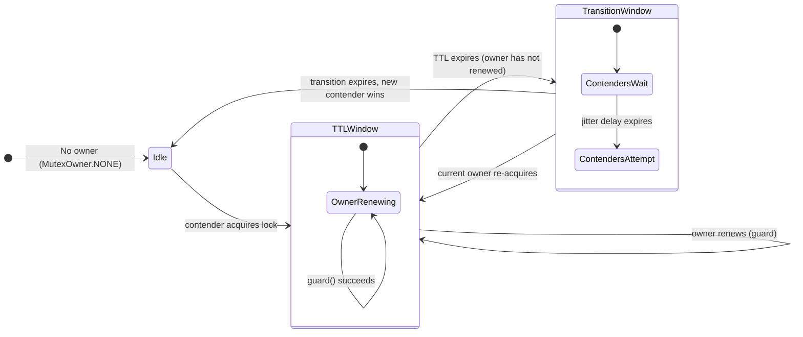
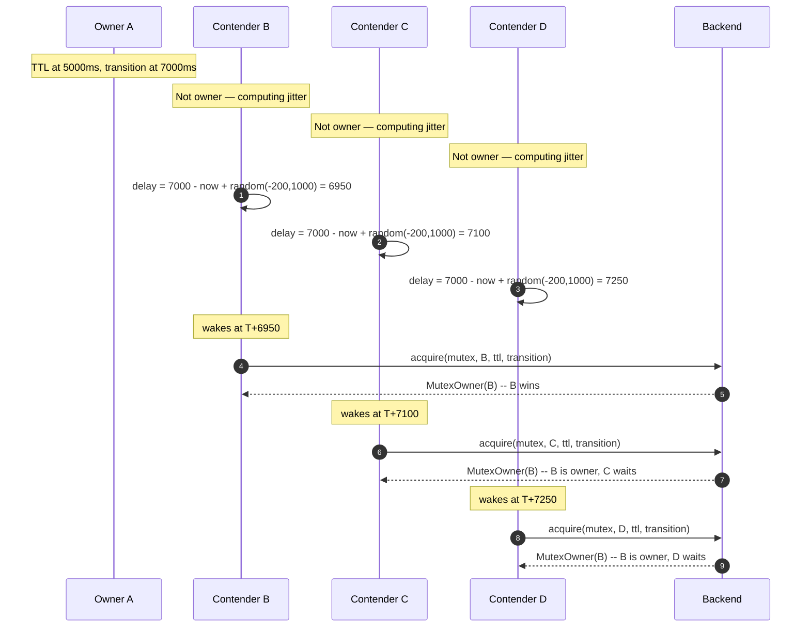
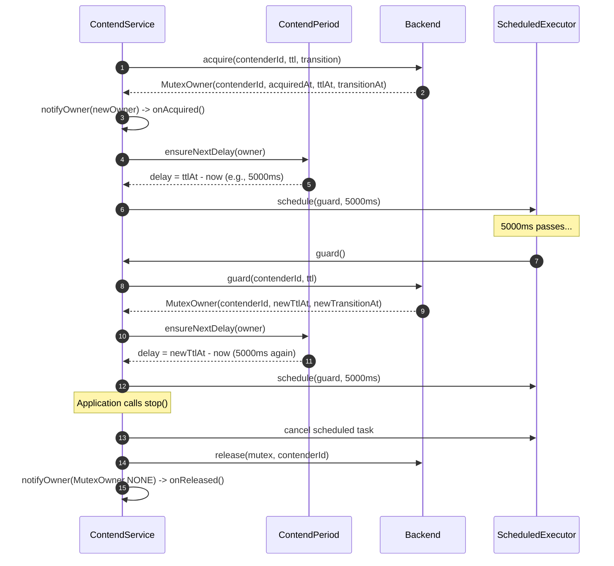
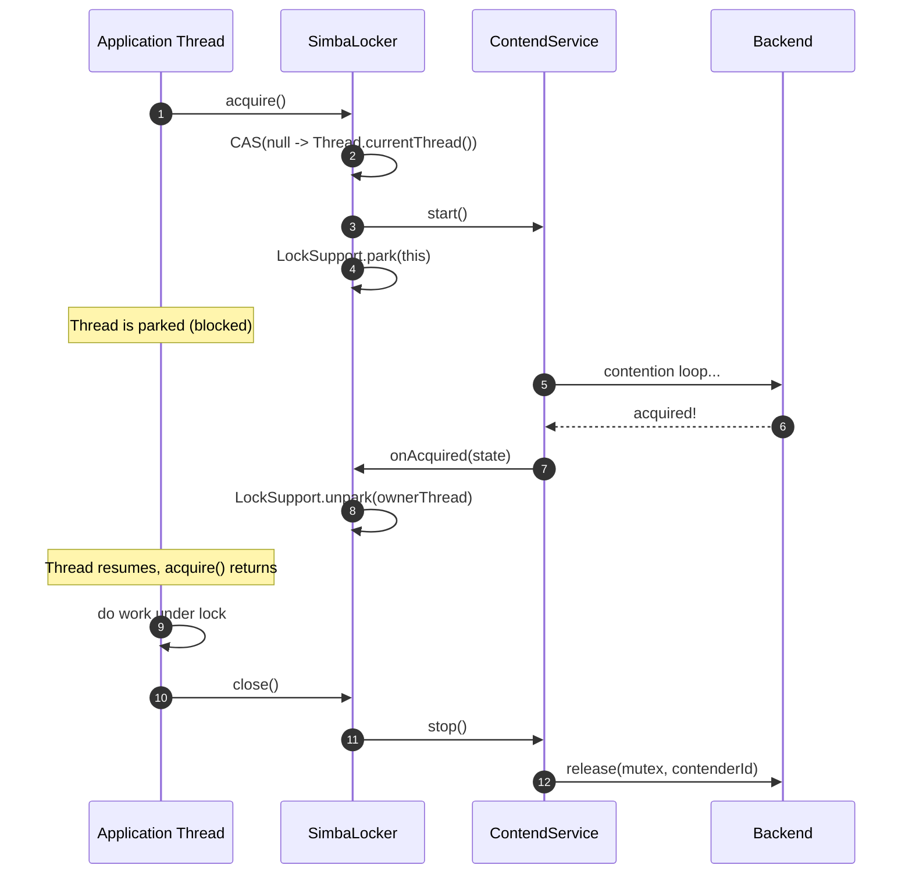
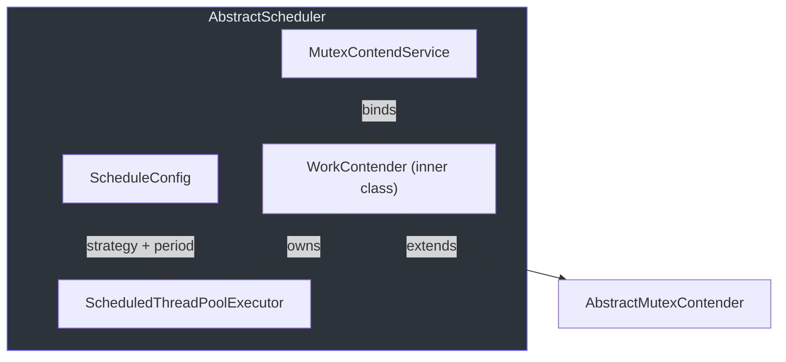
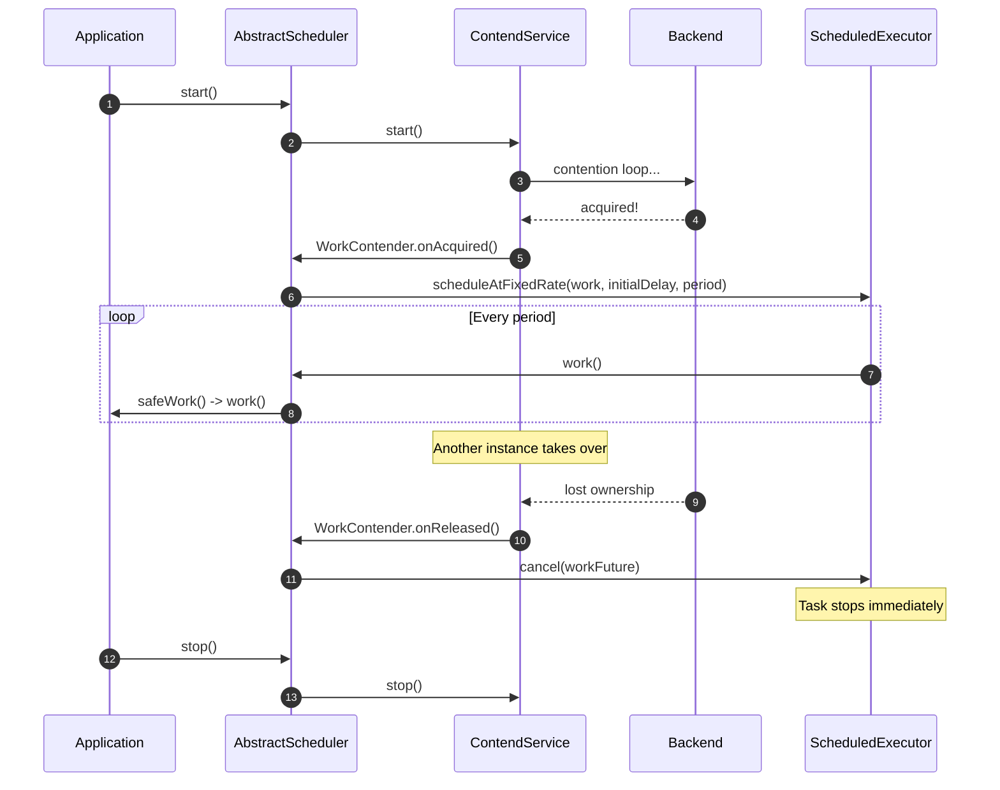

# Contention Mechanics

This page explains the timing and scheduling logic that drives Simba's distributed mutex
contention. Understanding these mechanics is essential for tuning TTL, transition, and jitter
parameters in production.

## Ownership Lifecycle

Every mutex ownership cycle has three time windows defined relative to the `acquiredAt` timestamp:



| Window | Duration | Semantics |
|---|---|---|
| **TTL** | `ttl` milliseconds | The owner holds exclusive rights and must renew before this window expires. Non-owners must not attempt acquisition. |
| **Transition** | `transition` milliseconds | A buffer period after TTL expires. The current owner may still re-acquire (preventing unnecessary leadership flips). Non-owners wait until this window ends, then contend. |
| **Idle** | Unbounded | No active owner. Any contender may acquire immediately. |

## ContendPeriod

[`ContendPeriod`](https://github.com/Ahoo-Wang/Simba/blob/main/simba-core/src/main/kotlin/me/ahoo/simba/core/ContendPeriod.kt)
is the central scheduling calculator. Each contention service instance creates one
`ContendPeriod` bound to its `contenderId`.

### Owner Delay

When the current contender IS the owner, the next scheduling delay is simply the remaining TTL
([`nextOwnerDelay`, line 38](https://github.com/Ahoo-Wang/Simba/blob/main/simba-core/src/main/kotlin/me/ahoo/simba/core/ContendPeriod.kt#L38)):

```
delay = mutexOwner.ttlAt - currentTimeMillis()
```

This means the service will wake up just before TTL expires to renew (guard) the lock.

### Contender Delay

When the current contender is NOT the owner, the delay targets the end of the transition
period plus a random jitter ([`nextContenderDelay`, line 43](https://github.com/Ahoo-Wang/Simba/blob/main/simba-core/src/main/kotlin/me/ahoo/simba/core/ContendPeriod.kt#L43)):

```
delay = (mutexOwner.transitionAt - currentTimeMillis()) + random(-200, +1000)
```

The jitter range is **[-200ms, +1000ms)**:
- The **-200ms** lower bound means some contenders wake up slightly *before* the transition
  period ends, giving them a head start on acquisition. This is intentional — it prevents
  all contenders from waking at exactly the same instant.
- The **+1000ms** upper bound spreads out late wakers.
- When the transition period is zero (`transition == 0`), the jitter range becomes **[0, +1000ms)**.

```mermaid
gantt
    title Ownership Timeline for One Mutex Cycle
    dateFormat X
    axisFormat %L ms

    section Owner (A)
    TTL Window (exclusive)           :active, ttl, 0, 5000
    Transition Window (buffer)       :trans, 5000, 7000

    section Contender (B)
    Waiting (must not contend)       :done, wait, 0, 7000
    Jitter window [-200, +1000]      :crit, jitter, 6800, 8000
```



### ensureNextDelay

The `ensureNextDelay()` method ([line 23](https://github.com/Ahoo-Wang/Simba/blob/main/simba-core/src/main/kotlin/me/ahoo/simba/core/ContendPeriod.kt#L23))
wraps `nextDelay()` and clamps negative values to zero:

```kotlin
fun ensureNextDelay(mutexOwner: MutexOwner): Long {
    val nextDelay = nextDelay(mutexOwner)
    return if (nextDelay < 0) 0 else nextDelay
}
```

This ensures the scheduled task never uses a negative delay (which would cause
`ScheduledThreadPoolExecutor` to execute immediately).

## Thundering Herd Prevention

Without jitter, all non-owner contenders would compute the same delay and wake up at
the same instant, producing a thundering herd of simultaneous acquisition attempts.

Simba's jitter strategy adds `ThreadLocalRandom.current().nextLong(-200, 1000)` to each
contender's delay ([line 48](https://github.com/Ahoo-Wang/Simba/blob/main/simba-core/src/main/kotlin/me/ahoo/simba/core/ContendPeriod.kt#L48)):



The early wakeup (negative jitter) is intentional: it gives the fastest contender a chance
to acquire the lock during the transition window, before other contenders even wake up.

## Guard (Renewal) Mechanism

When the owner's scheduled task fires before TTL expiry, the service calls `guard()` instead
of `acquire()`. Guard attempts to extend the TTL without releasing the lock.

In the Redis backend, the guard Lua script ([mutex_guard.lua](https://github.com/Ahoo-Wang/Simba/blob/main/simba-spring-redis/src/main/resources/mutex_guard.lua))
first verifies that the current contender still owns the lock (`GET mutexKey == contenderId`),
then extends the TTL via `SET ... XX PX transition`:

```lua
-- Verify ownership
if redis.call('get', mutexKey) ~= contenderId then
    return getCurrentOwner(mutexKey)
end
-- Extend TTL (XX = only if key exists)
if redis.call('set', mutexKey, contenderId, 'xx', 'px', transition) then
    return contenderId .. '@@' .. transition
end
```

In the JDBC backend, the `SQL_ACQUIRE` query's WHERE clause allows the current owner to
re-acquire even within the transition window ([line 55 of JdbcMutexOwnerRepository](https://github.com/Ahoo-Wang/Simba/blob/main/simba-jdbc/src/main/kotlin/me/ahoo/simba/jdbc/JdbcMutexOwnerRepository.kt#L55)):

```sql
AND (
    (transition_at < current_timestamp)
    OR
    (owner_id = ? AND transition_at > current_timestamp)
)
```

This dual condition ensures:
1. Non-owners can only acquire when the transition period has fully expired.
2. The current owner can re-acquire (renew) at any time within the transition window.

## Ownership Lifecycle Sequence Diagram

The full lifecycle of a single contention round, from acquisition through renewal to release:



## SimbaLocker Internals

[`SimbaLocker`](https://github.com/Ahoo-Wang/Simba/blob/main/simba-core/src/main/kotlin/me/ahoo/simba/locker/SimbaLocker.kt)
provides a RAII-style (try-with-resources) lock API. It extends `AbstractMutexContender` and
uses `LockSupport.park` / `unpark` for thread synchronization.

### How it Works



Key design points:

1. **Single-owner enforcement** — The `AtomicReferenceFieldUpdater<SimbaLocker, Thread>`
   named `OWNER` ([line 45](https://github.com/Ahoo-Wang/Simba/blob/main/simba-core/src/main/kotlin/me/ahoo/simba/locker/SimbaLocker.kt#L45))
   ensures only one thread can call `acquire()`. A second call from the same or different
   thread throws `IllegalMonitorStateException`.

2. **Timeout support** — `acquire(timeout: Duration)` ([line 73](https://github.com/Ahoo-Wang/Simba/blob/main/simba-core/src/main/kotlin/me/ahoo/simba/locker/SimbaLocker.kt#L73))
   uses `LockSupport.parkNanos()` instead of `park()`. If the thread wakes up without
   acquiring the lock, it throws `TimeoutException`.

3. **No reentrancy** — `SimbaLocker` does not support reentrant locking. Once parked, the
   same thread cannot call `acquire()` again until `close()` releases the lock.

### Usage Pattern

```kotlin
SimbaLocker(mutex, contendServiceFactory).use { locker ->
    locker.acquire()
    // ... work under distributed lock ...
} // close() releases automatically
```

## AbstractScheduler Internals

[`AbstractScheduler`](https://github.com/Ahoo-Wang/Simba/blob/main/simba-core/src/main/kotlin/me/ahoo/simba/schedule/AbstractScheduler.kt)
is a leader-gated scheduled task runner. It uses Simba's distributed mutex to ensure that
only one instance in a cluster executes a periodic task.

### Inner WorkContender

The `WorkContender` inner class ([line 55](https://github.com/Ahoo-Wang/Simba/blob/main/simba-core/src/main/kotlin/me/ahoo/simba/schedule/AbstractScheduler.kt#L55))
extends `AbstractMutexContender` and manages a `ScheduledThreadPoolExecutor` with a single
thread:



**On acquisition** (`onAcquired`, [line 66](https://github.com/Ahoo-Wang/Simba/blob/main/simba-core/src/main/kotlin/me/ahoo/simba/schedule/AbstractScheduler.kt#L66)):
If no scheduled task is running, it creates one using either `scheduleAtFixedRate` or
`scheduleWithFixedDelay` based on the `ScheduleConfig.strategy`.

**On release** (`onReleased`, [line 89](https://github.com/Ahoo-Wang/Simba/blob/main/simba-core/src/main/kotlin/me/ahoo/simba/schedule/AbstractScheduler.kt#L89)):
Cancels the scheduled future, immediately stopping task execution.

### ScheduleConfig

[`ScheduleConfig`](https://github.com/Ahoo-Wang/Simba/blob/main/simba-core/src/main/kotlin/me/ahoo/simba/schedule/ScheduleConfig.kt)
defines two strategies:

| Strategy | Behavior |
|---|---|
| `FIXED_RATE` | `scheduleAtFixedRate` — executes at a fixed interval regardless of task duration |
| `FIXED_DELAY` | `scheduleWithFixedDelay` — waits for the delay *after* the previous task completes |

### Scheduler Lifecycle



## Parameter Tuning Guide

| Parameter | Effect | Recommendation |
|---|---|---|
| `ttl` | How often the owner must renew. Shorter = faster failure detection, more DB/Redis load. | 5-15 seconds for most use cases |
| `transition` | Buffer period before leadership can change. Prevents flapping. | 1-3 seconds (must be > 0 for stable leadership) |
| `initialDelay` | How long to wait before the first contention attempt. | 0 for immediate start, or a small value to stagger cold starts |

The relationship between `ttl` and `transition` determines the total lock validity period:
**total = ttl + transition**. During the `ttl` window, only the owner may operate. During the
`transition` window, the owner may renew (keeping leadership) but non-owners wait.
