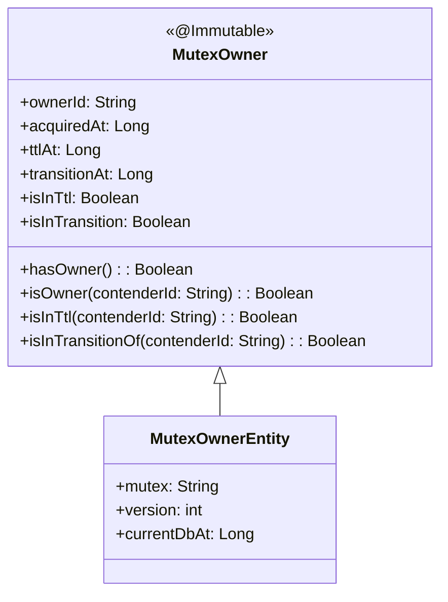
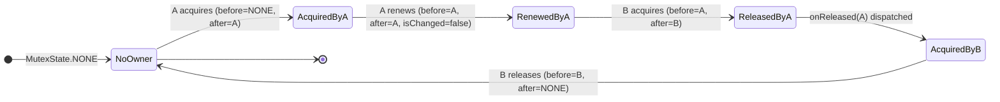
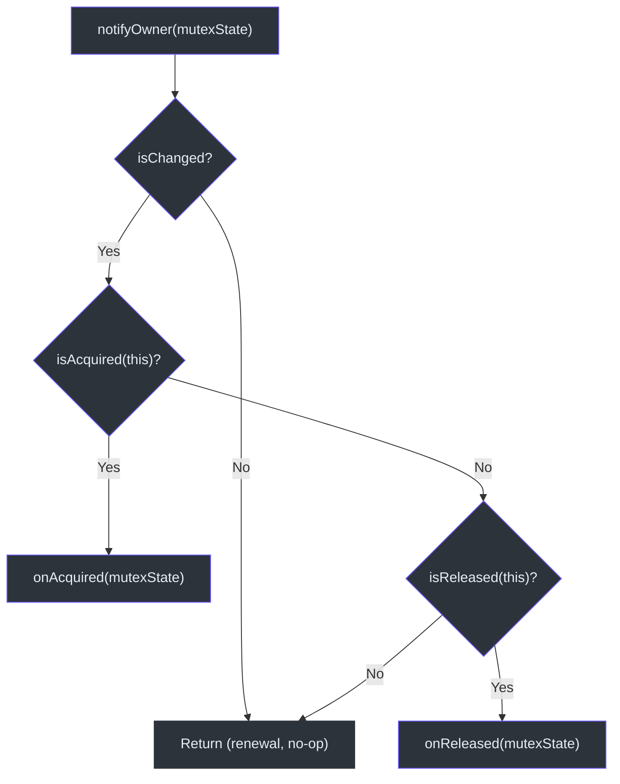
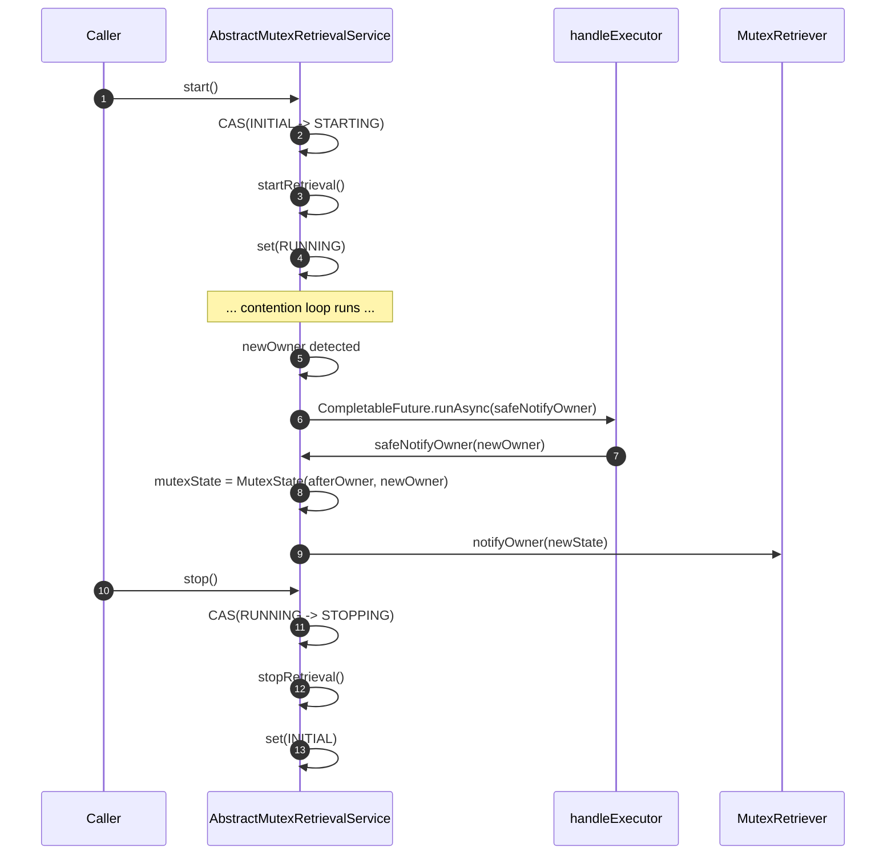
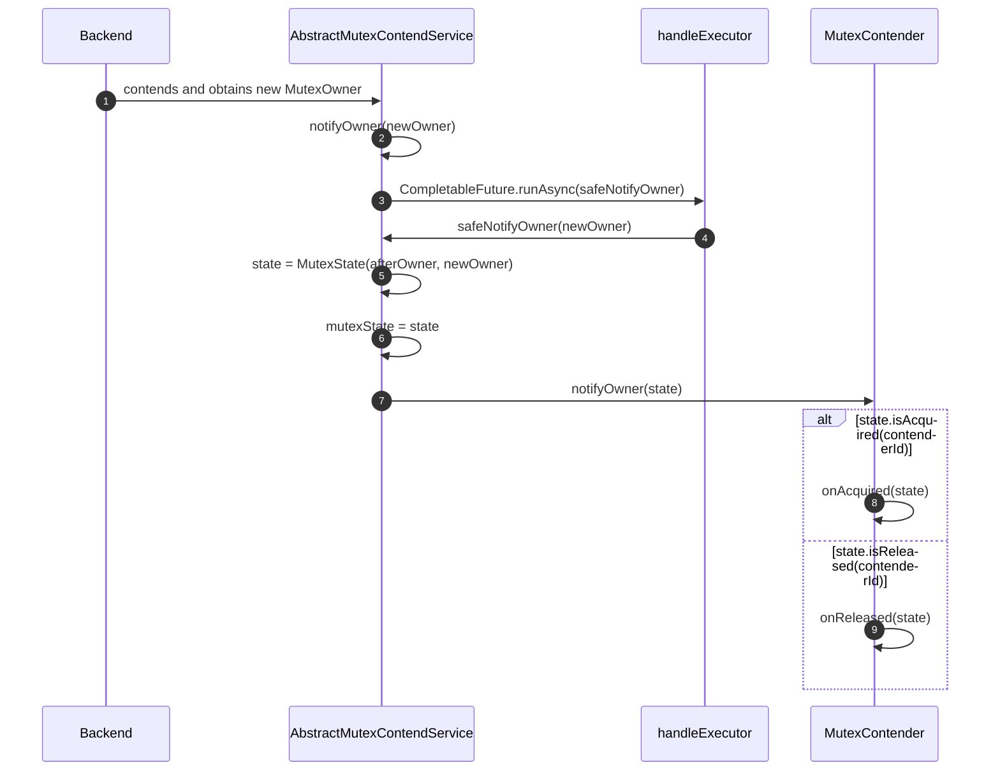
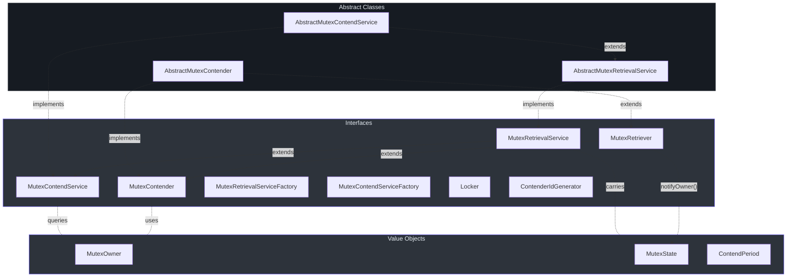

# Core Abstractions

This page documents every type in the `simba-core` module. The module defines the interface chain
that all backends implement, the value objects that represent ownership state, and the abstract
base classes that handle scheduling, notification dispatch, and lifecycle management.

## Value Objects

### MutexOwner

[`MutexOwner`](https://github.com/Ahoo-Wang/Simba/blob/main/simba-core/src/main/kotlin/me/ahoo/simba/core/MutexOwner.kt)
is an immutable value object that represents the current holder of a distributed mutex. It
carries four fields:

| Field | Type | Description |
|---|---|---|
| `ownerId` | `String` | The contender ID of the current owner |
| `acquiredAt` | `Long` | Epoch millis when the lock was acquired |
| `ttlAt` | `Long` | Epoch millis when the lock's TTL expires (owner must renew before this) |
| `transitionAt` | `Long` | Epoch millis when the transition period ends (other contenders may attempt acquisition after this) |

Key derived properties and methods:

- **`isInTtl`** — returns `true` when `ttlAt > currentTimeMillis()`, meaning the owner still has a valid TTL.
- **`isInTransition`** — returns `true` when `transitionAt >= currentTimeMillis()`, meaning no other contender should attempt acquisition yet.
- **`hasOwner()`** — returns `true` when `transitionAt >= currentTimeMillis()`, indicating that an active leader exists (even if TTL has expired, the transition window still counts as "owned").
- **`isOwner(contenderId)`** — checks whether the given contender ID matches `ownerId`.

The class is annotated with Guava's `@Immutable` ([line 22](https://github.com/Ahoo-Wang/Simba/blob/main/simba-core/src/main/kotlin/me/ahoo/simba/core/MutexOwner.kt#L22)).

**NONE sentinel:** The companion object provides `MutexOwner.NONE` ([line 85](https://github.com/Ahoo-Wang/Simba/blob/main/simba-core/src/main/kotlin/me/ahoo/simba/core/MutexOwner.kt#L85)),
a singleton with `ownerId = ""`, `acquiredAt = 0`, `ttlAt = 0`, `transitionAt = 0`. This
represents the absence of any owner and is used as the initial and terminal state.



### MutexState

[`MutexState`](https://github.com/Ahoo-Wang/Simba/blob/main/simba-core/src/main/kotlin/me/ahoo/simba/core/MutexState.kt)
is a `data class` that carries a before/after pair of `MutexOwner` values. It captures
ownership transitions and provides convenience predicates for determining what happened.

| Field | Type | Description |
|---|---|---|
| `before` | `MutexOwner` | The previous owner (or `MutexOwner.NONE`) |
| `after` | `MutexOwner` | The current owner (or `MutexOwner.NONE`) |

Key derived properties:

- **`isChanged`** ([line 36](https://github.com/Ahoo-Wang/Simba/blob/main/simba-core/src/main/kotlin/me/ahoo/simba/core/MutexState.kt#L36)) — `true` when `before.ownerId != after.ownerId`.
- **`isAcquired(contenderId)`** ([line 38](https://github.com/Ahoo-Wang/Simba/blob/main/simba-core/src/main/kotlin/me/ahoo/simba/core/MutexState.kt#L38)) — `true` when the state changed AND the given contender is the new owner.
- **`isReleased(contenderId)`** ([line 42](https://github.com/Ahoo-Wang/Simba/blob/main/simba-core/src/main/kotlin/me/ahoo/simba/core/MutexState.kt#L42)) — `true` when the state changed AND the given contender was the previous owner.
- **`isOwner(contenderId)`** ([line 46](https://github.com/Ahoo-Wang/Simba/blob/main/simba-core/src/main/kotlin/me/ahoo/simba/core/MutexState.kt#L46)) — delegates to `after.isOwner()`.
- **`isInTtl(contenderId)`** ([line 50](https://github.com/Ahoo-Wang/Simba/blob/main/simba-core/src/main/kotlin/me/ahoo/simba/core/MutexState.kt#L50)) — true when the contender is owner AND TTL has not expired.

The companion object provides `MutexState.NONE` ([line 32](https://github.com/Ahoo-Wang/Simba/blob/main/simba-core/src/main/kotlin/me/ahoo/simba/core/MutexState.kt#L32)),
which pairs two `MutexOwner.NONE` values.



## Interfaces

### MutexRetriever

[`MutexRetriever`](https://github.com/Ahoo-Wang/Simba/blob/main/simba-core/src/main/kotlin/me/ahoo/simba/core/MutexRetriever.kt)
is the root callback interface. Every participant in mutex contention must implement it.

```kotlin
interface MutexRetriever {
    val mutex: String
    fun notifyOwner(mutexState: MutexState)
}
```

- `mutex` — the name of the distributed mutex resource.
- `notifyOwner()` — invoked by the contention service whenever the owner state changes.

### MutexContender

[`MutexContender`](https://github.com/Ahoo-Wang/Simba/blob/main/simba-core/src/main/kotlin/me/ahoo/simba/core/MutexContender.kt)
extends `MutexRetriever` with an identity and specialized callbacks:

```kotlin
interface MutexContender : MutexRetriever {
    val contenderId: String
    fun onAcquired(mutexState: MutexState)
    fun onReleased(mutexState: MutexState)
}
```

The default `notifyOwner()` implementation ([lines 27-37](https://github.com/Ahoo-Wang/Simba/blob/main/simba-core/src/main/kotlin/me/ahoo/simba/core/MutexContender.kt#L27-L37))
filters no-change transitions and routes the callback:

1. If `mutexState.isChanged` is `false`, return immediately (renewal, not a real transition).
2. If `mutexState.isAcquired(contenderId)` — call `onAcquired()`.
3. If `mutexState.isReleased(contenderId)` — call `onReleased()`.



### MutexRetrievalService

[`MutexRetrievalService`](https://github.com/Ahoo-Wang/Simba/blob/main/simba-core/src/main/kotlin/me/ahoo/simba/core/MutexRetrievalService.kt)
defines the lifecycle of a contention service:

```kotlin
interface MutexRetrievalService : AutoCloseable {
    val status: Status
    val mutexState: MutexState
    val running: Boolean
    fun start()
    fun stop()
}
```

The `Status` enum tracks lifecycle phases:

| Status | Meaning |
|---|---|
| `INITIAL` | Not yet started |
| `STARTING` | Transitioning to running |
| `RUNNING` | Actively contending |
| `STOPPING` | Shutting down |

`isActive` ([line 59](https://github.com/Ahoo-Wang/Simba/blob/main/simba-core/src/main/kotlin/me/ahoo/simba/core/MutexRetrievalService.kt#L59))
returns `true` for both `STARTING` and `RUNNING`.

### MutexContendService

[`MutexContendService`](https://github.com/Ahoo-Wang/Simba/blob/main/simba-core/src/main/kotlin/me/ahoo/simba/core/MutexContendService.kt)
extends `MutexRetrievalService` and adds contender-specific queries:

```kotlin
interface MutexContendService : MutexRetrievalService {
    val contender: MutexContender
    val isOwner: Boolean
    val isInTtl: Boolean
}
```

- `isOwner` ([line 36](https://github.com/Ahoo-Wang/Simba/blob/main/simba-core/src/main/kotlin/me/ahoo/simba/core/MutexContendService.kt#L36)) — checks if the bound contender is the current owner.
- `isInTtl` ([line 38](https://github.com/Ahoo-Wang/Simba/blob/main/simba-core/src/main/kotlin/me/ahoo/simba/core/MutexContendService.kt#L38)) — checks if the bound contender is owner AND TTL is still valid.

## Factory Interfaces

### MutexRetrievalServiceFactory

[`MutexRetrievalServiceFactory`](https://github.com/Ahoo-Wang/Simba/blob/main/simba-core/src/main/kotlin/me/ahoo/simba/core/MutexRetrievalServiceFactory.kt)
creates retrieval services (observation-only, no contention):

```kotlin
interface MutexRetrievalServiceFactory {
    fun createMutexRetrievalService(retrievalListener: MutexRetriever): MutexRetrievalService
}
```

### MutexContendServiceFactory

[`MutexContendServiceFactory`](https://github.com/Ahoo-Wang/Simba/blob/main/simba-core/src/main/kotlin/me/ahoo/simba/core/MutexContendServiceFactory.kt)
creates contention services (full lock acquisition):

```kotlin
interface MutexContendServiceFactory {
    fun createMutexContendService(mutexContender: MutexContender): MutexContendService
}
```

All three backend modules provide implementations of this interface.

## Abstract Implementations

### AbstractMutexRetrievalService

[`AbstractMutexRetrievalService`](https://github.com/Ahoo-Wang/Simba/blob/main/simba-core/src/main/kotlin/me/ahoo/simba/core/AbstractMutexRetrievalService.kt)
is the base class for all retrieval services. It manages:

- **Status transitions** — uses `AtomicReferenceFieldUpdater` ([line 32](https://github.com/Ahoo-Wang/Simba/blob/main/simba-core/src/main/kotlin/me/ahoo/simba/core/AbstractMutexRetrievalService.kt#L32))
  for lock-free CAS on the `status` field. `start()` requires `INITIAL -> STARTING`, and
  `stop()` requires `RUNNING -> STOPPING`.
- **Owner state** — the `mutexState` field is `@Volatile` and updated in `safeNotifyOwner()`.
- **Async notification** — `notifyOwner(newOwner)` dispatches via `CompletableFuture.runAsync()`
  on the `handleExecutor`, ensuring that slow callbacks never block the contention thread.
- **Template methods** — subclasses implement `startRetrieval()` and `stopRetrieval()`.



### AbstractMutexContendService

[`AbstractMutexContendService`](https://github.com/Ahoo-Wang/Simba/blob/main/simba-core/src/main/kotlin/me/ahoo/simba/core/AbstractMutexContendService.kt)
extends `AbstractMutexRetrievalService` and bridges the retrieval and contention layers:

```kotlin
abstract class AbstractMutexContendService(
    override val contender: MutexContender,
    handleExecutor: Executor
) : AbstractMutexRetrievalService(contender, handleExecutor), MutexContendService {

    override fun startRetrieval() {
        resetOwner()
        startContend()
    }

    override fun stopRetrieval() {
        stopContend()
    }

    protected abstract fun startContend()
    protected abstract fun stopContend()
}
```

`startRetrieval()` resets the owner to `NONE` before calling `startContend()`, ensuring a
clean slate. The two abstract methods (`startContend` / `stopContend`) are the extension points
that JDBC, Redis, and Zookeeper backends implement.

### AbstractMutexContender

[`AbstractMutexContender`](https://github.com/Ahoo-Wang/Simba/blob/main/simba-core/src/main/kotlin/me/ahoo/simba/core/AbstractMutexContender.kt)
provides a concrete `MutexContender` base class with logging defaults:

- Validates that both `mutex` and `contenderId` are non-blank in the `init` block ([lines 30-32](https://github.com/Ahoo-Wang/Simba/blob/main/simba-core/src/main/kotlin/me/ahoo/simba/core/AbstractMutexContender.kt#L30-L32)).
- Defaults `contenderId` to `ContenderIdGenerator.HOST.generate()` ([line 24](https://github.com/Ahoo-Wang/Simba/blob/main/simba-core/src/main/kotlin/me/ahoo/simba/core/AbstractMutexContender.kt#L24)).
- Provides logging-only `onAcquired()` / `onReleased()` implementations.

`SimbaLocker` and `AbstractScheduler.WorkContender` both extend this class.

## ContenderIdGenerator

[`ContenderIdGenerator`](https://github.com/Ahoo-Wang/Simba/blob/main/simba-core/src/main/kotlin/me/ahoo/simba/core/ContenderIdGenerator.kt)
is a strategy interface for generating unique contender identifiers. Two implementations are
provided:

### UUIDContenderIdGenerator

[UUIDContenderIdGenerator](https://github.com/Ahoo-Wang/Simba/blob/main/simba-core/src/main/kotlin/me/ahoo/simba/core/ContenderIdGenerator.kt#L36)
generates a random UUID with dashes removed. Accessible via `ContenderIdGenerator.UUID`.

```
a1b2c3d4e5f6789012345678abcdef01
```

### HostContenderIdGenerator

[HostContenderIdGenerator](https://github.com/Ahoo-Wang/Simba/blob/main/simba-core/src/main/kotlin/me/ahoo/simba/core/ContenderIdGenerator.kt#L42)
generates IDs in the format `{counter}:{processId}@{hostAddress}`. Accessible via
`ContenderIdGenerator.HOST` and used as the default in `AbstractMutexContender`.

```
0:12345@192.168.1.100
1:12345@192.168.1.100
```

The counter is an `AtomicLong` that increments per JVM, making IDs human-readable and
traceable to a specific host and process. This is the preferred strategy for production
deployments because it simplifies debugging ownership issues.

## Ownership Notification Flow

The complete flow from backend detection to application callback:



## Interface Relationship Diagram

The diagram below shows the full interface/implementation relationships in `simba-core`:



## Summary

| Abstraction | Type | Location | Purpose |
|---|---|---|---|
| `MutexOwner` | Value object | [core/MutexOwner.kt](https://github.com/Ahoo-Wang/Simba/blob/main/simba-core/src/main/kotlin/me/ahoo/simba/core/MutexOwner.kt) | Immutable snapshot of lock ownership |
| `MutexState` | Value object | [core/MutexState.kt](https://github.com/Ahoo-Wang/Simba/blob/main/simba-core/src/main/kotlin/me/ahoo/simba/core/MutexState.kt) | Before/after ownership transition |
| `MutexRetriever` | Interface | [core/MutexRetriever.kt](https://github.com/Ahoo-Wang/Simba/blob/main/simba-core/src/main/kotlin/me/ahoo/simba/core/MutexRetriever.kt) | Callback contract for ownership changes |
| `MutexContender` | Interface | [core/MutexContender.kt](https://github.com/Ahoo-Wang/Simba/blob/main/simba-core/src/main/kotlin/me/ahoo/simba/core/MutexContender.kt) | Adds identity + acquire/release hooks |
| `MutexRetrievalService` | Interface | [core/MutexRetrievalService.kt](https://github.com/Ahoo-Wang/Simba/blob/main/simba-core/src/main/kotlin/me/ahoo/simba/core/MutexRetrievalService.kt) | Service lifecycle + state access |
| `MutexContendService` | Interface | [core/MutexContendService.kt](https://github.com/Ahoo-Wang/Simba/blob/main/simba-core/src/main/kotlin/me/ahoo/simba/core/MutexContendService.kt) | Contender-bound service with ownership queries |
| `MutexContendServiceFactory` | Interface | [core/MutexContendServiceFactory.kt](https://github.com/Ahoo-Wang/Simba/blob/main/simba-core/src/main/kotlin/me/ahoo/simba/core/MutexContendServiceFactory.kt) | Creates backend-specific contention services |
| `AbstractMutexRetrievalService` | Abstract class | [core/AbstractMutexRetrievalService.kt](https://github.com/Ahoo-Wang/Simba/blob/main/simba-core/src/main/kotlin/me/ahoo/simba/core/AbstractMutexRetrievalService.kt) | CAS-based lifecycle + async notification |
| `AbstractMutexContendService` | Abstract class | [core/AbstractMutexContendService.kt](https://github.com/Ahoo-Wang/Simba/blob/main/simba-core/src/main/kotlin/me/ahoo/simba/core/AbstractMutexContendService.kt) | Bridges retrieval to contention via template method |
| `AbstractMutexContender` | Abstract class | [core/AbstractMutexContender.kt](https://github.com/Ahoo-Wang/Simba/blob/main/simba-core/src/main/kotlin/me/ahoo/simba/core/AbstractMutexContender.kt) | Default contender with validation and logging |
| `ContenderIdGenerator` | Interface | [core/ContenderIdGenerator.kt](https://github.com/Ahoo-Wang/Simba/blob/main/simba-core/src/main/kotlin/me/ahoo/simba/core/ContenderIdGenerator.kt) | Strategy for unique contender ID generation |
| `ContendPeriod` | Class | [core/ContendPeriod.kt](https://github.com/Ahoo-Wang/Simba/blob/main/simba-core/src/main/kotlin/me/ahoo/simba/core/ContendPeriod.kt) | Computes next scheduling delay based on ownership |
