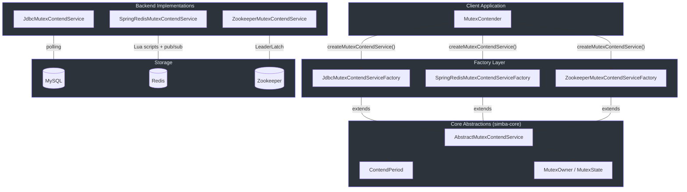
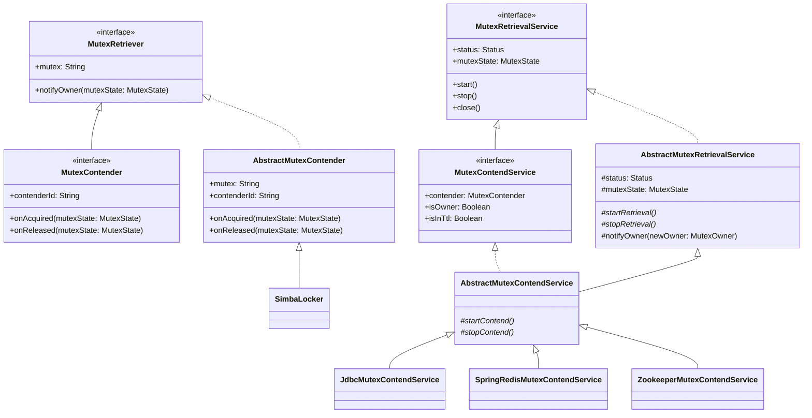
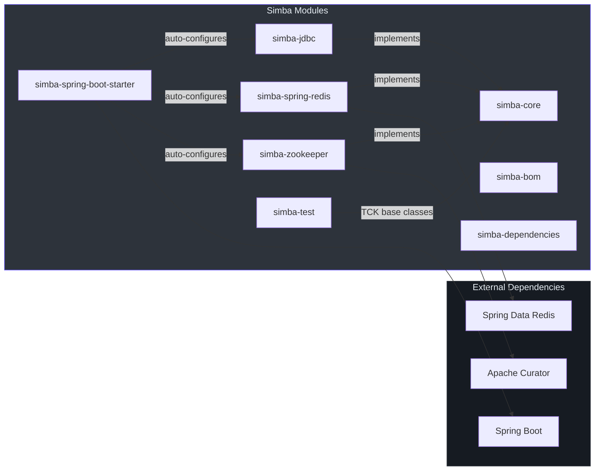
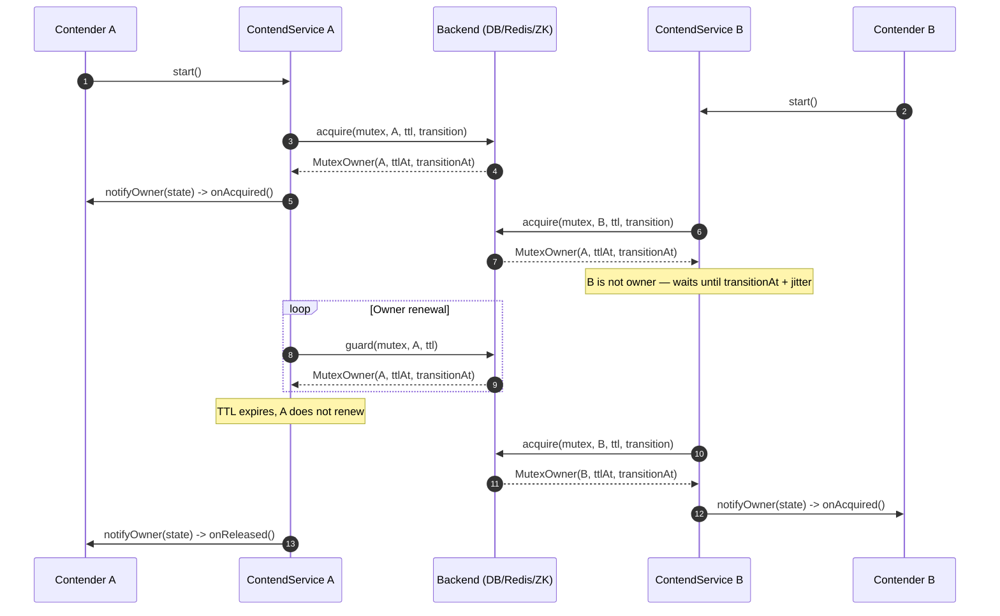

# Architecture Overview

Simba is a distributed mutex (distributed lock) library for the JVM, written in Kotlin. It provides a
uniform contention protocol across three backend implementations — JDBC/MySQL, Redis, and Zookeeper — so
application code can switch storage backends without changing business logic.

## High-Level Architecture

The diagram below shows how a client application interacts with Simba. The client first obtains a
`MutexContendService` from a backend-specific factory, then the service drives the contention loop
against the chosen storage backend.

## Class Hierarchy

The class hierarchy is organized around a clean interface chain: `MutexRetriever` defines the
callback contract, `MutexContender` extends it with an identity and acquisition/release hooks, and
`MutexRetrievalService` / `MutexContendService` manage the lifecycle of contention. Abstract base
classes implement the shared scheduling and notification logic, while backend-specific subclasses
plug in the actual storage operations.

## Design Patterns

Simba applies several well-known design patterns to keep the abstraction clean and the
backend implementations decoupled.

### Template Method Pattern

[`AbstractMutexContendService`](https://github.com/Ahoo-Wang/Simba/blob/main/simba-core/src/main/kotlin/me/ahoo/simba/core/AbstractMutexContendService.kt)
defines the skeleton of the contention lifecycle (`startRetrieval` -> `startContend` ->
`stopContend` -> `stopRetrieval`). Concrete backends override `startContend()` and
`stopContend()` to provide their storage-specific logic, while the base class manages status
transitions, owner state, and notification dispatch.

### Strategy Pattern

Each backend is a strategy for the mutex acquisition algorithm. The
[`MutexContendServiceFactory`](https://github.com/Ahoo-Wang/Simba/blob/main/simba-core/src/main/kotlin/me/ahoo/simba/core/MutexContendServiceFactory.kt)
interface acts as the strategy selector — callers choose a factory implementation at
construction time (JDBC, Redis, or Zookeeper), and the factory produces the corresponding
`MutexContendService`.

### Observer / Callback Pattern

[`MutexRetriever.notifyOwner()`](https://github.com/Ahoo-Wang/Simba/blob/main/simba-core/src/main/kotlin/me/ahoo/simba/core/MutexRetriever.kt#L33)
establishes a callback contract. When the contention service detects an ownership change, it
constructs a `MutexState` and dispatches it asynchronously to the retriever.
[`MutexContender`](https://github.com/Ahoo-Wang/Simba/blob/main/simba-core/src/main/kotlin/me/ahoo/simba/core/MutexContender.kt)
further specializes this by routing the callback to `onAcquired()` or `onReleased()` based on
whether the change is relevant to the contender.

### Factory Pattern

Three factory classes implement the
[`MutexContendServiceFactory`](https://github.com/Ahoo-Wang/Simba/blob/main/simba-core/src/main/kotlin/me/ahoo/simba/core/MutexContendServiceFactory.kt)
interface, each wiring up the appropriate repository, template, client, or connection:

- [`JdbcMutexContendServiceFactory`](https://github.com/Ahoo-Wang/Simba/blob/main/simba-jdbc/src/main/kotlin/me/ahoo/simba/jdbc/JdbcMutexContendServiceFactory.kt) — injects `MutexOwnerRepository` + TTL/transition durations
- [`SpringRedisMutexContendServiceFactory`](https://github.com/Ahoo-Wang/Simba/blob/main/simba-spring-redis/src/main/kotlin/me/ahoo/simba/spring/redis/SpringRedisMutexContendServiceFactory.kt) — injects `StringRedisTemplate` + `RedisMessageListenerContainer`
- [`ZookeeperMutexContendServiceFactory`](https://github.com/Ahoo-Wang/Simba/blob/main/simba-zookeeper/src/main/kotlin/me/ahoo/simba/zookeeper/ZookeeperMutexContendServiceFactory.kt) — injects `CuratorFramework`

### Guarded Suspension Pattern

[`SimbaLocker`](https://github.com/Ahoo-Wang/Simba/blob/main/simba-core/src/main/kotlin/me/ahoo/simba/locker/SimbaLocker.kt)
applies the guarded suspension pattern: the calling thread parks via `LockSupport.park()` and
is unparked by the `onAcquired()` callback when the lock is won. This blocks the caller without
busy-waiting.

### Template Method in AbstractMutexRetrievalService

[`AbstractMutexRetrievalService`](https://github.com/Ahoo-Wang/Simba/blob/main/simba-core/src/main/kotlin/me/ahoo/simba/core/AbstractMutexRetrievalService.kt)
applies template method at a lower level: it enforces CAS-based status transitions
(`INITIAL -> STARTING -> RUNNING -> STOPPING -> INITIAL`) and dispatches owner notifications
through `CompletableFuture.runAsync()` on a configurable `handleExecutor`. Subclasses only
need to implement `startRetrieval()` / `stopRetrieval()` (and by extension, `startContend()` /
`stopContend()`).

### Asynchronous Notification Dispatch

Owner notifications are always dispatched asynchronously via
`CompletableFuture.runAsync(safeNotifyOwner, handleExecutor)` ([line 71](https://github.com/Ahoo-Wang/Simba/blob/main/simba-core/src/main/kotlin/me/ahoo/simba/core/AbstractMutexRetrievalService.kt#L71)).
This ensures that a slow `onAcquired()` / `onReleased()` callback never blocks the contention
scheduling thread. The default `handleExecutor` is `ForkJoinPool.commonPool()` in the JDBC and
Redis factories.

## Key Concepts

### MutexOwner

An immutable value object carrying `ownerId`, `acquiredAt`, `ttlAt`, and `transitionAt`.
The companion object provides `MutexOwner.NONE` as a sentinel for "no current owner".
The `hasOwner()` method returns `true` when `transitionAt >= now`, meaning even an expired
TTL (but within the transition window) counts as "having an owner".

### MutexState

A `data class` pairing `before` and `after` `MutexOwner` values. It provides predicates
like `isChanged`, `isAcquired(contenderId)`, and `isReleased(contenderId)` that abstract
away the comparison logic. See [Core Abstractions](./core-abstractions.md) for details.

### TTL and Transition

Every lock acquisition sets two time boundaries relative to `acquiredAt`:
- **TTL** (`ttlAt = acquiredAt + ttl`): The owner must renew (guard) before this time.
- **Transition** (`transitionAt = ttlAt + transition`): A grace period after TTL expiry
  during which the current owner may still re-acquire, but non-owners must wait.

The total lock validity is `ttl + transition`. This two-phase design prevents leadership
flapping when an owner is slow to renew. See [Contention Mechanics](./contention-mechanics.md).

### ContendPeriod

[`ContendPeriod`](https://github.com/Ahoo-Wang/Simba/blob/main/simba-core/src/main/kotlin/me/ahoo/simba/core/ContendPeriod.kt)
computes the next scheduling delay for each contender:
- **Owner**: `delay = ttlAt - now` (renew just before TTL expiry)
- **Non-owner**: `delay = transitionAt - now + random(-200, +1000)` (wait for transition
  end, then add jitter to prevent thundering herd)

## Module Dependency Diagram

| Module | Role |
|---|---|
| `simba-core` | Core interfaces and abstract implementations |
| `simba-jdbc` | JDBC/MySQL backend — polling with optimistic locking |
| `simba-spring-redis` | Redis backend — Lua scripts + pub/sub notifications |
| `simba-zookeeper` | Zookeeper backend — Curator LeaderLatch recipe |
| `simba-spring-boot-starter` | Spring Boot auto-configuration |
| `simba-test` | TCK (Technology Compatibility Kit) base classes |
| `simba-bom` / `simba-dependencies` | Dependency version management |

## Data Flow

The sequence diagram below traces a complete contention cycle with two contenders. Contender A
wins the first round, holds the lock until its TTL expires, and then Contender B acquires it.

## Three Levels of API

Simba offers three API levels, from lowest to highest abstraction:

| API | Class | Use Case |
|---|---|---|
| **Contender callback** | `MutexContender` + `MutexContendService` | Full control: implement `onAcquired()` / `onReleased()` callbacks |
| **RAII locker** | `SimbaLocker` (implements `Locker`) | Simple try-with-resources: `locker.acquire()` blocks until lock won |
| **Leader scheduler** | `AbstractScheduler` | Leader-gated periodic tasks: work runs only on the lock-holding instance |

The callback API is the foundation. `SimbaLocker` wraps it with `LockSupport.park/unpark`
for blocking semantics. `AbstractScheduler` wraps it with a `ScheduledThreadPoolExecutor`
so the `work()` method only fires on the leader node.

## Tech Stack

| Technology | Version | Role |
|---|---|---|
| Kotlin | 2.4.0 | Implementation language |
| JVM | 17 (toolchain) | Runtime target |
| Gradle | Kotlin DSL | Build system |
| Spring Boot | 4.1.0 | Auto-configuration (starter module) |
| Spring Data Redis | (managed by Boot) | Redis backend client |
| Apache Curator | (managed) | Zookeeper backend client |
| JUnit 5 (Jupiter) | (managed) | Test framework |
| MockK | 1.14.11 | Kotlin mocking |
| Detekt | 1.23.8 | Static analysis |

## Related Pages

- [Core Abstractions](./core-abstractions.md) — Deep dive into `MutexOwner`, `MutexState`, `MutexRetriever`, `MutexContender`, service interfaces, and factories
- [Contention Mechanics](./contention-mechanics.md) — How `ContendPeriod` computes delays, jitter ranges, TTL/transition semantics, `SimbaLocker`, and `AbstractScheduler`
- [Backend Implementations](./backends.md) — JDBC, Redis, and Zookeeper backends compared with sequence diagrams and data models
