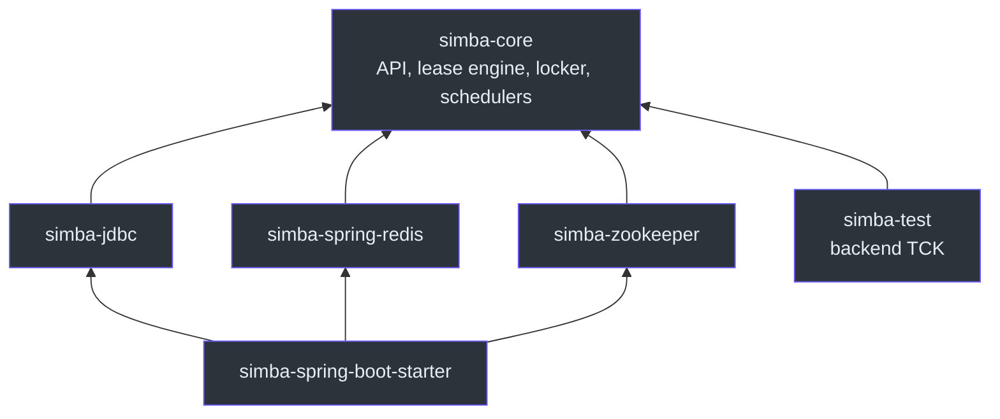
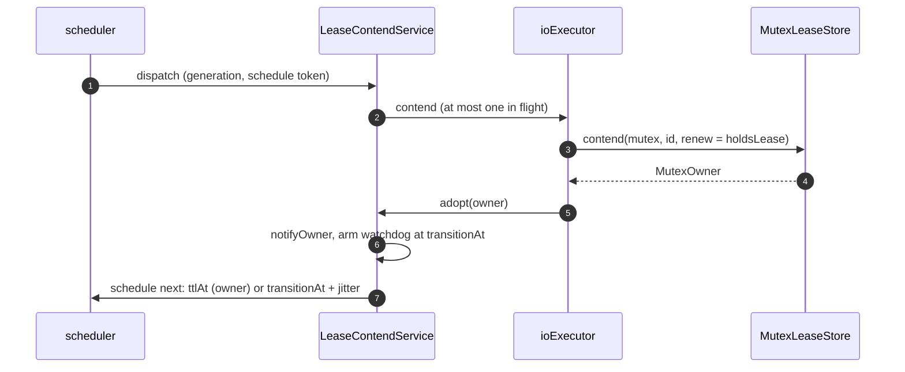

# Architecture

This page is for people changing Simba. It explains how the pieces fit and which rules they rely on; the
[ADRs](https://github.com/Ahoo-Wang/Simba/tree/main/docs/adr) record why.

## Modules

```mermaid
graph BT
    core["simba-core<br>API, lease engine, locker, schedulers"]
    jdbc["simba-jdbc"]
    redis["simba-spring-redis"]
    zk["simba-zookeeper"]
    starter["simba-spring-boot-starter"]
    tck["simba-test<br>backend TCK"]
    jdbc --> core
    redis --> core
    zk --> core
    starter --> jdbc
    starter --> redis
    starter --> zk
    tck --> core
    style core fill:#2d333b,stroke:#6d5dfc,color:#e6edf3
    style jdbc fill:#2d333b,stroke:#6d5dfc,color:#e6edf3
    style redis fill:#2d333b,stroke:#6d5dfc,color:#e6edf3
    style zk fill:#2d333b,stroke:#6d5dfc,color:#e6edf3
    style starter fill:#2d333b,stroke:#6d5dfc,color:#e6edf3
    style tck fill:#2d333b,stroke:#6d5dfc,color:#e6edf3
```

`simba-core` knows no backend and depends only on kotlin-logging. The starter depends on the backends as optional
features. `simba-bom` and `simba-dependencies` are publication metadata; `simba-example` is a runnable sample.

## Layers of a Contend Service

| Layer | Responsibility |
|---|---|
| `AbstractMutexRetrievalService` | Lifecycle (`status`, generations), applying owner changes, ordered notification |
| `AbstractMutexContendService` | Binds a `MutexContender`; reports to `ContendObserver` |
| `LeaseContendService` | Polling engine for lease backends: scheduling, renewal, watchdog, compensation |
| `JdbcMutexContendService`, `SpringRedisMutexContendService` | Thin adapters supplying a `MutexLeaseStore` (Redis also wires pub/sub) |
| `ZookeeperMutexContendService` | Event-driven adapter over Curator `LeaderLatch`; does not use the engine |

`SimbaLocker`, `SimbaScheduler` and `AbstractScheduler` are contenders built on top of a contend service.

### Lifecycle and Notification

- `status`: `INITIAL → STARTING → RUNNING → STOPPING → INITIAL`. A failed `start()` returns to `INITIAL`.
- Each `start()` begins a new **generation**. A notification carries the generation it was produced in; one from an
  older generation is dropped. While inactive, only a release (`MutexOwner.NONE`) may still be applied.
- Owner changes are computed under the state lock but delivered through a `SequentialExecutor` over the handle
  executor, so callbacks run in order and never under a lock.
- `stop()` delivers the final release through the same executor and waits for it, or runs it inline when called from
  one of the service's own callbacks.

## The Lease Engine

`LeaseContendService` turns one atomic storage call (`MutexLeaseStore.contend`) into a lease protocol.

```mermaid
sequenceDiagram
autonumber
    participant S as scheduler
    participant E as LeaseContendService
    participant IO as ioExecutor
    participant B as MutexLeaseStore
    S->>E: dispatch (generation, schedule token)
    E->>IO: contend (at most one in flight)
    IO->>B: contend(mutex, id, renew = holdsLease)
    B-->>IO: MutexOwner
    IO->>E: adopt(owner)
    E->>E: notifyOwner, arm watchdog at transitionAt
    E->>S: schedule next: ttlAt (owner) or transitionAt + jitter
```

Rules the engine maintains:

- **Acquire vs. renew** is decided by the last reply from the store (`holdsLease`), not by `isOwner`, which is
  updated asynchronously.
- **One call in flight** per service. A `contendNow()` request (Redis release broadcast) during a call is coalesced
  and runs immediately after it.
- **Watchdog.** After each successful acquire or renew, a watchdog is armed at `transitionAt`, measured from when the
  call was *sent* with `System.nanoTime()`. It revokes local ownership if no renewal succeeds in time, even while a
  call hangs.
- **Failure.** A failed call keeps ownership while the lease is valid and retries after half the remaining time (min
  100 ms); otherwise it revokes and retries after `ttl`.
- **Late acquisitions.** A call that completes after `stop()` and granted the lease releases it, unless a restarted
  lifecycle with the same `contenderId` is active and now relies on that lease (`adopt`).

## Threads

| Executor | Runs | Default |
|---|---|---|
| Handle executor | `onAcquired` / `onReleased` | Library: `ForkJoinPool.commonPool()`; starter: `simbaHandleExecutor` |
| Scheduler | Contention triggers and watchdogs; never blocks | Shared per factory (`ContendExecutors.newScheduler`) |
| I/O executor | `MutexLeaseStore` calls | Shared per factory (`ContendExecutors.newIoExecutor`); threads ≤ contending services |
| Work executor | `SimbaScheduler` work | One single-thread executor per scheduler, only while leading |

Factory executors are daemon threads reclaimed when idle; factories shut them down on `close()`. A directly
constructed `JdbcMutexContendService` uses its own scheduler and runs I/O on it.

## Time

Lease decisions use backend time or monotonic offsets, never wall clocks of different nodes. `MutexOwner` records the
backend time it was observed at (`observedAt`) plus a `System.nanoTime()` anchor; `currentAt` advances from there.
JDBC reads `current_at` from the database. Redis derives `transitionAt` from `PTTL` and the local clock. Zookeeper uses
no time (`ttlAt = transitionAt = Long.MAX_VALUE`).

## Wire Contracts

Nodes running different Simba versions contend for the same mutex, so these are compatibility-sensitive:

- **Redis keys:** `simba:{mutex}` (lease and pub/sub channel), `simba:{mutex}:fence`, `simba:{mutex}:token`, built in
  `RedisMutexKeys` and the three Lua scripts. Messages are `{event}@@{ownerId}` with `acquired` / `released`. Scripts
  take keys through `KEYS` and return `{ownerId, remaining lease ms, fencing token}`.
- **JDBC schema:** `simba_mutex(mutex, acquired_at, ttl_at, transition_at, owner_id, version, fencing_token)`. In the
  acquire `UPDATE`, the `fencing_token` assignment must stay first in `SET`: MySQL evaluates assignments left to right
  with already-updated values.
- **Zookeeper path:** `/simba/{mutex}`, latch node `czxid` as fencing token.

## Design Records

| ADR | Decision |
|---|---|
| [0001](https://github.com/Ahoo-Wang/Simba/blob/main/docs/adr/0001-lease-contention-engine.md) | Shared lease engine and `MutexLeaseStore` SPI |
| [0002](https://github.com/Ahoo-Wang/Simba/blob/main/docs/adr/0002-fencing-token.md) | Fencing tokens per backend |
| [0003](https://github.com/Ahoo-Wang/Simba/blob/main/docs/adr/0003-simba-4.md) | Simba 4.0 breaking changes |
| [0004](https://github.com/Ahoo-Wang/Simba/blob/main/docs/adr/0004-leader-scheduling.md) | `SimbaScheduler` and `@SimbaScheduled` |
| [0005](https://github.com/Ahoo-Wang/Simba/blob/main/docs/adr/0005-observability.md) | `ContendObserver` and Micrometer metrics |
| [0006](https://github.com/Ahoo-Wang/Simba/blob/main/docs/adr/0006-actuator-endpoint.md) | Read-only `simba` Actuator endpoint |
