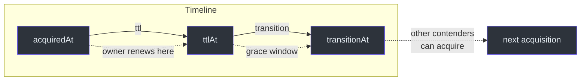
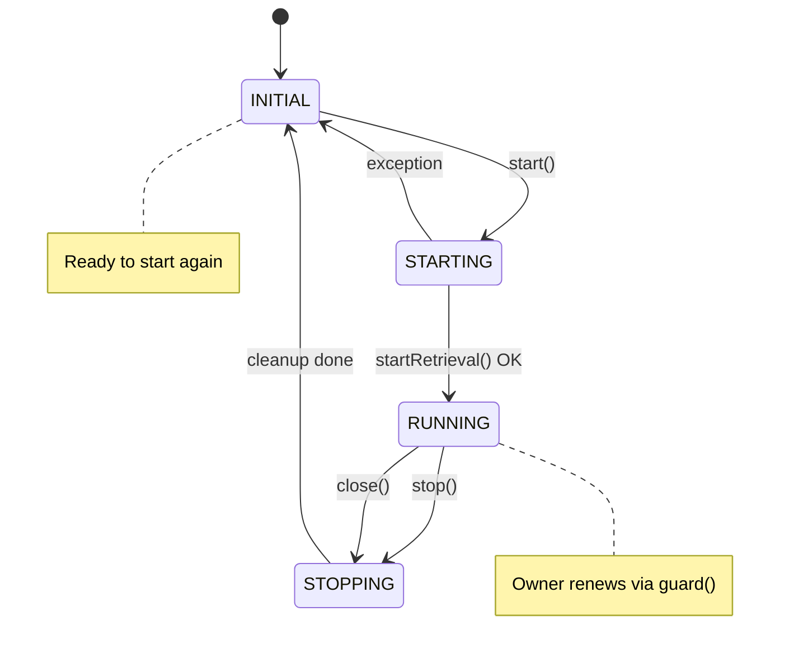
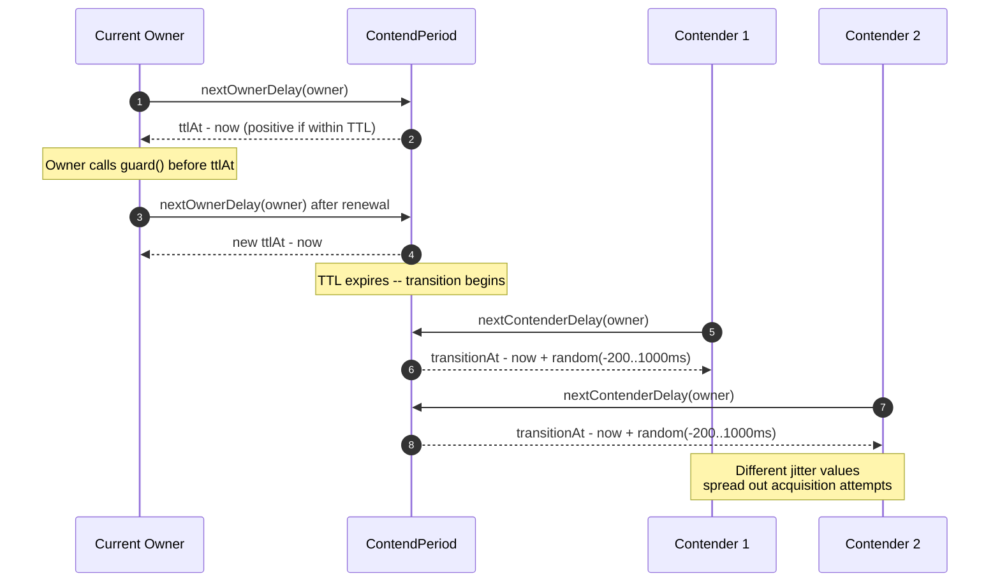
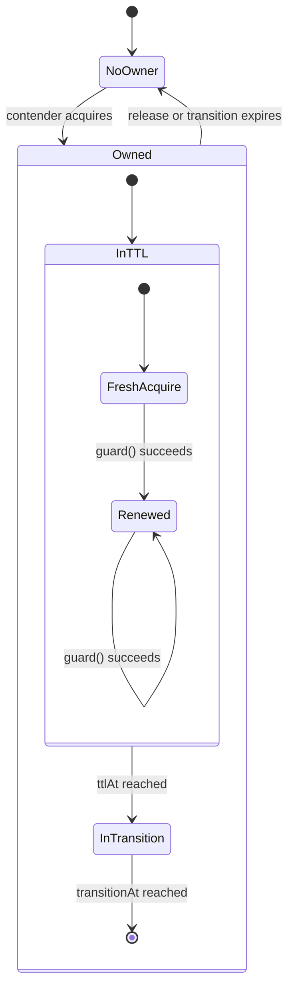

# Configuration

This page covers every configuration option available in Simba. You can configure Simba through Spring Boot properties (recommended for Spring applications) or programmatically through the factory classes.

## Spring Boot Properties

All properties are prefixed with `simba.`. The starter auto-configures the correct `MutexContendServiceFactory` based on which backend you enable.

### Global

| Property | Type | Default | Description |
|---|---|---|---|
| `simba.enabled` | `Boolean` | `true` | Master switch for all Simba auto-configuration. |

### JDBC Backend

Properties prefix: `simba.jdbc`

Defined in [`JdbcProperties`]([file_path:simba-spring-boot-starter/src/main/kotlin/me/ahoo/simba/spring/boot/starter/jdbc/JdbcProperties.kt](https://github.com/Ahoo-Wang/Simba/blob/main/simba-spring-boot-starter/src/main/kotlin/me/ahoo/simba/spring/boot/starter/jdbc/JdbcProperties.kt)).

| Property | Type | Default | Description |
|---|---|---|---|
| `simba.jdbc.enabled` | `Boolean` | `true` | Enable the JDBC backend. Activated when `simba.enabled=true` and this flag is `true`. |
| `simba.jdbc.initial-delay` | `Duration` | `0s` | Delay before the first contention attempt after `start()`. |
| `simba.jdbc.ttl` | `Duration` | `10s` | Time-to-live for the owner lease. The owner must renew before this expires. |
| `simba.jdbc.transition` | `Duration` | `6s` | Grace period after TTL expires. The incumbent owner can renew preferentially during this window. |

**Example `application.yml`:**

```yaml
simba:
  enabled: true
  jdbc:
    enabled: true
    initial-delay: 5s
    ttl: 30s
    transition: 10s
```

### Redis Backend

Properties prefix: `simba.redis`

Defined in [`RedisProperties`]([file_path:simba-spring-boot-starter/src/main/kotlin/me/ahoo/simba/spring/boot/starter/redis/RedisProperties.kt](https://github.com/Ahoo-Wang/Simba/blob/main/simba-spring-boot-starter/src/main/kotlin/me/ahoo/simba/spring/boot/starter/redis/RedisProperties.kt)).

| Property | Type | Default | Description |
|---|---|---|---|
| `simba.redis.enabled` | `Boolean` | `true` | Enable the Redis backend. |
| `simba.redis.ttl` | `Duration` | `10s` | Time-to-live for the owner lease. |
| `simba.redis.transition` | `Duration` | `6s` | Grace period after TTL expires. |

**Example `application.yml`:**

```yaml
simba:
  redis:
    enabled: true
    ttl: 15s
    transition: 8s
```

### Zookeeper Backend

Properties prefix: `simba.zookeeper`

Defined in [`ZookeeperProperties`]([file_path:simba-spring-boot-starter/src/main/kotlin/me/ahoo/simba/spring/boot/starter/zookeeper/ZookeeperProperties.kt](https://github.com/Ahoo-Wang/Simba/blob/main/simba-spring-boot-starter/src/main/kotlin/me/ahoo/simba/spring/boot/starter/zookeeper/ZookeeperProperties.kt)).

| Property | Type | Default | Description |
|---|---|---|---|
| `simba.zookeeper.enabled` | `Boolean` | `true` | Enable the Zookeeper backend. |

The Zookeeper backend delegates leadership lifecycle management to Curator's `LeaderLatch`, so no additional timing properties are needed at the Simba level.

**Example `application.yml`:**

```yaml
simba:
  zookeeper:
    enabled: true
```

## Timing Relationship

Understanding how `ttl` and `transition` interact is essential for correct configuration:



**Key rules:**

- The owner should renew before `ttlAt`. The guard operation extends both `ttlAt` and `transitionAt`.
- Non-owner contenders wake up at `transitionAt` with random jitter of **-200ms to +1000ms** (see [`ContendPeriod.nextContenderDelay()`]([file_path:simba-core/src/main/kotlin/me/ahoo/simba/core/ContendPeriod.kt](https://github.com/Ahoo-Wang/Simba/blob/main/simba-core/src/main/kotlin/me/ahoo/simba/core/ContendPeriod.kt#L43-L49))).
- If `transition` is zero, the owner has no grace period and contenders wake immediately at `ttlAt`.

## Programmatic Configuration

When not using Spring Boot, create a factory directly.

### JDBC Factory

```kotlin
import me.ahoo.simba.jdbc.JdbcMutexContendServiceFactory
import me.ahoo.simba.jdbc.JdbcMutexOwnerRepository
import java.time.Duration

val repository = JdbcMutexOwnerRepository(dataSource)
val factory = JdbcMutexContendServiceFactory(
    mutexOwnerRepository = repository,
    initialDelay = Duration.ofSeconds(0),
    ttl = Duration.ofSeconds(10),
    transition = Duration.ofSeconds(6)
)
```

The factory parameters mirror the Spring Boot properties. The [`JdbcMutexContendServiceFactory`]([file_path:simba-jdbc/src/main/kotlin/me/ahoo/simba/jdbc/JdbcMutexContendServiceFactory.kt](https://github.com/Ahoo-Wang/Simba/blob/main/simba-jdbc/src/main/kotlin/me/ahoo/simba/jdbc/JdbcMutexContendServiceFactory.kt)) accepts an optional `handleExecutor` (defaults to `ForkJoinPool.commonPool()`).

### Redis Factory

```kotlin
import me.ahoo.simba.spring.redis.SpringRedisMutexContendServiceFactory
import org.springframework.data.redis.core.StringRedisTemplate
import org.springframework.data.redis.listener.RedisMessageListenerContainer
import java.time.Duration
import java.util.concurrent.Executors

val factory = SpringRedisMutexContendServiceFactory(
    redisTemplate = redisTemplate,
    listenerContainer = listenerContainer,
    scheduledExecutorService = Executors.newScheduledThreadPool(4),
    ttl = Duration.ofSeconds(10),
    transition = Duration.ofSeconds(6)
)
```

### Zookeeper Factory

```kotlin
import me.ahoo.simba.zookeeper.ZookeeperMutexContendServiceFactory
import org.apache.curator.framework.CuratorFramework

val factory = ZookeeperMutexContendServiceFactory(curatorClient)
```

The Zookeeper backend delegates lease management to Curator, so no timing parameters are needed.

## Lock Lifecycle State Diagram

The `MutexContendService` follows a strict state machine. Understanding this helps when debugging lifecycle issues:



## Contention Timing Flow

This sequence diagram shows how `ContendPeriod` computes the next delay for both the owner and non-owner contenders:



## Owner State Diagram

The `MutexOwner` lifecycle during a single lease:



## Recommended Defaults

| Scenario | TTL | Transition | Notes |
|---|---|---|---|
| **Short-lived tasks** | 5s | 3s | Fast failover, higher backend load |
| **Standard workloads** | 10s | 6s | Default -- good balance |
| **Heavy tasks** | 30s -- 60s | 10s -- 20s | Allows long-running work on the leader |
| **Scheduler with 1-min period** | 65s+ | 20s+ | Must exceed the scheduling period |

## Related Pages

- [Quick Start](/guide/quick-start) -- add dependencies and write your first lock.
- [Architecture](/architecture/) -- deep dive into the contention mechanics.
- [Contributing](/guide/contributing) -- development setup and testing.
