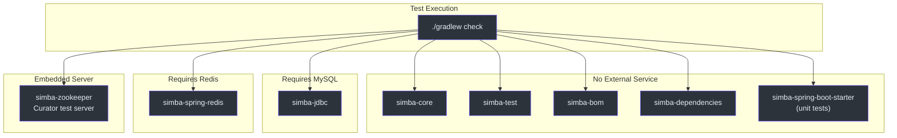
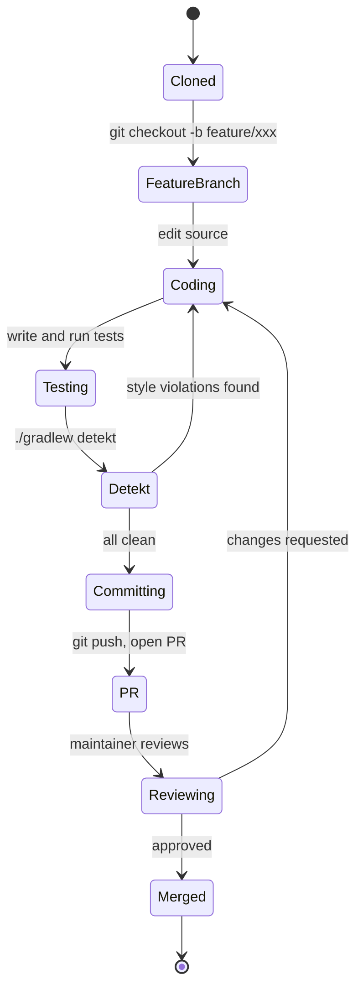
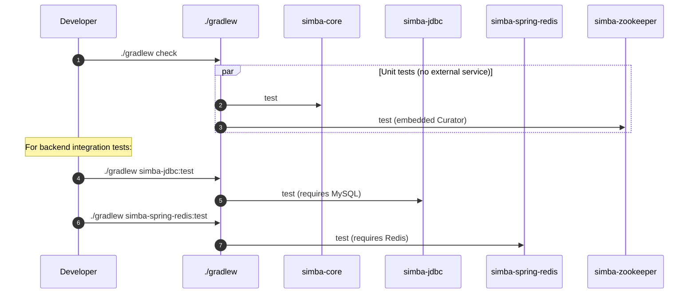
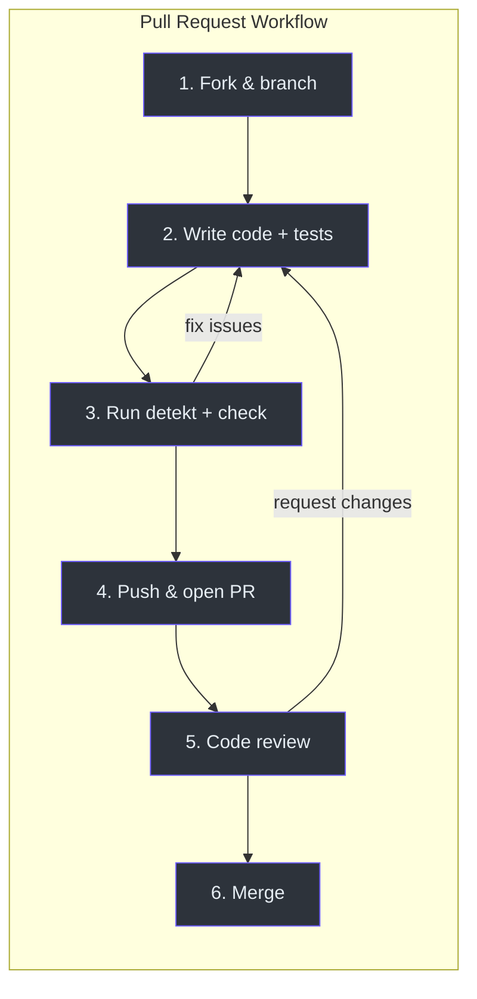

# Contributing

Thank you for your interest in contributing to Simba. This guide walks you through environment setup, build commands, testing requirements, code style, and the pull request process.

## Development Environment

### Prerequisites

| Tool | Version | Notes |
|---|---|---|
| **JDK** | 17+ | Simba targets the JVM 17 toolchain |
| **Gradle** | 8+ (wrapper included) | Use `./gradlew` instead of a global install |
| **Git** | 2.30+ | For cloning and branching |
| **Docker** (optional) | Latest | For running MySQL and Redis containers locally |
| **IntelliJ IDEA** (recommended) | 2024+ | Kotlin and Gradle support built in |

### Clone and Build

```bash
git clone https://github.com/Ahoo-Wang/Simba.git
cd Simba
./gradlew build
```

The `build` task compiles all modules and runs tests that do not require external services.

## Build Commands

| Command | Purpose |
|---|---|
| `./gradlew build` | Compile all modules and run tests |
| `./gradlew check` | Run all tests (same as build for tests) |
| `./gradlew simba-core:check` | Test a single module |
| `./gradlew detekt` | Static analysis with Detekt |
| `./gradlew codeCoverageReport` | Aggregated JaCoCo coverage report |
| `./gradlew clean` | Remove build outputs |

Run Detekt before submitting any code change:

```bash
./gradlew detekt
```

Detekt is configured in [`config/detekt/detekt.yml`]([file_path:config/detekt/detekt.yml](https://github.com/Ahoo-Wang/Simba/blob/main/config/detekt/detekt.yml)) with `autoCorrect = true`, so many style issues are fixed automatically on the next build.

## Testing Requirements by Backend

Not all modules can be tested with a simple `./gradlew check`. Each backend has different requirements:



### simba-jdbc (MySQL)

Requires a running MySQL instance. Apply the init script before running tests:

```bash
mysql -u root -p < simba-jdbc/src/init-script/init-simba-mysql.sql
```

Or use Docker:

```bash
docker run -d --name simba-mysql \
  -e MYSQL_ROOT_PASSWORD=root \
  -e MYSQL_DATABASE=simba \
  -p 3306:3306 \
  mysql:8.0

# Wait for startup, then:
mysql -h 127.0.0.1 -u root -proot simba < simba-jdbc/src/init-script/init-simba-mysql.sql
```

### simba-spring-redis (Redis)

Requires a running Redis instance:

```bash
docker run -d --name simba-redis -p 6379:6379 redis:7
```

### simba-zookeeper

No external service required. Tests use Curator's embedded test server (`TestingServer`).

## Code Style

### Kotlin Conventions

- Follow the [Kotlin Coding Conventions](https://kotlinlang.org/docs/coding-conventions.html).
- Use `val` over `var`. Prefer immutable data structures.
- Use expression bodies for single-expression functions.
- Use descriptive names for lambda parameters.

### Detekt Rules

Detekt enforces static analysis rules defined in [`config/detekt/detekt.yml`]([file_path:config/detekt/detekt.yml](https://github.com/Ahoo-Wang/Simba/blob/main/config/detekt/detekt.yml)). Key rules:

| Rule | Description |
|---|---|
| `MaxLineLength` | 120 characters per line |
| `TooManyFunctions` | Warns at 11+ functions per class |
| `LongParameterList` | Warns at 6+ parameters |
| `WildcardImport` | Disallowed -- use explicit imports |

Auto-correction is enabled (`autoCorrect = true`), so many issues are fixed by running `./gradlew detekt`.

### Testing Conventions

- Tests use **JUnit 5** (Jupiter) with `useJUnitPlatform()`.
- Backend test classes extend base classes from `simba-test`.
- Use the **fluent-assert** library (`me.ahoo.test:fluent-assert-core`) for assertions:

```kotlin
import me.ahoo.test.asserts.assert

// Correct -- use .assert() extension
result.assert().isEqualTo(expected)

// Avoid -- verbose and not null-safe in Kotlin
assertThat(result).isEqualTo(expected)
```

- Use **MockK** (`io.mockk:mockk`) for mocking in Kotlin.
- Place test source files under `src/test/kotlin/me/ahoo/simba/` mirroring the main source tree.

## Development Workflow



## Test Execution Sequence



## PR Process



### Step by Step

1. **Fork and branch** -- Fork the repository on GitHub and create a feature branch from `main`.
2. **Write code and tests** -- Implement your change. Add or update tests in the corresponding test source set.
3. **Run static analysis and tests** -- Execute the full check before pushing:

   ```bash
   ./gradlew detekt check
   ```

4. **Push and open a PR** -- Push your branch and open a pull request against `main`. Fill in the PR template with:
   - What the change does and why.
   - Link to any related issue.
   - Notes for reviewers (e.g. trade-offs, follow-up work).
5. **Code review** -- A maintainer will review the PR. Address feedback by pushing additional commits.
6. **Merge** -- Once approved, the PR is squash-merged into `main`.

### Commit Message Format

Follow [Conventional Commits](https://www.conventionalcommits.org/):

```
<type>(<scope>): <description>

[optional body]
```

Types: `feat`, `fix`, `refactor`, `test`, `docs`, `chore`, `ci`.

Scopes are typically module names: `core`, `jdbc`, `redis`, `zookeeper`, `spring-boot-starter`, `deps`.

Examples:

```
feat(redis): add pub/sub notification for lock release
fix(jdbc): handle race condition in owner update
test(core): add unit tests for ContendPeriod jitter
```

## Project Structure Reference

```mermaid
graph TD
    subgraph sg_14 ["Repository"]
        direction TB
        ROOT["Simba (root)"]
        SC["simba-core"]
        SJ["simba-jdbc"]
        SR["simba-spring-redis"]
        SZ["simba-zookeeper"]
        SBS["simba-spring-boot-starter"]
        ST["simba-test"]
        SB["simba-bom"]
        SD["simba-dependencies"]
        SE["simba-example"]
        CCR["code-coverage-report"]
        CFG["config/detekt"]
    end

    ROOT --> SC
    ROOT --> SJ
    ROOT --> SR
    ROOT --> SZ
    ROOT --> SBS
    ROOT --> ST
    ROOT --> SB
    ROOT --> SD
    ROOT --> SE
    ROOT --> CCR
    ROOT --> CFG

    style ROOT fill:#2d333b,stroke:#6d5dfc,color:#e6edf3
    style SC fill:#2d333b,stroke:#6d5dfc,color:#e6edf3
    style SJ fill:#2d333b,stroke:#6d5dfc,color:#e6edf3
    style SR fill:#2d333b,stroke:#6d5dfc,color:#e6edf3
    style SZ fill:#2d333b,stroke:#6d5dfc,color:#e6edf3
    style SBS fill:#2d333b,stroke:#6d5dfc,color:#e6edf3
    style ST fill:#2d333b,stroke:#6d5dfc,color:#e6edf3
    style SB fill:#2d333b,stroke:#6d5dfc,color:#e6edf3
    style SD fill:#2d333b,stroke:#6d5dfc,color:#e6edf3
    style SE fill:#2d333b,stroke:#6d5dfc,color:#e6edf3
    style CCR fill:#2d333b,stroke:#6d5dfc,color:#e6edf3
    style CFG fill:#2d333b,stroke:#6d5dfc,color:#e6edf3

```



## Related Pages

- [Quick Start](/guide/quick-start) -- add Simba to your project.
- [Configuration](/guide/configuration) -- tune backends and timing.
- [Architecture](/architecture/) -- understand the design.
