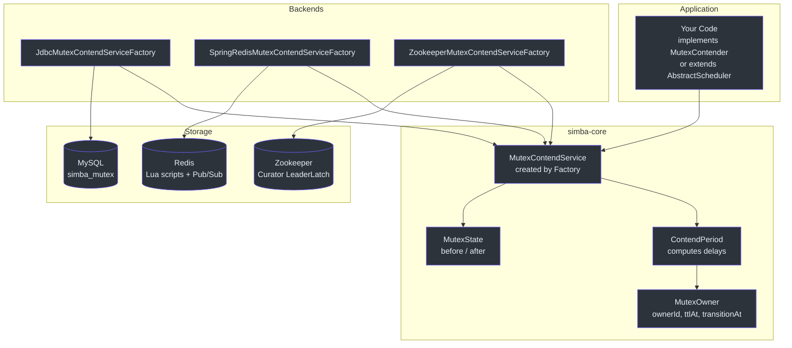
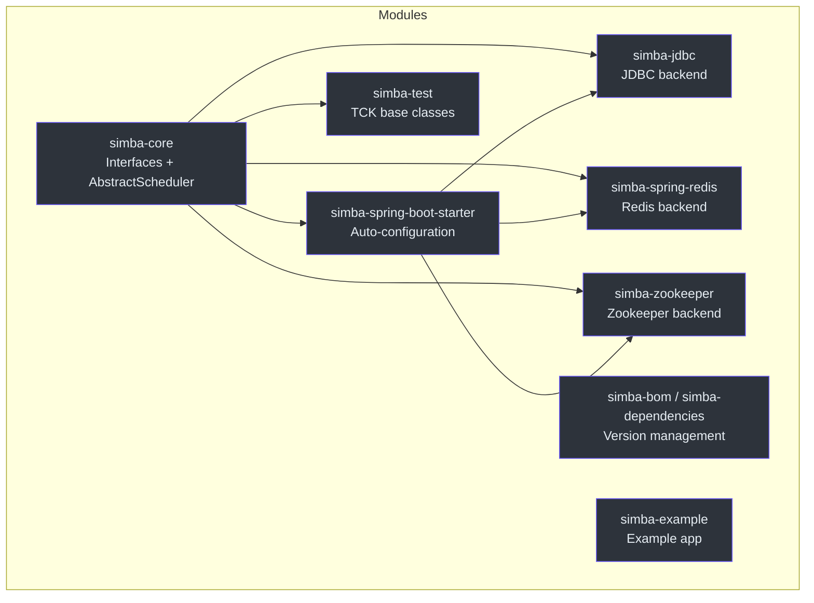
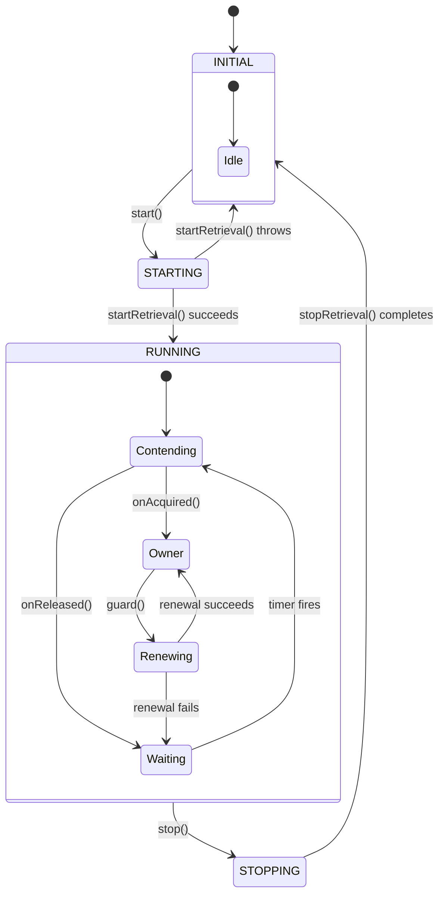

# Introduction to Simba

Simba is a distributed mutex (distributed lock) library for the JVM, written in Kotlin. It enables multiple application instances to coordinate access to shared resources by electing a single leader at any given time. Unlike heavy-weight coordination services, Simba is a lightweight library you add as a dependency -- no separate server process required.

## Why Simba Exists

In a horizontally scaled service, you often need exactly one instance to perform a task: running a scheduled job, writing to a shared resource, or coordinating a deployment. Simba solves this with a simple protocol backed by your choice of storage: a relational database you already run (JDBC/MySQL), your Redis instance, or a Zookeeper cluster.

Key design goals:

- **Simple API** -- three abstraction levels (callback, RAII, scheduler) so you pick the right one for your use case.
- **Pluggable storage** -- swap backends without changing application code.
- **Fairness** -- random jitter prevents the thundering herd problem.
- **Spring-native** -- auto-configuration through Spring Boot starters with feature capability flags.

## Core Concepts

### Mutex

A **mutex** is a named resource that at most one contender can own at a time. In Simba the mutex is identified by a plain string (for example `"my-scheduled-job"`). All contenders that reference the same mutex string compete for the same lock.

The [`MutexRetriever`]([file_path:simba-core/src/main/kotlin/me/ahoo/simba/core/MutexRetriever.kt](https://github.com/Ahoo-Wang/Simba/blob/main/simba-core/src/main/kotlin/me/ahoo/simba/core/MutexRetriever.kt)) interface defines the contract:

```kotlin
interface MutexRetriever {
    val mutex: String
    fun notifyOwner(mutexState: MutexState)
}
```

### Contender

A **contender** is an application instance competing for a mutex. Each contender has a unique `contenderId` -- by default generated from the host name and process ID via [`ContenderIdGenerator`]([file_path:simba-core/src/main/kotlin/me/ahoo/simba/core/ContenderIdGenerator.kt](https://github.com/Ahoo-Wang/Simba/blob/main/simba-core/src/main/kotlin/me/ahoo/simba/core/ContenderIdGenerator.kt)). The [`MutexContender`]([file_path:simba-core/src/main/kotlin/me/ahoo/simba/core/MutexContender.kt](https://github.com/Ahoo-Wang/Simba/blob/main/simba-core/src/main/kotlin/me/ahoo/simba/core/MutexContender.kt)) interface extends `MutexRetriever` and adds `onAcquired` / `onReleased` callbacks.

### Owner

The **owner** is the contender that currently holds the mutex. Ownership is represented by a [`MutexOwner`]([file_path:simba-core/src/main/kotlin/me/ahoo/simba/core/MutexOwner.kt](https://github.com/Ahoo-Wang/Simba/blob/main/simba-core/src/main/kotlin/me/ahoo/simba/core/MutexOwner.kt)) record that tracks:

| Field | Meaning |
|---|---|
| `ownerId` | The `contenderId` of the current owner (empty string if none). |
| `acquiredAt` | Timestamp when ownership was acquired. |
| `ttlAt` | Absolute time when the TTL window expires. |
| `transitionAt` | Absolute time when the transition (grace) window expires. |

### TTL (Time To Live)

The **TTL** is the duration for which a contender holds exclusive ownership. Before the TTL expires, the owner must **renew** its lease by calling the guard operation. If renewal succeeds the TTL is extended; if it fails or the owner crashes, ownership lapses.

### Transition

The **transition** is a grace period that begins when the TTL expires. During transition:

1. The current owner can renew its lease preferentially (making leadership stable).
2. Non-owner contenders wait with random jitter before attempting acquisition.

This two-phase design (TTL + transition) gives the incumbent owner a fair chance to renew while guaranteeing eventual liveness if the owner becomes unresponsive.

## At-a-Glance Summary

| Aspect | Detail |
|---|---|
| **Language** | Kotlin (JVM 17+) |
| **Artifact** | `me.ahoo.simba:simba-core` + backend module |
| **Backends** | JDBC/MySQL, Redis, Zookeeper |
| **APIs** | `MutexContender` (callback), `SimbaLocker` (RAII), `AbstractScheduler` (scheduled) |
| **Spring Boot** | Auto-config via `simba-spring-boot-starter` |
| **License** | Apache 2.0 |
| **Version** | 3.1.0 |

## Architecture Overview

The following diagram shows how the major components connect:



## Module Map



## Lock Lifecycle State Diagram

The following diagram shows the states a `MutexContendService` passes through:



## Comparison: Simba vs Alternatives

| Feature | Simba | Redisson | Curator | ShedLock |
|---|---|---|---|---|
| **Storage** | JDBC, Redis, Zookeeper | Redis only | Zookeeper only | JDBC, Redis, Mongo |
| **API style** | Callback, RAII, Scheduler | Lock, Semaphore, etc. | LeaderLatch | Annotation-based |
| **Leader election** | Built-in (TTL + transition) | Lock-based | Ephemeral nodes | N/A |
| **Scheduled task support** | `AbstractScheduler` | Not built-in | Not built-in | Core feature |
| **Thundering herd mitigation** | Random jitter (-200ms..+1s) | Pub/Sub wait | Watch-based | N/A |
| **Spring Boot starter** | Yes | Yes | No | Yes |
| **Kotlin-first** | Yes | Java-first | Java-first | Java-first |
| **License** | Apache 2.0 | Apache 2.0 | Apache 2.0 | Apache 2.0 |

## Related Pages

- [Quick Start](/guide/quick-start) -- add dependencies and run your first distributed lock.
- [Configuration](/guide/configuration) -- full reference for Spring Boot properties and programmatic setup.
- [Architecture Overview](/architecture/) -- deep dive into the abstraction chain and contention mechanics.
- [Contributing](/guide/contributing) -- set up your development environment and submit a PR.
