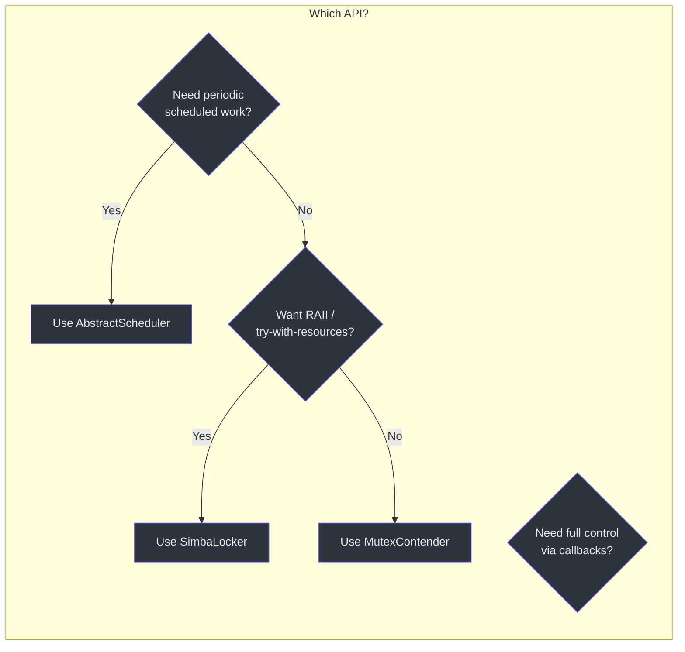
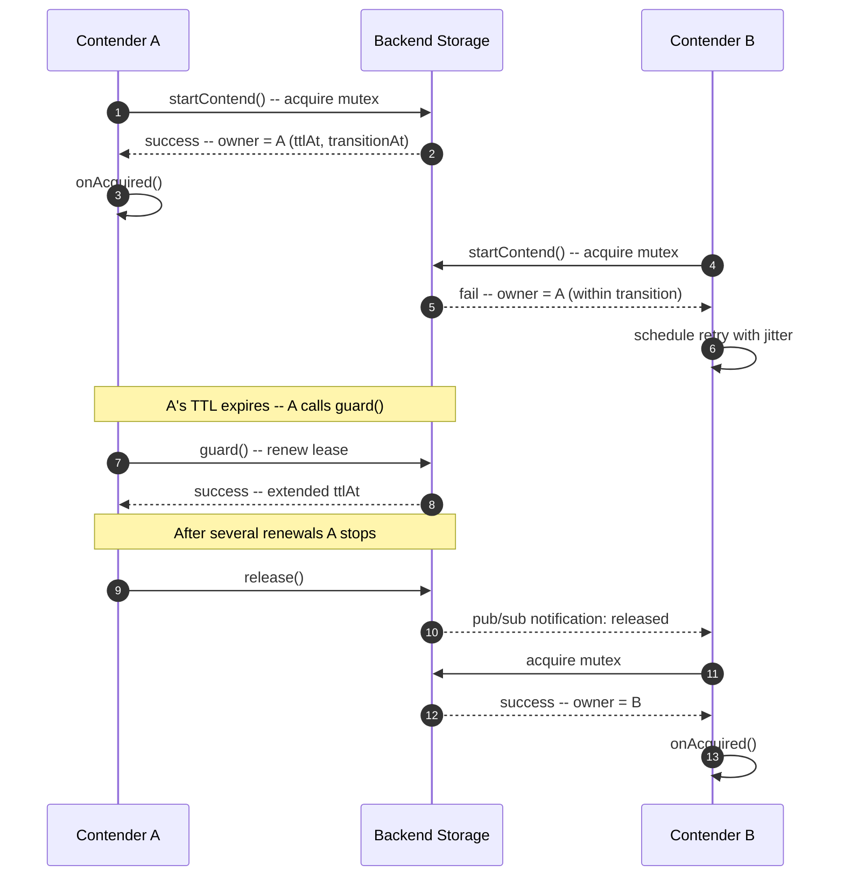
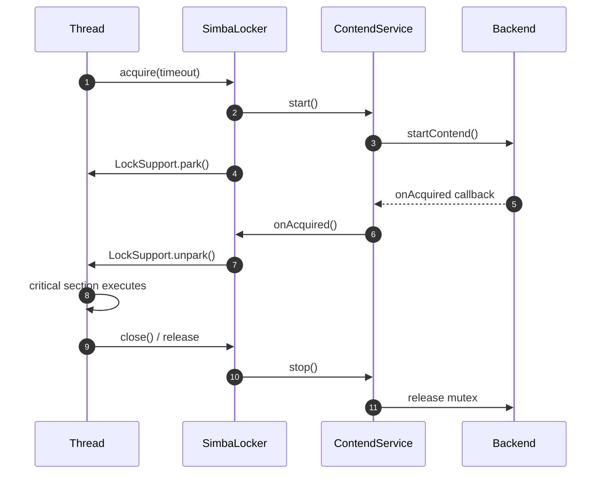
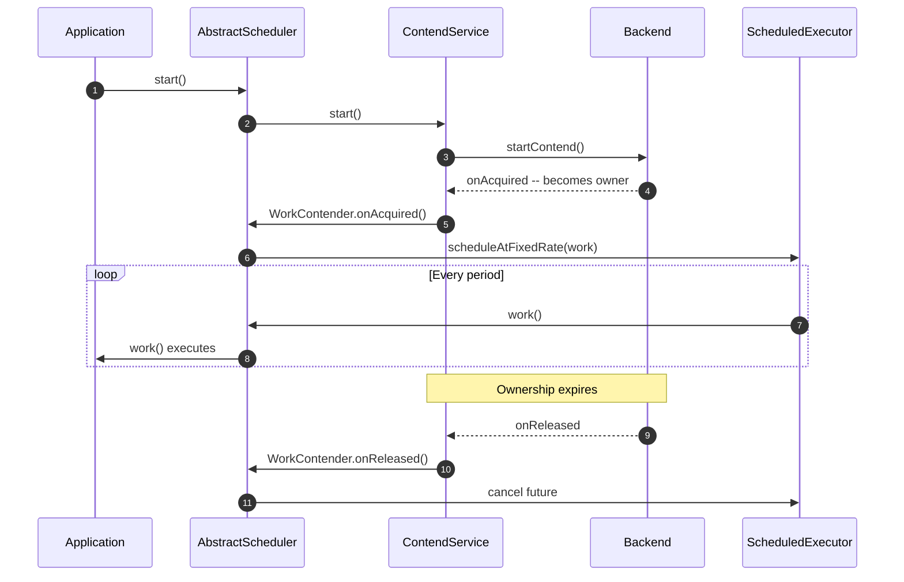

# Quick Start

This guide walks you through adding Simba to your project, configuring a backend, and acquiring a distributed lock in a few lines of code.

## Prerequisites

- **JDK 17** or later (Simba targets JVM 17 toolchain)
- **Gradle 8+** with Kotlin DSL (recommended) or **Maven 3.9+**
- A running instance of one of the supported backends: MySQL, Redis, or Zookeeper

## Add Dependencies

Simba is organized as a multi-module library. You need the core module plus exactly one backend module. If you use Spring Boot, the starter handles auto-configuration.

### Gradle Kotlin DSL

::: code-group

```kotlin [JDBC/MySQL]
implementation("me.ahoo.simba:simba-jdbc:3.0.2")
```

```kotlin [Redis]
implementation("me.ahoo.simba:simba-spring-redis:3.0.2")
```

```kotlin [Zookeeper]
implementation("me.ahoo.simba:simba-zookeeper:3.0.2")
```

```kotlin [Spring Boot Starter (add one backend)]
implementation("me.ahoo.simba:simba-spring-boot-starter:3.0.2")
implementation("me.ahoo.simba:simba-jdbc:3.0.2")  // or simba-spring-redis, or simba-zookeeper
```

:::

### Maven XML

::: code-group

```xml [JDBC/MySQL]
<dependency>
    <groupId>me.ahoo.simba</groupId>
    <artifactId>simba-jdbc</artifactId>
    <version>3.0.2</version>
</dependency>
```

```xml [Redis]
<dependency>
    <groupId>me.ahoo.simba</groupId>
    <artifactId>simba-spring-redis</artifactId>
    <version>3.0.2</version>
</dependency>
```

```xml [Zookeeper]
<dependency>
    <groupId>me.ahoo.simba</groupId>
    <artifactId>simba-zookeeper</artifactId>
    <version>3.0.2</version>
</dependency>
```

```xml [Spring Boot Starter]
<dependency>
    <groupId>me.ahoo.simba</groupId>
    <artifactId>simba-spring-boot-starter</artifactId>
    <version>3.0.2</version>
</dependency>
```

:::

## Choose Your API Level

Simba provides three API levels. Pick the one that matches your use case:



## Basic Usage with MutexContender

The simplest way to use Simba is to implement [`MutexContender`]([file_path:simba-core/src/main/kotlin/me/ahoo/simba/core/MutexContender.kt](https://github.com/Ahoo-Wang/Simba/blob/main/simba-core/src/main/kotlin/me/ahoo/simba/core/MutexContender.kt)). You receive callbacks when you acquire or lose the lock.

```kotlin
import me.ahoo.simba.core.AbstractMutexContender
import me.ahoo.simba.core.MutexContendServiceFactory
import me.ahoo.simba.core.MutexState

class LeaderContender(mutex: String) : AbstractMutexContender(mutex) {
    override fun onAcquired(mutexState: MutexState) {
        println("[$contenderId] acquired leadership for mutex: $mutex")
    }

    override fun onReleased(mutexState: MutexState) {
        println("[$contenderId] lost leadership for mutex: $mutex")
    }
}
```

Create the contender and start contention:

```kotlin
val factory: MutexContendServiceFactory = /* obtain from backend, e.g. JdbcMutexContendServiceFactory */
val contender = LeaderContender("my-task-lock")
val service = factory.createMutexContendService(contender)
service.start()

// When done:
service.stop()
```

## Using SimbaLocker

[`SimbaLocker`]([file_path:simba-core/src/main/kotlin/me/ahoo/simba/locker/SimbaLocker.kt](https://github.com/Ahoo-Wang/Simba/blob/main/simba-core/src/main/kotlin/me/ahoo/simba/locker/SimbaLocker.kt)) implements `AutoCloseable` so you can use it in a try-with-resources block. The calling thread blocks until the lock is acquired.

```kotlin
import me.ahoo.simba.locker.SimbaLocker
import java.time.Duration

val factory: MutexContendServiceFactory = /* ... */

SimbaLocker("my-task-lock", factory).use { locker ->
    locker.acquire()
    println("Lock acquired -- doing critical work")
    // lock is released automatically when the block exits
}

// With a timeout:
SimbaLocker("my-task-lock", factory).use { locker ->
    locker.acquire(Duration.ofSeconds(30))
    println("Lock acquired within 30s")
}
```

## Using AbstractScheduler

[`AbstractScheduler`]([file_path:simba-core/src/main/kotlin/me/ahoo/simba/schedule/AbstractScheduler.kt](https://github.com/Ahoo-Wang/Simba/blob/main/simba-core/src/main/kotlin/me/ahoo/simba/schedule/AbstractScheduler.kt)) is ideal for periodic tasks that should only run on the current leader instance. It automatically starts and stops the scheduled work when leadership changes.

```kotlin
import me.ahoo.simba.core.MutexContendServiceFactory
import me.ahoo.simba.schedule.AbstractScheduler
import me.ahoo.simba.schedule.ScheduleConfig
import java.time.Duration

class MyCleanupScheduler(
    contendServiceFactory: MutexContendServiceFactory
) : AbstractScheduler("cleanup-task", contendServiceFactory) {

    override val config: ScheduleConfig = ScheduleConfig.rate(
        initialDelay = Duration.ofSeconds(0),
        period = Duration.ofMinutes(5)
    )

    override val worker: String = "cleanup-worker"

    override fun work() {
        println("Running cleanup on leader instance...")
    }
}

// Start the scheduler
val scheduler = MyCleanupScheduler(factory)
scheduler.start()

// Stop when shutting down
scheduler.stop()
```

## Spring Boot Auto-Configuration

With the Spring Boot starter, Simba auto-configures everything. You just set the enabled flag for your chosen backend.

**application.yml**

```yaml
simba:
  jdbc:
    enabled: true
    initial-delay: 0s
    ttl: 10s
    transition: 6s
```

The auto-configuration creates the `MutexContendServiceFactory` bean for you. Inject it and use it directly:

```kotlin
import org.springframework.stereotype.Component
import me.ahoo.simba.core.AbstractMutexContender
import me.ahoo.simba.core.MutexContendServiceFactory
import me.ahoo.simba.core.MutexState
import jakarta.annotation.PostConstruct
import jakarta.annotation.PreDestroy

@Component
class MyLeaderTask(
    private val contendServiceFactory: MutexContendServiceFactory
) : AbstractMutexContender("spring-task-lock") {

    private val service = contendServiceFactory.createMutexContendService(this)

    @PostConstruct
    fun onStart() = service.start()

    @PreDestroy
    fun onStop() = service.stop()

    override fun onAcquired(mutexState: MutexState) {
        println("This instance is now the leader!")
    }

    override fun onReleased(mutexState: MutexState) {
        println("Leadership lost.")
    }
}
```

## Lock Acquisition Sequence

The following diagram shows the full sequence when two contenders compete for the same mutex:



## Locker Acquisition Sequence



## Scheduler Lifecycle Sequence



## Next Steps

- [Configuration Reference](/guide/configuration) -- tune TTL, transition, and initial delay per backend.
- [Architecture Overview](/architecture/) -- understand the abstraction chain in depth.
- [Contributing](/guide/contributing) -- set up the development environment and run the test suite.
