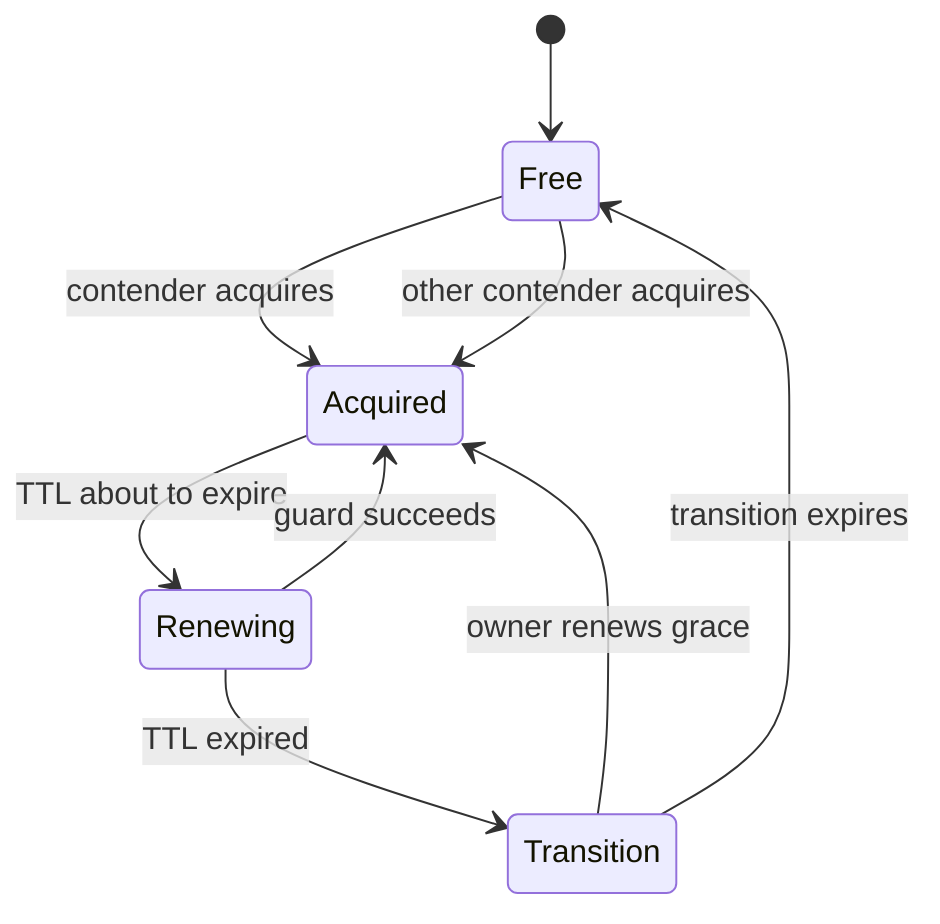
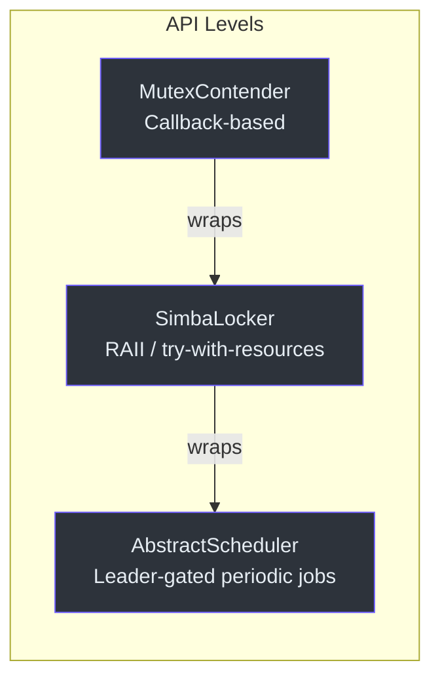
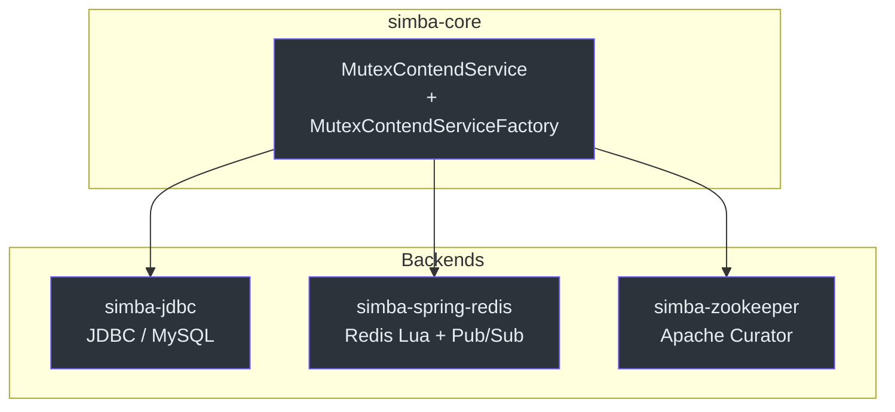

## How It Works

Simba uses a cooperative leader-election protocol. Each contender competes for a named mutex, and the winner becomes the owner for a configurable TTL window. When the TTL expires, a transition period begins during which the current owner can renew its lease preferentially. Non-owner contenders wake up with random jitter to reduce collision.



## Three Lock APIs

Simba offers three levels of abstraction so you can pick the one that best matches your use case:



## Backend Storage



## Quick Example

```kotlin
class MyContender : AbstractMutexContender("my-mutex") {
    override fun onAcquired(mutexState: MutexState) {
        println("I am the owner!")
    }
    override fun onReleased(mutexState: MutexState) {
        println("Lost leadership.")
    }
}
```
