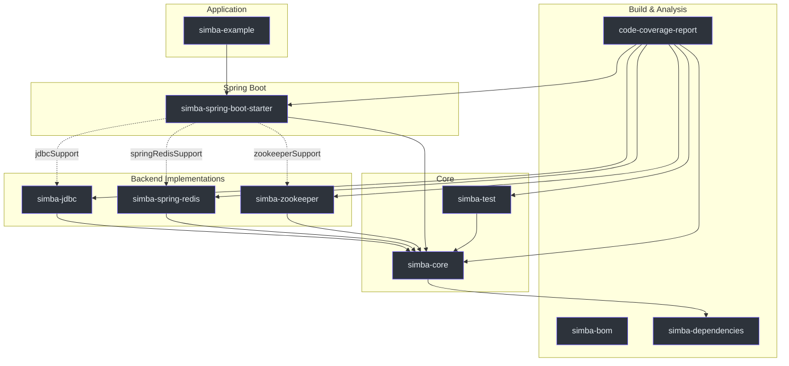
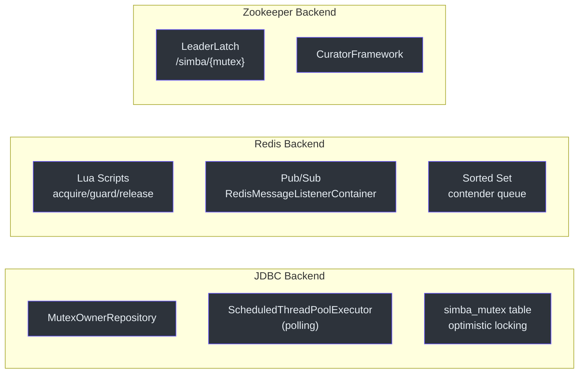

# Modules Overview

Simba is organized as a multi-module Gradle project. Each module has a focused responsibility, from core abstractions to backend-specific implementations and Spring Boot auto-configuration.

## Module Dependency Graph



## Module Catalogue

| Module | Role | Key Types | Dependencies |
|---|---|---|---|
| **simba-core** | Core interfaces, abstract classes, value objects | `MutexContender`, `MutexContendService`, `SimbaLocker`, `AbstractScheduler` | kotlin-logging, cosid-core, guava |
| **simba-jdbc** | JDBC/MySQL backend with optimistic locking | `JdbcMutexContendService`, `JdbcMutexOwnerRepository` | simba-core, JDBC driver |
| **simba-spring-redis** | Redis backend with Lua scripts and pub/sub | `SpringRedisMutexContendService`, Lua scripts | simba-core, spring-data-redis |
| **simba-zookeeper** | Zookeeper backend using Curator LeaderLatch | `ZookeeperMutexContendService` | simba-core, curator-recipes |
| **simba-spring-boot-starter** | Auto-configuration for all backends | `SimbaJdbcAutoConfiguration`, `SimbaSpringRedisAutoConfiguration`, `SimbaZookeeperAutoConfiguration` | simba-core + conditional backend deps |
| **simba-test** | TCK (Technology Compatibility Kit) | `MutexContendServiceSpec`, `LockSpec` | simba-core, JUnit 5 |
| **simba-bom** | BOM (Bill of Materials) for version management | -- | -- |
| **simba-dependencies** | Dependency version constraints | -- | -- |
| **simba-example** | Example application | `ExampleApp` | simba-spring-boot-starter |
| **code-coverage-report** | JaCoCo aggregated report | -- | all modules |

## Backend Comparison



| Feature | JDBC | Redis | Zookeeper |
|---|---|---|---|
| **Coordination mechanism** | Poll with `ScheduledThreadPoolExecutor` | Lua scripts + pub/sub | Curator `LeaderLatch` |
| **Lock storage** | `simba_mutex` table | Redis key (`simba:{mutex}`) | ZNode (`/simba/{mutex}`) |
| **Ownership transfer** | Optimistic locking via `version` column | Sorted set wait queue + pub/sub notification | ZK watcher on latch participants |
| **Time source** | MySQL `current_timestamp(3)` | System clock (client-side) | ZK server time |
| **External dependency** | MySQL instance | Redis instance | ZooKeeper ensemble |
| **Best for** | Existing relational DB infrastructure | High-throughput, low-latency | Strong consistency guarantees |

## Gradle Feature Variants

The `simba-spring-boot-starter` uses Gradle feature variants so consumers only pull the backend dependency they need:

```kotlin
dependencies {
    // Pull only the Redis backend
    implementation("me.ahoo.simba:simba-spring-boot-starter") {
        capabilities {
            requireCapability("me.ahoo.simba:spring-redis-support")
        }
    }
}
```

Available feature variants:

| Variant | Capability | Backend Module |
|---|---|---|
| `springRedisSupport` | `me.ahoo.simba:spring-redis-support` | simba-spring-redis |
| `jdbcSupport` | `me.ahoo.simba:jdbc-support` | simba-jdbc |
| `zookeeperSupport` | `me.ahoo.simba:zookeeper-support` | simba-zookeeper |

## See Also

- [simba-core](./simba-core) -- core abstractions and design patterns
- [simba-jdbc](./simba-jdbc) -- JDBC/MySQL backend
- [simba-spring-redis](./simba-spring-redis) -- Redis backend
- [simba-zookeeper](./simba-zookeeper) -- Zookeeper backend
- [simba-spring-boot-starter](./simba-spring-boot-starter) -- Spring Boot auto-configuration
- [simba-test](./simba-test) -- TCK test base classes
