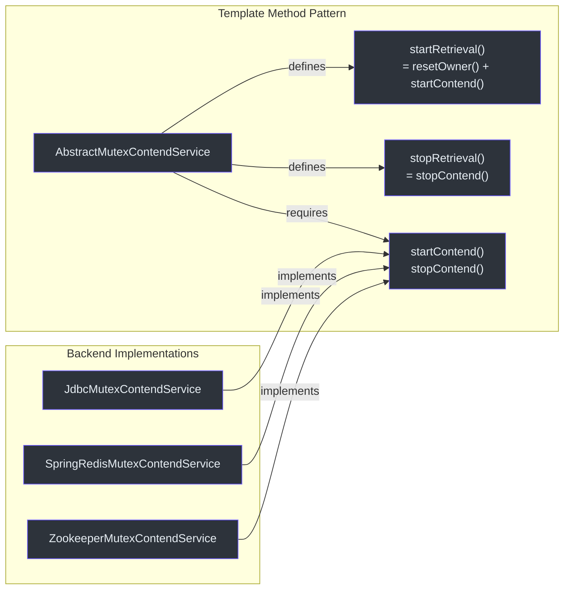
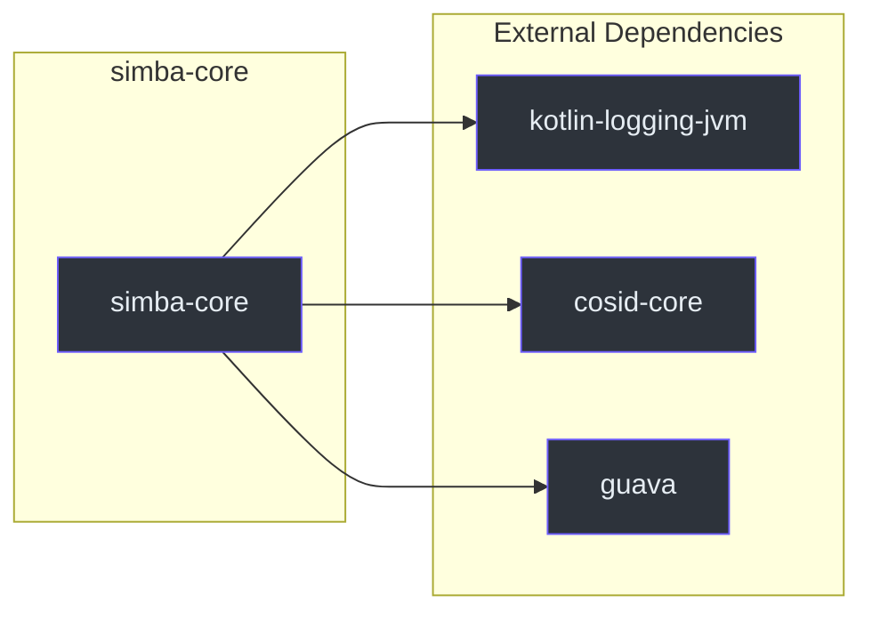

# simba-core Module

`simba-core` is the foundation of the Simba library. It defines all interfaces, abstract base classes, value objects, and utility types that the backend modules implement. Application code typically depends only on types from this module.

## Package Structure

```
me.ahoo.simba
    Simba                  -- Brand constants
    SimbaException         -- Root exception class
me.ahoo.simba.core
    MutexRetriever         -- Minimal mutex callback interface
    MutexContender         -- Contender with lifecycle callbacks
    MutexRetrievalService  -- Lifecycle-managed retrieval
    MutexContendService    -- Contender-bound retrieval with ownership queries
    MutexRetrievalServiceFactory
    MutexContendServiceFactory
    AbstractMutexRetriever (via MutexRetriever)
    AbstractMutexContender -- Default logging contender
    AbstractMutexRetrievalService -- Template method for lifecycle
    AbstractMutexContendService -- Bridges to backend startContend/stopContend
    MutexOwner             -- Immutable ownership snapshot
    MutexState             -- Before/after transition pair
    ContendPeriod          -- Scheduling delay computation
    ContenderIdGenerator   -- ID generation strategies
me.ahoo.simba.locker
    Locker                 -- RAII lock interface
    SimbaLocker            -- LockSupport-based implementation
me.ahoo.simba.schedule
    AbstractScheduler      -- Leader-gated periodic executor
    ScheduleConfig         -- Scheduling parameters
me.ahoo.simba.util
    Threads                -- ThreadFactory builder
```



```mermaid
graph TB
    subgraph sg_32 ["me.ahoo.simba"]

        SB["Simba"]
        SE["SimbaException"]
    end
    subgraph sg_33 ["me.ahoo.simba.core"]

        MR["MutexRetriever"]
        MC["MutexContender"]
        MRS["MutexRetrievalService"]
        MCS["MutexContendService"]
        MRF["MutexRetrievalServiceFactory"]
        MCF["MutexContendServiceFactory"]
        AMRS["AbstractMutexRetrievalService"]
        AMCS["AbstractMutexContendService"]
        AMC["AbstractMutexContender"]
        MO["MutexOwner"]
        MS["MutexState"]
        CP["ContendPeriod"]
        CIG["ContenderIdGenerator"]
    end
    subgraph sg_34 ["me.ahoo.simba.locker"]

        LK["Locker"]
        SL["SimbaLocker"]
    end
    subgraph sg_35 ["me.ahoo.simba.schedule"]

        AS["AbstractScheduler"]
        SC["ScheduleConfig"]
    end
    subgraph sg_36 ["me.ahoo.simba.util"]

        TH["Threads"]
    end

    MC --> MR
    MCS --> MRS
    AMC --> MC
    AMRS --> MRS
    AMCS --> MCS
    AMCS --> AMRS
    AMRS --> MR
    AMCS --> MC
    MRS --> MR
    MCS --> MC
    MRF --> MRS
    MCF --> MCS
    MS --> MO
    AMRS --> MS
    AMRS --> MO
    CP --> MO
    SL --> LK
    SL --> AMC
    SL --> MCS
    AS --> AMC
    AS --> MCS

    style SB fill:#2d333b,stroke:#6d5dfc,color:#e6edf3
    style SE fill:#2d333b,stroke:#6d5dfc,color:#e6edf3
    style MR fill:#2d333b,stroke:#6d5dfc,color:#e6edf3
    style MC fill:#2d333b,stroke:#6d5dfc,color:#e6edf3
    style MRS fill:#2d333b,stroke:#6d5dfc,color:#e6edf3
    style MCS fill:#2d333b,stroke:#6d5dfc,color:#e6edf3
    style MRF fill:#2d333b,stroke:#6d5dfc,color:#e6edf3
    style MCF fill:#2d333b,stroke:#6d5dfc,color:#e6edf3
    style AMRS fill:#2d333b,stroke:#6d5dfc,color:#e6edf3
    style AMCS fill:#2d333b,stroke:#6d5dfc,color:#e6edf3
    style AMC fill:#2d333b,stroke:#6d5dfc,color:#e6edf3
    style MO fill:#2d333b,stroke:#6d5dfc,color:#e6edf3
    style MS fill:#2d333b,stroke:#6d5dfc,color:#e6edf3
    style CP fill:#2d333b,stroke:#6d5dfc,color:#e6edf3
    style CIG fill:#2d333b,stroke:#6d5dfc,color:#e6edf3
    style LK fill:#2d333b,stroke:#6d5dfc,color:#e6edf3
    style SL fill:#2d333b,stroke:#6d5dfc,color:#e6edf3
    style AS fill:#2d333b,stroke:#6d5dfc,color:#e6edf3
    style SC fill:#2d333b,stroke:#6d5dfc,color:#e6edf3
    style TH fill:#2d333b,stroke:#6d5dfc,color:#e6edf3
```

## Key Classes

### Core Abstraction Chain

The core abstraction chain follows a **template method** pattern:



1. `AbstractMutexContendService.startRetrieval()` calls `resetOwner()` then `startContend()`
2. Each backend implements `startContend()` (begin polling/subscribing/latching) and `stopContend()` (cleanup)
3. `AbstractMutexRetrievalService` manages the `Status` state machine (`INITIAL` -> `STARTING` -> `RUNNING` -> `STOPPING` -> `INITIAL`)

### MutexOwner -- Ownership Snapshot

`MutexOwner` is an immutable value object representing a point-in-time snapshot of who holds the mutex and when the key timestamps expire.

| Field | Meaning |
|---|---|
| `ownerId` | The `contenderId` of the current owner |
| `acquiredAt` | When the lock was acquired (epoch millis) |
| `ttlAt` | When the TTL expires -- after this, the owner should renew |
| `transitionAt` | End of the grace period -- the owner can preferentially renew during this window |

The **transition period** (`transitionAt - ttlAt`) is a key design element: it prevents leadership churn by giving the current owner a grace window to renew before other contenders can take over.

### ContendPeriod -- Scheduling Delay

`ContendPeriod` computes the next scheduling delay for the contention loop:

- **Owner**: delay = `ttlAt - now` (renew just before TTL expiry)
- **Non-owner with transition**: delay = `transitionAt - now + random(-200, 1000)` (jitter after transition ends)
- **Non-owner without transition**: delay = `transitionAt - now + random(0, 1000)`

The jitter range (`-200ms` to `+1000ms`) prevents thundering herd among contenders.

### ContenderIdGenerator -- ID Strategies

| Strategy | Format | Source |
|---|---|---|
| `HOST` (default) | `{counter}:{pid}@{host}` | `HostContenderIdGenerator` -- uses `cosid-core` for host address and `ProcessId` |
| `UUID` | UUID without hyphens | `UUIDContenderIdGenerator` |

The `HOST` strategy is human-readable and aids debugging. Example: `0:12345@192.168.1.100`.

### SimbaLocker -- RAII Lock

`SimbaLocker` wraps `MutexContendService` into a blocking `acquire()`/`close()` pattern using `LockSupport.park/unpark`. See [Locker API](/api/locker-api) for details.

### AbstractScheduler -- Leader-Gated Execution

`AbstractScheduler` creates a `WorkContender` inner class that starts/stops a `ScheduledThreadPoolExecutor` based on leadership state. See [Scheduler API](/api/scheduler-api) for details.

## Design Patterns

| Pattern | Where Used |
|---|---|
| **Template Method** | `AbstractMutexContendService` defines `startRetrieval`/`stopRetrieval`; backends implement `startContend`/`stopContend` |
| **Abstract Factory** | `MutexContendServiceFactory` / `MutexRetrievalServiceFactory` create service instances |
| **Observer / Callback** | `MutexRetriever.notifyOwner` / `MutexContender.onAcquired`/`onReleased` |
| **RAII** | `SimbaLocker` uses `AutoCloseable` for automatic lock release |
| **Strategy** | `ContenderIdGenerator.HOST` / `ContenderIdGenerator.UUID` |
| **State Machine** | `MutexRetrievalService.Status` with atomic CAS transitions |

## Dependencies



| Dependency | Usage |
|---|---|
| `kotlin-logging-jvm` | Logging throughout abstract classes (`KotlinLogging.logger`) |
| `cosid-core` | `LocalHostAddressSupplier` and `ProcessId` for `HostContenderIdGenerator` |
| `guava` | `ThreadFactoryBuilder` in `Threads.defaultFactory`, `@Immutable` annotation on `MutexOwner` |

## Exception Hierarchy

```
java.lang.RuntimeException
  └── SimbaException                       (me.ahoo.simba)
        └── NotFoundMutexOwnerException    (me.ahoo.simba.jdbc)
```

`SimbaException` is an open class with all standard `RuntimeException` constructors. `NotFoundMutexOwnerException` (in `simba-jdbc`) extends it for the case where a mutex row has not been initialized.

## Thread Safety

Key thread-safety mechanisms in simba-core:

| Class | Mechanism |
|---|---|
| `AbstractMutexRetrievalService` | `AtomicReferenceFieldUpdater` on `status` field for CAS transitions |
| `SimbaLocker` | `AtomicReferenceFieldUpdater` on `owner` field for single-owner enforcement |
| `MutexOwner` | `@Immutable` -- all fields are `val`, safe to share across threads |
| `MutexState` | `data class` -- immutable snapshot |
| `ContenderIdGenerator` | `AtomicLong` counter in `HostContenderIdGenerator` |

## See Also

- [API Reference](/api/) -- complete API documentation
- [simba-jdbc](./simba-jdbc) -- JDBC backend implementation
- [simba-spring-redis](./simba-spring-redis) -- Redis backend implementation
- [simba-zookeeper](./simba-zookeeper) -- Zookeeper backend implementation
