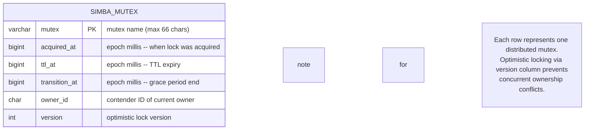
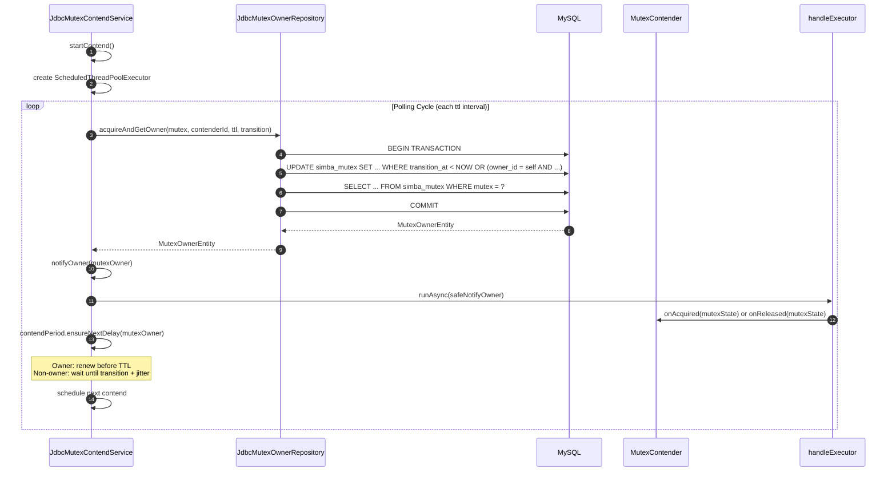

# simba-jdbc Module

The `simba-jdbc` module provides a JDBC-based distributed mutex backend using MySQL. It uses optimistic locking (a `version` column) to ensure safe concurrent updates to the `simba_mutex` table, and polls the database on a `ScheduledThreadPoolExecutor` to detect ownership changes.

## Schema DDL

The MySQL schema is defined in [simba-jdbc/src/init-script/init-simba-mysql.sql](https://github.com/Ahoo-Wang/Simba/blob/main/simba-jdbc/src/init-script/init-simba-mysql.sql):

```sql
CREATE DATABASE IF NOT EXISTS simba_db;
USE simba_db;

CREATE TABLE IF NOT EXISTS simba_mutex (
    mutex         VARCHAR(66)    NOT NULL PRIMARY KEY COMMENT 'mutex name',
    acquired_at   BIGINT UNSIGNED NOT NULL,
    ttl_at        BIGINT UNSIGNED NOT NULL,
    transition_at BIGINT UNSIGNED NOT NULL,
    owner_id      VARCHAR(128)   NOT NULL,
    version       INT UNSIGNED   NOT NULL
);
```

### ER Diagram



### Column Semantics

| Column | Type | Description |
|---|---|---|
| `mutex` | `VARCHAR(66)` PK | The logical mutex name. Primary key -- one row per mutex. |
| `acquired_at` | `BIGINT UNSIGNED` | Epoch millis when the current owner acquired the lock. `0` when no owner. |
| `ttl_at` | `BIGINT UNSIGNED` | Epoch millis when the TTL expires. After this, other contenders may attempt acquisition. |
| `transition_at` | `BIGINT UNSIGNED` | Epoch millis when the grace period ends. Equals `acquired_at + ttl + transition`. |
| `owner_id` | `VARCHAR(128)` | The `contenderId` of the current owner. Empty string when no owner. |
| `version` | `INT UNSIGNED` | Incremented on every acquire/release for optimistic concurrency control. |

## Key Classes

### MutexOwnerRepository Interface

**Source:** [simba-jdbc/.../MutexOwnerRepository.kt:23](https://github.com/Ahoo-Wang/Simba/blob/main/simba-jdbc/src/main/kotlin/me/ahoo/simba/jdbc/MutexOwnerRepository.kt#L23)

```kotlin
interface MutexOwnerRepository {
    fun initMutex(mutex: String): Boolean
    fun tryInitMutex(mutex: String): Boolean
    fun getOwner(mutex: String): MutexOwnerEntity
    fun acquire(mutex: String, contenderId: String, ttl: Long, transition: Long): Boolean
    fun acquireAndGetOwner(mutex: String, contenderId: String, ttl: Long, transition: Long): MutexOwnerEntity
    fun release(mutex: String, contenderId: String): Boolean
    fun ensureOwner(mutex: String): MutexOwnerEntity
}
```

| Method | Description |
|---|---|
| `initMutex` | Inserts the mutex row. Throws `SQLIntegrityConstraintViolationException` if already exists. |
| `tryInitMutex` | Safe wrapper: returns `false` on any exception. |
| `getOwner` | Reads the current owner. Throws `NotFoundMutexOwnerException` if the row does not exist. |
| `acquire` | Attempts to acquire the mutex via `UPDATE ... WHERE`. Returns `true` if affected rows > 0. |
| `acquireAndGetOwner` | Atomic transaction: acquires the mutex and reads back the full owner state. |
| `release` | Releases the mutex by resetting the row. Only succeeds if `owner_id` matches. |
| `ensureOwner` | Gets the owner, auto-initializing the row if it does not exist. |

### JdbcMutexOwnerRepository

**Source:** [simba-jdbc/.../JdbcMutexOwnerRepository.kt:27](https://github.com/Ahoo-Wang/Simba/blob/main/simba-jdbc/src/main/kotlin/me/ahoo/simba/jdbc/JdbcMutexOwnerRepository.kt#L27)

```kotlin
class JdbcMutexOwnerRepository(private val dataSource: DataSource) : MutexOwnerRepository
```

### ACQUIRE SQL Logic

The acquisition uses a conditional `UPDATE`:

```sql
UPDATE simba_mutex
SET acquired_at = NOW_MILLIS,
    ttl_at = NOW_MILLIS + ?,
    transition_at = NOW_MILLIS + ?,
    owner_id = ?,
    version = version + 1
WHERE mutex = ?
  AND (
    transition_at < NOW_MILLIS                    -- no active owner (transition expired)
    OR
    (owner_id = ? AND transition_at > NOW_MILLIS) -- same owner renewing within transition
  );
```

This ensures:
1. **No active owner**: `transition_at` has passed -- any contender can acquire.
2. **Same owner renewing**: The current owner can renew even during the transition period (grace period for leadership stability).

### MutexOwnerEntity

**Source:** [simba-jdbc/.../MutexOwnerEntity.kt:22](https://github.com/Ahoo-Wang/Simba/blob/main/simba-jdbc/src/main/kotlin/me/ahoo/simba/jdbc/MutexOwnerEntity.kt#L22)

Extends `MutexOwner` with JDBC-specific fields:

```kotlin
class MutexOwnerEntity(
    val mutex: String,
    ownerId: String, acquiredAt: Long, ttlAt: Long, transitionAt: Long
) : MutexOwner(ownerId, acquiredAt, ttlAt, transitionAt) {
    var version: Int = 0
    var currentDbAt: Long = 0
}
```

| Field | Description |
|---|---|
| `version` | The optimistic lock version from the database. Used for concurrency control. |
| `currentDbAt` | The database server's current timestamp, used to prevent clock skew issues between application servers. |

### JdbcMutexContendService

**Source:** [simba-jdbc/.../JdbcMutexContendService.kt:32](https://github.com/Ahoo-Wang/Simba/blob/main/simba-jdbc/src/main/kotlin/me/ahoo/simba/jdbc/JdbcMutexContendService.kt#L32)

```kotlin
class JdbcMutexContendService(
    mutexContender: MutexContender,
    handleExecutor: Executor,
    private val mutexOwnerRepository: MutexOwnerRepository,
    private val initialDelay: Duration,
    private val ttl: Duration,
    private val transition: Duration
) : AbstractMutexContendService(mutexContender, handleExecutor)
```

| Parameter | Description |
|---|---|
| `mutexContender` | The contender bound to this service |
| `handleExecutor` | Executor for async owner notification callbacks |
| `mutexOwnerRepository` | The JDBC repository for mutex state |
| `initialDelay` | Delay before the first contention attempt |
| `ttl` | Lock TTL -- how long before the owner must renew |
| `transition` | Grace period after TTL where the current owner can preferentially renew |

### JdbcMutexContendServiceFactory

**Source:** [simba-jdbc/.../JdbcMutexContendServiceFactory.kt:27](https://github.com/Ahoo-Wang/Simba/blob/main/simba-jdbc/src/main/kotlin/me/ahoo/simba/jdbc/JdbcMutexContendServiceFactory.kt#L27)

```kotlin
class JdbcMutexContendServiceFactory(
    private val mutexOwnerRepository: MutexOwnerRepository,
    private val handleExecutor: Executor = ForkJoinPool.commonPool(),
    private val initialDelay: Duration,
    private val ttl: Duration,
    private val transition: Duration
) : MutexContendServiceFactory
```

## Sequence Diagram -- Polling Contention



## Properties

When using `simba-spring-boot-starter`, the JDBC backend is configured via `application.yml`:

```yaml
simba:
  enabled: true          # Global Simba enable (default: true)
  jdbc:
    enabled: true        # JDBC backend enable (default: true)
    initial-delay: 0s    # Delay before first contention
    ttl: 10s             # Lock TTL
    transition: 6s       # Grace period after TTL
```

**Source:** [simba-spring-boot-starter/.../JdbcProperties.kt:25](https://github.com/Ahoo-Wang/Simba/blob/main/simba-spring-boot-starter/src/main/kotlin/me/ahoo/simba/spring/boot/starter/jdbc/JdbcProperties.kt#L25)

| Property | Default | Description |
|---|---|---|
| `simba.enabled` | `true` | Global enable switch for all Simba backends |
| `simba.jdbc.enabled` | `true` | Enable the JDBC backend |
| `simba.jdbc.initial-delay` | `0s` | Delay before first contention attempt |
| `simba.jdbc.ttl` | `10s` | Lock TTL -- how long the lock is held before requiring renewal |
| `simba.jdbc.transition` | `6s` | Grace period after TTL for preferential owner renewal |

## Error Handling

| Situation | Behavior |
|---|---|
| Mutex row does not exist | `NotFoundMutexOwnerException` thrown; use `tryInitMutex()` or `ensureOwner()` to auto-create |
| Concurrent acquisition conflict | Optimistic locking via `version` column; the `UPDATE` returns 0 affected rows |
| SQL error during contend | Logged at ERROR level; next contend scheduled after `ttl` period |
| Transaction rollback | `acquireAndGetOwner` rolls back on any exception and wraps in `SimbaException` |

## Dependencies

```
simba-jdbc
  ├── simba-core
  └── javax.sql.DataSource (provided by the application)
```

The module does not bundle a JDBC driver. The application must provide the MySQL connector (e.g., `com.mysql:mysql-connector-j`).

## See Also

- [simba-core Module](./simba-core) -- core interfaces and abstractions
- [simba-spring-boot-starter](./simba-spring-boot-starter) -- auto-configuration with `simba.jdbc.*` properties
- [simba-spring-redis](./simba-spring-redis) -- Redis alternative backend
