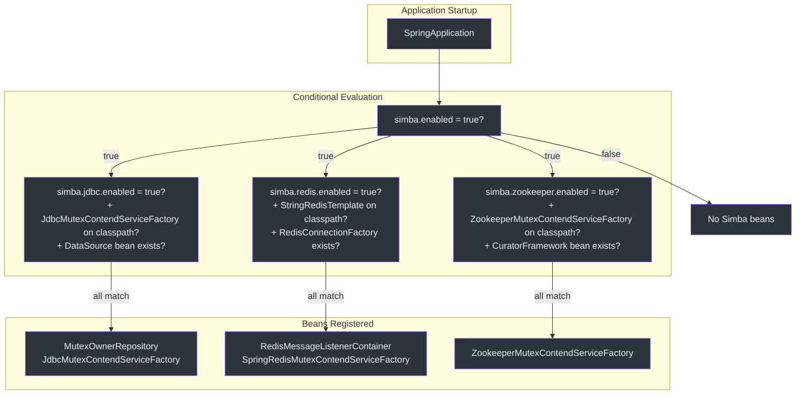
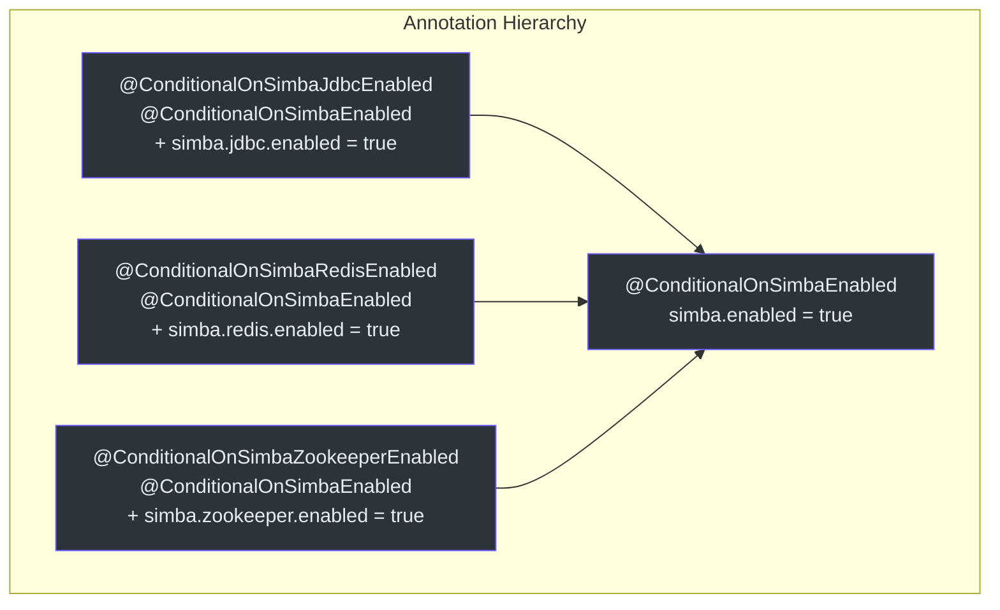
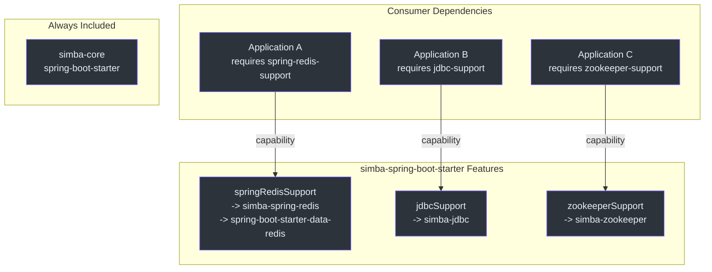

# simba-spring-boot-starter Module

The `simba-spring-boot-starter` module provides Spring Boot auto-configuration for all three Simba backends (JDBC, Redis, Zookeeper). It uses conditional annotations and Gradle feature variants so that only the selected backend's dependencies are pulled into the application.

## Auto-Configuration Classes

The module registers three auto-configuration classes via Spring Boot's standard mechanism.

**Source:** [simba-spring-boot-starter/.../org.springframework.boot.autoconfigure.AutoConfiguration.imports](https://github.com/Ahoo-Wang/Simba/blob/main/simba-spring-boot-starter/src/main/resources/META-INF/spring/org.springframework.boot.autoconfigure.AutoConfiguration.imports)

```
me.ahoo.simba.spring.boot.starter.jdbc.SimbaJdbcAutoConfiguration
me.ahoo.simba.spring.boot.starter.redis.SimbaSpringRedisAutoConfiguration
me.ahoo.simba.spring.boot.starter.zookeeper.SimbaZookeeperAutoConfiguration
```

## Configuration Flow



## Conditional Annotations

The module uses a two-level conditional annotation hierarchy:



### ConditionalOnSimbaEnabled

**Source:** [simba-spring-boot-starter/.../ConditionalOnSimbaEnabled.kt:23](https://github.com/Ahoo-Wang/Simba/blob/main/simba-spring-boot-starter/src/main/kotlin/me/ahoo/simba/spring/boot/starter/ConditionalOnSimbaEnabled.kt#L23)

```kotlin
@ConditionalOnProperty(
    value = ["simba.enabled"],
    matchIfMissing = true,
    havingValue = "true"
)
annotation class ConditionalOnSimbaEnabled
```

Global switch. Defaults to `true` when the property is not set.

### ConditionalOnSimbaJdbcEnabled

**Source:** [simba-spring-boot-starter/.../ConditionalOnSimbaJdbcEnabled.kt:24](https://github.com/Ahoo-Wang/Simba/blob/main/simba-spring-boot-starter/src/main/kotlin/me/ahoo/simba/spring/boot/starter/jdbc/ConditionalOnSimbaJdbcEnabled.kt#L24)

```kotlin
@ConditionalOnSimbaEnabled
@ConditionalOnProperty(
    value = ["simba.jdbc.enabled"],
    matchIfMissing = true,
    havingValue = "true"
)
annotation class ConditionalOnSimbaJdbcEnabled
```

### ConditionalOnSimbaRedisEnabled

**Source:** [simba-spring-boot-starter/.../ConditionalOnSimbaRedisEnabled.kt:28](https://github.com/Ahoo-Wang/Simba/blob/main/simba-spring-boot-starter/src/main/kotlin/me/ahoo/simba/spring/boot/starter/redis/ConditionalOnSimbaRedisEnabled.kt#L28)

```kotlin
@ConditionalOnSimbaEnabled
@ConditionalOnProperty(
    value = ["simba.redis.enabled"],
    matchIfMissing = true,
    havingValue = "true"
)
annotation class ConditionalOnSimbaRedisEnabled
```

### ConditionalOnSimbaZookeeperEnabled

**Source:** [simba-spring-boot-starter/.../ConditionalOnSimbaZookeeperEnabled.kt:26](https://github.com/Ahoo-Wang/Simba/blob/main/simba-spring-boot-starter/src/main/kotlin/me/ahoo/simba/spring/boot/starter/zookeeper/ConditionalOnSimbaZookeeperEnabled.kt#L26)

```kotlin
@ConditionalOnSimbaEnabled
@ConditionalOnProperty(
    value = ["simba.zookeeper.enabled"],
    matchIfMissing = true,
    havingValue = "true"
)
annotation class ConditionalOnSimbaZookeeperEnabled
```

## Auto-Configuration Details

### SimbaJdbcAutoConfiguration

**Source:** [simba-spring-boot-starter/.../SimbaJdbcAutoConfiguration.kt:32](https://github.com/Ahoo-Wang/Simba/blob/main/simba-spring-boot-starter/src/main/kotlin/me/ahoo/simba/spring/boot/starter/jdbc/SimbaJdbcAutoConfiguration.kt#L32)

```kotlin
@AutoConfiguration
@ConditionalOnSimbaJdbcEnabled
@ConditionalOnClass(JdbcMutexContendServiceFactory::class)
@EnableConfigurationProperties(JdbcProperties::class)
class SimbaJdbcAutoConfiguration(private val jdbcProperties: JdbcProperties) {

    @Bean @ConditionalOnMissingBean
    fun mutexOwnerRepository(dataSource: DataSource): MutexOwnerRepository

    @Bean @ConditionalOnMissingBean
    fun jdbcMutexContendServiceFactory(mutexOwnerRepository: MutexOwnerRepository): MutexContendServiceFactory
}
```

| Condition | Bean |
|---|---|
| `simba.jdbc.enabled = true` + `JdbcMutexContendServiceFactory` on classpath + `DataSource` bean exists | `MutexOwnerRepository` |
| Same as above + `MutexOwnerRepository` bean exists | `MutexContendServiceFactory` (as `JdbcMutexContendServiceFactory`) |

### SimbaSpringRedisAutoConfiguration

**Source:** [simba-spring-boot-starter/.../SimbaSpringRedisAutoConfiguration.kt:34](https://github.com/Ahoo-Wang/Simba/blob/main/simba-spring-boot-starter/src/main/kotlin/me/ahoo/simba/spring/boot/starter/redis/SimbaSpringRedisAutoConfiguration.kt#L34)

```kotlin
@AutoConfiguration(after = [DataRedisAutoConfiguration::class])
@ConditionalOnSimbaRedisEnabled
@ConditionalOnClass(StringRedisTemplate::class)
@EnableConfigurationProperties(RedisProperties::class)
class SimbaSpringRedisAutoConfiguration(private val redisProperties: RedisProperties) {

    @Bean @ConditionalOnMissingBean @ConditionalOnSingleCandidate(RedisConnectionFactory::class)
    fun simbaRedisMessageListenerContainer(connectionFactory: RedisConnectionFactory): RedisMessageListenerContainer

    @Bean @ConditionalOnMissingBean @ConditionalOnBean(StringRedisTemplate::class)
    fun redisMutexContendServiceFactory(
        redisTemplate: StringRedisTemplate,
        listenerContainer: RedisMessageListenerContainer
    ): MutexContendServiceFactory
}
```

| Condition | Bean |
|---|---|
| `simba.redis.enabled = true` + `StringRedisTemplate` on classpath + `RedisConnectionFactory` exists | `RedisMessageListenerContainer` |
| Same as above + `StringRedisTemplate` bean exists | `MutexContendServiceFactory` (as `SpringRedisMutexContendServiceFactory`) |

The configuration runs `after = DataRedisAutoConfiguration` to ensure the Redis infrastructure beans are available.

### SimbaZookeeperAutoConfiguration

**Source:** [simba-spring-boot-starter/.../SimbaZookeeperAutoConfiguration.kt:30](https://github.com/Ahoo-Wang/Simba/blob/main/simba-spring-boot-starter/src/main/kotlin/me/ahoo/simba/spring/boot/starter/zookeeper/SimbaZookeeperAutoConfiguration.kt#L30)

```kotlin
@AutoConfiguration
@ConditionalOnSimbaZookeeperEnabled
@ConditionalOnClass(ZookeeperMutexContendServiceFactory::class)
@EnableConfigurationProperties(ZookeeperProperties::class)
class SimbaZookeeperAutoConfiguration {

    @Bean @ConditionalOnBean(CuratorFramework::class) @ConditionalOnMissingBean
    fun zookeeperMutexContendServiceFactory(curatorFramework: CuratorFramework): ZookeeperMutexContendServiceFactory
}
```

| Condition | Bean |
|---|---|
| `simba.zookeeper.enabled = true` + `ZookeeperMutexContendServiceFactory` on classpath + `CuratorFramework` bean exists | `MutexContendServiceFactory` (as `ZookeeperMutexContendServiceFactory`) |

## Properties Binding

All properties are bound under the `simba` prefix.

### Complete Properties Reference

```yaml
simba:
  enabled: true                # Global switch (default: true)

  jdbc:
    enabled: true              # JDBC backend (default: true)
    initial-delay: 0s          # Delay before first contention
    ttl: 10s                   # Lock TTL
    transition: 6s             # Grace period

  redis:
    enabled: true              # Redis backend (default: true)
    ttl: 10s                   # Lock TTL
    transition: 6s             # Grace period

  zookeeper:
    enabled: true              # Zookeeper backend (default: true)
```

| Property | Source Class | Default |
|---|---|---|
| `simba.enabled` | `ConditionalOnSimbaEnabled` | `true` |
| `simba.jdbc.enabled` | `JdbcProperties` | `true` |
| `simba.jdbc.initial-delay` | `JdbcProperties` | `0s` |
| `simba.jdbc.ttl` | `JdbcProperties` | `10s` |
| `simba.jdbc.transition` | `JdbcProperties` | `6s` |
| `simba.redis.enabled` | `RedisProperties` | `true` |
| `simba.redis.ttl` | `RedisProperties` | `10s` |
| `simba.redis.transition` | `RedisProperties` | `6s` |
| `simba.zookeeper.enabled` | `ZookeeperProperties` | `true` |

## Gradle Feature Variants

The starter uses Gradle's `registerFeature` to create optional capability variants. This ensures consumers only pull backend dependencies they need.

**Source:** [simba-spring-boot-starter/build.gradle.kts:18](https://github.com/Ahoo-Wang/Simba/blob/main/simba-spring-boot-starter/build.gradle.kts#L18)

```kotlin
java {
    registerFeature("springRedisSupport") {
        usingSourceSet(sourceSets[SourceSet.MAIN_SOURCE_SET_NAME])
        capability(group.toString(), "spring-redis-support", version.toString())
    }
    registerFeature("jdbcSupport") {
        usingSourceSet(sourceSets[SourceSet.MAIN_SOURCE_SET_NAME])
        capability(group.toString(), "jdbc-support", version.toString())
    }
    registerFeature("zookeeperSupport") {
        usingSourceSet(sourceSets[SourceSet.MAIN_SOURCE_SET_NAME])
        capability(group.toString(), "zookeeper-support", version.toString())
    }
}
```



### Consuming a Feature Variant

In the consuming application's `build.gradle.kts`:

```kotlin
dependencies {
    // Pull only the Redis backend
    implementation("me.ahoo.simba:simba-spring-boot-starter") {
        capabilities {
            requireCapability("me.ahoo.simba:spring-redis-support")
        }
    }
}
```

This pulls in `simba-spring-redis` and `spring-boot-starter-data-redis`, but NOT `simba-jdbc` or `simba-zookeeper`.

## Enabled Suffix Convention

All backend enabled properties use the `.enabled` suffix constant:

**Source:** [simba-spring-boot-starter/.../EnabledSuffix.kt:20](https://github.com/Ahoo-Wang/Simba/blob/main/simba-spring-boot-starter/src/main/kotlin/me/ahoo/simba/spring/boot/starter/EnabledSuffix.kt#L20)

```kotlin
object EnabledSuffix {
    const val KEY = ".enabled"
}
```

## Disabling Backends

### Disable All of Simba

```yaml
simba:
  enabled: false
```

### Disable Specific Backends

```yaml
simba:
  jdbc:
    enabled: false
  redis:
    enabled: false
  zookeeper:
    enabled: false
```

### Enable Only One Backend

```yaml
simba:
  jdbc:
    enabled: false
  redis:
    enabled: true
    ttl: 15s
    transition: 8s
  zookeeper:
    enabled: false
```

## See Also

- [simba-core Module](./simba-core) -- core interfaces and abstract classes
- [simba-jdbc](./simba-jdbc) -- JDBC backend details and properties
- [simba-spring-redis](./simba-spring-redis) -- Redis backend details and Lua scripts
- [simba-zookeeper](./simba-zookeeper) -- Zookeeper backend details
