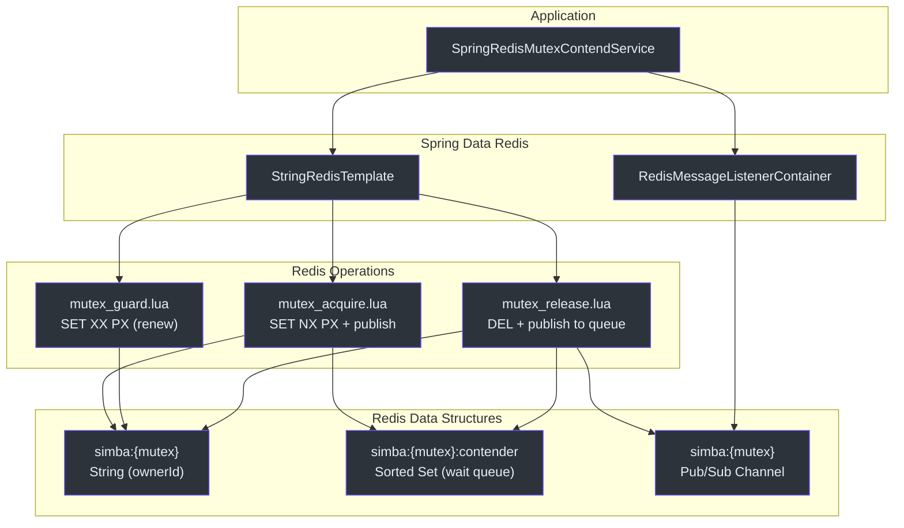
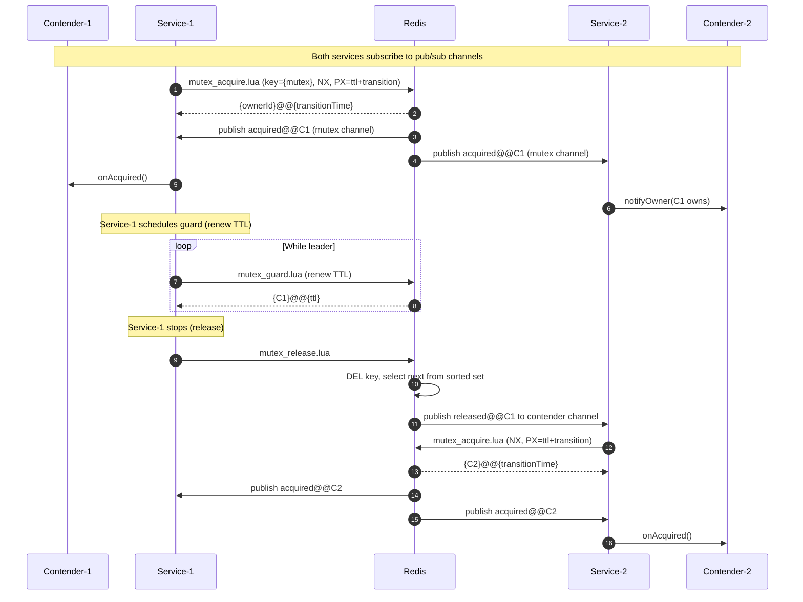
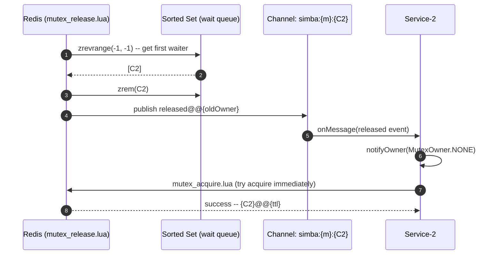

# simba-spring-redis Module

The `simba-spring-redis` module provides a Redis-based distributed mutex backend using Spring Data Redis. It achieves atomic lock operations through Lua scripts executed server-side, and uses Redis pub/sub for near-instant ownership change notifications.

## Architecture Overview



## Redis Data Structures

The module uses a hash-tag convention (`{mutex}`) to ensure all keys for a given mutex land on the same Redis cluster slot.

| Key | Type | Purpose |
|---|---|---|
| `simba:{mutex}` | String | Stores the `contenderId` of the current owner. TTL set via `PX` (milliseconds). |
| `simba:{mutex}:contender` | Sorted Set | Wait queue. Members are `contenderId` values; scores are insertion timestamps. |
| Channel: `simba:{mutex}` | Pub/Sub | Broadcasts `acquired@@{ownerId}` when a contender acquires the lock. |
| Channel: `simba:{mutex}:{contenderId}` | Pub/Sub | Per-contender channel. Receives `released@@{ownerId}` when the lock is released and this contender is next in the wait queue. |

## Lua Scripts

### mutex_acquire.lua

**Source:** [simba-spring-redis/src/main/resources/mutex_acquire.lua](https://github.com/Ahoo-Wang/Simba/blob/main/simba-spring-redis/src/main/resources/mutex_acquire.lua)

```lua
redis.replicate_commands();

local mutex = KEYS[1];
local contenderId = ARGV[1];
local transition = ARGV[2];
local mutexKey = 'simba:' .. mutex;

-- 1. Try to acquire the lock (SET NX PX)
local succeed = redis.call('set', mutexKey, contenderId, 'nx', 'px', transition)

if succeed then
    -- Publish acquisition event to the mutex channel
    local message = 'acquired@@' .. contenderId;
    redis.call('publish', mutexKey, message)
    return contenderId..'@@'..transition;
end

-- 2. Failed: add self to wait queue (sorted set)
local contenderQueueKey = mutexKey .. ':contender';
local nowTime = redis.call('time')[1];
redis.call('zadd', contenderQueueKey, 'nx', nowTime, contenderId)

-- Return current owner and remaining TTL
local ownerId = redis.call('get', mutexKey)
local ttl = redis.call('pttl', mutexKey)
return ownerId..'@@'..ttl;
```

**Logic:**
1. Attempts `SET key value NX PX ttl` -- atomic lock acquisition.
2. On success: publishes `acquired@@{contenderId}` to the mutex channel, returns the owner and transition time.
3. On failure: adds self to the sorted set wait queue (score = current server timestamp), returns the current owner and remaining TTL.

### mutex_guard.lua

**Source:** [simba-spring-redis/src/main/resources/mutex_guard.lua](https://github.com/Ahoo-Wang/Simba/blob/main/simba-spring-redis/src/main/resources/mutex_guard.lua)

```lua
local mutex = KEYS[1];
local contenderId = ARGV[1];
local transition = ARGV[2];
local mutexKey = 'simba:' .. mutex;

local function getCurrentOwner(mutexKey)
    local ownerId = redis.call('get', mutexKey)
    if ownerId then
        local ttl = redis.call('pttl', mutexKey)
        return ownerId .. '@@' .. ttl;
    end
    return '@@';
end

-- Check if current owner is this contender
if redis.call('get', mutexKey) ~= contenderId then
    return getCurrentOwner(mutexKey)
end

-- Renew the TTL (SET XX PX)
if redis.call('set', mutexKey, contenderId, 'xx', 'px', transition) then
    return contenderId .. '@@' .. transition;
else
    return getCurrentOwner(mutexKey)
end
```

**Logic:**
1. Verifies the caller is the current owner (`GET` check).
2. If owner, renews the TTL using `SET key value XX PX ttl` (only set if key exists).
3. Returns the owner and TTL information.

### mutex_release.lua

**Source:** [simba-spring-redis/src/main/resources/mutex_release.lua](https://github.com/Ahoo-Wang/Simba/blob/main/simba-spring-redis/src/main/resources/mutex_release.lua)

```lua
local mutex = KEYS[1];
local contenderId = ARGV[1];
local mutexKey = 'simba:' .. mutex;
local contenderQueueKey = mutexKey .. ':contender';

-- 1. Verify caller is the owner
if redis.call('get', mutexKey) ~= contenderId then
    redis.call('zrem', contenderQueueKey, contenderId)
    return 0;
end

-- 2. Delete the lock key
local succeed = redis.call('del', mutexKey)
if not succeed then return succeed; end

-- 3. Notify the next contender in the wait queue
local contenderQueue = redis.call('zrevrange', contenderQueueKey, -1, -1);
if #contenderQueue == 0 then return succeed; end

local nextContender = contenderQueue[1];
redis.call('zrem', contenderQueueKey, nextContender)

local channel = mutexKey .. ':' .. nextContender;
local message = 'released@@' .. contenderId;
redis.call('publish', channel, message)

return succeed;
```

**Logic:**
1. Verifies the caller is the current owner. If not, removes self from the wait queue and returns failure.
2. Deletes the lock key.
3. Pops the first contender from the sorted set (lowest score = longest waiter) and publishes `released@@{ownerId}` to that contender's personal channel.

## Key Classes

### SpringRedisMutexContendService

**Source:** [simba-spring-redis/.../SpringRedisMutexContendService.kt:42](https://github.com/Ahoo-Wang/Simba/blob/main/simba-spring-redis/src/main/kotlin/me/ahoo/simba/spring/redis/SpringRedisMutexContendService.kt#L42)

```kotlin
class SpringRedisMutexContendService(
    contender: MutexContender,
    handleExecutor: Executor,
    private val ttl: Duration,
    private val transition: Duration,
    private val redisTemplate: StringRedisTemplate,
    private val listenerContainer: RedisMessageListenerContainer,
    private val scheduledExecutorService: ScheduledExecutorService
) : AbstractMutexContendService(contender, handleExecutor)
```

| Parameter | Description |
|---|---|
| `contender` | The mutex contender |
| `handleExecutor` | Executor for async owner notification callbacks |
| `ttl` | Lock TTL (passed to Lua scripts as the PX value for guard, and as part of transition for acquire) |
| `transition` | Grace period; the total key TTL is `ttl + transition` |
| `redisTemplate` | `StringRedisTemplate` for Lua script execution |
| `listenerContainer` | `RedisMessageListenerContainer` for pub/sub |
| `scheduledExecutorService` | Schedules contend/guard cycles |

### Channels

The service subscribes to two topics:

| Channel | Purpose |
|---|---|
| `simba:{mutex}` | Global mutex channel -- receives `acquired@@{ownerId}` broadcasts |
| `simba:{mutex}:{contenderId}` | Per-contender channel -- receives `released@@{ownerId}` when this contender is selected from the wait queue |

### AcquireResult

**Source:** [simba-spring-redis/.../AcquireResult.kt:22](https://github.com/Ahoo-Wang/Simba/blob/main/simba-spring-redis/src/main/kotlin/me/ahoo/simba/spring/redis/AcquireResult.kt#L22)

Parses the Lua script return format `{ownerId}@@{ttl}`:

```kotlin
data class AcquireResult(val ownerId: String, val transitionAt: Long)
```

### OwnerEvent

**Source:** [simba-spring-redis/.../OwnerEvent.kt:20](https://github.com/Ahoo-Wang/Simba/blob/main/simba-spring-redis/src/main/kotlin/me/ahoo/simba/spring/redis/OwnerEvent.kt#L20)

Parses pub/sub message format `{event}@@{ownerId}`:

```kotlin
data class OwnerEvent(val event: String, val ownerId: String, val eventAt: Long)
```

| Event | Trigger |
|---|---|
| `acquired` | A contender successfully acquired the lock (from `mutex_acquire.lua`) |
| `released` | The current owner released the lock and this contender is next in queue (from `mutex_release.lua`) |

## Sequence Diagram -- Redis Lock Acquisition



## Sequence Diagram -- Pub/Sub Driven Handoff



## Properties

```yaml
simba:
  enabled: true
  redis:
    enabled: true       # Redis backend enable (default: true)
    ttl: 10s            # Lock TTL
    transition: 6s      # Grace period after TTL
```

**Source:** [simba-spring-boot-starter/.../RedisProperties.kt:25](https://github.com/Ahoo-Wang/Simba/blob/main/simba-spring-boot-starter/src/main/kotlin/me/ahoo/simba/spring/boot/starter/redis/RedisProperties.kt#L25)

| Property | Default | Description |
|---|---|---|
| `simba.redis.enabled` | `true` | Enable the Redis backend |
| `simba.redis.ttl` | `10s` | Lock TTL -- the key's PX value for guard, and part of the PX for acquire |
| `simba.redis.transition` | `6s` | Grace period; total key TTL on acquire = `ttl + transition` |

## Factory

**Source:** [simba-spring-redis/.../SpringRedisMutexContendServiceFactory.kt:31](https://github.com/Ahoo-Wang/Simba/blob/main/simba-spring-redis/src/main/kotlin/me/ahoo/simba/spring/redis/SpringRedisMutexContendServiceFactory.kt#L31)

```kotlin
class SpringRedisMutexContendServiceFactory(
    private val ttl: Duration,
    private val transition: Duration,
    private val redisTemplate: StringRedisTemplate,
    private val listenerContainer: RedisMessageListenerContainer,
    private val handleExecutor: Executor = ForkJoinPool.commonPool(),
    private val scheduledExecutorService: ScheduledExecutorService = Executors.newScheduledThreadPool(1)
) : MutexContendServiceFactory
```

## Redis Cluster Compatibility

The `{mutex}` hash-tag in all keys ensures that `simba:{mutex}`, `simba:{mutex}:contender`, and the associated pub/sub channel all hash to the same Redis cluster slot. This is required because Lua scripts access multiple keys atomically -- all keys must reside on the same node.

```
Key: simba:{order-lock}         -> slot = hash("order-lock")
Key: simba:{order-lock}:contender -> slot = hash("order-lock")
```

## Dependencies

```
simba-spring-redis
  ├── simba-core
  └── spring-data-redis
```

The module depends on `spring-data-redis` for `StringRedisTemplate`, `RedisScript`, and `RedisMessageListenerContainer`. The application must provide a Redis connection factory.

## See Also

- [simba-core Module](./simba-core) -- core interfaces
- [simba-spring-boot-starter](./simba-spring-boot-starter) -- auto-configuration with `simba.redis.*` properties
- [simba-jdbc](./simba-jdbc) -- JDBC alternative backend
