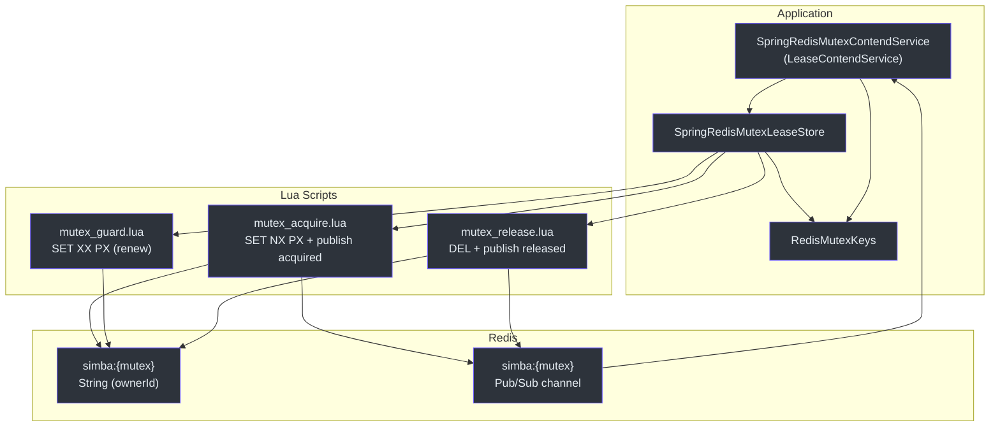
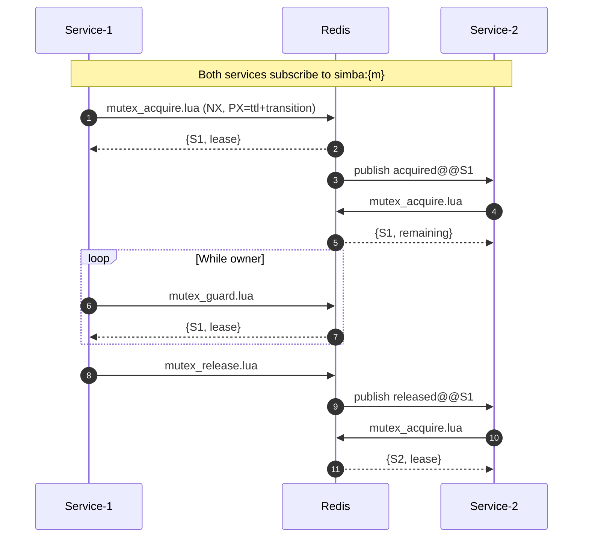

# simba-spring-redis Module

The `simba-spring-redis` module provides a Redis-based distributed mutex backend using Spring Data Redis. Lock operations are atomic Lua scripts executed server-side, and Redis pub/sub broadcasts ownership changes so waiting contenders react immediately instead of waiting for their next poll.

## Architecture Overview


```mermaid
graph TB
    subgraph sg_app ["Application"]
        SVC["SpringRedisMutexContendService<br>(LeaseContendService)"]
        STORE["SpringRedisMutexLeaseStore"]
        KEYS["RedisMutexKeys"]
    end
    subgraph sg_lua ["Lua Scripts"]
        ACQ["mutex_acquire.lua<br>SET NX PX + publish acquired"]
        GRD["mutex_guard.lua<br>SET XX PX (renew)"]
        REL["mutex_release.lua<br>DEL + publish released"]
    end
    subgraph sg_data ["Redis"]
        KEY["simba:{mutex}<br>String (ownerId)"]
        CHAN["simba:{mutex}<br>Pub/Sub channel"]
    end

    SVC --> STORE
    STORE --> KEYS
    SVC --> KEYS
    STORE --> ACQ
    STORE --> GRD
    STORE --> REL
    ACQ --> KEY
    ACQ --> CHAN
    GRD --> KEY
    REL --> KEY
    REL --> CHAN
    CHAN --> SVC

    style SVC fill:#2d333b,stroke:#6d5dfc,color:#e6edf3
    style STORE fill:#2d333b,stroke:#6d5dfc,color:#e6edf3
    style KEYS fill:#2d333b,stroke:#6d5dfc,color:#e6edf3
    style ACQ fill:#2d333b,stroke:#6d5dfc,color:#e6edf3
    style GRD fill:#2d333b,stroke:#6d5dfc,color:#e6edf3
    style REL fill:#2d333b,stroke:#6d5dfc,color:#e6edf3
    style KEY fill:#2d333b,stroke:#6d5dfc,color:#e6edf3
    style CHAN fill:#2d333b,stroke:#6d5dfc,color:#e6edf3
```

## Redis Keys and Channels

All names share the `{mutex}` hash tag, so they land on one Redis Cluster slot. [`RedisMutexKeys`](https://github.com/Ahoo-Wang/Simba/blob/main/simba-spring-redis/src/main/kotlin/me/ahoo/simba/spring/redis/RedisMutexKeys.kt) is the single Kotlin source of these names.

| Name | Type | Purpose |
|---|---|---|
| `simba:{mutex}` | String | `contenderId` of the current owner, expiring after `ttl + transition` (`PX`). |
| `simba:{mutex}` | Pub/Sub channel | Broadcasts `acquired@@{ownerId}` and `released@@{ownerId}` to every contender. |
| `simba:{mutex}:{contenderId}` | Pub/Sub channel | Still subscribed so that Simba < 3.2 owners, which address releases to one queued contender, can wake this node during a rolling upgrade. |
| `simba:{mutex}:contender` | Sorted set (legacy) | Wait queue written only by Simba < 3.2; deleted on every release. |

## Lua Scripts

Every script receives its keys through `KEYS` (Redis Cluster compliant). `mutex_acquire.lua` and `mutex_guard.lua` return a two-element array `{ownerId, remaining lease in ms}`, or `{'', 0}` when there is no owner.

### mutex_acquire.lua

[`mutex_acquire.lua`](https://github.com/Ahoo-Wang/Simba/blob/main/simba-spring-redis/src/main/resources/mutex_acquire.lua)

```lua
if redis.call('set', mutexKey, contenderId, 'nx', 'px', lease) then
    redis.call('publish', mutexKey, 'acquired@@' .. contenderId)
    return { contenderId, tonumber(lease) };
end
local ownerId = redis.call('get', mutexKey)
if not ownerId then
    return { '', 0 };
end
return { ownerId, redis.call('pttl', mutexKey) };
```

`SET NX PX` acquires atomically for `ttl + transition` and announces the new owner. On failure the script reports the current owner and its remaining lease.

### mutex_guard.lua

[`mutex_guard.lua`](https://github.com/Ahoo-Wang/Simba/blob/main/simba-spring-redis/src/main/resources/mutex_guard.lua) renews the lease only when the caller still owns it (`SET XX PX`), otherwise it reports the current owner. It never creates a lease that has already expired.

### mutex_release.lua

[`mutex_release.lua`](https://github.com/Ahoo-Wang/Simba/blob/main/simba-spring-redis/src/main/resources/mutex_release.lua)

```lua
if redis.call('get', mutexKey) ~= contenderId then
    redis.call('zrem', legacyQueueKey, contenderId)
    return 0;
end
redis.call('del', mutexKey, legacyQueueKey)
redis.call('publish', mutexKey, 'released@@' .. contenderId)
return 1;
```

Only the owner can release. The release is broadcast on the mutex channel, so every live contender contends immediately and one wins; no wake-up can be lost to a crashed contender.

## Key Classes

| Class | Role |
|---|---|
| [`SpringRedisMutexContendService`](https://github.com/Ahoo-Wang/Simba/blob/main/simba-spring-redis/src/main/kotlin/me/ahoo/simba/spring/redis/SpringRedisMutexContendService.kt) | `LeaseContendService` subclass; subscribes in `onStart()`, unsubscribes in `onStop()`, and reacts to owner events. |
| [`SpringRedisMutexLeaseStore`](https://github.com/Ahoo-Wang/Simba/blob/main/simba-spring-redis/src/main/kotlin/me/ahoo/simba/spring/redis/SpringRedisMutexLeaseStore.kt) | `MutexLeaseStore`: runs `mutex_guard.lua` when renewing, `mutex_acquire.lua` otherwise, and `mutex_release.lua`. |
| [`AcquireResult`](https://github.com/Ahoo-Wang/Simba/blob/main/simba-spring-redis/src/main/kotlin/me/ahoo/simba/spring/redis/AcquireResult.kt) | Parses a script reply into the owner and the absolute lease end (`transitionAt`). |
| [`OwnerEvent`](https://github.com/Ahoo-Wang/Simba/blob/main/simba-spring-redis/src/main/kotlin/me/ahoo/simba/spring/redis/OwnerEvent.kt) | Parses pub/sub messages `{event}@@{ownerId}`. |

| Event | Reaction |
|---|---|
| `acquired` | Update the observed owner. |
| `released` | Clear the observed owner and call `contendNow()` for an immediate attempt. |

## Sequence Diagram -- Acquisition and Hand-off


```mermaid
sequenceDiagram
autonumber
    participant S1 as Service-1
    participant Redis as Redis
    participant S2 as Service-2

    Note over S1,S2: Both services subscribe to simba:{m}
    S1->>Redis: mutex_acquire.lua (NX, PX=ttl+transition)
    Redis-->>S1: {S1, lease}
    Redis->>S2: publish acquired@@S1
    S2->>Redis: mutex_acquire.lua
    Redis-->>S2: {S1, remaining}
    loop While owner
        S1->>Redis: mutex_guard.lua
        Redis-->>S1: {S1, lease}
    end
    S1->>Redis: mutex_release.lua
    Redis->>S2: publish released@@S1
    S2->>Redis: mutex_acquire.lua
    Redis-->>S2: {S2, lease}
```

## Properties

| Property | Default | Description |
|---|---|---|
| `simba.redis.enabled` | `true` | Enable the Redis backend |
| `simba.redis.ttl` | `10s` | Time after acquisition at which the owner renews |
| `simba.redis.transition` | `6s` | Grace period; the key expires after `ttl + transition` |

## Factory

[`SpringRedisMutexContendServiceFactory`](https://github.com/Ahoo-Wang/Simba/blob/main/simba-spring-redis/src/main/kotlin/me/ahoo/simba/spring/redis/SpringRedisMutexContendServiceFactory.kt)

```kotlin
class SpringRedisMutexContendServiceFactory(
    ttl: Duration,
    transition: Duration,
    redisTemplate: StringRedisTemplate,
    listenerContainer: RedisMessageListenerContainer,
    handleExecutor: Executor = ForkJoinPool.commonPool(),
    scheduledExecutorService: ScheduledExecutorService = ContendExecutors.newScheduler("simba-redis"),
    ioExecutor: ExecutorService = ContendExecutors.newIoExecutor("simba-redis-io")
) : MutexContendServiceFactory, AutoCloseable
```

All services share the scheduler (contention triggers and lease watchdogs) and the I/O executor (script calls). The factory owns both and shuts them down on `close()`. The Spring Boot starter passes its `simbaHandleExecutor` bean as `handleExecutor`.

## Rolling Upgrade from Simba < 3.2

Key and channel names are unchanged. Older nodes keep receiving releases because they subscribe to the mutex channel and handle `released` from any channel; newer nodes keep their per-contender channel for releases sent by older owners. Older contenders that are only in the legacy queue may wait for their next poll until all nodes are upgraded.

## Dependencies

```
simba-spring-redis
  ├── simba-core
  └── spring-data-redis
```

## See Also

- [simba-core Module](./simba-core) -- core interfaces and `LeaseContendService`
- [simba-spring-boot-starter](./simba-spring-boot-starter) -- auto-configuration with `simba.redis.*` properties
- [simba-jdbc](./simba-jdbc) -- JDBC alternative backend
