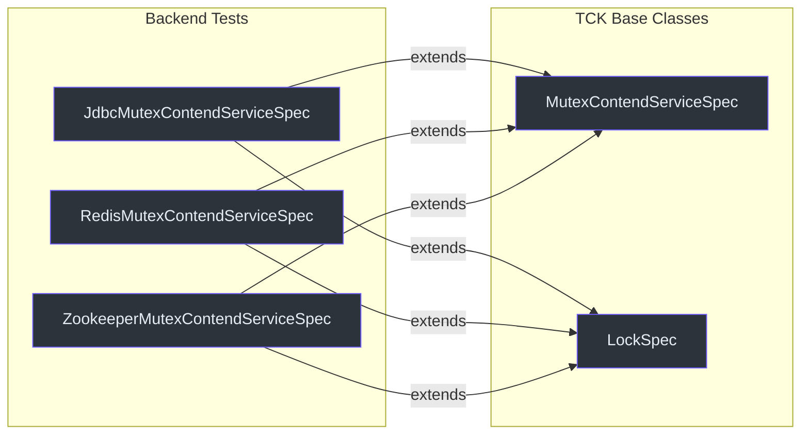
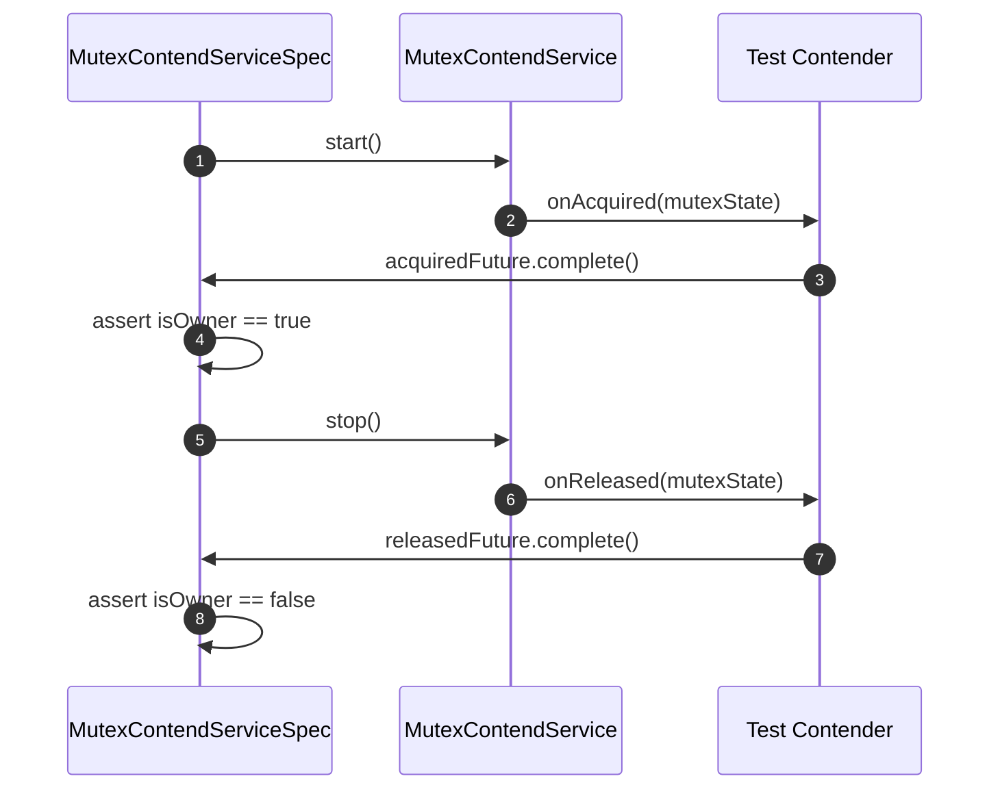
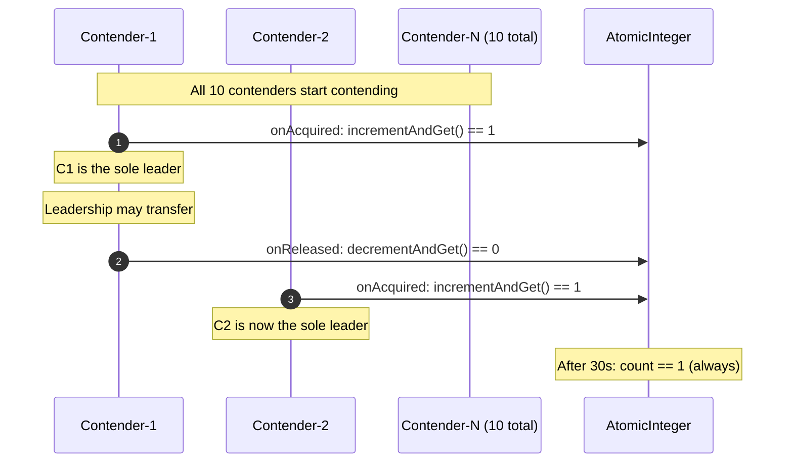
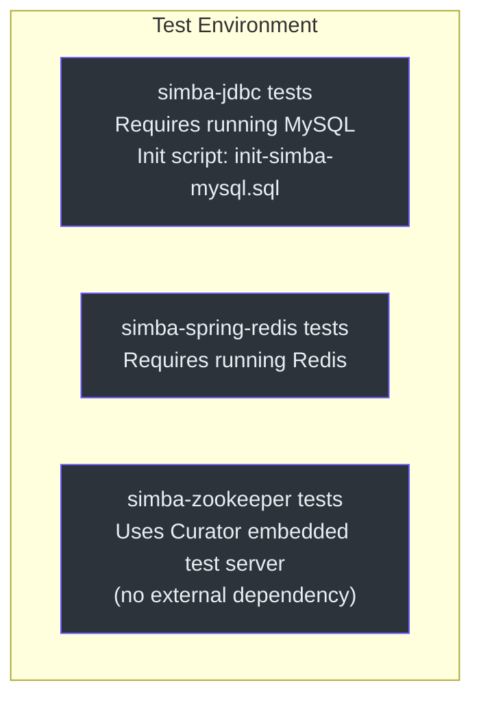

# simba-test Module

The `simba-test` module provides abstract test base classes that form a Technology Compatibility Kit (TCK) for Simba backend implementations. Each backend module extends these base classes to verify that its `MutexContendService` implementation behaves correctly.

## Purpose



Each backend test class provides:
- A `MutexContendServiceFactory` instance (configured for that backend)
- Infrastructure setup (e.g., MySQL connection, Redis instance, embedded ZK server)

The TCK test methods verify the generic contention contract.

## MutexContendServiceSpec

**Source:** [simba-test/.../MutexContendServiceSpec.kt:34](https://github.com/Ahoo-Wang/Simba/blob/main/simba-test/src/main/kotlin/me/ahoo/simba/test/MutexContendServiceSpec.kt#L34)

```kotlin
abstract class MutexContendServiceSpec {
    abstract val mutexContendServiceFactory: MutexContendServiceFactory
}
```

Backend test classes must provide the `mutexContendServiceFactory` property.

### Test Cases

The spec defines five test cases that cover the core contention lifecycle:

#### start

**Source:** [simba-test/.../MutexContendServiceSpec.kt:47](https://github.com/Ahoo-Wang/Simba/blob/main/simba-test/src/main/kotlin/me/ahoo/simba/test/MutexContendServiceSpec.kt#L47)

```kotlin
@Test open fun start()
```

Verifies the basic acquire/release lifecycle:
1. Creates a contender with `onAcquired` and `onReleased` callbacks connected to `CompletableFuture`s.
2. Starts the contend service and waits for `onAcquired` to fire.
3. Asserts `contendService.isOwner == true`.
4. Stops the service and waits for `onReleased`.
5. Asserts `contendService.isOwner == false`.



#### restart

**Source:** [simba-test/.../MutexContendServiceSpec.kt:72](https://github.com/Ahoo-Wang/Simba/blob/main/simba-test/src/main/kotlin/me/ahoo/simba/test/MutexContendServiceSpec.kt#L72)

```kotlin
@Test open fun restart()
```

Verifies that a contend service can be stopped and restarted:
1. Start, acquire, assert owner, stop, assert not owner.
2. Start again (restart), acquire again, assert owner, stop, assert not owner.

This tests the `INITIAL -> STARTING -> RUNNING -> STOPPING -> INITIAL` cycle can be repeated.

#### guard

**Source:** [simba-test/.../MutexContendServiceSpec.kt:112](https://github.com/Ahoo-Wang/Simba/blob/main/simba-test/src/main/kotlin/me/ahoo/simba/test/MutexContendServiceSpec.kt#L112)

```kotlin
@Test open fun guard()
```

Verifies that the owner can maintain leadership across TTL renewals:
1. Start and wait for acquisition.
2. Sleep for 3 seconds (longer than a typical contention cycle).
3. Assert the owner is still the same contender.
4. Stop and verify release.

This validates the `guard` / renewal mechanism.

#### multiContend

**Source:** [simba-test/.../MutexContendServiceSpec.kt:140](https://github.com/Ahoo-Wang/Simba/blob/main/simba-test/src/main/kotlin/me/ahoo/simba/test/MutexContendServiceSpec.kt#L140)

```kotlin
@Test open fun multiContend()
```

Verifies mutual exclusion with 10 concurrent contenders:
1. Creates 10 contenders for the same mutex, each with an `AtomicInteger` counter.
2. `onAcquired` asserts `count.incrementAndGet() == 1` (exactly one owner).
3. `onReleased` asserts `count.decrementAndGet() == 0`.
4. Sleeps for 30 seconds to observe contention.
5. Asserts `count == 1` (exactly one owner at any time).
6. All contenders agree on the same `ownerId`.



#### schedule

**Source:** [simba-test/.../MutexContendServiceSpec.kt:176](https://github.com/Ahoo-Wang/Simba/blob/main/simba-test/src/main/kotlin/me/ahoo/simba/test/MutexContendServiceSpec.kt#L176)

```kotlin
@Test fun schedule()
```

Verifies `AbstractScheduler` integration:
1. Creates an `AbstractScheduler` subclass with a `CountDownLatch` in `work()`.
2. Asserts `running == false` initially.
3. Starts the scheduler, asserts `running == true`.
4. Waits for the latch (work was called within 5 seconds).
5. Stops the scheduler, asserts `running == false`.

### Test Mutex Names

| Constant | Value | Used By |
|---|---|---|
| `START_MUTEX` | `"start"` | `start()` |
| `RESTART_MUTEX` | `"restart"` | `restart()` |
| `GUARD_MUTEX` | `"guard"` | `guard()` |
| `MULTI_CONTEND_MUTEX` | `"multiContend"` | `multiContend()` |
| `SCHEDULE_MUTEX` | `"schedule"` | `schedule()` |

## LockSpec

**Source:** [simba-test/.../LockSpec.kt:16](https://github.com/Ahoo-Wang/Simba/blob/main/simba-test/src/main/kotlin/me/ahoo/simba/test/LockSpec.kt#L16)

```kotlin
abstract class LockSpec
```

Currently an empty abstract class reserved for future Locker-specific TCK tests. Backend test classes should extend this alongside `MutexContendServiceSpec`.

## Extending the TCK

### Example: JDBC Backend Test

```kotlin
class JdbcMutexContendServiceSpec : MutexContendServiceSpec() {
    override val mutexContendServiceFactory: MutexContendServiceFactory =
        JdbcMutexContendServiceFactory(
            mutexOwnerRepository = JdbcMutexOwnerRepository(dataSource),
            initialDelay = Duration.ZERO,
            ttl = Duration.ofSeconds(3),
            transition = Duration.ofSeconds(2)
        )
}
```

### Example: Redis Backend Test

```kotlin
class RedisMutexContendServiceSpec : MutexContendServiceSpec() {
    override val mutexContendServiceFactory: MutexContendServiceFactory =
        SpringRedisMutexContendServiceFactory(
            ttl = Duration.ofSeconds(3),
            transition = Duration.ofSeconds(2),
            redisTemplate = stringRedisTemplate,
            listenerContainer = listenerContainer
        )
}
```

### Example: Zookeeper Backend Test

```kotlin
class ZookeeperMutexContendServiceSpec : MutexContendServiceSpec() {
    override val mutexContendServiceFactory: MutexContendServiceFactory =
        ZookeeperMutexContendServiceFactory(
            handleExecutor = ForkJoinPool.commonPool(),
            curatorFramework = curatorFramework
        )
}
```

## Test Infrastructure Requirements



| Backend | Test Infrastructure |
|---|---|
| `simba-jdbc` | Running MySQL instance. Schema must be initialized from `init-simba-mysql.sql`. |
| `simba-spring-redis` | Running Redis instance. |
| `simba-zookeeper` | Curator's embedded test server (no external ZK required). |

## Dependencies

```
simba-test
  ├── simba-core
  ├── JUnit 5 (jupiter)
  └── Hamcrest (assertions)
```

## See Also

- [simba-core Module](./simba-core) -- the interfaces being tested
- [simba-jdbc](./simba-jdbc) -- JDBC backend TCK tests
- [simba-spring-redis](./simba-spring-redis) -- Redis backend TCK tests
- [simba-zookeeper](./simba-zookeeper) -- Zookeeper backend TCK tests
