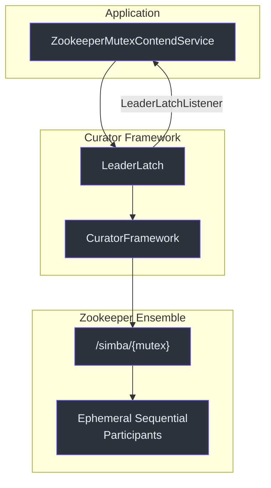
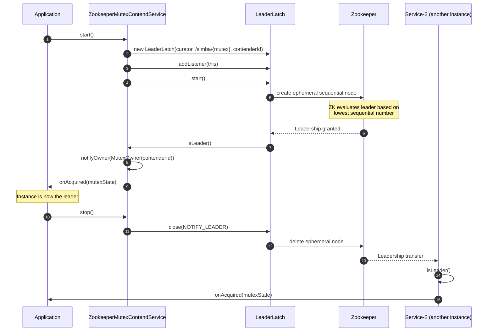
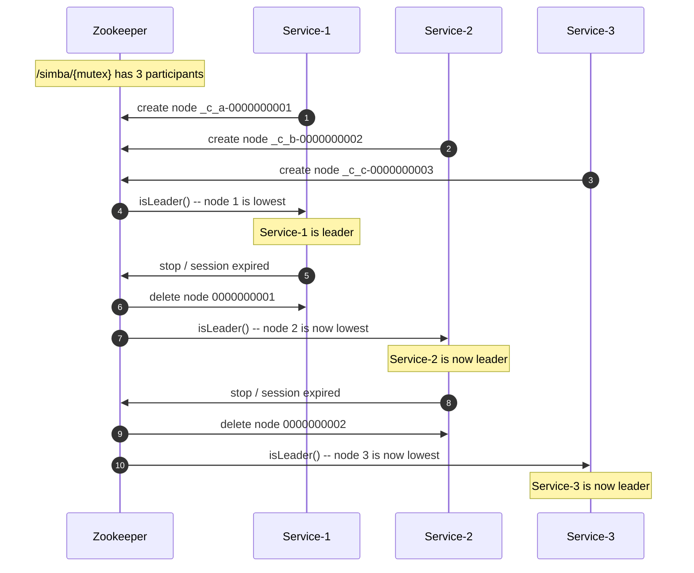
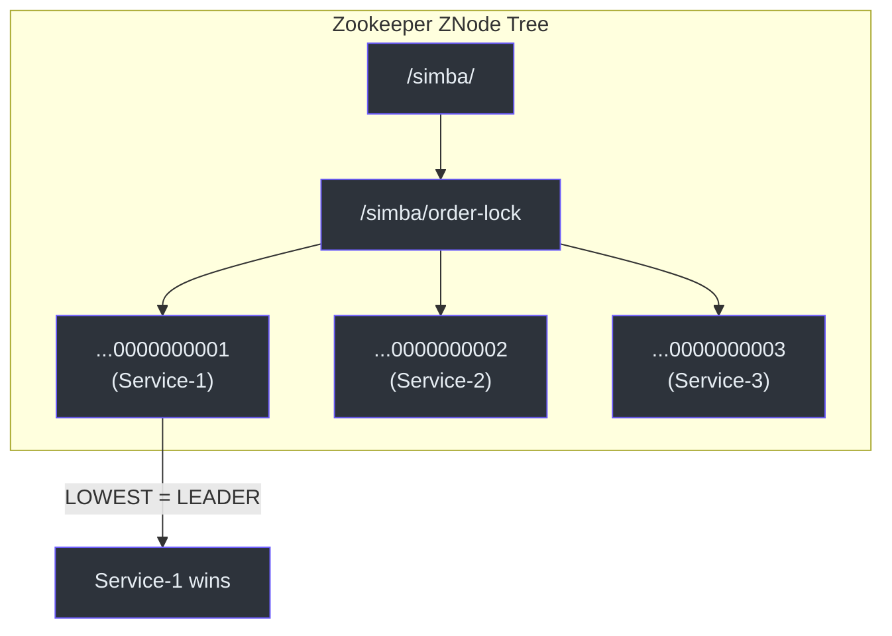

# simba-zookeeper Module

The `simba-zookeeper` module provides a Zookeeper-based distributed mutex backend using Apache Curator's `LeaderLatch`. Unlike the JDBC and Redis backends which use polling-based contention, Zookeeper provides push-based leader election through ephemeral sequential znodes.

## Architecture



## Path Structure

All Simba mutexes in Zookeeper use the path prefix `/simba/`:

```
/simba/
  └── {mutex}              -- The mutex resource (e.g., "order-settlement")
      ├── _c_<guid>-0000000001  -- Participant 1 (ephemeral sequential)
      ├── _c_<guid>-0000000002  -- Participant 2 (ephemeral sequential)
      └── _c_<guid>-0000000003  -- Participant 3 (ephemeral sequential)
```

The constant `RESOURCE_PREFIX` is defined as `"/simba/"`:

**Source:** [simba-zookeeper/.../ZookeeperMutexContendService.kt:59](https://github.com/Ahoo-Wang/Simba/blob/main/simba-zookeeper/src/main/kotlin/me/ahoo/simba/zookeeper/ZookeeperMutexContendService.kt#L59)

```kotlin
companion object {
    const val RESOURCE_PREFIX = "/simba/"
}
```

The final path for a mutex named `"order-settlement"` is `/simba/order-settlement`.

## Key Classes

### ZookeeperMutexContendService

**Source:** [simba-zookeeper/.../ZookeeperMutexContendService.kt:29](https://github.com/Ahoo-Wang/Simba/blob/main/simba-zookeeper/src/main/kotlin/me/ahoo/simba/zookeeper/ZookeeperMutexContendService.kt#L29)

```kotlin
class ZookeeperMutexContendService(
    contender: MutexContender,
    handleExecutor: Executor,
    private val curatorFramework: CuratorFramework
) : AbstractMutexContendService(contender, handleExecutor), LeaderLatchListener
```

| Parameter | Description |
|---|---|
| `contender` | The mutex contender |
| `handleExecutor` | Executor for async owner notification callbacks |
| `curatorFramework` | Curator client for Zookeeper communication |

The class implements `LeaderLatchListener` to receive push-based leadership notifications:

```kotlin
interface LeaderLatchListener {
    fun isLeader()      // Called when this participant becomes the leader
    fun notLeader()     // Called when this participant loses leadership
}
```

### Implementation Details

```kotlin
override fun startContend() {
    leaderLatch = LeaderLatch(curatorFramework, mutexPath, contenderId)
    leaderLatch!!.addListener(this)
    leaderLatch!!.start()
}

override fun stopContend() {
    leaderLatch!!.close(CloseMode.NOTIFY_LEADER)
    leaderLatch = null
}

override fun isLeader() {
    notifyOwner(MutexOwner(contenderId))
}

override fun notLeader() {
    notifyOwner(MutexOwner.NONE)
}
```

| Method | Behavior |
|---|---|
| `startContend()` | Creates a `LeaderLatch` at `/simba/{mutex}`, registers self as a listener, and starts the latch. The contender's `contenderId` is used as the latch participant ID. |
| `stopContend()` | Closes the latch with `CloseMode.NOTIFY_LEADER`, which triggers leadership transfer to the next participant. |
| `isLeader()` | Called by Curator when this participant wins leadership. Notifies the service with a new `MutexOwner`. |
| `notLeader()` | Called by Curator when this participant loses leadership. Notifies with `MutexOwner.NONE`. |

### CloseMode.NOTIFY_LEADER

When the latch closes with `NOTIFY_LEADER`, Curator triggers the next participant's `isLeader()` callback, enabling seamless leadership handoff without polling delay.

### ZookeeperMutexContendServiceFactory

**Source:** [simba-zookeeper/.../ZookeeperMutexContendServiceFactory.kt:26](https://github.com/Ahoo-Wang/Simba/blob/main/simba-zookeeper/src/main/kotlin/me/ahoo/simba/zookeeper/ZookeeperMutexContendServiceFactory.kt#L26)

```kotlin
class ZookeeperMutexContendServiceFactory(
    private val handleExecutor: Executor,
    private val curatorFramework: CuratorFramework
) : MutexContendServiceFactory
```

| Parameter | Description |
|---|---|
| `handleExecutor` | Executor for async owner notification callbacks |
| `curatorFramework` | Shared Curator client for all mutexes |

Unlike JDBC and Redis backends, the Zookeeper backend does not have `ttl` or `transition` parameters. Zookeeper handles expiry through ephemeral nodes (session-based).

## Sequence Diagram -- Zookeeper Leader Election



## Sequence Diagram -- Multi-Instance Leadership



## How LeaderLatch Works



Each `LeaderLatch` participant creates an ephemeral sequential znode under the mutex path. The participant with the lowest sequence number is the leader. When the leader's node is removed (explicit close or session expiry), Zookeeper notifies the next lowest participant.

## Properties

```yaml
simba:
  enabled: true
  zookeeper:
    enabled: true       # Zookeeper backend enable (default: true)
```

**Source:** [simba-spring-boot-starter/.../ZookeeperProperties.kt:24](https://github.com/Ahoo-Wang/Simba/blob/main/simba-spring-boot-starter/src/main/kotlin/me/ahoo/simba/spring/boot/starter/zookeeper/ZookeeperProperties.kt#L24)

| Property | Default | Description |
|---|---|---|
| `simba.zookeeper.enabled` | `true` | Enable the Zookeeper backend |

The Zookeeper backend does not have `ttl` or `transition` properties because Zookeeper's ephemeral node mechanism handles expiry automatically via session management.

## Comparison with Other Backends

| Aspect | Zookeeper | JDBC | Redis |
|---|---|---|---|
| **Notification model** | Push (watcher) | Pull (polling) | Push (pub/sub) |
| **Acquisition latency** | Low (watcher-based) | High (polling interval) | Low (pub/sub) |
| **External dependency** | ZK ensemble | MySQL | Redis |
| **TTL management** | Session-based (ephemeral) | Application-level (ttl column) | Redis PX expiry |
| **Configuration** | Only `enabled` flag | `ttl`, `transition`, `initialDelay` | `ttl`, `transition` |
| **Best for** | Strong consistency, existing ZK infrastructure | Simple infra, existing RDBMS | High-throughput, low-latency |

## Dependencies

```
simba-zookeeper
  ├── simba-core
  └── curator-recipes
```

The application must provide a configured `CuratorFramework` instance. Typically created via Spring Boot's auto-configuration or manually:

```kotlin
val curatorFramework = CuratorFrameworkFactory.builder()
    .connectString("localhost:2181")
    .retryPolicy(ExponentialBackoffRetry(1000, 3))
    .build()
curatorFramework.start()
```

## See Also

- [simba-core Module](./simba-core) -- core interfaces
- [simba-spring-boot-starter](./simba-spring-boot-starter) -- auto-configuration with `simba.zookeeper.*` properties
- [simba-spring-redis](./simba-spring-redis) -- Redis alternative backend
