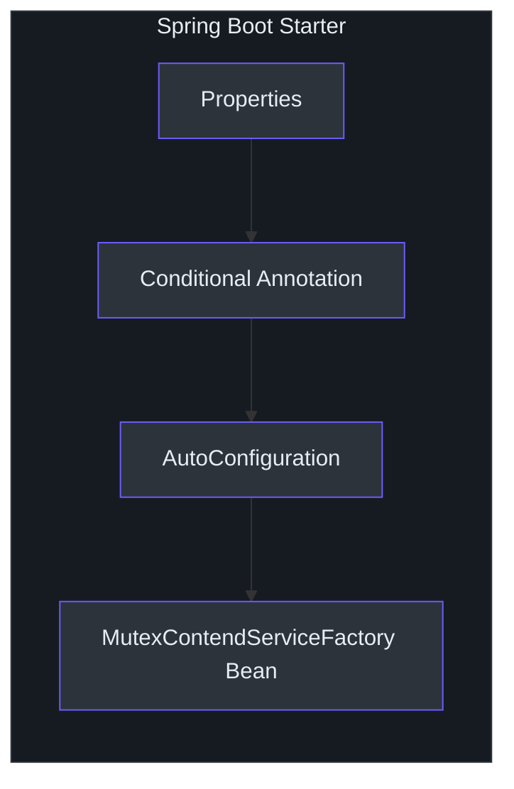
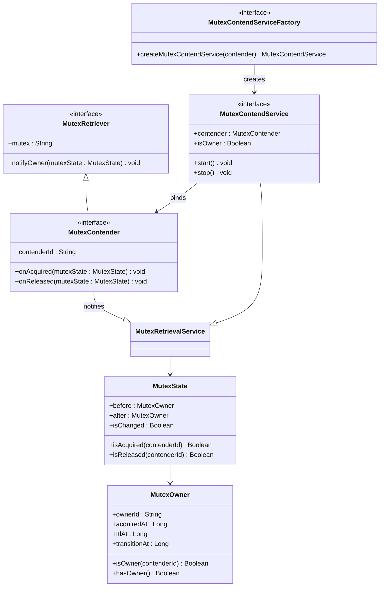
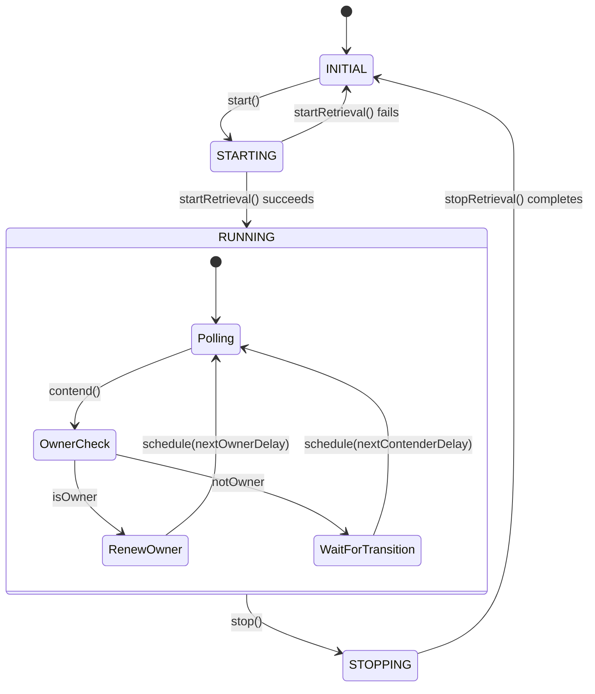
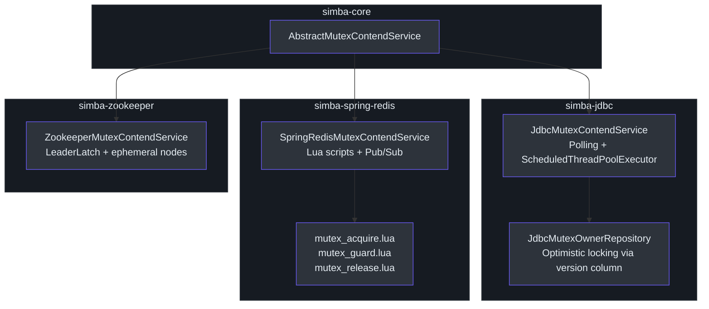
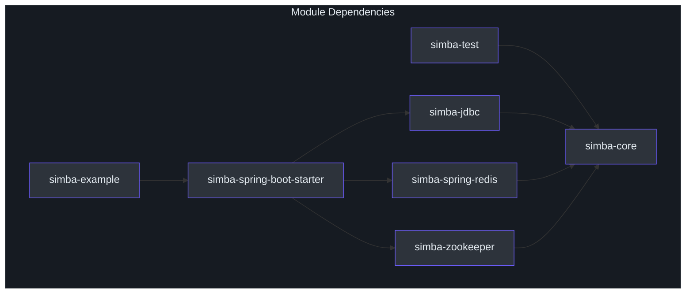

# Contributor Guide

Welcome to Simba. This guide assumes you are proficient in Kotlin and/or Java and want to become productive in this codebase quickly. It is organized in three parts: language and framework foundations, Simba's architecture and domain model, and getting productive with setup, testing, and contributing.

---

## Part I: Language and Framework Foundations

### Kotlin Essentials for This Codebase

Simba is written in Kotlin 2.3.20 targeting JVM 17. If you are coming from Java, here are the Kotlin patterns used heavily in this project.

#### Extension Functions and Properties

Kotlin extension functions add methods to existing types without inheritance. Simba uses them in the test assertion library:

```kotlin
import me.ahoo.test.asserts.assert

// Instead of assertThat(value).isEqualTo(expected) (AssertJ)
value.assert().isEqualTo(expected)
```

The `.assert()` extension wraps the value in a fluent assertion context. This is the project standard -- never use AssertJ's `assertThat()` directly.

#### Data Classes

[`MutexState`](https://github.com/Ahoo-Wang/Simba/blob/main/simba-core/src/main/kotlin/me/ahoo/simba/core/MutexState.kt) is a data class. Kotlin auto-generates `equals()`, `hashCode()`, `toString()`, `copy()`, and destructuring:

```kotlin
data class MutexState(val before: MutexOwner, val after: MutexOwner)
// Usage:
val (before, after) = mutexState  // destructuring
```

#### `object` Declarations (Singletons)

[`Simba`](https://github.com/Ahoo-Wang/Simba/blob/main/simba-core/src/main/kotlin/me/ahoo/simba/Simba.kt) and [`ContenderIdGenerator`](https://github.com/Ahoo-Wang/Simba/blob/main/simba-core/src/main/kotlin/me/ahoo/simba/core/ContenderIdGenerator.kt) companion objects use Kotlin's `object` for thread-safe singletons:

```kotlin
object Simba {
    const val SIMBA = "simba"
    const val SIMBA_PREFIX = "$SIMBA."
}
```

#### `@Volatile` and `AtomicReferenceFieldUpdater`

Simba uses Java's `AtomicReferenceFieldUpdater` for lock-free state transitions. In [`AbstractMutexRetrievalService`](https://github.com/Ahoo-Wang/Simba/blob/main/simba-core/src/main/kotlin/me/ahoo/simba/core/AbstractMutexRetrievalService.kt), the `status` field is updated atomically:

```kotlin
@Volatile
override var status = Status.INITIAL

companion object {
    val STATUS: AtomicReferenceFieldUpdater<...> =
        AtomicReferenceFieldUpdater.newUpdater(...)
}
```

The `compareAndSet` pattern ensures only one thread can transition the status from `INITIAL` to `STARTING`.

#### `lateinit` and Lazy Delegation

Tests use `lateinit var` for properties initialized in `@BeforeAll`:

```kotlin
override lateinit var mutexContendServiceFactory: MutexContendServiceFactory
```

The `ContenderIdGenerator` uses `by lazy` for deferred host resolution:

```kotlin
private val host: String by lazy {
    LocalHostAddressSupplier.INSTANCE.hostAddress
}
```

#### Coroutines vs Threads

Simba deliberately does **not** use Kotlin coroutines. All concurrency is handled through `java.util.concurrent` primitives:

- `ScheduledThreadPoolExecutor` for periodic contention cycles
- `CompletableFuture` for async owner notifications
- `Executor` interfaces for callback dispatch
- `LockSupport.park/unpark` in `SimbaLocker`
- `ForkJoinPool.commonPool()` as the default handle executor

This is a deliberate design choice: the library targets server-side JVM applications where `java.util.concurrent` is well-understood, predictable, and does not require coroutine context management.

### Gradle Kotlin DSL

The build system uses Gradle Kotlin DSL. Key files:

| File | Purpose |
|---|---|
| [`build.gradle.kts`](https://github.com/Ahoo-Wang/Simba/blob/main/build.gradle.kts) | Root project configuration |
| [`settings.gradle.kts`](https://github.com/Ahoo-Wang/Simba/blob/main/settings.gradle.kts) | Module includes and repository config |
| [`gradle/libs.versions.toml`](https://github.com/Ahoo-Wang/Simba/blob/main/gradle/libs.versions.toml) | Version catalog for all dependencies |
| [`gradle.properties`](https://github.com/Ahoo-Wang/Simba/blob/main/gradle.properties) | Project-wide Gradle properties |

#### Version Catalog

All dependency versions are centralized in `libs.versions.toml`. Modules reference them as:

```kotlin
dependencies {
    implementation(libs.some.dependency)
}
```

Never hardcode version strings in individual module `build.gradle.kts` files.

#### Feature Capabilities

The Spring Boot starter uses Gradle feature capabilities to allow consumers to pull only the backend they need. This is declared in the starter's `build.gradle.kts`:

```kotlin
java {
    registerFeature("springRedisSupport") { ... }
    registerFeature("jdbcSupport") { ... }
    registerFeature("zookeeperSupport") { ... }
}
```

### Spring Boot Auto-Configuration

The [`simba-spring-boot-starter`](https://github.com/Ahoo-Wang/Simba/blob/main/simba-spring-boot-starter) module provides auto-configuration for all three backends. Each backend has:

1. A `Properties` class (e.g., `RedisProperties`, `JdbcProperties`, `ZookeeperProperties`)
2. A `ConditionalOnSimba*Enabled` annotation (conditional on `simba.{backend}.enabled=true`)
3. An `AutoConfiguration` class that registers the `MutexContendServiceFactory` bean

Auto-configuration classes are registered in `META-INF/spring/org.springframework.boot.autoconfigure.AutoConfiguration.imports`.



**Application properties** follow the pattern `simba.{backend}.{property}`:

```properties
simba.redis.enabled=true
simba.redis.ttl=5000
simba.redis.transition=2000
simba.jdbc.enabled=true
simba.jdbc.initial-delay=2000
simba.zookeeper.enabled=true
simba.zookeeper.connect-string=localhost:2181
```

---

## Part II: Simba Architecture and Domain Model

### The Domain: Distributed Mutex

From a Domain-Driven Design perspective, Simba models **distributed mutual exclusion** as a bounded context. The core entities and value objects are:



#### Aggregate Root: The Mutex

Each named mutex (identified by a string like `"my-leader-election"`) is the aggregate root. It has:
- A current owner (`MutexOwner`)
- A TTL (time-to-live for the ownership claim)
- A transition period (grace period for the owner to renew)
- A version/optimistic lock (in JDBC backend)

#### Domain Event: Ownership Change

`MutexState` represents a domain event -- the transition from one owner to another. The `isChanged` property indicates whether ownership actually changed. The `isAcquired()` and `isReleased()` methods determine which contender gained or lost ownership.

### The Contention Lifecycle



### The Template Method Pattern

[`AbstractMutexContendService`](https://github.com/Ahoo-Wang/Simba/blob/main/simba-core/src/main/kotlin/me/ahoo/simba/core/AbstractMutexContendService.kt) uses the template method pattern. It defines the skeleton:

```kotlin
abstract class AbstractMutexContendService(
    override val contender: MutexContender,
    handleExecutor: Executor
) : AbstractMutexRetrievalService(contender, handleExecutor),
    MutexContendService {

    override fun startRetrieval() {
        resetOwner()
        startContend()  // <-- abstract, backend implements
    }

    override fun stopRetrieval() {
        stopContend()   // <-- abstract, backend implements
    }

    protected abstract fun startContend()
    protected abstract fun stopContend()
}
```

Each backend provides:
- `startContend()` -- begin competing for the lock
- `stopContend()` -- release the lock and clean up

The parent class (`AbstractMutexRetrievalService`) handles:
- Status machine transitions (`INITIAL -> STARTING -> RUNNING -> STOPPING -> INITIAL`)
- Owner notification dispatch (via `CompletableFuture.runAsync` on the handle executor)
- Thread-safe state management via `AtomicReferenceFieldUpdater`

### Backend Implementations



#### JDBC Backend

- [`JdbcMutexContendService`](https://github.com/Ahoo-Wang/Simba/blob/main/simba-jdbc/src/main/kotlin/me/ahoo/simba/jdbc/JdbcMutexContendService.kt) uses a `ScheduledThreadPoolExecutor` to periodically poll MySQL
- [`JdbcMutexOwnerRepository`](https://github.com/Ahoo-Wang/Simba/blob/main/simba-jdbc/src/main/kotlin/me/ahoo/simba/jdbc/JdbcMutexOwnerRepository.kt) performs `UPDATE simba_mutex SET ... WHERE mutex = ? AND version = ?` for optimistic locking
- The `simba_mutex` table has columns: `mutex`, `acquired_at`, `ttl_at`, `transition_at`, `owner_id`, `version`

#### Redis Backend

- [`SpringRedisMutexContendService`](https://github.com/Ahoo-Wang/Simba/blob/main/simba-spring-redis/src/main/kotlin/me/ahoo/simba/spring/redis/SpringRedisMutexContendService.kt) uses atomic Lua scripts for lock operations
- Pub/sub via `RedisMessageListenerContainer` provides real-time notifications when locks are released
- Two channel types: global (`simba:{mutex}`) for ownership broadcasts, per-contender (`simba:{mutex}:{contenderId}`) for targeted messages

#### Zookeeper Backend

- [`ZookeeperMutexContendService`](https://github.com/Ahoo-Wang/Simba/blob/main/simba-zookeeper/src/main/kotlin/me/ahoo/simba/zookeeper/ZookeeperMutexContendService.kt) wraps Curator's `LeaderLatch`
- Uses ephemeral sequential znodes under `/simba/{mutex}`
- The simplest backend: leadership changes are event-driven via `LeaderLatchListener`

### The Three API Styles

#### 1. MutexContender (Callback API)

The lowest-level API. You implement `onAcquired()` and `onReleased()` callbacks:

```kotlin
val contender = object : AbstractMutexContender("my-resource") {
    override fun onAcquired(mutexState: MutexState) {
        // I am now the leader
    }
    override fun onReleased(mutexState: MutexState) {
        // I lost leadership
    }
}
val service = factory.createMutexContendService(contender)
service.start()
// ... later
service.stop()
```

#### 2. SimbaLocker (RAII API)

[`SimbaLocker`](https://github.com/Ahoo-Wang/Simba/blob/main/simba-core/src/main/kotlin/me/ahoo/simba/locker/SimbaLocker.kt) provides blocking lock acquisition:

```kotlin
SimbaLocker("my-resource", factory).use { locker ->
    locker.acquire()
    // critical section
} // auto-released via AutoCloseable
```

Internally, `acquire()` parks the calling thread with `LockSupport.park()` and unparks it when `onAcquired` fires.

#### 3. AbstractScheduler (Leader-Gated Tasks)

[`AbstractScheduler`](https://github.com/Ahoo-Wang/Simba/blob/main/simba-core/src/main/kotlin/me/ahoo/simba/schedule/AbstractScheduler.kt) runs periodic work only when the instance holds leadership:

```kotlin
val scheduler = object : AbstractScheduler("my-task", factory) {
    override val config = ScheduleConfig.delay(Duration.ZERO, Duration.ofSeconds(30))
    override val worker = "CleanupWorker"
    override fun work() {
        // Runs every 30s, only on the leader
    }
}
scheduler.start()
```

### Contention Timing

[`ContendPeriod`](https://github.com/Ahoo-Wang/Simba/blob/main/simba-core/src/main/kotlin/me/ahoo/simba/core/ContendPeriod.kt) computes when the next contention cycle should occur:

- **Owner**: schedules renewal just before `ttlAt` (to prevent expiry)
- **Contender**: schedules attempt near `transitionAt` with random jitter between -200ms and +1000ms

The jitter prevents thundering herd -- when the current lock expires, all waiting contenders do not attempt acquisition simultaneously.

```mermaid
gantt
    title Contention Timeline for One Cycle
    dateFormat X
    axisFormat %Lms

    section Current Owner
    TTL Active           :active, 0, 2000
    Transition Period    :active, 2000, 5000

    section Contender A
    Wait (with jitter)   :done, 0, 4800
    Attempt acquire      :crit, 4800, 4900

    section Contender B
    Wait (with jitter)   :done, 0, 5500
    Attempt acquire      :crit, 5500, 5600
```



---

## Part III: Getting Productive

### Environment Setup

#### Prerequisites

- JDK 17+ (Temurin recommended)
- Docker (for MySQL and Redis integration tests)
- Git

#### Clone and Build

```bash
git clone https://github.com/Ahoo-Wang/Simba.git
cd Simba
./gradlew build
```

#### Run Tests

```bash
# Core unit tests (no infra needed)
./gradlew simba-core:check

# Zookeeper tests (embedded server, no infra needed)
./gradlew simba-zookeeper:check

# JDBC tests (needs MySQL)
docker compose -f docker-compose-test.yml up -d mysql
./gradlew simba-jdbc:check

# Redis tests (needs Redis)
docker compose -f docker-compose-test.yml up -d redis
./gradlew simba-spring-redis:check

# All tests
./gradlew check
```

#### Static Analysis

```bash
./gradlew detekt
```

Detekt config: [`config/detekt/detekt.yml`](https://github.com/Ahoo-Wang/Simba/blob/main/config/detekt/detekt.yml). Key setting: `autoCorrect = true`.

#### Code Coverage

```bash
./gradlew codeCoverageReport
```

Report location: `code-coverage-report/build/reports/jacoco/`

### Project Walkthrough: Understanding a Backend

Let's trace through the JDBC backend as a representative example.

#### Step 1: The Factory

[`JdbcMutexContendServiceFactory`](https://github.com/Ahoo-Wang/Simba/blob/main/simba-jdbc/src/main/kotlin/me/ahoo/simba/jdbc/JdbcMutexContendServiceFactory.kt) creates `JdbcMutexContendService` instances. It receives configuration (repository, initial delay, TTL, transition) and passes them to each new service.

#### Step 2: The Service

[`JdbcMutexContendService`](https://github.com/Ahoo-Wang/Simba/blob/main/simba-jdbc/src/main/kotlin/me/ahoo/simba/jdbc/JdbcMutexContendService.kt):

1. `startContend()` creates a `ScheduledThreadPoolExecutor` and schedules the first contention
2. `safeHandleContend()` calls `contend()` which calls `mutexOwnerRepository.acquireAndGetOwner()`
3. The repository executes an `UPDATE ... WHERE version = ?` against `simba_mutex`
4. The result is a `MutexOwner` indicating who won
5. `notifyOwner()` dispatches the state change to the contender's callbacks via the handle executor
6. `nextSchedule()` computes the next delay using `ContendPeriod` and schedules the next cycle

#### Step 3: The Repository

[`JdbcMutexOwnerRepository`](https://github.com/Ahoo-Wang/Simba/blob/main/simba-jdbc/src/main/kotlin/me/ahoo/simba/jdbc/JdbcMutexOwnerRepository.kt) wraps a JDBC `DataSource`. It uses optimistic locking (`version` column) to ensure only one contender wins per cycle across all application instances.

#### Step 4: Cleanup

`stopContend()` cancels the scheduled future, shuts down the executor, notifies `MutexOwner.NONE`, and releases the mutex row in the database.

### Contributing Workflow

1. **Fork** the repository on GitHub
2. **Create a feature branch** from `main`
3. **Make your changes** following the coding conventions below
4. **Write tests** -- all new code must have test coverage
5. **Run `./gradlew check`** -- all tests and detekt must pass
6. **Submit a pull request** to `main`

### Coding Conventions

- Follow Kotlin coding conventions (camelCase for functions/properties, PascalCase for classes)
- Use `KotlinLogging` for logging: `private val log = KotlinLogging.logger {}`
- Use `me.ahoo.test.asserts.assert` for all assertions
- Prefer `data class` for immutable value objects
- Use `@Volatile` and `AtomicReferenceFieldUpdater` for concurrent state
- No coroutines -- use `java.util.concurrent` primitives
- All public APIs should have KDoc comments

### Static Analysis Rules

Key Detekt rules enforced:
- `TooGenericExceptionCaught` -- use `@Suppress` when catching `Throwable` is intentional (common in service lifecycle methods)
- `LongParameterList` -- use `@Suppress` when the parameters are genuinely needed (common in factory constructors)
- `MaxLineLength` -- 120 characters
- `TooManyFunctions` -- use `@Suppress` for classes like `SpringRedisMutexContendService` that legitimately need many methods

### Writing a New Backend: Step-by-Step Walkthrough

If you need to add a new backend (e.g., etcd, Consul, or a custom storage), follow this detailed walkthrough.

#### Step 1: Create the Module

Create a new Gradle module `simba-{backend}` with the standard directory structure:

```
simba-{backend}/
  build.gradle.kts
  src/
    main/kotlin/me/ahoo/simba/{backend}/
      {Backend}MutexContendService.kt
      {Backend}MutexContendServiceFactory.kt
    test/kotlin/me/ahoo/simba/{backend}/
      {Backend}MutexContendServiceTest.kt
```

In `build.gradle.kts`:

```kotlin
plugins {
    id("simba.library-conventions")
}

dependencies {
    api(project(":simba-core"))
    testImplementation(project(":simba-test"))
    testImplementation(libs.junit.jupiter)
    // your backend-specific dependencies
}
```

#### Step 2: Implement the Service

The service class extends `AbstractMutexContendService` and implements the two abstract methods. Here is the skeleton:

```kotlin
class MyBackendMutexContendService(
    contender: MutexContender,
    handleExecutor: Executor,
    private val ttl: Duration,
    private val transition: Duration,
    // backend-specific dependencies
) : AbstractMutexContendService(contender, handleExecutor) {

    private val contendPeriod = ContendPeriod(contenderId)

    override fun startContend() {
        // 1. Subscribe to ownership changes in your backend
        // 2. Attempt initial acquisition
        // 3. Schedule next contention cycle
    }

    override fun stopContend() {
        // 1. Cancel any scheduled tasks
        // 2. Release the lock in your backend
        // 3. Unsubscribe from changes
        // 4. notifyOwner(MutexOwner.NONE)
    }

    private fun handleContend() {
        // 1. Attempt to acquire/renew the lock
        // 2. Build a MutexOwner from the result
        // 3. Call notifyOwner(mutexOwner)
        // 4. Schedule next cycle using contendPeriod.ensureNextDelay()
    }
}
```

#### Step 3: Implement the Factory

```kotlin
class MyBackendMutexContendServiceFactory(
    private val ttl: Duration,
    private val transition: Duration,
    private val handleExecutor: Executor = ForkJoinPool.commonPool(),
    // backend-specific dependencies
) : MutexContendServiceFactory {

    override fun createMutexContendService(
        mutexContender: MutexContender
    ): MutexContendService {
        return MyBackendMutexContendService(
            mutexContender,
            handleExecutor,
            ttl,
            transition,
            // ...
        )
    }
}
```

#### Step 4: Write the TCK Test

```kotlin
@TestInstance(TestInstance.Lifecycle.PER_CLASS)
internal class MyBackendMutexContendServiceTest : MutexContendServiceSpec() {

    override lateinit var mutexContendServiceFactory: MutexContendServiceFactory
    // backend-specific resources

    @BeforeAll
    fun setup() {
        // Initialize your backend connection
        mutexContendServiceFactory = MyBackendMutexContendServiceFactory(
            ttl = Duration.ofSeconds(2),
            transition = Duration.ofSeconds(5)
        )
    }

    @AfterAll
    fun destroy() {
        // Clean up backend resources
    }
}
```

Run `./gradlew simba-{backend}:check` and ensure all 5 TCK tests pass.

#### Step 5: (Optional) Add Spring Boot Auto-Configuration

If you want Spring Boot integration, create three files in `simba-spring-boot-starter`:

1. **Properties class**: `@ConfigurationProperties("simba.{backend}")`
2. **Conditional annotation**: Composite of `@ConditionalOnProperty("simba.{backend}.enabled")` and `@ConditionalOnClass` for your backend's main class
3. **Auto-configuration class**: `@AutoConfiguration` that creates the factory bean

Register in `META-INF/spring/org.springframework.boot.autoconfigure.AutoConfiguration.imports`.

#### Step 6: Register the Module

Add the new module to `settings.gradle.kts`:

```kotlin
include("simba-{backend}")
```

If using Spring Boot feature capabilities, add the corresponding feature in the starter's `build.gradle.kts`.

### Example: How the Redis Backend Is Structured

Walking through [`SpringRedisMutexContendService`](https://github.com/Ahoo-Wang/Simba/blob/main/simba-spring-redis/src/main/kotlin/me/ahoo/simba/spring/redis/SpringRedisMutexContendService.kt) as a concrete example:

1. **`startContend()`**:
   - Calls `startSubscribe()` to register a `MessageListener` on Redis pub/sub channels
   - Calls `nextSchedule(0)` for immediate first contention attempt

2. **`nextSchedule(delay)`**:
   - Schedules either `guard()` (if already owner) or `acquire()` (if not) after the given delay
   - Uses `ScheduledExecutorService.schedule()`

3. **`acquire()`**:
   - Executes `mutex_acquire.lua` via `redisTemplate.execute()`
   - Parses the result into an `AcquireResult` (owner ID + transition time)
   - Calls `notifyOwnerAndScheduleNext()` which builds a `MutexOwner`, notifies, and schedules the next cycle

4. **`guard()`**:
   - Executes `mutex_guard.lua` to renew TTL
   - Parses result and schedules next cycle

5. **`release()`**:
   - Executes `mutex_release.lua` to release the lock
   - Publishes release event via the Lua script
   - Notifies `MutexOwner.NONE`

6. **`MutexMessageListener.onMessage()`**:
   - Handles two event types: `acquired` (another contender won) and `released` (lock is free)
   - On `released`: clears ownership and immediately attempts acquisition
   - On `acquired`: updates local ownership state

### Version Catalog Entry for New Dependencies

When adding backend-specific dependencies, add them to `gradle/libs.versions.toml`:

```toml
[versions]
my-backend-client = "1.0.0"

[libraries]
my-backend-client = { module = "com.example:my-backend-client", version.ref = "my-backend-client" }
```

Then reference in `build.gradle.kts`:

```kotlin
dependencies {
    implementation(libs.my.backend.client)
}
```

Never hardcode version strings in module build files.

### Error Handling Patterns

Simba uses a consistent error handling strategy across all backends.

#### The `safe*` Pattern

Methods prefixed with `safe` wrap the actual logic in a try-catch and log errors without propagating exceptions. This prevents one failed contention cycle from crashing the entire service:

```kotlin
// From JdbcMutexContendService
private fun safeHandleContend() {
    try {
        val mutexOwner = contend()
        notifyOwner(mutexOwner)
        val nextDelay = contendPeriod.ensureNextDelay(mutexOwner)
        nextSchedule(nextDelay)
    } catch (throwable: Throwable) {
        log.error(throwable) { "safeHandleContend failed" }
        nextSchedule(ttl.toMillis())  // retry after TTL
    }
}
```

Key points:
- Errors in contention do not stop the service -- they schedule a retry
- The retry delay defaults to the TTL duration, avoiding tight error loops
- The `@Suppress("TooGenericExceptionCaught")` annotation is used because catching `Throwable` is intentional in lifecycle methods

#### Status Machine Guards

[`AbstractMutexRetrievalService`](https://github.com/Ahoo-Wang/Simba/blob/main/simba-core/src/main/kotlin/me/ahoo/simba/core/AbstractMutexRetrievalService.kt) uses `compareAndSet` to prevent invalid state transitions:

```kotlin
override fun start() {
    check(STATUS.compareAndSet(this, Status.INITIAL, Status.STARTING)) {
        "Cannot start from state [$status]. Expected: [${Status.INITIAL}]"
    }
    try {
        startRetrieval()
        STATUS.set(this, Status.RUNNING)
    } catch (error: Throwable) {
        STATUS.set(this, Status.INITIAL)  // rollback on failure
        throw error
    }
}
```

This means:
- Calling `start()` twice throws `IllegalStateException`
- Calling `stop()` before `start()` throws `IllegalStateException`
- If `startRetrieval()` fails, the status rolls back to `INITIAL`

### Logging Conventions

Simba uses [`io.github.oshai.kotlinlogging.KotlinLogging`](https://github.com/oshai/kotlin-logging) throughout. Each class declares its own logger:

```kotlin
companion object {
    private val log = KotlinLogging.logger {}
}
```

Log levels used:
- **INFO**: Lifecycle events (`start`, `stop`, `onAcquired`, `onReleased`)
- **DEBUG**: Contention cycles, scheduling decisions, Redis operations
- **WARN**: Non-fatal issues (e.g., scheduling when not active)
- **ERROR**: Exceptions caught in `safe*` methods

The lambda syntax `log.info { "message" }` avoids string construction when the log level is disabled.

### The Spring Boot Starter in Detail

The auto-configuration module ([`simba-spring-boot-starter`](https://github.com/Ahoo-Wang/Simba/blob/main/simba-spring-boot-starter)) uses Gradle feature capabilities to selectively include backend dependencies. This means consumers only pull the code for their chosen backend.

#### How Feature Capabilities Work

In the starter's `build.gradle.kts`:

```kotlin
java {
    registerFeature("springRedisSupport") {
        usingSourceSet(sourceSets.main.get())
    }
    registerFeature("jdbcSupport") {
        usingSourceSet(sourceSets.main.get())
    }
    registerFeature("zookeeperSupport") {
        usingSourceSet(sourceSets.main.get())
    }
}
```

When a consumer declares `implementation("me.ahoo.simba:simba-spring-boot-starter")`, they get only the core starter. To enable a specific backend, they add the corresponding capability dependency. The conditional annotations (`@ConditionalOnSimbaRedisEnabled`, etc.) ensure that auto-configuration beans are only created when the backend is both enabled via properties AND the backend classes are on the classpath.

#### Property Structure

Each backend has its own properties class following the `simba.{backend}` prefix:

- [`RedisProperties`](https://github.com/Ahoo-Wang/Simba/blob/main/simba-spring-boot-starter/src/main/kotlin/me/ahoo/simba/spring/boot/starter/redis/RedisProperties.kt): `simba.redis.enabled`, `simba.redis.ttl`, `simba.redis.transition`
- [`JdbcProperties`](https://github.com/Ahoo-Wang/Simba/blob/main/simba-spring-boot-starter/src/main/kotlin/me/ahoo/simba/spring/boot/starter/jdbc/JdbcProperties.kt): `simba.jdbc.enabled`, `simba.jdbc.initial-delay`, `simba.jdbc.ttl`, `simba.jdbc.transition`
- [`ZookeeperProperties`](https://github.com/Ahoo-Wang/Simba/blob/main/simba-spring-boot-starter/src/main/kotlin/me/ahoo/simba/spring/boot/starter/zookeeper/ZookeeperProperties.kt): `simba.zookeeper.enabled`, `simba.zookeeper.connect-string`, `simba.zookeeper.session-timeout`, `simba.zookeeper.connection-timeout`

### Common Pitfalls and Solutions

#### Pitfall 1: Forgetting to Stop the Service

A `MutexContendService` holds thread pools and (for Redis) subscriptions. If you call `start()` without eventually calling `stop()`, you will leak threads and connections.

**Solution**: Always use `try/finally` or Kotlin's `.use {}` (for `SimbaLocker` which implements `AutoCloseable`).

#### Pitfall 2: Using AssertJ assertThat in Tests

The project standard is `me.ahoo.test.asserts.assert`. Using AssertJ's `assertThat()` directly is not null-safe in Kotlin and will fail code review.

**Solution**: Always use `import me.ahoo.test.asserts.assert` and the `.assert()` extension.

#### Pitfall 3: Blocking the Handle Executor

The `handleExecutor` dispatches `onAcquired`/`onReleased` callbacks. If your callback blocks for a long time, it delays notifications for other mutexes using the same executor.

**Solution**: Keep callbacks lightweight. Offload heavy work to a separate thread pool.

#### Pitfall 4: Reusing Contender IDs Across Restarts

If your application restarts and creates a new contender with the same ID as a still-active old instance (e.g., a cached ID), both instances may believe they are the owner.

**Solution**: Use the default `ContenderIdGenerator.HOST` which includes a process ID and an atomic counter. Each JVM process generates unique IDs.

### Debugging Contention Issues

When a mutex does not behave as expected, follow this checklist:

1. **Verify the backend is reachable**: Check connectivity to MySQL/Redis/Zookeeper from the application instance.

2. **Check mutex initialization**: For JDBC, ensure the `simba_mutex` table has a row for your mutex name. The test classes call `tryInitMutex()` for each mutex constant.

3. **Examine log output**: Set the log level to DEBUG for `me.ahoo.simba` to see contention cycle details: which contender attempted, who won, what the next schedule delay is.

4. **Check for clock skew**: If using multiple servers, ensure their clocks are synchronized (NTP). While Simba is tolerant of minor skew, large differences can cause unexpected behavior.

5. **Review TTL and transition values**: If the TTL is too short, the owner constantly renews, creating high load. If too long, failover takes a long time. Start with 5s TTL and 5s transition.

6. **Inspect the `simba_mutex` table** (JDBC only): Check the `owner_id`, `ttl_at`, `transition_at`, and `version` columns to see the current state.

---

## Glossary

| Term | Definition |
|---|---|
| **Mutex** | A named distributed lock resource. Identified by a string (e.g., `"my-task"`). |
| **Contender** | An application instance competing for mutex ownership. Each contender has a unique `contenderId`. |
| **Owner** | The contender currently holding the mutex. Only one owner exists at any time. |
| **TTL** | Time-to-live. The duration for which an ownership claim is valid. The owner must renew before expiry. |
| **Transition** | Grace period after TTL expires. During transition, the existing owner can still renew. This stabilizes leadership. |
| **Contention** | The process of multiple contenders competing for ownership of a mutex. |
| **Guard** | The TTL renewal mechanism. The owner "guards" its ownership by periodically renewing before expiry. |
| **TCK** | Technology Compatibility Kit. Shared test base classes that all backends must pass. |
| **Polling** | JDBC backend's contention model: periodically query the database to attempt acquisition. |
| **Pub/Sub** | Redis backend uses publish/subscribe for real-time lock release notifications. |
| **LeaderLatch** | Curator primitive used by the Zookeeper backend for leader election. |
| **ContendPeriod** | Computes scheduling delays. Owner delays renew near TTL; contender delays include random jitter near transition. |
| **Handle Executor** | The `Executor` on which owner notifications (`onAcquired`/`onReleased`) are dispatched. |
| **SimbaLocker** | RAII-style lock wrapper that blocks the calling thread until acquisition. |

## Key File Reference

| File | Lines | Description |
|---|---|---|
| [`simba-core/.../MutexRetriever.kt`](https://github.com/Ahoo-Wang/Simba/blob/main/simba-core/src/main/kotlin/me/ahoo/simba/core/MutexRetriever.kt) | ~34 | Base interface: `mutex` + `notifyOwner()` |
| [`simba-core/.../MutexContender.kt`](https://github.com/Ahoo-Wang/Simba/blob/main/simba-core/src/main/kotlin/me/ahoo/simba/core/MutexContender.kt) | ~52 | Extends `MutexRetriever` with `onAcquired`/`onReleased` |
| [`simba-core/.../MutexContendService.kt`](https://github.com/Ahoo-Wang/Simba/blob/main/simba-core/src/main/kotlin/me/ahoo/simba/core/MutexContendService.kt) | ~39 | Service interface: `start()`, `stop()`, `isOwner` |
| [`simba-core/.../MutexContendServiceFactory.kt`](https://github.com/Ahoo-Wang/Simba/blob/main/simba-core/src/main/kotlin/me/ahoo/simba/core/MutexContendServiceFactory.kt) | ~22 | Factory interface |
| [`simba-core/.../AbstractMutexRetrievalService.kt`](https://github.com/Ahoo-Wang/Simba/blob/main/simba-core/src/main/kotlin/me/ahoo/simba/core/AbstractMutexRetrievalService.kt) | ~109 | Status machine, notification dispatch |
| [`simba-core/.../AbstractMutexContendService.kt`](https://github.com/Ahoo-Wang/Simba/blob/main/simba-core/src/main/kotlin/me/ahoo/simba/core/AbstractMutexContendService.kt) | ~42 | Template method: `startContend()`/`stopContend()` |
| [`simba-core/.../AbstractMutexContender.kt`](https://github.com/Ahoo-Wang/Simba/blob/main/simba-core/src/main/kotlin/me/ahoo/simba/core/AbstractMutexContender.kt) | ~46 | Base contender with logging |
| [`simba-core/.../MutexOwner.kt`](https://github.com/Ahoo-Wang/Simba/blob/main/simba-core/src/main/kotlin/me/ahoo/simba/core/MutexOwner.kt) | ~87 | Immutable owner value object |
| [`simba-core/.../MutexState.kt`](https://github.com/Ahoo-Wang/Simba/blob/main/simba-core/src/main/kotlin/me/ahoo/simba/core/MutexState.kt) | ~53 | State transition (before/after) |
| [`simba-core/.../ContendPeriod.kt`](https://github.com/Ahoo-Wang/Simba/blob/main/simba-core/src/main/kotlin/me/ahoo/simba/core/ContendPeriod.kt) | ~52 | Timing calculation with jitter |
| [`simba-core/.../ContenderIdGenerator.kt`](https://github.com/Ahoo-Wang/Simba/blob/main/simba-core/src/main/kotlin/me/ahoo/simba/core/ContenderIdGenerator.kt) | ~51 | UUID and Host-based ID generators |
| [`simba-core/.../SimbaLocker.kt`](https://github.com/Ahoo-Wang/Simba/blob/main/simba-core/src/main/kotlin/me/ahoo/simba/locker/SimbaLocker.kt) | ~91 | RAII lock with `LockSupport.park/unpark` |
| [`simba-core/.../AbstractScheduler.kt`](https://github.com/Ahoo-Wang/Simba/blob/main/simba-core/src/main/kotlin/me/ahoo/simba/schedule/AbstractScheduler.kt) | ~105 | Leader-gated periodic task runner |
| [`simba-core/.../ScheduleConfig.kt`](https://github.com/Ahoo-Wang/Simba/blob/main/simba-core/src/main/kotlin/me/ahoo/simba/schedule/ScheduleConfig.kt) | ~39 | FIXED_RATE vs FIXED_DELAY config |
| [`simba-jdbc/.../JdbcMutexContendService.kt`](https://github.com/Ahoo-Wang/Simba/blob/main/simba-jdbc/src/main/kotlin/me/ahoo/simba/jdbc/JdbcMutexContendService.kt) | ~96 | JDBC backend: polling + scheduled executor |
| [`simba-jdbc/.../JdbcMutexOwnerRepository.kt`](https://github.com/Ahoo-Wang/Simba/blob/main/simba-jdbc/src/main/kotlin/me/ahoo/simba/jdbc/JdbcMutexOwnerRepository.kt) | -- | MySQL repository with optimistic locking |
| [`simba-spring-redis/.../SpringRedisMutexContendService.kt`](https://github.com/Ahoo-Wang/Simba/blob/main/simba-spring-redis/src/main/kotlin/me/ahoo/simba/spring/redis/SpringRedisMutexContendService.kt) | ~247 | Redis backend: Lua scripts + pub/sub |
| [`simba-zookeeper/.../ZookeeperMutexContendService.kt`](https://github.com/Ahoo-Wang/Simba/blob/main/simba-zookeeper/src/main/kotlin/me/ahoo/simba/zookeeper/ZookeeperMutexContendService.kt) | ~61 | Zookeeper backend: LeaderLatch |
| [`simba-test/.../MutexContendServiceSpec.kt`](https://github.com/Ahoo-Wang/Simba/blob/main/simba-test/src/main/kotlin/me/ahoo/simba/test/MutexContendServiceSpec.kt) | ~198 | TCK: 5 mandatory test cases |
| [`simba-spring-boot-starter/.../SimbaSpringRedisAutoConfiguration.kt`](https://github.com/Ahoo-Wang/Simba/blob/main/simba-spring-boot-starter/src/main/kotlin/me/ahoo/simba/spring/boot/starter/redis/SimbaSpringRedisAutoConfiguration.kt) | ~68 | Spring Boot auto-config for Redis |
| [`simba-jdbc/src/init-script/init-simba-mysql.sql`](https://github.com/Ahoo-Wang/Simba/blob/main/simba-jdbc/src/init-script/init-simba-mysql.sql) | ~14 | MySQL table DDL |

## Module Dependency Graph



## Next Steps

- Read the [Staff Engineer Guide](./staff-engineer.md) for deep architectural analysis
- Explore the [Testing Documentation](../testing/index.md) for test strategy details
- Review the source code starting from `simba-core/src/main/kotlin/me/ahoo/simba/core/`

## Frequently Asked Questions

**Q: Can I use Simba without Spring Boot?**
A: Yes. The core library (`simba-core`) and all backend modules (`simba-jdbc`, `simba-spring-redis`, `simba-zookeeper`) have no Spring dependency. The `simba-spring-boot-starter` is optional. You can manually create a `MutexContendServiceFactory` and use the APIs directly.

**Q: How do I test my code that uses Simba?**
A: Use MockK to mock the `MutexContendServiceFactory`. The [Unit Testing Guide](../testing/unit-testing.md) provides detailed patterns for this. You do not need a real backend for unit testing your application code.

**Q: What happens if I call `start()` without calling `stop()`?**
A: The service will continue running, holding thread pool resources and (for Redis) pub/sub subscriptions. Always call `stop()` when done. Use `SimbaLocker` with `use {}` for automatic cleanup.

**Q: Can two different mutexes share the same factory?**
A: Yes. The factory creates independent `MutexContendService` instances for each mutex. Multiple mutexes can coexist without interfering.

**Q: What is the difference between `MutexContendService.isOwner` and `MutexContendService.afterOwner.isOwner(contenderId)`?**
A: `isOwner` is a convenience property that calls `afterOwner.isOwner(contenderId)`. They are equivalent. The `afterOwner` gives you access to the full `MutexOwner` object with timestamps.

**Q: How does the jitter prevent thundering herd?**
A: When the lock expires, all waiting contenders schedule their next attempt at `transitionAt + random(-200ms, +1000ms)`. Because the random component differs per contender, they attempt at slightly different times, reducing the spike in backend load.

**Q: Can I use Simba for distributed counting or rate limiting?**
A: Simba is designed for mutual exclusion (one-at-a-time access). It is not suitable for counting or rate limiting. For those use cases, use Redis `INCR` with expiry, or a dedicated rate limiter library.

**Q: What is the `handleExecutor` parameter in the factory constructors?**
A: It is the `Executor` on which `onAcquired`/`onReleased` callbacks are dispatched. By default, `ForkJoinPool.commonPool()` is used. In production, consider creating a dedicated executor to avoid contention with other ForkJoinPool users.

**Q: How do I choose between `FIXED_RATE` and `FIXED_DELAY` scheduling strategies?**
A: Use `FIXED_RATE` when work must run at consistent wall-clock intervals (e.g., every 30 seconds). Use `FIXED_DELAY` when you want a minimum gap between work completions. `FIXED_DELAY` is safer for long-running work because it prevents task pile-up.

**Q: Where do I report bugs or ask questions?**
A: Open an issue on the [GitHub repository](https://github.com/Ahoo-Wang/Simba/issues). Include your backend type, configuration, and log output for fastest resolution.
