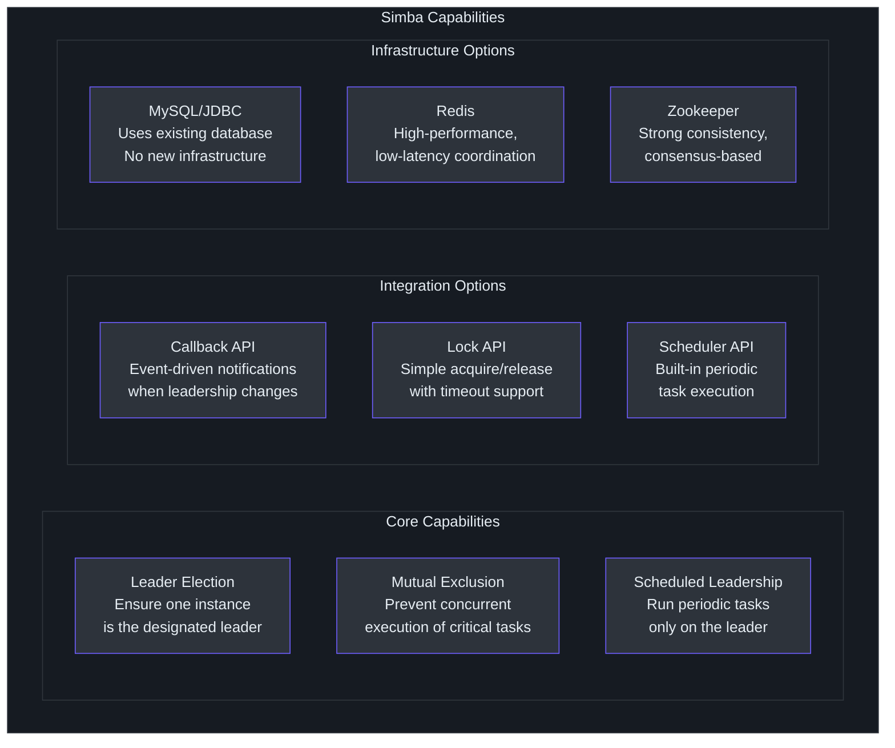
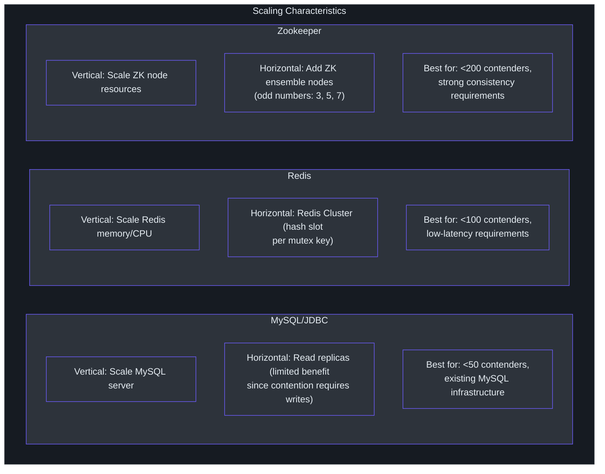
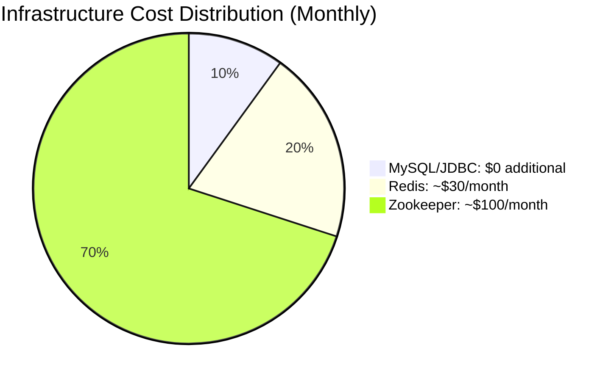
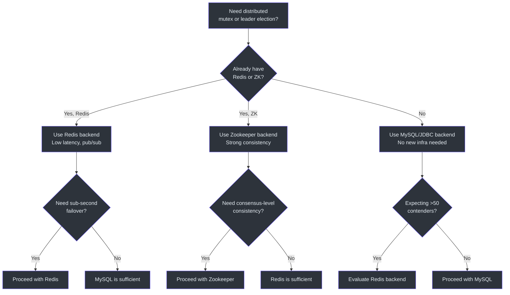
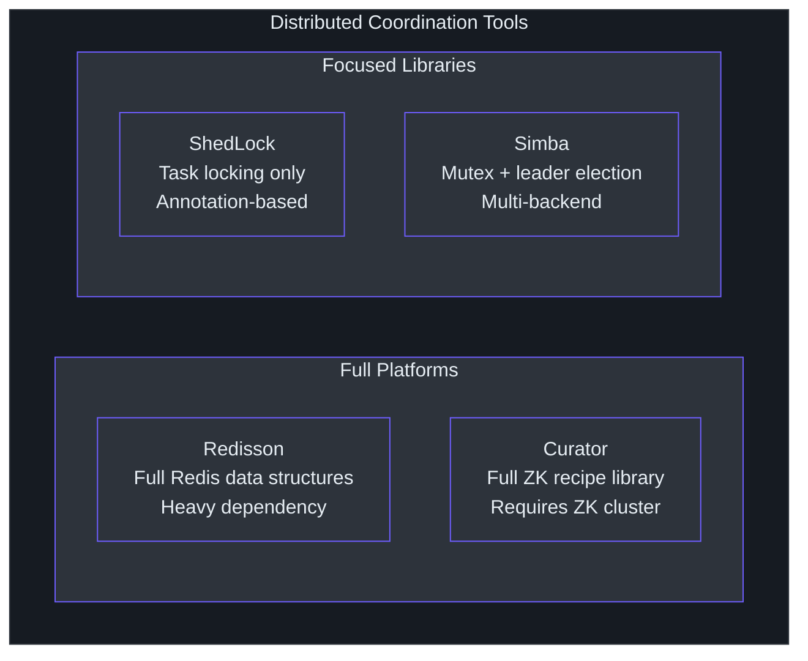

# Executive Guide

This guide provides a leadership-level overview of Simba: what it does, why it matters, what risks it carries, and how to evaluate it as a technology investment. No code snippets are included.

---

## What Simba Does

Simba is a library that ensures **only one instance of a software service performs a specific task at any given time**. In distributed systems where multiple copies of an application run simultaneously, certain operations -- such as sending scheduled reports, processing a batch queue, or coordinating deployments -- must be executed by exactly one instance to avoid duplication, data corruption, or conflicting actions.

Simba solves this by providing a **distributed mutex** (a lock shared across all instances) with three backend storage options: a MySQL database, a Redis cache, or an Apache Zookeeper cluster. Developers integrate Simba into their application, and the library handles the coordination automatically.

### Capability Map

### What Problems It Solves

| Problem | Without Simba | With Simba |
|---|---|---|
| Scheduled batch jobs | All instances run the job simultaneously, causing duplicates and data conflicts | Only the leader instance runs the job |
| Resource cleanup | Multiple instances attempt cleanup concurrently, risking race conditions | One instance holds the lock and performs cleanup exclusively |
| Data migration | Unclear which instance should drive a migration process | Leader election designates exactly one driver |
| External API rate limiting | All instances hit the API independently, risking throttling | Leader batches and throttles external calls |

---

## Risk Assessment

### Single Point of Failure Analysis by Backend

```mermaid
flowchart LR
    subgraph risk["Failure Risk by Backend"]
        style risk fill:#161b22,stroke:#30363d,color:#e6edf3

        subgraph mysql_risk["MySQL/JDBC"]
            style mysql_risk fill:#161b22,stroke:#30363d,color:#e6edf3
            M1["Database goes down"]
            M2["All contenders stop<br>acquiring locks"]
            M3["No split-brain risk"]
            M4["Auto-recovers when<br>DB is restored"]
            M1 --> M2 --> M3 --> M4
        end

        subgraph redis_risk["Redis"]
            style redis_risk fill:#161b22,stroke:#30363d,color:#e6edf3
            R1["Redis goes down"]
            R2["Subscribers lose pub/sub"]
            R3["No split-brain risk"]
            R4["Auto-recovers when<br>Redis is restored"]
            R1 --> R2 --> R3 --> R4
        end

        subgraph zk_risk["Zookeeper"]
            style zk_risk fill:#161b22,stroke:#30363d,color:#e6edf3
            Z1["ZK ensemble loses quorum"]
            Z2["No new leader elected"]
            Z3["No split-brain risk"]
            Z4["Auto-recovers when<br>quorum restored"]
            Z1 --> Z2 --> Z3 --> Z4
        end
    end

    style mysql_risk fill:#2d333b,stroke:#6d5dfc,color:#e6edf3
    style redis_risk fill:#2d333b,stroke:#6d5dfc,color:#e6edf3
    style zk_risk fill:#2d333b,stroke:#6d5dfc,color:#e6edf3
    style M1 fill:#2d333b,stroke:#6d5dfc,color:#e6edf3
    style M2 fill:#2d333b,stroke:#6d5dfc,color:#e6edf3
    style M3 fill:#2d333b,stroke:#6d5dfc,color:#e6edf3
    style M4 fill:#2d333b,stroke:#6d5dfc,color:#e6edf3
    style R1 fill:#2d333b,stroke:#6d5dfc,color:#e6edf3
    style R2 fill:#2d333b,stroke:#6d5dfc,color:#e6edf3
    style R3 fill:#2d333b,stroke:#6d5dfc,color:#e6edf3
    style R4 fill:#2d333b,stroke:#6d5dfc,color:#e6edf3
    style Z1 fill:#2d333b,stroke:#6d5dfc,color:#e6edf3
    style Z2 fill:#2d333b,stroke:#6d5dfc,color:#e6edf3
    style Z3 fill:#2d333b,stroke:#6d5dfc,color:#e6edf3
    style Z4 fill:#2d333b,stroke:#6d5dfc,color:#e6edf3
```

### Risk Matrix

| Risk | Likelihood | Impact | Mitigation |
|---|---|---|---|
| **Storage backend outage** | Medium | High -- no leader elected, tasks pause | Backend-specific HA (MySQL replication, Redis Sentinel/Cluster, ZK ensemble) |
| **Network partition** | Low | Medium -- temporary dual-leader possible within transition window | TTL + transition design limits dual-leader window to transition duration |
| **GC pause on leader** | Medium | Low -- leader misses renewal, leadership transfers | Transition period absorbs GC pauses up to transition duration |
| **Clock skew** | Low | Low -- contention timing slightly off | All timing is relative to a single backend's clock; cross-node clock skew only affects jitter |
| **Library vulnerability** | Low | Medium -- depends on severity | Apache 2.0 license, active maintenance, minimal dependency tree |
| **Backend capacity exhaustion** | Medium | Medium -- contention queries overwhelm storage | Jitter distributes load; connection pooling limits concurrent queries |

### Key Safety Property

Simba's design guarantees **no split-brain under normal operation**. Even if two instances believe they are the leader simultaneously (possible during the transition period), this window is bounded and configurable. The transition period is a deliberate trade-off: it provides stability at the cost of a brief ambiguity window.

---

## Technology Investment Thesis

### Why Invest in Simba

1. **Infrastructure flexibility**: Unlike alternatives locked to a single backend, Simba lets teams choose the storage that matches their existing infrastructure. A team already running MySQL can add distributed locking without deploying Redis or Zookeeper.

2. **Minimal operational footprint**: The library has a small dependency tree. For the MySQL backend, no additional infrastructure is required at all -- the `simba_mutex` table is the only addition to an existing database.

3. **Spring Boot integration**: Auto-configuration reduces integration effort to adding a dependency and setting a few properties.

4. **Proven testing approach**: The TCK (Technology Compatibility Kit) ensures all backends behave identically. Any new backend must pass the same 5 test cases, reducing the risk of behavioral inconsistencies.

5. **Kotlin on JVM**: Runs on the dominant server-side platform (JVM 17) while benefiting from Kotlin's null safety and conciseness.

### Investment Risks

1. **Community size**: Simba is a niche library. The contributor base is smaller than Redisson or ShedLock.
2. **Kotlin adoption**: Teams without Kotlin experience may face a learning curve, though Kotlin interop with Java is seamless.
3. **No built-in monitoring**: The library does not expose metrics (lock acquisition rate, contention frequency, latency). Teams need to add instrumentation.

---

## Scaling Model

### How Each Backend Scales

### Cost Implications

| Backend | Additional Infrastructure Cost | Operational Overhead |
|---|---|---|
| MySQL/JDBC | None (uses existing database) | Low -- one additional table |
| Redis | Redis instance cost (~$15-50/month for small cloud instances) | Low -- standard Redis operations |
| Zookeeper | ZK ensemble (3+ nodes, ~$45-150/month) | High -- requires ZK operational expertise |

---

## Actionable Recommendations

### For Teams Starting with Distributed Locking

1. **Start with the MySQL/JDBC backend**. It requires no new infrastructure and integrates with existing Spring Boot data access patterns.

2. **Use the Scheduler API** for leader-gated periodic tasks. It provides the simplest mental model: one instance runs the task on a schedule, and leadership transfers automatically if that instance goes down.

3. **Set conservative TTL values** (5-10 seconds) initially. Shorter TTLs mean faster failover but more database load. Longer TTLs reduce load but increase failover time.

### For Teams at Scale

1. **Evaluate the Redis backend** if you need sub-second leadership transfer latency and already operate Redis infrastructure.

2. **Monitor your backend storage**. Simba does not emit metrics directly, so ensure your MySQL/Redis/Zookeeper monitoring covers query volume and latency.

3. **Test failure scenarios** in staging: kill the leader instance and measure how quickly a new leader is elected. This validates that your TTL and transition settings are appropriate.

### For Platform Teams

1. **Standardize on one backend** across the organization to reduce operational complexity.

2. **Include Simba in your service template** if your platform uses leader election patterns frequently.

3. **Contribute monitoring hooks** if the library does not meet your observability requirements. The callback API (`onAcquired`/`onReleased`) is the natural integration point for metrics.

---

## Implementation Timeline Estimates

| Phase | Duration | Activities |
|---|---|---|
| **Evaluation** | 1-2 days | Developer reads documentation, identifies backend, creates proof-of-concept |
| **Integration** | 2-5 days | Add dependency, configure backend, write task logic, local testing |
| **Staging validation** | 3-5 days | Multi-instance testing, failover testing, timing tuning |
| **Production rollout** | 1-2 days | Deploy with monitoring, observe leader election behavior |
| **Total** | 1-2 weeks | From evaluation to production |

These estimates assume a Spring Boot application with an existing MySQL or Redis infrastructure. Add 1-2 weeks if Zookeeper infrastructure needs to be provisioned.

## Organizational Impact

### Team Responsibilities

| Team | Responsibility | Time Investment |
|---|---|---|
| **Backend Development** | Integrate Simba into application code, write task logic | 3-5 days per application |
| **Platform/Infrastructure** | Ensure backend infrastructure (MySQL/Redis/ZK) is highly available | Existing HA setup + monitoring |
| **SRE/DevOps** | Monitor leader election in production, handle failover incidents | Initial setup: 1-2 days |
| **Architecture** | Review and approve backend choice, set timing standards | 1-2 hours |

### Skills Required

- **Kotlin or Java proficiency** -- required for integration
- **Distributed systems awareness** -- helpful for understanding failure modes
- **Spring Boot experience** -- simplifies auto-configuration integration
- **Database or Redis operations** -- required if using JDBC or Redis backends

## Cost-Benefit Analysis

### Costs

| Cost Category | Estimate | Notes |
|---|---|---|
| Integration development | 3-5 developer-days | Per application |
| Infrastructure (MySQL backend) | $0 additional | Uses existing database |
| Infrastructure (Redis backend) | $15-50/month | Small Redis instance |
| Infrastructure (Zookeeper backend) | $45-150/month | 3-node ensemble |
| Ongoing maintenance | < 1 day/quarter | Library updates, timing tuning |
| Monitoring setup | 1-2 developer-days | One-time per application |

### Benefits

| Benefit | Impact | Without Simba |
|---|---|---|
| Eliminate duplicate task execution | Prevents data corruption, duplicate sends | Manual coordination or hope-for-the-best |
| Automatic failover | Seconds vs. manual intervention | On-call engineer must manually restart |
| Reduced operational incidents | Fewer "multiple instances ran the same task" bugs | Common source of production issues |
| Faster development | Pre-built leader election vs. custom implementation | 2-4 weeks to build from scratch |
| Backend flexibility | Choose infrastructure that fits | Locked into one approach |

### ROI Calculation

If a team would otherwise spend 2-4 weeks building a custom leader election solution (conservative estimate based on typical distributed systems development), Simba provides an immediate savings of 8-16 developer-days. The ongoing cost is near-zero since the library requires no separate infrastructure (with MySQL backend).

## Risk Mitigation Strategies

### For Storage Backend Failure

| Backend | HA Strategy | Failover Time |
|---|---|---|
| MySQL | Primary-replica replication with automatic failover (e.g., RDS Multi-AZ) | 30-60 seconds |
| Redis | Redis Sentinel or Redis Cluster | 10-30 seconds |
| Zookeeper | 3 or 5 node ensemble with automatic leader election | 2-10 seconds |

### For Library Issues

- **Pin the version**: Use a specific version (e.g., `3.0.2`) rather than a dynamic version range
- **Monitor the GitHub repository**: Watch for security advisories and breaking changes
- **Have a rollback plan**: Simba is a library, not a service -- rolling back means reverting a code deployment

### For Application Misconfiguration

- **Use staging environments**: Test failover scenarios before production
- **Set conservative TTLs**: Start with 5-10 second TTL values and tune down only if needed
- **Enable debug logging initially**: Switch to INFO level after confirming correct behavior

## Quick Decision Guide

## Competitive Positioning

### Where Simba Fits in the Market

Simba occupies a specific niche: it is a **focused library** (not a full platform) that provides **backend flexibility** (not locked to one storage). This makes it ideal for teams that need leader election without adopting a new infrastructure dependency.

### When to Choose Simba vs. Alternatives

| Situation | Recommended Tool |
|---|---|
| Need leader election + already have MySQL | **Simba** (no new infra) |
| Need leader election + already have Redis | **Simba** or Redisson (Simba is lighter) |
| Need full distributed data structures on Redis | Redisson |
| Need annotation-based task locking only | ShedLock |
| Already committed to Zookeeper ecosystem | Curator (deeper ZK integration) |
| Need multi-backend flexibility | **Simba** (only option) |

## Compliance and Governance

| Aspect | Status |
|---|---|
| **License** | Apache License 2.0 -- permissive, commercial use allowed |
| **Dependencies** | Minimal; core has no Spring dependency |
| **Vulnerability management** | Active Renovate bot for dependency updates |
| **Code quality** | Detekt static analysis, JaCoCo coverage reporting |
| **Testing** | TCK-driven with 5 mandatory test cases per backend |
| **Versioning** | Semantic versioning (current: 3.0.2) |

## Summary

Simba is a lightweight, infrastructure-flexible distributed mutex library for JVM applications. Its primary value proposition is **choice of backend** -- teams can use their existing MySQL, Redis, or Zookeeper infrastructure without deploying new systems. The library is well-tested (TCK-driven), has a small dependency footprint, and integrates cleanly with Spring Boot. The main risks are its niche community and lack of built-in monitoring, both of which are manageable for teams with existing observability infrastructure.
