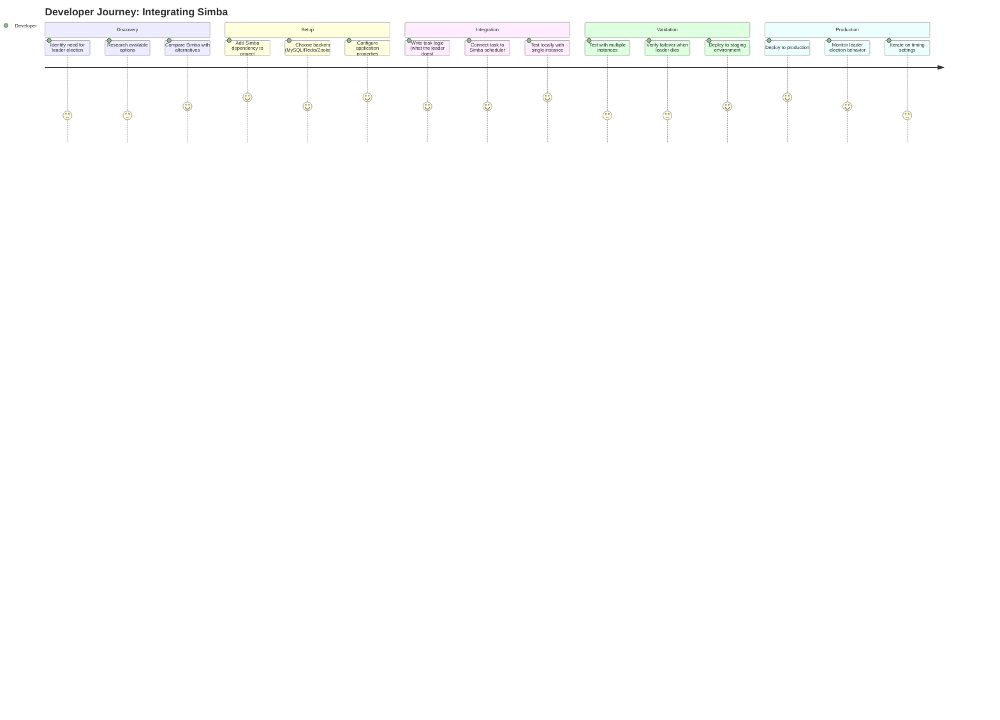
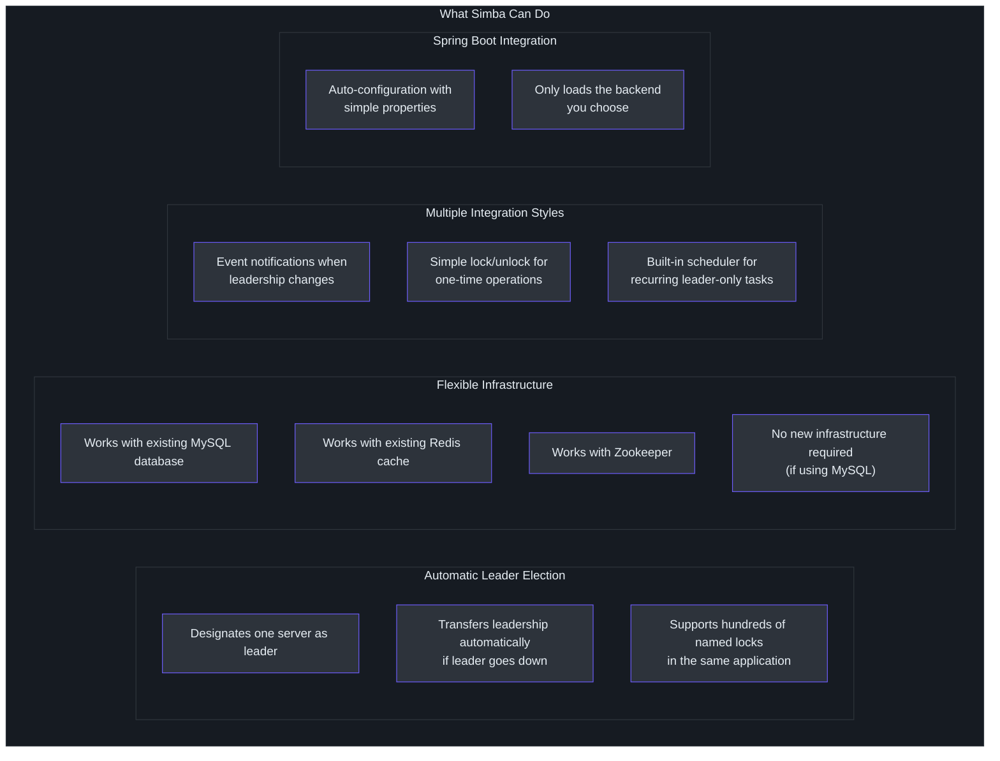
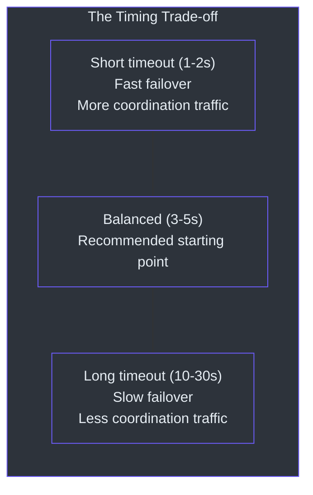
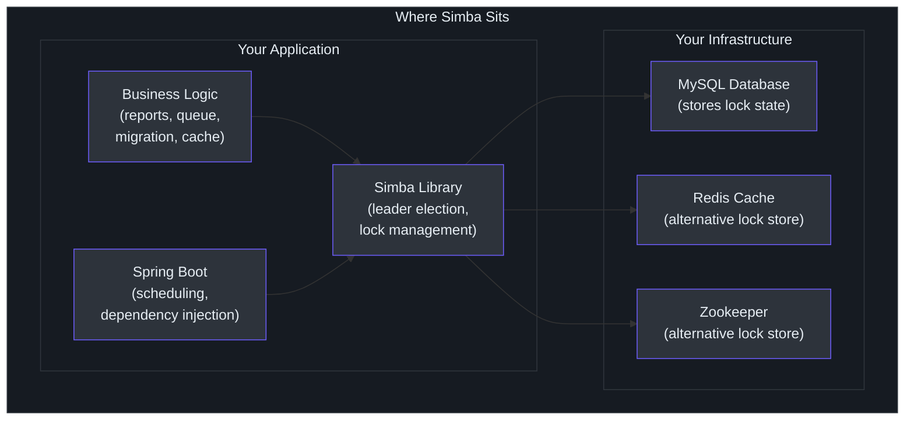
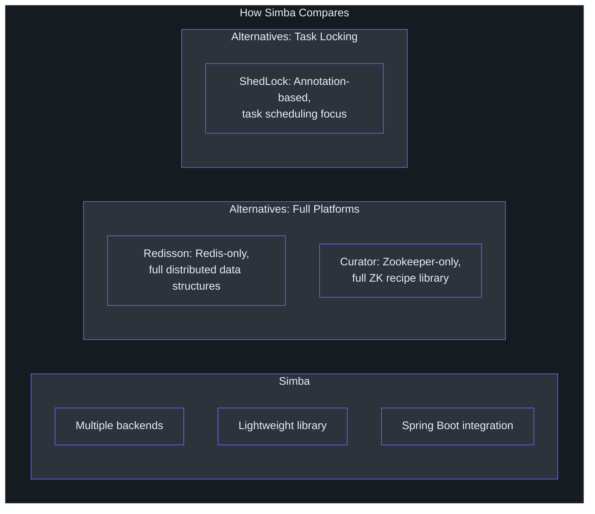

# Product Manager Guide

This guide explains Simba in non-technical terms. It covers what problem the product solves, who uses it, what it can and cannot do, and answers common questions.

---

## What Problem Does Simba Solve?

Imagine your company runs a web application on multiple servers (say, 5 copies of the same application, all running at the same time to handle user traffic). Sometimes, you need a task to be performed by **only one** of those servers. For example:

- **Sending a daily report**: You only want one server to send it, not all five (which would send five copies to every recipient).
- **Processing a queue of work items**: If multiple servers process the same item, you get duplicate results or conflicting writes.
- **Running a cleanup routine**: If multiple servers try to clean up the same data simultaneously, they might interfere with each other.

Simba ensures that **exactly one server** is the designated "leader" for a given task. If that server goes down, another server automatically takes over.

Think of it like a "talking stick" in a meeting -- only the person holding the stick can speak. When they are done (or leave the room), they pass it to someone else.

---

## Who Uses Simba?

**Primary users**: Software developers and platform engineers who build and operate distributed applications.

**Typical roles involved in adoption**:

| Role | Involvement |
|---|---|
| Backend Developer | Integrates Simba into the application code |
| Platform Engineer | Ensures the supporting infrastructure (database, Redis, or Zookeeper) is available |
| DevOps / SRE | Monitors the system and handles failover scenarios |
| Engineering Manager | Approves the technology choice and integration timeline |
| Product Manager | Understands the capabilities for roadmap planning and feature scoping |

---

## User Journey: A Developer Integrating Simba

### Journey Map

### Integration Steps (Plain Language)

1. **Add the library**: The developer adds Simba as a dependency to their project, like adding a chapter to a book.

2. **Choose where to store the "talking stick"**: Simba needs a shared place to track who is the current leader. The developer picks one:
   - Their existing database (MySQL) -- no new systems needed
   - Their existing cache (Redis) -- fast, low delay
   - A coordination service (Zookeeper) -- very reliable

3. **Write the task**: The developer writes what should happen when their server becomes the leader (e.g., "send the daily report").

4. **Let Simba handle the rest**: The library automatically coordinates between all servers, ensures only one is the leader, and transfers leadership if a server goes down.

---

## Feature Capability Map

### Feature Detail

| Feature | What It Means | When You Would Use It |
|---|---|---|
| **Leader Election** | Only one server is the designated "leader" at any time | When a task must run on exactly one server |
| **Automatic Failover** | If the leader stops responding, another server takes over within seconds | When you cannot afford downtime for the leader task |
| **Multiple Locks** | You can have many independent locks in the same application (e.g., one for reports, one for cleanup, one for data sync) | When different features need independent leadership |
| **MySQL Backend** | Uses your existing database, no new systems to deploy | When you want the simplest setup |
| **Redis Backend** | Uses your existing cache for faster coordination | When you need sub-second leadership transfer |
| **Zookeeper Backend** | Uses a dedicated coordination service for the strongest guarantees | When you need the highest reliability |
| **Scheduler Integration** | The library runs your task on a schedule, but only on the leader server | When you have periodic tasks (every 30 seconds, every hour, etc.) |
| **Spring Boot Support** | One-line configuration to enable | When your application uses Spring Boot |
| **Testing Kit** | Built-in tests ensure all backends behave identically | When you want confidence that switching backends does not break anything |

---

## When NOT to Use Simba

Simba is not the right tool for every situation. Here are cases where a different approach would be better:

| Situation | Why Simba Is Not Ideal | Better Alternative |
|---|---|---|
| **You need a full job scheduler** (retry logic, job history, monitoring dashboard) | Simba only ensures one instance runs the task; it does not manage the job lifecycle | Use a dedicated job scheduler (Quartz, Spring Batch, Apache Airflow) and optionally add Simba for leader election |
| **All your services are stateless and idempotent** | If running a task twice has no negative effect (e.g., checking for new emails), coordination adds unnecessary complexity | Simply let all instances run the task |
| **You are not on the JVM** | Simba is a JVM library (Java/Kotlin) | Use a coordination service with language-agnostic APIs (etcd, Consul) or a language-specific library |
| **You need sub-millisecond coordination** | Simba's fastest backend (Redis) has coordination latency in the millisecond range | Use application-level concurrency control within a single process |
| **You need distributed transactions** across multiple systems | Simba provides mutual exclusion, not transaction coordination | Use a distributed transaction framework (Seata, Axon) |

---

## Known Limitations

### What Simba Does NOT Do

| Limitation | Explanation | Workaround |
|---|---|---|
| **No built-in monitoring dashboard** | Simba does not provide a web UI or metrics endpoint to see which server is the leader | Developers can add logging or metrics through the callback API |
| **No automatic backend selection** | The developer must choose which backend (MySQL, Redis, or Zookeeper) to use | The decision guide helps choose based on existing infrastructure |
| **No cross-region coordination** | Simba assumes all servers can reach the same backend (database, Redis, or Zookeeper) | For cross-region, a centralized coordination service with multi-region replication is needed |
| **No encryption of lock data** | Lock ownership information is stored in the backend as-is | Standard infrastructure security (encrypted connections, access controls) applies |
| **No priority-based election** | All contenders have equal priority; the first to acquire the lock wins | Custom priority logic must be implemented by the developer in the callback |
| **JVM only** | Simba runs on the Java Virtual Machine (Java or Kotlin applications) | Non-JVM services need a different coordination solution |
| **Not a full job scheduler** | Simba ensures only the leader runs a task, but does not manage task definitions, retries, or job history | Use alongside a job scheduler (Quartz, Spring Scheduler) for full job management |

### Timing Trade-offs

The time it takes to detect that a leader has failed and transfer leadership to another server is configurable. Faster detection means less downtime but more communication between servers. Slower detection reduces traffic but increases the window where no leader exists.

---

## FAQ

### General Questions

**Q: Is Simba a standalone product I deploy, or a library my developers add to their code?**
A: It is a library. Developers add it to their application code, like adding any other building block. There is no separate server or service to deploy.

**Q: Do I need to buy or license Simba?**
A: No. Simba is open-source software under the Apache License 2.0. You can use it, modify it, and deploy it in commercial products at no cost.

**Q: How many servers can use Simba at the same time?**
A: It depends on the backend. With MySQL, up to about 50 servers can compete for the same lock efficiently. With Redis, up to about 100. With Zookeeper, up to about 200. These limits are for a single lock; you can have many independent locks.

**Q: What happens if the database/Redis/Zookeeper goes down?**
A: No new leader can be elected until the backend is restored. The current leader continues its work (it does not need the backend to keep running its task). When the backend comes back, leadership resumes normally. There is no data corruption or split-brain risk.

**Q: Can two servers accidentally become the leader at the same time?**
A: There is a brief, configurable window (called the "transition period," typically 1-5 seconds) where this is theoretically possible. This is by design -- it provides stability so the current leader does not lose its position due to minor delays. For most business tasks, this brief overlap is acceptable because the task results are idempotent (running it twice produces the same result).

### Integration Questions

**Q: How long does it take to integrate Simba?**
A: For a Spring Boot application using MySQL, a developer can integrate Simba in less than an hour. The process involves adding a dependency, setting configuration properties, and writing 10-20 lines of code.

**Q: Which backend should we use?**
A: If you already have MySQL, start there -- no new infrastructure needed. If you need faster failover (sub-second) and already have Redis, use the Redis backend. If you need the strongest consistency guarantees and already operate Zookeeper, use that.

**Q: Does Simba work with our existing monitoring tools?**
A: Simba does not emit metrics directly, but developers can hook into the leadership change callbacks to send events to your monitoring system (Datadog, Prometheus, etc.).

**Q: Can we use Simba for a task that runs every 5 minutes?**
A: Yes. The built-in scheduler API is designed exactly for this. Configure the schedule interval, and Simba ensures only the leader server runs the task.

### Operational Questions

**Q: What happens during a deployment (rolling restart)?**
A: During a rolling restart, instances are stopped and started one by one. When a leader instance stops, Simba automatically transfers leadership to another running instance. The new instance of the restarted server will compete for leadership like any other contender.

**Q: How do we test Simba before going to production?**
A: Run multiple instances of your application locally or in a staging environment. Kill the leader instance and verify that another instance takes over. The library includes a built-in test kit (TCK) that developers run to verify their backend configuration.

**Q: What is the ongoing maintenance burden?**
A: Minimal. Simba is a library with no separate infrastructure to maintain (if using MySQL/Redis backends). Keep the library version updated through standard dependency management.

---

## Scenarios and Use Cases

### Scenario 1: Scheduled Report Sending

**Problem**: Your application sends a daily sales report to the management team every morning at 9 AM. You run 4 instances of the application for load balancing. Without coordination, all 4 instances send the report, so management receives 4 copies.

**With Simba**: One instance is designated the leader. Only that instance sends the report. If the leader instance goes down (e.g., during a deployment), another instance automatically becomes the leader and sends the next report.

**Integration effort**: A developer adds Simba and writes the report-sending task connected to the scheduler. Estimated time: half a day.

### Scenario 2: Queue Processing Deduplication

**Problem**: Your application processes items from a work queue (e.g., image resizing, email sending). Multiple instances pull items from the queue simultaneously. Sometimes two instances process the same item, causing duplicate emails or wasted compute.

**With Simba**: Use Simba to ensure only one instance processes items at a time. The leader instance processes the queue; other instances stand by. When the leader goes down, another takes over and resumes processing.

**Alternative approach**: If queue-level deduplication is already handled by the queue system (e.g., SQS visibility timeout), Simba may not be needed for this specific use case. Evaluate based on your queue's guarantees.

### Scenario 3: Database Migration Coordination

**Problem**: When deploying a new version of your application that includes a database migration, you need exactly one instance to run the migration before other instances start serving traffic.

**With Simba**: The first instance to start becomes the leader, runs the migration, and other instances wait until the migration is complete. This eliminates the race condition of multiple instances attempting the same migration.

### Scenario 4: Cache Warming

**Problem**: Your application needs to pre-load a cache (e.g., configuration data, reference data) on startup. If all instances do this simultaneously, they overwhelm the source system.

**With Simba**: One instance (the leader) warms the cache. Other instances either wait or read from the already-warmed cache. This reduces load on the source system by a factor of N (where N is the number of instances).

### Scenario 5: External API Rate Limiting

**Problem**: Your application calls an external API that has a rate limit (e.g., 100 requests per minute). With 5 instances, each independently calling the API, you may exceed the limit.

**With Simba**: The leader instance acts as a gateway for external API calls, batching and throttling requests across all instances. This provides centralized rate control.

---

## How Simba Fits Into Your Tech Stack

Simba sits inside your application as a library. It does not require a separate deployment, a separate server, or a separate team to operate. It uses your existing database or cache infrastructure to coordinate between instances.

---

## Success Metrics

When evaluating whether Simba is working correctly in your system, look for these indicators:

| Metric | What It Means | How to Measure |
|---|---|---|
| **Zero duplicate task executions** | Only one instance runs leader-only tasks | Check task logs for single execution per schedule |
| **Fast failover** | When the leader goes down, another takes over quickly | Time between leader failure and new leader task execution |
| **No split-brain incidents** | Two instances never both believe they are the leader | Monitor for duplicate task outputs |
| **Low infrastructure overhead** | Simba does not add significant load to your database/cache | Monitor database query volume and Redis memory |

---

## Comparison Summary

| Dimension | Simba | Redisson | Curator | ShedLock |
|---|---|---|---|---|
| Infrastructure needed | Your choice of MySQL, Redis, or ZK | Redis only | Zookeeper only | MySQL, Redis, Mongo, or ZK |
| Primary use case | Leader election and distributed mutex | Full distributed data structures | Zookeeper recipes | Scheduled task locking |
| Integration style | Library with callback and scheduler APIs | Library with data structure APIs | Library with recipe APIs | Annotation-based |
| Operational cost | Low (especially with MySQL) | Low | High (ZK ensemble) | Low |
| Best for | Teams wanting backend flexibility | Teams already committed to Redis | Teams already committed to ZK | Teams wanting simple task locking |

---

## Getting Started Checklist

If your team is evaluating Simba for a project, follow these steps:

- [ ] **Identify the need**: Which specific task requires only-one-instance execution?
- [ ] **Check infrastructure**: Do you already have MySQL, Redis, or Zookeeper?
- [ ] **Read the [Contributor Guide](./contributor.md)**: Share with the developer who will do the integration
- [ ] **Prototype**: Build a proof-of-concept on a non-critical task (1-2 days)
- [ ] **Test failover**: Kill the leader instance in staging and verify another takes over
- [ ] **Set monitoring**: Add logging around leadership changes (onAcquired/onReleased events)
- [ ] **Deploy to production**: Start with one task, expand after validation

## Glossary (Non-Technical)

| Term | Plain Language |
|---|---|
| **Distributed mutex** | A shared lock that multiple servers can use to coordinate who does a task |
| **Leader election** | The process of choosing one server to be in charge of a specific task |
| **Failover** | When the current leader stops working, another server automatically takes over |
| **TTL (Time-to-live)** | How long a server's claim to leadership lasts before it must renew |
| **Transition period** | A grace period that prevents leadership from changing too abruptly |
| **Backend** | The storage system (MySQL, Redis, or Zookeeper) that Simba uses to track who is the leader |
| **Contention** | Multiple servers competing to become the leader |
| **Callback** | A notification sent to your code when a specific event happens (e.g., "you are now the leader") |
| **RAII** | A pattern where a resource (like a lock) is automatically released when you are done with it |
| **Spring Boot** | A popular framework for building Java/Kotlin web applications |

## Next Steps

If your team is evaluating Simba for a project:

1. **Have a developer read the [Contributor Guide](./contributor.md)** to understand the technical details
2. **Identify which backend** matches your existing infrastructure
3. **Start with a proof-of-concept** on a single non-critical scheduled task
4. **Review the [Staff Engineer Guide](./staff-engineer.md)** for architectural deep-dive and risk analysis
