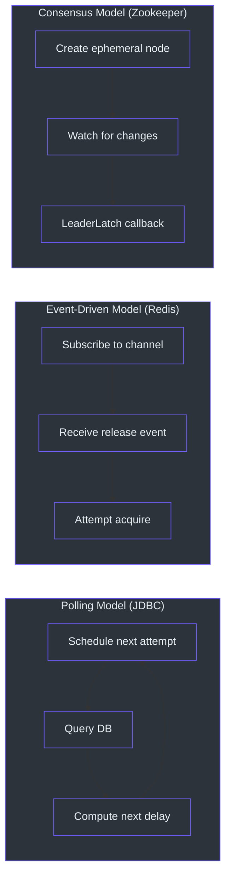
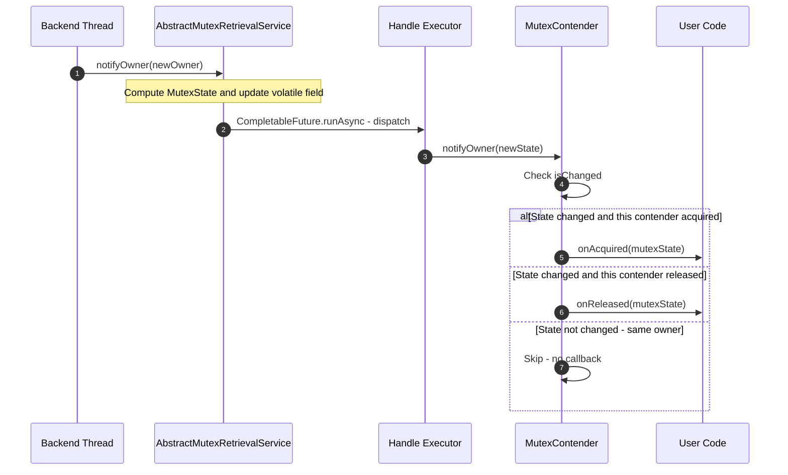

# Staff Engineer Guide

This guide provides a dense, architectural-level analysis of Simba. It assumes strong familiarity with distributed systems, JVM concurrency, and storage engines. Code is presented as pseudocode where helpful; refer to source for exact implementation.

---

## The Core Insight

Simba treats a distributed mutex as **a service with pluggable storage**. The invariant is simple: for a given mutex name, at most one contender holds ownership at any point in time. The library provides three implementations that enforce this invariant using fundamentally different storage primitives:

| Backend | Storage Primitive | Consistency Model |
|---|---|---|
| JDBC | Relational row with optimistic locking (`UPDATE ... WHERE version = ?`) | Linearizable via serializable DB transaction |
| Redis | Atomic `SET NX PX` + Lua scripts | Single-threaded Redis execution guarantees atomicity |
| Zookeeper | Ephemeral sequential znodes via `LeaderLatch` | ZAB consensus protocol |

The insight is that the **protocol** (TTL + transition + jitter) is identical across all three -- only the **storage binding** changes.

---

## Design Tradeoff Analysis

### Polling vs. Event-Driven Contention



| Dimension | Polling (JDBC) | Event-Driven (Redis) | Consensus (Zookeeper) |
|---|---|---|---|
| **Latency to acquire after release** | Up to `transition` duration | Sub-millisecond (pub/sub push) | Sub-second (ZK watch) |
| **Database load** | O(contenders) queries per cycle | O(1) Lua per attempt | O(1) ZK ops per cycle |
| **Failure mode** | Silent (just retries next cycle) | Pub/sub message loss means delayed re-acquisition | Session expiry triggers immediate leadership change |
| **Network overhead** | Constant (polling interval) | Bursty (pub/sub + Lua) | Constant (ZK heartbeat) |
| **Operational complexity** | Low (just MySQL) | Medium (Redis + pub/sub) | High (ZK ensemble) |

### Optimistic vs. Pessimistic Locking (JDBC)

The JDBC backend uses **optimistic locking** via a `version` column in `simba_mutex`. The core SQL operation:

```
UPDATE simba_mutex
SET owner_id = ?, acquired_at = ?, ttl_at = ?, transition_at = ?, version = version + 1
WHERE mutex = ? AND (version = ? OR transition_at < ?)
```

This means:
- No row-level locks are held during contention
- Multiple contenders can attempt simultaneously; exactly one wins the `UPDATE`
- Losers simply see 0 rows updated and schedule their next attempt
- The `transition_at < ?` condition allows takeover when the transition period has expired

**Alternative considered**: Pessimistic locking (`SELECT ... FOR UPDATE`). Rejected because it holds database locks during the full contention cycle, reducing throughput and risking deadlocks under high contention.

### TTL + Transition Model

The dual-timestamp model (`ttlAt` + `transitionAt`) is Simba's key design innovation:

```
timeline: ----[acquired]----[ttlAt]----[transitionAt]----
                      |          |              |
                      |   TTL expires    Transition expires
                      |          |              |
                Owner can   Owner can      Any contender
                use lock    still renew     can take over
```

- **TTL period** (`acquiredAt` to `ttlAt`): The owner has exclusive use of the lock. No other contender should attempt acquisition.
- **Transition period** (`ttlAt` to `transitionAt`): The owner can still renew (via `guard`), but its claim is weakening. Other contenders begin timing their attempts.
- **Post-transition** (after `transitionAt`): The lock is up for grabs. Contenders with jitter near `transitionAt` compete.

**Why not a single TTL?** With only TTL, there is a race condition: the owner's renewal might arrive milliseconds after expiry, causing a leadership gap. The transition period absorbs this by giving the owner a grace window. This is analogous to a lease with a renewal grace period in systems like Chubby.

### Jitter Strategy

[`ContendPeriod.nextContenderDelay()`](https://github.com/Ahoo-Wang/Simba/blob/main/simba-core/src/main/kotlin/me/ahoo/simba/core/ContendPeriod.kt) adds random jitter in the range [-200ms, +1000ms] to the scheduled attempt time:

```
delay = (transitionAt - now) + random(-200, 1000)
```

This serves two purposes:
1. **Thundering herd prevention**: Without jitter, all contenders would attempt at exactly `transitionAt`, causing a spike in database/Redis load
2. **Natural load distribution**: The random spread means different contenders attempt at slightly different times, increasing the probability that one succeeds on the first try

---

## The `MutexOwner` Lifecycle in Detail

The [`MutexOwner`](https://github.com/Ahoo-Wang/Simba/blob/main/simba-core/src/main/kotlin/me/ahoo/simba/core/MutexOwner.kt) value object tracks four timestamps:

```
acquiredAt ---- ttlAt ---- transitionAt ---- now (expired)
     |             |              |
     |   "I own this"    "I still have       "Up for grabs"
     |                   grace time"
```

Each backend constructs `MutexOwner` differently:

**JDBC**: The repository returns a `MutexOwnerEntity` from the database row, which is mapped to `MutexOwner(ownerId, acquiredAt, ttlAt, transitionAt)`.

**Redis**: The Lua script returns `{ownerId}@@{transitionAt}`. The service computes `ttlAt = transitionAt - transition` and `acquiredAt = ttlAt - ttl`.

**Zookeeper**: Leadership events produce a simple `MutexOwner(contenderId)` with default `Long.MAX_VALUE` for all timestamps (ZK session-based expiry replaces TTL).

### How the Transition Period Prevents Split-Brain

Without the transition period, the following race condition is possible:

```
T=0:     Owner A holds lock (TTL=2s, no transition)
T=2.000: Lock expires
T=2.001: Contender B acquires lock
T=2.002: Owner A's renewal arrives (but it's too late -- B is now owner)
         A's callback fires with the old state, A believes it is still owner
T=2.003: Both A and B believe they are the owner (split-brain!)
```

With the transition period (TTL=2s, transition=5s):

```
T=0:     Owner A holds lock
T=2.000: TTL expires, but transition period begins
T=2.001: Owner A's renewal arrives -- accepted because transitionAt=7 > 2.001
T=2.002: A's ownership is renewed, no split-brain
```

The transition period gives the existing owner a window to renew even after TTL expiry. Contenders only attempt acquisition after `transitionAt`, by which time the owner has either renewed or genuinely failed.

---

## System Architecture (Pseudocode)

### Class Hierarchy

```
MutexRetriever (interface)
  mutex: String
  notifyOwner(MutexState)

MutexContender (interface extends MutexRetriever)
  contenderId: String
  onAcquired(MutexState)    -- callback
  onReleased(MutexState)    -- callback

MutexRetrievalService (interface extends AutoCloseable)
  status: Status {INITIAL, STARTING, RUNNING, STOPPING}
  retriever: MutexRetriever
  mutexState: MutexState
  start(), stop()

MutexContendService (interface extends MutexRetrievalService)
  contender: MutexContender
  isOwner: Boolean

MutexContendServiceFactory (interface)
  createMutexContendService(MutexContender) -> MutexContendService
```

### State Machine

```
INITIAL --start()--> STARTING
  ^                     |
  |                     | startRetrieval() succeeds
  |                     v
  +--stop()-------- RUNNING
  ^                     |
  |                     | stop()
  |                     v
  +--cleanup()---- STOPPING
```

The status transitions use `AtomicReferenceFieldUpdater.compareAndSet()` to prevent concurrent transitions. This means `start()` from `INITIAL` and `stop()` from `RUNNING` are the only valid paths.

### Notification Pipeline

```
Backend detects ownership change
  -> calls notifyOwner(MutexOwner)
    -> AbstractMutexRetrievalService.safeNotifyOwner(newOwner)
      -> compute MutexState(afterOwner, newOwner)
      -> update mutexState field
      -> CompletableFuture.runAsync({ retriever.notifyOwner(state) }, handleExecutor)
        -> MutexContender.notifyOwner(state)
          -> if state.isAcquired(myId): onAcquired(state)
          -> if state.isReleased(myId): onReleased(state)
```

The notification is dispatched asynchronously on the `handleExecutor`. This prevents backend threads from being blocked by slow callback implementations.

---

## Extension Points

### Adding a New Backend

Implement three things:

**1. MutexContendService subclass**

```kotlin
class MyBackendMutexContendService(
    contender: MutexContender,
    handleExecutor: Executor,
    /* backend-specific dependencies */
) : AbstractMutexContendService(contender, handleExecutor) {

    override fun startContend() {
        // Subscribe to lock changes in your backend
        // When ownership changes: notifyOwner(newMutexOwner)
        // or notifyOwner(MutexOwner.NONE)
    }

    override fun stopContend() {
        // Release the lock
        // Unsubscribe from changes
        // notifyOwner(MutexOwner.NONE)
    }
}
```

**2. MutexContendServiceFactory**

```kotlin
class MyBackendMutexContendServiceFactory(
    /* backend dependencies */
    private val handleExecutor: Executor
) : MutexContendServiceFactory {
    override fun createMutexContendService(
        mutexContender: MutexContender
    ): MutexContendService {
        return MyBackendMutexContendService(
            mutexContender, handleExecutor, /* ... */
        )
    }
}
```

**3. TCK Compliance Test**

```kotlin
@TestInstance(TestInstance.Lifecycle.PER_CLASS)
class MyBackendTest : MutexContendServiceSpec() {
    override lateinit var mutexContendServiceFactory: MutexContendServiceFactory

    @BeforeAll
    fun setup() {
        mutexContendServiceFactory = MyBackendMutexContendServiceFactory(/* ... */)
    }
}
```

All 5 TCK test cases must pass: `start()`, `restart()`, `guard()`, `multiContend()`, `schedule()`.

### Adding Spring Boot Auto-Configuration

Create three files in `simba-spring-boot-starter`:

1. `MyBackendProperties` -- `@ConfigurationProperties("simba.my-backend")`
2. `ConditionalOnSimbaMyBackendEnabled` -- composite conditional annotation
3. `SimbaMyBackendAutoConfiguration` -- `@AutoConfiguration` class that registers the factory bean

Register the auto-configuration in `META-INF/spring/org.springframework.boot.autoconfigure.AutoConfiguration.imports`.

### Custom ContenderIdGenerator

The default `HostContenderIdGenerator` produces IDs in the format `{counter}:{processId}@{hostAddress}`. To use UUID-based IDs:

```kotlin
abstract class MyContender(mutex: String) : AbstractMutexContender(
    mutex,
    ContenderIdGenerator.UUID.generate()
)
```

Or implement a custom generator:

```kotlin
val customGenerator = ContenderIdGenerator { "my-prefix-${System.nanoTime()}" }
```

---

## Decision Log

### Why Kotlin (Not Java)?

1. **Null safety**: The type system distinguishes nullable and non-nullable references at compile time. Critical for a distributed systems library where null states indicate errors.
2. **Data classes**: Value objects like `MutexOwner` and `MutexState` get `equals`/`hashCode`/`toString` for free.
3. **Extension functions**: The fluent-assert test library provides `.assert()` which would be verbose in Java.
4. **Conciseness**: Typical classes are 30-50% shorter than Java equivalents without sacrificing readability.
5. **JVM interop**: Full compatibility with Java libraries (Curator, Spring, HikariCP).

**Trade-off**: Smaller talent pool than Java. Mitigated by Kotlin's Java interop -- contributors can read and understand most code with Java knowledge.

### Why Template Method (Not Strategy)?

`AbstractMutexContendService` uses the template method pattern (`startContend()`/`stopContend()` abstract methods) rather than a strategy pattern (injecting a `ContentionStrategy` interface).

**Reasons**:
1. The skeleton algorithm (status management, owner reset, notification dispatch) is identical across backends
2. Backend implementations need access to protected state (`contender`, `status`, `notifyOwner()`)
3. Template method avoids the overhead of an additional strategy object per service instance
4. The class hierarchy is shallow (3 levels max) and stable -- no need for runtime strategy swapping

### Why TTL + Transition (Not Single TTL)?

A single TTL creates a race condition between the owner's renewal and a contender's acquisition. The transition period provides a grace window where:
- The owner can still renew (preventing unnecessary leadership changes)
- Contenders can time their attempts (preventing thundering herd)
- The system absorbs network jitter and GC pauses

### Why No Coroutines?

1. `java.util.concurrent` is sufficient for Simba's concurrency patterns (periodic scheduling, async callbacks, thread parking)
2. No structured concurrency requirement -- each mutex operates independently
3. Avoids the complexity of coroutine scope management in library code
4. Users may or may not use coroutines; the library must work in both contexts

### Why Optimistic Locking for JDBC?

Pessimistic locking (`SELECT FOR UPDATE`) would hold database locks during the entire contention cycle, causing:
- Lock convoy effects under high contention
- Potential deadlocks if multiple mutexes are contended simultaneously
- Reduced throughput due to lock wait times

Optimistic locking lets all contenders attempt simultaneously; the database's version check ensures exactly one winner without holding any locks between cycles.

---

## Testing Strategy Analysis

### Why a TCK Instead of Per-Backend Mocks

The TCK approach (shared abstract test class, per-backend concrete tests) has specific advantages over mocking backend dependencies:

1. **Behavioral contract**: The 5 test cases define the exact behavioral contract of a `MutexContendService`. Any backend that passes all 5 tests is guaranteed to be interchangeable with any other.

2. **Real infrastructure testing**: Mocks cannot capture the timing, concurrency, and failure characteristics of real databases, Redis servers, or Zookeeper ensembles. The TCK tests run against real (or embedded) infrastructure.

3. **Regression prevention**: If a backend change breaks the contention protocol, the TCK catches it immediately. Without the TCK, subtle timing bugs might only appear in production.

### The 5 Test Cases as a Behavioral Specification

| Test | Behavioral Requirement |
|---|---|
| `start()` | A service transitions from idle to active, acquires ownership, and cleanly releases on stop. |
| `restart()` | A service can be stopped and restarted, re-acquiring ownership. The status machine correctly resets to INITIAL. |
| `guard()` | An owner that does not explicitly release continues to hold the lock through multiple TTL cycles. This proves the renewal mechanism works. |
| `multiContend()` | With N contenders, exactly one holds the lock at any time. This is verified by an atomic counter that must equal 1 during acquisition and 0 during release. The test runs for 30 seconds to cover many cycles. |
| `schedule()` | The `AbstractScheduler` correctly acquires leadership and calls `work()`. The scheduler lifecycle (start/stop) works through the underlying contention service. |

### Why `multiContend` Runs for 30 Seconds

The 30-second duration is not arbitrary. With a 2-second TTL (used in most backend tests), this covers approximately 15 contention cycles. This is enough to exercise:
- Multiple ownership transitions
- Random jitter distribution (different contenders winning at different times)
- Guard/renewal cycles
- The case where a contender's scheduled attempt arrives just as the lock expires

Shorter durations (e.g., 5 seconds) would catch obvious bugs but miss timing-sensitive race conditions that only manifest after several cycles.

---

## Extension Point: Custom Scheduler Strategies

`AbstractScheduler` supports two strategies via [`ScheduleConfig.Strategy`](https://github.com/Ahoo-Wang/Simba/blob/main/simba-core/src/main/kotlin/me/ahoo/simba/schedule/ScheduleConfig.kt):

- **`FIXED_RATE`**: `scheduleAtFixedRate()` -- the next work invocation starts at a fixed interval from the previous start. If work takes longer than the period, invocations pile up.
- **`FIXED_DELAY`**: `scheduleWithFixedDelay()` -- the next work invocation starts a fixed delay after the previous one completes. No piling up.

Choose `FIXED_RATE` when the work must run at consistent wall-clock intervals (e.g., every 30 seconds regardless of how long it takes). Choose `FIXED_DELAY` when you want to guarantee a minimum gap between invocations.

### Custom Work Contender Behavior

The `WorkContender` inner class in `AbstractScheduler` creates a `ScheduledThreadPoolExecutor` with a single thread. On `onAcquired`, it schedules the work. On `onReleased`, it cancels the scheduled future. This means:

- Work only runs when this instance is the leader
- When leadership is lost, the next scheduled work invocation is cancelled
- If work is currently executing when leadership is lost, it continues to completion (the cancel does not interrupt already-running work by default)

For interruptible work, override the `WorkContender` to use `cancel(true)` and handle `InterruptedException` in your work method.

---

## The `ContenderIdGenerator` Design

[`ContenderIdGenerator`](https://github.com/Ahoo-Wang/Simba/blob/main/simba-core/src/main/kotlin/me/ahoo/simba/core/ContenderIdGenerator.kt) provides two strategies:

**Host-based** (`HostContenderIdGenerator`): Generates IDs in the format `{counter}:{processId}@{hostAddress}`. The counter is per-JVM (atomic long), the process ID identifies the JVM process, and the host address identifies the machine. This produces human-readable, debuggable IDs that are unique across restarts (because the process ID changes).

**UUID-based** (`UUIDContenderIdGenerator`): Generates 32-character hex strings from random UUIDs. Fully random, no machine-identifying information. Useful when you do not want to leak host information in database rows or logs.

The default is HOST. The choice affects debugging (HOST is easier to trace) and security (UUID leaks no infrastructure information).

---

## Production Deployment Considerations

### Connection Pool Sizing (JDBC)

Each `JdbcMutexContendService` instance creates a `ScheduledThreadPoolExecutor` with 1 thread. The actual database connections come from the `DataSource` (typically HikariCP). With N application instances and M mutexes per instance, the connection pool needs at least M active connections (one per contention cycle). HikariCP's default pool size (10) is usually sufficient for moderate mutex counts.

### Redis Memory Usage

Each mutex in Redis uses:
- 1 string key (the mutex name -> owner ID, ~50 bytes)
- 1 sorted set (the wait queue, ~100 bytes per contender)
- 2 pub/sub subscriptions per contender (global channel + per-contender channel)

For 100 mutexes with 10 contenders each, this is approximately 100KB of Redis memory -- negligible.

### Zookeeper Znode Cleanup

Zookeeper ephemeral nodes under `/simba/{mutex}` are automatically deleted when the client session ends. However, if a contender crashes without closing its `LeaderLatch`, the znode persists until the ZK session timeout expires (default: several minutes). This is by design -- it prevents premature leadership transfer during network issues.

### GC Tuning

Simba's allocation rate is low (value objects like `MutexOwner` and `MutexState` are small and short-lived). No special GC tuning is needed. Standard G1GC with the default settings works well. If you observe leadership gaps that correlate with GC pauses, consider:
- Reducing max GC pause time target (`-XX:MaxGCPauseMillis=200`)
- Increasing the transition period to absorb longer pauses

---

## Observability and Monitoring

Simba does not emit metrics directly, but the callback API provides natural instrumentation points. Recommended metrics to collect:

| Metric | Type | Source |
|---|---|---|
| Lock acquisition count | Counter | `onAcquired` callback |
| Lock release count | Counter | `onReleased` callback |
| Current ownership state | Gauge (0/1) | `contendService.isOwner` |
| Contention cycle duration | Histogram | Time between `startContend()` calls |
| Backend operation latency | Histogram | Time for DB query / Redis Lua / ZK operation |

The `MutexContendService.Status` enum (`INITIAL`, `STARTING`, `RUNNING`, `STOPPING`) is also a useful health indicator. A service stuck in `STARTING` indicates a backend connectivity issue.

### Alerting Recommendations

- **Alert if no leader exists** for more than 2x the transition duration: indicates backend unavailability or all contenders have crashed
- **Alert if leadership changes** more than N times in a short window: indicates instability (frequent GC pauses, network issues, or misconfigured TTL)
- **Alert on backend errors** in the `safe*` methods: logged at ERROR level

---

## Configuration Tuning Guide

### Choosing TTL and Transition Values

| Scenario | TTL | Transition | Rationale |
|---|---|---|---|
| **Development/testing** | 2s | 5s | Fast cycles for quick iteration |
| **Production (conservative)** | 10s | 10s | Minimal backend load, 20s max failover |
| **Production (fast failover)** | 3s | 5s | ~8s max failover, moderate backend load |
| **Production (minimal load)** | 30s | 30s | Very low backend load, ~60s max failover |

### Tuning the Jitter Range

The default jitter range [-200ms, +1000ms] in `ContendPeriod.nextContenderDelay()` works well for most deployments. Adjust if:

- **Many contenders (>20)**: Widen the range (e.g., [-500ms, +2000ms]) to spread attempts over a longer window
- **Few contenders (<5)**: Narrowing the range reduces acquisition latency since thundering herd is less of a concern
- **High-latency backends**: Widen the positive side of the jitter to account for network delays

---

## Comparison with Alternatives

### Simba vs. Redisson

| Dimension | Simba | Redisson |
|---|---|---|
| Scope | Mutex/leader election only | Full distributed data structures |
| Backends | JDBC, Redis, Zookeeper | Redis-only |
| API | Callback + RAII + Scheduler | RAII (`RLock`) + async |
| Locking model | TTL + transition (dual-phase) | Watchdog-based TTL renewal |
| Dependencies | Minimal (Spring optional) | Heavy (Netty, Redis codec) |
| Redis protocol | Lua scripts + pub/sub | Redisson protocol over Netty |

**When to choose Simba**: You need leader election or mutex across multiple storage backends, or you want minimal dependencies.

### Simba vs. Curator InterProcessMutex

| Dimension | Simba | Curator |
|---|---|---|
| Storage | Pluggable (JDBC, Redis, ZK) | Zookeeper-only |
| API style | Callback + RAII + Scheduler | RAII (`acquire`/`release`) |
| Failure handling | TTL + transition grace period | Session-based (ephemeral nodes) |
| Operational cost | Low (choose your backend) | High (ZK ensemble) |

**When to choose Simba**: You do not want to operate a Zookeeper cluster, or you need MySQL/Redis as the coordination store.

### Simba vs. ShedLock

| Dimension | Simba | ShedLock |
|---|---|---|
| Primary use | Distributed mutex / leader election | Scheduled task locking |
| Backends | JDBC, Redis, ZK | JDBC, Redis, Mongo, ZK |
| API | Low-level (contender/service) | Annotation-based (`@SchedulerLock`) |
| Spring integration | Manual or starter | Deep Spring `@Scheduled` integration |
| Lock model | TTL + transition with jitter | Simple TTL |

**When to choose Simba**: You need fine-grained control over contention timing, or you need the callback/scheduler APIs beyond simple task locking.

---

## Scaling Model

### Per-Backend Scaling Characteristics


| Metric | JDBC | Redis | Zookeeper |
|---|---|---|---|
| Max contenders per mutex | ~50 (connection pool limit) | ~100 (Redis single-thread) | ~200 (ZK session limit) |
| Acquisition latency | Polling interval (configurable) | Sub-millisecond (pub/sub) | Sub-second (ZK watch) |
| Renewal cost | 1 DB query per TTL | 1 Lua script per TTL | Automatic (ZK session) |
| Failure detection | TTL expiry (seconds) | TTL expiry (seconds) | Session timeout (seconds) |
| Multi-mutex scaling | Independent per mutex row | Independent per Redis key | Independent per znode path |

### Horizontal Scaling

Simba scales horizontally by design: each application instance runs its own contender. The coordination happens at the storage layer (MySQL, Redis, or Zookeeper), not within Simba itself. Adding more instances simply adds more contenders to the same mutex.

---

## Thread Safety Analysis

### Status Machine Safety

The status field in [`AbstractMutexRetrievalService`](https://github.com/Ahoo-Wang/Simba/blob/main/simba-core/src/main/kotlin/me/ahoo/simba/core/AbstractMutexRetrievalService.kt) uses `AtomicReferenceFieldUpdater` with `compareAndSet`:

```
INITIAL --[CAS]--> STARTING --[set]--> RUNNING --[CAS]--> STOPPING --[set]--> INITIAL
```

- `start()` uses `compareAndSet(INITIAL, STARTING)` -- only one thread can succeed
- `stop()` uses `compareAndSet(RUNNING, STOPPING)` -- only one thread can succeed
- After success, both methods use plain `set()` for the terminal transition since the CAS already provided mutual exclusion

This means `start()` and `stop()` are thread-safe and will not corrupt state even if called concurrently from different threads. Double-start or double-stop will throw `IllegalStateException`.

### Owner State Safety

The `mutexState` field is `@Volatile` with a `protected set`. Updates happen in `safeNotifyOwner()` which is always called from the `handleExecutor` via `CompletableFuture.runAsync()`. This means:

1. The `mutexState` write happens on the handle executor thread
2. The `@Volatile` ensures visibility to all threads
3. The ordering is: `mutexState = newState` then `retriever.notifyOwner(newState)` -- the contender sees the updated state when its callback fires

### SimbaLocker Thread Safety

[`SimbaLocker`](https://github.com/Ahoo-Wang/Simba/blob/main/simba-core/src/main/kotlin/me/ahoo/simba/locker/SimbaLocker.kt) uses `AtomicReferenceFieldUpdater` on the `owner: Thread?` field to implement a single-owner lock:

```
acquire():
  CAS(owner, null, currentThread)  -- succeeds only if no thread owns it
  contendService.start()
  LockSupport.park(this)           -- block until onAcquired

onAcquired():
  LockSupport.unpark(owner)        -- unblock the waiting thread

close():
  contendService.stop()
```

The `CAS` ensures that only one thread can attempt acquisition. If another thread tries while the first is parked, it gets `IllegalMonitorStateException`.

### Redis Backend: Lua Script Atomicity

The Redis backend executes Lua scripts atomically on the Redis server. Redis is single-threaded for command execution, so no two Lua scripts run concurrently. This means:

- `mutex_acquire.lua`: The `SET NX PX` + `PUBLISH` is atomic -- no race between acquiring and notifying
- `mutex_guard.lua`: TTL renewal checks ownership atomically -- cannot renew a lock you do not own
- `mutex_release.lua`: Release checks ownership atomically -- cannot release a lock you do not own

### Zookeeper Backend: Event Ordering

Zookeeper guarantees causal ordering of events within a session. The `LeaderLatch` watches the predecessor znode and receives a notification when it is deleted. This means:

- Leadership changes are always detected in the correct order
- Two instances cannot simultaneously believe they are the leader (ZAB consensus prevents this)
- The callback `isLeader()`/`notLeader()` is invoked sequentially per latch

### Redis Pub/Sub Delivery Semantics

Redis pub/sub provides **at-most-once** delivery semantics. If a subscriber is disconnected when a message is published, it will not receive that message. Simba compensates for this:

1. Each contender subscribes to both the global mutex channel and its own per-contender channel
2. Even if a pub/sub message is missed, the scheduled contention cycle (via `ContendPeriod`) will detect the ownership change on the next poll
3. The guard mechanism ensures the owner renews before TTL expiry regardless of pub/sub state

```
Pub/Sub delivery:
  Fast path: lock released -> PUBLISH -> contenders notified -> immediate acquire attempt
  Slow path: pub/sub missed -> next scheduled cycle detects change -> acquire attempt

Both paths converge to the same result; pub/sub only improves latency.
```

---

## Redis Lua Scripts in Detail

### mutex_acquire.lua

```lua
redis.replicate_commands();

local mutex = KEYS[1];
local contenderId = ARGV[1];
local transition = ARGV[2];
local mutexKey = 'simba:' .. mutex;

-- Step 1: Atomic acquire with expiry
local succeed = redis.call('set', mutexKey, contenderId, 'nx', 'px', transition)

if succeed then
    -- Won the lock. Notify all subscribers.
    local message = 'acquired@@' .. contenderId;
    redis.call('publish', mutexKey, message)
    return contenderId..'@@'..transition;
end

-- Step 2: Lost. Join the wait queue.
local contenderQueueKey = mutexKey .. ':contender';
local nowTime = redis.call('time')[1];
redis.call('zadd', contenderQueueKey, 'nx', nowTime, contenderId)

-- Step 3: Return current owner info
local ownerId = redis.call('get', mutexKey)
local ttl = redis.call('pttl', mutexKey)
return ownerId..'@@'..ttl;
```

Key design decisions:
- `NX` flag ensures only one `SET` succeeds when no key exists
- `PX` sets expiry in milliseconds, combining lock and TTL in one command
- The sorted set wait queue enables targeted notification to waiting contenders
- `redis.replicate_commands()` enables script effects replication in Redis Cluster

### mutex_guard.lua

Used by the owner to renew TTL without releasing the lock. Checks that the caller is still the owner before renewing.

### mutex_release.lua

Atomically checks ownership and releases. Publishes a release event to notify waiting contenders.

---

## The Notification Pipeline (Detailed)



The async dispatch is important: it prevents backend threads from being blocked by slow user callbacks. If the handle executor is a `ForkJoinPool.commonPool()`, callbacks run on shared worker threads. For production, consider using a dedicated executor to avoid contention with other ForkJoinPool users.

---

## Memory Model Considerations

### Happens-Before Relationships

Simba establishes happens-before relationships through:

1. **`@Volatile` fields**: All reads of `status`, `mutexState`, and `owner` see the most recent write from any thread
2. **`AtomicReferenceFieldUpdater.compareAndSet()`**: Provides both atomicity and memory visibility
3. **`CompletableFuture.runAsync()`**: The executor submission establishes a happens-before from the submitting thread to the executing thread
4. **`ScheduledThreadPoolExecutor.schedule()`**: The scheduled task sees all writes made before the schedule call

### Potential Visibility Gaps

The `mutexOwner` object returned from `MutexOwnerRepository.acquireAndGetOwner()` is created on the backend's scheduling thread but read on the handle executor thread (when the contender callback accesses `mutexState.after`). This is safe because the `@Volatile` write to `mutexState` in `safeNotifyOwner()` establishes the happens-before relationship.

---

## Key Source Files

| File | Purpose |
|---|---|
| [`AbstractMutexRetrievalService.kt`](https://github.com/Ahoo-Wang/Simba/blob/main/simba-core/src/main/kotlin/me/ahoo/simba/core/AbstractMutexRetrievalService.kt) | Status machine, notification dispatch, the "spine" of the library |
| [`AbstractMutexContendService.kt`](https://github.com/Ahoo-Wang/Simba/blob/main/simba-core/src/main/kotlin/me/ahoo/simba/core/AbstractMutexContendService.kt) | Template method defining the contention skeleton |
| [`ContendPeriod.kt`](https://github.com/Ahoo-Wang/Simba/blob/main/simba-core/src/main/kotlin/me/ahoo/simba/core/ContendPeriod.kt) | Timing logic with jitter -- the "secret sauce" |
| [`MutexOwner.kt`](https://github.com/Ahoo-Wang/Simba/blob/main/simba-core/src/main/kotlin/me/ahoo/simba/core/MutexOwner.kt) | Immutable value object for ownership state |
| [`MutexState.kt`](https://github.com/Ahoo-Wang/Simba/blob/main/simba-core/src/main/kotlin/me/ahoo/simba/core/MutexState.kt) | State transition (before/after) |
| [`SimbaLocker.kt`](https://github.com/Ahoo-Wang/Simba/blob/main/simba-core/src/main/kotlin/me/ahoo/simba/locker/SimbaLocker.kt) | RAII lock with `LockSupport.park/unpark` |
| [`AbstractScheduler.kt`](https://github.com/Ahoo-Wang/Simba/blob/main/simba-core/src/main/kotlin/me/ahoo/simba/schedule/AbstractScheduler.kt) | Leader-gated periodic task runner |
| [`JdbcMutexContendService.kt`](https://github.com/Ahoo-Wang/Simba/blob/main/simba-jdbc/src/main/kotlin/me/ahoo/simba/jdbc/JdbcMutexContendService.kt) | JDBC polling backend |
| [`SpringRedisMutexContendService.kt`](https://github.com/Ahoo-Wang/Simba/blob/main/simba-spring-redis/src/main/kotlin/me/ahoo/simba/spring/redis/SpringRedisMutexContendService.kt) | Redis Lua + pub/sub backend |
| [`ZookeeperMutexContendService.kt`](https://github.com/Ahoo-Wang/Simba/blob/main/simba-zookeeper/src/main/kotlin/me/ahoo/simba/zookeeper/ZookeeperMutexContendService.kt) | Zookeeper LeaderLatch backend |
| [`MutexContendServiceSpec.kt`](https://github.com/Ahoo-Wang/Simba/blob/main/simba-test/src/main/kotlin/me/ahoo/simba/test/MutexContendServiceSpec.kt) | TCK: 5 mandatory test cases |
