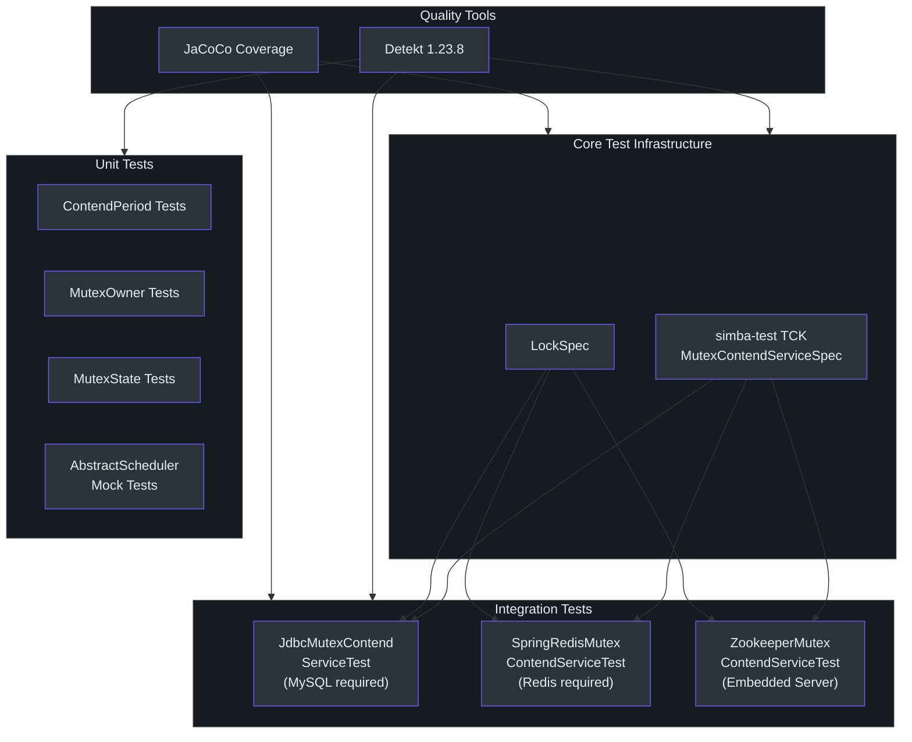
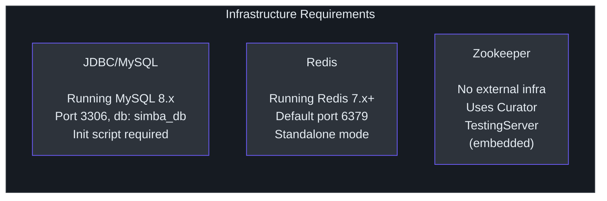
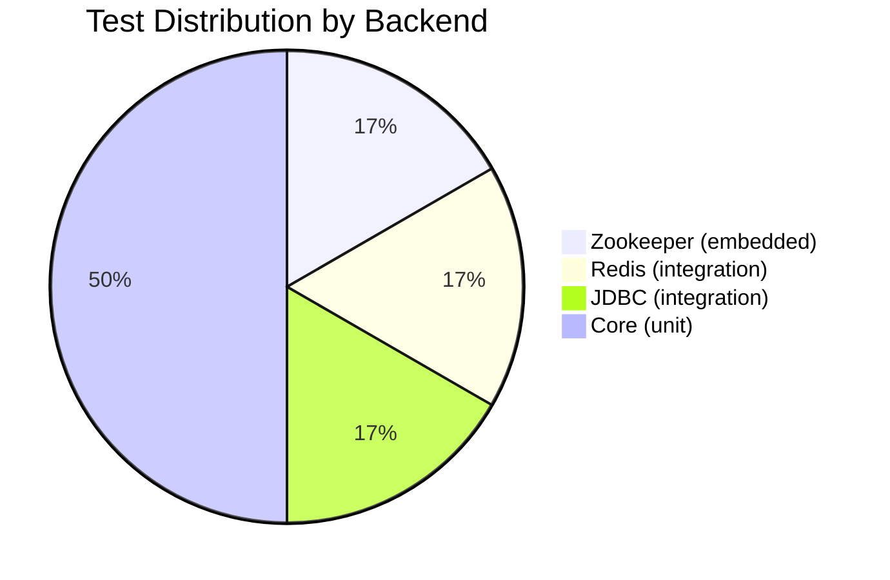
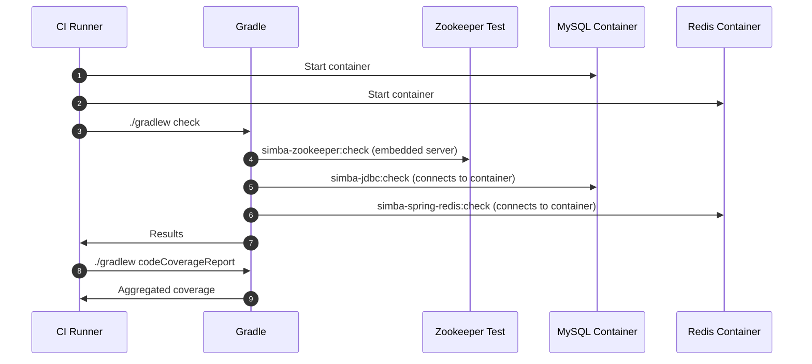

# Testing Overview

Simba's testing strategy is built on a three-tier approach: fast unit tests with mocks, backend-specific integration tests with real infrastructure, and a shared Technology Compatibility Kit (TCK) that enforces behavioral consistency across all three backends (JDBC, Redis, Zookeeper).

## Testing Strategy

The following diagram illustrates the overall testing approach and how tests flow from core abstractions to backend-specific implementations.



## Test Pyramid

Simba follows a standard test pyramid adapted for distributed systems:

| Tier | Count | Speed | Infra | Purpose |
|---|---|---|---|---|
| **Unit** | ~15 tests | < 1s each | None | Validate value objects (`MutexOwner`, `MutexState`, `ContendPeriod`) and timing logic |
| **TCK (Shared)** | 5 cases per backend | 5-30s each | Per backend | Validate the full contention lifecycle: start, restart, guard, multiContend, schedule |
| **Integration** | 5 cases x 3 backends | 5-60s each | MySQL, Redis, ZK | Confirm TCK compliance against real infrastructure |

### The 5 TCK Test Cases

Every backend MUST pass all five cases defined in [`MutexContendServiceSpec`](https://github.com/Ahoo-Wang/Simba/blob/main/simba-test/src/main/kotlin/me/ahoo/simba/test/MutexContendServiceSpec.kt):

| Test | Constant | What It Verifies |
|---|---|---|
| `start()` | `START_MUTEX` | A contender can acquire and release ownership. `onAcquired` fires when acquired, `onReleased` fires when stopped. |
| `restart()` | `RESTART_MUTEX` | After `stop()` + `start()`, the same contender can re-acquire and re-release. State resets correctly. |
| `guard()` | `GUARD_MUTEX` | After acquisition, the owner continues to hold the lock through TTL renewals (waits 3 seconds, then verifies ownership is still held). |
| `multiContend()` | `MULTI_CONTEND_MUTEX` | 10 contenders compete for the same mutex. Exactly one holds at any time. An `AtomicInteger` counter asserts mutual exclusion: `incrementAndGet()` on acquire must equal 1, `decrementAndGet()` on release must equal 0. Runs for 30 seconds. |
| `schedule()` | `SCHEDULE_MUTEX` | Validates `AbstractScheduler` integration: a scheduler acquires leadership, executes its `work()` callback, and responds to `start()`/`stop()` lifecycle. Uses a `CountDownLatch` with 5-second timeout. |

## Backend Test Requirements



### JDBC/MySQL Backend

**Prerequisite**: A running MySQL instance.

**Connection defaults** (from [`JdbcMutexContendServiceTest`](https://github.com/Ahoo-Wang/Simba/blob/main/simba-jdbc/src/test/kotlin/me/ahoo/simba/jdbc/JdbcMutexContendServiceTest.kt)):

```
jdbc:mysql://localhost:3306/simba_db
username: root
password: root
```

**Initialization**: Run the init script before first test execution:

```bash
mysql -u root -proot < simba-jdbc/src/init-script/init-simba-mysql.sql
```

The test class calls [`jdbcMutexOwnerRepository.tryInitMutex()`](https://github.com/Ahoo-Wang/Simba/blob/main/simba-jdbc/src/test/kotlin/me/ahoo/simba/jdbc/JdbcMutexContendServiceTest.kt) for each of the 5 mutex constants (`start`, `restart`, `guard`, `multiContend`, `schedule`).

**Configuration**: `initialDelay=2s`, `ttl=2s`, `transition=5s`.

### Redis Backend

**Prerequisite**: A running Redis instance on `localhost:6379`.

The test class in [`SpringRedisMutexContendServiceTest`](https://github.com/Ahoo-Wang/Simba/blob/main/simba-spring-redis/src/test/kotlin/me/ahoo/simba/spring/redis/SpringRedisMutexContendServiceTest.kt) uses `LettuceConnectionFactory` with default standalone configuration.

**Configuration**: `ttl=2s`, `transition=1s`.

The Redis backend uses Lua scripts for atomic operations:
- `mutex_acquire.lua` -- attempts `SET NX PX`, publishes `acquired` event on success
- `mutex_guard.lua` -- renews TTL for current owner
- `mutex_release.lua` -- releases the lock if the caller is the owner

### Zookeeper Backend

**No external infrastructure required.** The test class in [`ZookeeperMutexContendServiceTest`](https://github.com/Ahoo-Wang/Simba/blob/main/simba-zookeeper/src/test/kotlin/me/ahoo/simba/zookeeper/ZookeeperMutexContendServiceTest.kt) uses Curator's embedded `TestingServer`:

```kotlin
testingServer = TestingServer()
testingServer.start()
curatorFramework = CuratorFrameworkFactory.newClient(
    testingServer.connectString, RetryNTimes(1, 10)
)
curatorFramework.start()
```

This makes the Zookeeper module the easiest to run locally and in CI without any external dependencies.

## Running Tests

### All Modules

```bash
./gradlew check
```

### Single Backend Module

```bash
./gradlew simba-core:check            # unit tests only (no infra needed)
./gradlew simba-jdbc:check            # needs MySQL
./gradlew simba-spring-redis:check    # needs Redis
./gradlew simba-zookeeper:check       # no external infra
```

### TCK Only

The TCK base classes live in `simba-test` (published as `me.ahoo.simba:simba-test`). They contain no executable test cases themselves -- the tests run when a backend module extends `MutexContendServiceSpec`.

## Coverage and Quality

### Static Analysis (Detekt)

Detekt configuration lives at [`config/detekt/detekt.yml`](https://github.com/Ahoo-Wang/Simba/blob/main/config/detekt/detekt.yml). Key settings:
- `autoCorrect = true`
- Run: `./gradlew detekt`

### Code Coverage (JaCoCo)

The `code-coverage-report` module aggregates JaCoCo reports from all submodules:

```bash
./gradlew codeCoverageReport
```

Reports are generated at `code-coverage-report/build/reports/jacoco/`.



## CI Integration

In continuous integration, only the Zookeeper backend can run without service containers. The JDBC and Redis backends require either:
- Docker Compose services provisioned by the CI runner
- GitHub Actions service containers

A typical CI strategy:



## Key Files Reference

| File | Purpose |
|---|---|
| [`simba-test/.../MutexContendServiceSpec.kt`](https://github.com/Ahoo-Wang/Simba/blob/main/simba-test/src/main/kotlin/me/ahoo/simba/test/MutexContendServiceSpec.kt) | TCK base class with 5 mandatory test cases |
| [`simba-test/.../LockSpec.kt`](https://github.com/Ahoo-Wang/Simba/blob/main/simba-test/src/main/kotlin/me/ahoo/simba/test/LockSpec.kt) | TCK base class for locker tests |
| [`simba-jdbc/.../JdbcMutexContendServiceTest.kt`](https://github.com/Ahoo-Wang/Simba/blob/main/simba-jdbc/src/test/kotlin/me/ahoo/simba/jdbc/JdbcMutexContendServiceTest.kt) | JDBC backend integration test |
| [`simba-spring-redis/.../SpringRedisMutexContendServiceTest.kt`](https://github.com/Ahoo-Wang/Simba/blob/main/simba-spring-redis/src/test/kotlin/me/ahoo/simba/spring/redis/SpringRedisMutexContendServiceTest.kt) | Redis backend integration test |
| [`simba-zookeeper/.../ZookeeperMutexContendServiceTest.kt`](https://github.com/Ahoo-Wang/Simba/blob/main/simba-zookeeper/src/test/kotlin/me/ahoo/simba/zookeeper/ZookeeperMutexContendServiceTest.kt) | Zookeeper backend integration test (embedded) |
| [`simba-jdbc/src/init-script/init-simba-mysql.sql`](https://github.com/Ahoo-Wang/Simba/blob/main/simba-jdbc/src/init-script/init-simba-mysql.sql) | MySQL initialization script |
| [`config/detekt/detekt.yml`](https://github.com/Ahoo-Wang/Simba/blob/main/config/detekt/detekt.yml) | Detekt static analysis configuration |

## Next Steps

- [Unit Testing](./unit-testing.md) -- How to write unit tests with MockK and JUnit 5
- [Integration Testing](./integration-testing.md) -- Backend-specific setup and Docker Compose examples
- [TCK Reference](./tck.md) -- Detailed breakdown of MutexContendServiceSpec and how to extend it
