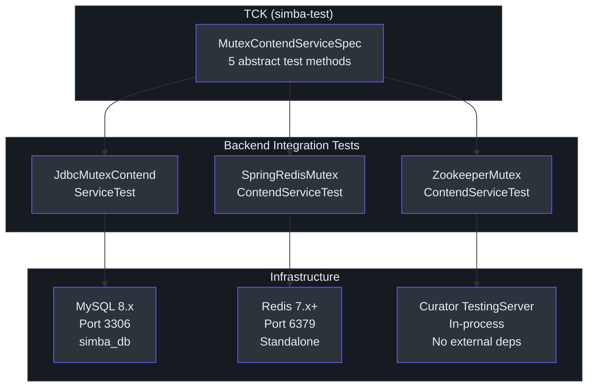
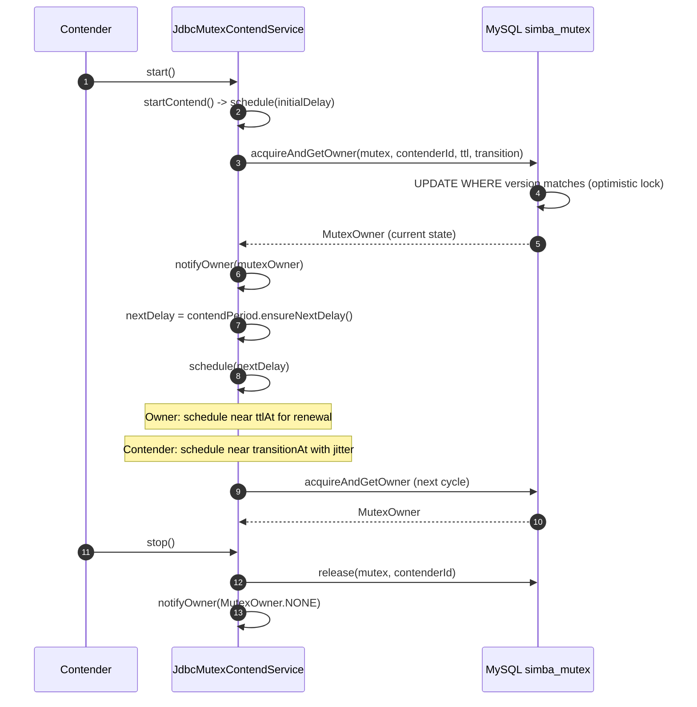
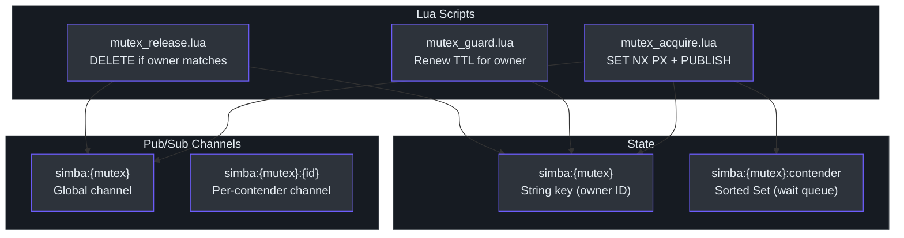
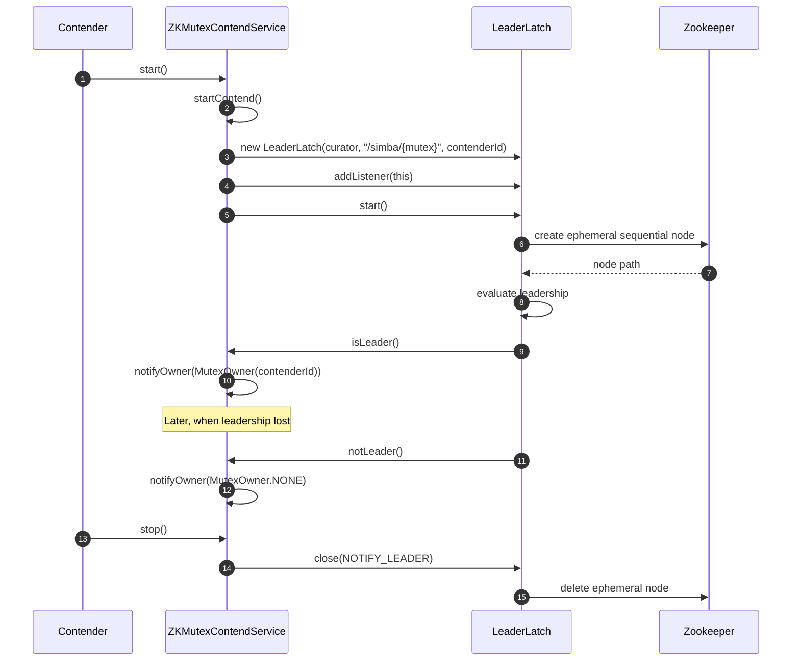

# Integration Testing Guide

Integration tests verify that each Simba backend correctly implements the distributed mutex protocol against real infrastructure. All backend integration tests extend `MutexContendServiceSpec` from the TCK and must pass the same 5 test cases.

## Integration Test Architecture



## JDBC/MySQL Backend

### Database Setup

The JDBC backend stores mutex state in a MySQL table. The schema is defined in [`init-simba-mysql.sql`](https://github.com/Ahoo-Wang/Simba/blob/main/simba-jdbc/src/init-script/init-simba-mysql.sql):

```sql
CREATE DATABASE IF NOT EXISTS simba_db;
USE simba_db;

CREATE TABLE IF NOT EXISTS simba_mutex (
    mutex         VARCHAR(66) NOT NULL PRIMARY KEY COMMENT 'mutex name',
    acquired_at   BIGINT UNSIGNED NOT NULL,
    ttl_at        BIGINT UNSIGNED NOT NULL,
    transition_at BIGINT UNSIGNED NOT NULL,
    owner_id      VARCHAR(128) NOT NULL,
    version       INT UNSIGNED NOT NULL
);
```

The `version` column enables optimistic locking for concurrent acquisition attempts. [`JdbcMutexOwnerRepository`](https://github.com/Ahoo-Wang/Simba/blob/main/simba-jdbc/src/main/kotlin/me/ahoo/simba/jdbc/JdbcMutexOwnerRepository.kt) uses `UPDATE ... WHERE version = ?` to ensure only one contender succeeds per cycle.

### Test Class

[`JdbcMutexContendServiceTest`](https://github.com/Ahoo-Wang/Simba/blob/main/simba-jdbc/src/test/kotlin/me/ahoo/simba/jdbc/JdbcMutexContendServiceTest.kt) sets up the test infrastructure:

```kotlin
@TestInstance(TestInstance.Lifecycle.PER_CLASS)
internal class JdbcMutexContendServiceTest : MutexContendServiceSpec() {

    private lateinit var jdbcMutexOwnerRepository: JdbcMutexOwnerRepository
    override lateinit var mutexContendServiceFactory: MutexContendServiceFactory

    @BeforeAll
    fun setup() {
        val hikariDataSource = HikariDataSource()
        hikariDataSource.jdbcUrl = "jdbc:mysql://localhost:3306/simba_db"
        hikariDataSource.username = "root"
        hikariDataSource.password = "root"
        jdbcMutexOwnerRepository = JdbcMutexOwnerRepository(hikariDataSource)
        mutexContendServiceFactory = JdbcMutexContendServiceFactory(
            mutexOwnerRepository = jdbcMutexOwnerRepository,
            initialDelay = Duration.ofSeconds(2),
            ttl = Duration.ofSeconds(2),
            transition = Duration.ofSeconds(5)
        )
        // Initialize all 5 mutex rows
        jdbcMutexOwnerRepository.tryInitMutex(START_MUTEX)
        jdbcMutexOwnerRepository.tryInitMutex(RESTART_MUTEX)
        jdbcMutexOwnerRepository.tryInitMutex(GUARD_MUTEX)
        jdbcMutexOwnerRepository.tryInitMutex(MULTI_CONTEND_MUTEX)
        jdbcMutexOwnerRepository.tryInitMutex(SCHEDULE_MUTEX)
    }
}
```

### Contention Flow (JDBC)



### MySQL via Docker Compose

```yaml
# docker-compose-test.yml
services:
  mysql:
    image: mysql:8.0
    ports:
      - "3306:3306"
    environment:
      MYSQL_ROOT_PASSWORD: root
      MYSQL_DATABASE: simba_db
    volumes:
      - ./simba-jdbc/src/init-script/init-simba-mysql.sql:/docker-entrypoint-initdb.d/init.sql
    healthcheck:
      test: ["CMD", "mysqladmin", "ping", "-h", "localhost"]
      interval: 5s
      timeout: 5s
      retries: 10
```

```bash
docker compose -f docker-compose-test.yml up -d mysql
# Wait for healthy
docker compose -f docker-compose-test.yml exec mysql mysqladmin ping -h localhost
# Run tests
./gradlew simba-jdbc:check
```

## Redis Backend

### How the Redis Backend Works

The Redis backend uses three Lua scripts for atomic lock operations and Redis pub/sub for real-time notifications between contenders:



The `mutex_acquire.lua` script ([source](https://github.com/Ahoo-Wang/Simba/blob/main/simba-spring-redis/src/main/resources/mutex_acquire.lua)):
1. Attempts `SET mutexKey contenderId NX PX transition` -- atomic acquire with expiry
2. On success: publishes `acquired@@contenderId` to the global channel
3. On failure: adds the contender to a sorted set wait queue and returns the current owner + remaining TTL

### Test Class

[`SpringRedisMutexContendServiceTest`](https://github.com/Ahoo-Wang/Simba/blob/main/simba-spring-redis/src/test/kotlin/me/ahoo/simba/spring/redis/SpringRedisMutexContendServiceTest.kt) creates the full Spring Redis stack:

```kotlin
@TestInstance(TestInstance.Lifecycle.PER_CLASS)
internal class SpringRedisMutexContendServiceTest : MutexContendServiceSpec() {
    lateinit var lettuceConnectionFactory: LettuceConnectionFactory
    override lateinit var mutexContendServiceFactory: MutexContendServiceFactory
    lateinit var listenerContainer: RedisMessageListenerContainer

    @BeforeAll
    fun setup() {
        val redisStandaloneConfiguration = RedisStandaloneConfiguration()
        lettuceConnectionFactory = LettuceConnectionFactory(redisStandaloneConfiguration)
        lettuceConnectionFactory.afterPropertiesSet()
        val stringRedisTemplate = StringRedisTemplate(lettuceConnectionFactory)
        listenerContainer = RedisMessageListenerContainer()
        listenerContainer.setConnectionFactory(lettuceConnectionFactory)
        listenerContainer.afterPropertiesSet()
        listenerContainer.start()
        mutexContendServiceFactory = SpringRedisMutexContendServiceFactory(
            ttl = Duration.ofSeconds(2),
            transition = Duration.ofSeconds(1),
            redisTemplate = stringRedisTemplate,
            listenerContainer = listenerContainer,
            handleExecutor = ForkJoinPool.commonPool(),
            scheduledExecutorService = Executors.newScheduledThreadPool(1)
        )
    }
}
```

### Redis via Docker Compose

```yaml
# docker-compose-test.yml (add to existing file)
services:
  redis:
    image: redis:7-alpine
    ports:
      - "6379:6379"
    healthcheck:
      test: ["CMD", "redis-cli", "ping"]
      interval: 5s
      timeout: 5s
      retries: 10
```

```bash
docker compose -f docker-compose-test.yml up -d redis
./gradlew simba-spring-redis:check
```

## Zookeeper Backend

### Embedded Test Server

The Zookeeper backend requires **no external infrastructure**. [`ZookeeperMutexContendServiceTest`](https://github.com/Ahoo-Wang/Simba/blob/main/simba-zookeeper/src/test/kotlin/me/ahoo/simba/zookeeper/ZookeeperMutexContendServiceTest.kt) uses Curator's `TestingServer`:

```kotlin
@TestInstance(TestInstance.Lifecycle.PER_CLASS)
internal class ZookeeperMutexContendServiceTest : MutexContendServiceSpec() {
    lateinit var curatorFramework: CuratorFramework
    override lateinit var mutexContendServiceFactory: MutexContendServiceFactory
    lateinit var testingServer: TestingServer

    @BeforeAll
    fun setup() {
        testingServer = TestingServer()
        testingServer.start()
        curatorFramework = CuratorFrameworkFactory.newClient(
            testingServer.connectString, RetryNTimes(1, 10)
        )
        curatorFramework.start()
        mutexContendServiceFactory = ZookeeperMutexContendServiceFactory(
            ForkJoinPool.commonPool(), curatorFramework
        )
    }

    @AfterAll
    fun destroy() {
        if (this::curatorFramework.isInitialized) curatorFramework.close()
        if (this::testingServer.isInitialized) testingServer.stop()
    }
}
```

### Zookeeper Contention Flow

The Zookeeper backend delegates to Curator's [`LeaderLatch`](https://github.com/Ahoo-Wang/Simba/blob/main/simba-zookeeper/src/main/kotlin/me/ahoo/simba/zookeeper/ZookeeperMutexContendService.kt), which uses ephemeral sequential znodes under `/simba/{mutex}`:



### Running Zookeeper Tests

```bash
# No Docker needed
./gradlew simba-zookeeper:check
```

## Full Docker Compose for All Backends

```yaml
# docker-compose-test.yml
services:
  mysql:
    image: mysql:8.0
    ports:
      - "3306:3306"
    environment:
      MYSQL_ROOT_PASSWORD: root
      MYSQL_DATABASE: simba_db
    volumes:
      - ./simba-jdbc/src/init-script/init-simba-mysql.sql:/docker-entrypoint-initdb.d/init.sql
    healthcheck:
      test: ["CMD", "mysqladmin", "ping", "-h", "localhost"]
      interval: 5s
      timeout: 5s
      retries: 10

  redis:
    image: redis:7-alpine
    ports:
      - "6379:6379"
    healthcheck:
      test: ["CMD", "redis-cli", "ping"]
      interval: 5s
      timeout: 5s
      retries: 10
```

Start all services and run all tests:

```bash
docker compose -f docker-compose-test.yml up -d
./gradlew check
docker compose -f docker-compose-test.yml down
```

## CI Configuration

### GitHub Actions Example

```yaml
# .github/workflows/test.yml
name: Tests
on: [push, pull_request]

jobs:
  test:
    runs-on: ubuntu-latest
    services:
      mysql:
        image: mysql:8.0
        env:
          MYSQL_ROOT_PASSWORD: root
          MYSQL_DATABASE: simba_db
        ports:
          - 3306:3306
        options: >-
          --health-cmd="mysqladmin ping -h localhost"
          --health-interval=10s
          --health-timeout=5s
          --health-retries=10
      redis:
        image: redis:7-alpine
        ports:
          - 6379:6379
        options: >-
          --health-cmd="redis-cli ping"
          --health-interval=10s
          --health-timeout=5s
          --health-retries=10
    steps:
      - uses: actions/checkout@v4
      - uses: actions/setup-java@v4
        with:
          distribution: temurin
          java-version: 17
      - name: Init MySQL
        run: mysql -h 127.0.0.1 -u root -proot < simba-jdbc/src/init-script/init-simba-mysql.sql
      - name: Run tests
        run: ./gradlew check
      - name: Coverage report
        run: ./gradlew codeCoverageReport
```

## Timing Considerations

Integration tests involve real infrastructure and timing-dependent behavior. Key timeout values used in the TCK:

| Test | Timeout | Notes |
|---|---|---|
| `start()` | ~5s | Single acquire + release cycle |
| `restart()` | ~10s | Two acquire + release cycles |
| `guard()` | 3s sleep | Verifies TTL renewal maintains ownership |
| `multiContend()` | 30s sleep | 10 contenders compete; asserts exactly 1 owner at all times |
| `schedule()` | 5s latch | CountDownLatch for first `work()` invocation |

The `multiContend` test is the longest-running and most resource-intensive. It validates true mutual exclusion over an extended period.

## Troubleshooting

### JDBC: "Connection refused"

Ensure MySQL is running and the `simba_db` database exists with the `simba_mutex` table initialized. Verify credentials match the test configuration (`root`/`root`).

### Redis: "Connection refused"

Ensure Redis is running on `localhost:6379`. The test uses default `RedisStandaloneConfiguration` with no authentication.

### Zookeeper: Tests pass in isolation but fail in suite

The Zookeeper `TestingServer` binds to a random port. If running multiple test classes concurrently, ensure each uses its own `TestingServer` instance. The existing test pattern with `@TestInstance(PER_CLASS)` and `@BeforeAll`/`@AfterAll` handles this correctly.

### Timing Flaky Tests

If `guard()` or `multiContend()` tests are flaky, increase the sleep durations or TTL values in the test setup. The current defaults (2s TTL, 5s transition for JDBC; 2s TTL, 1s transition for Redis) work reliably in most environments.

## Next Steps

- [TCK Reference](./tck.md) -- Detailed breakdown of test base classes
- [Unit Testing](./unit-testing.md) -- Fast isolated tests with MockK
