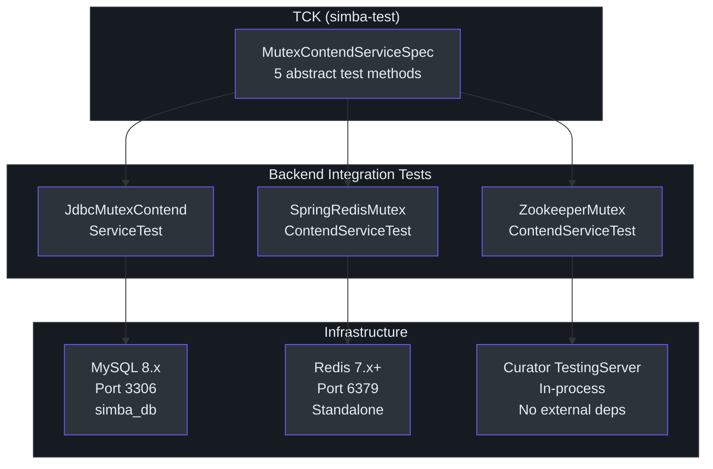
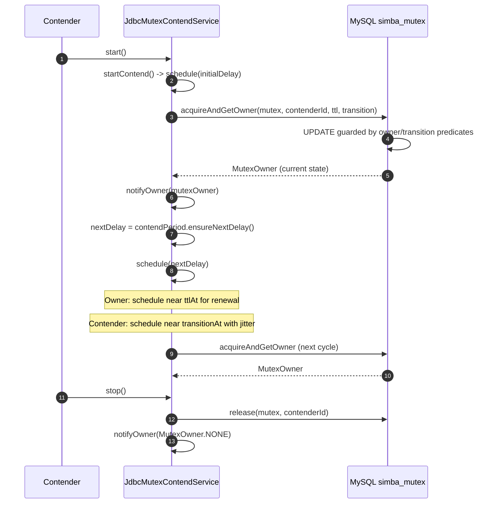
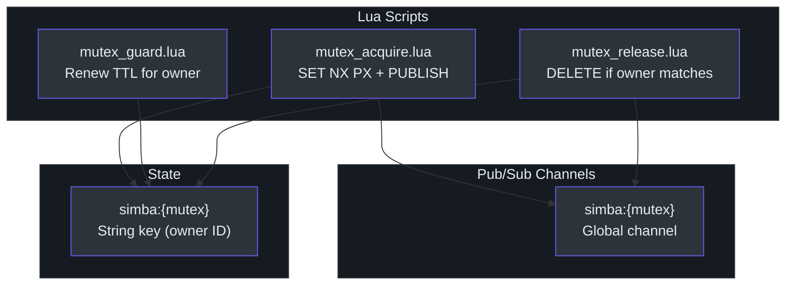
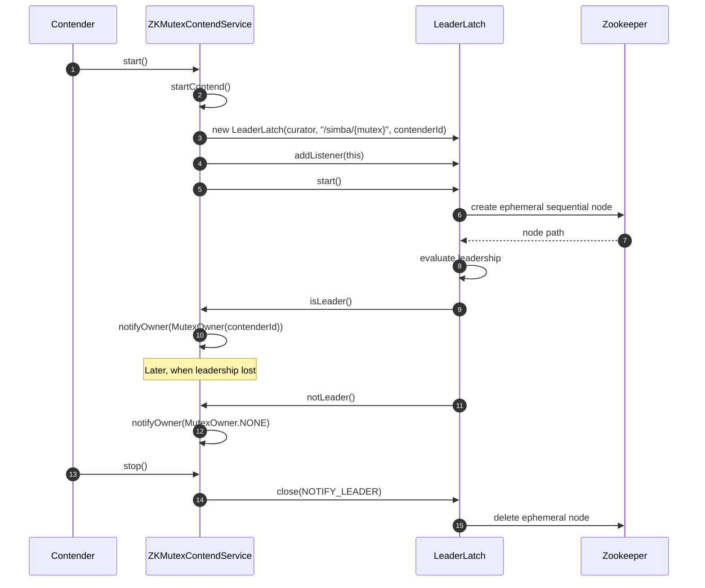

# Integration Testing Guide

Integration tests verify that each Simba backend correctly implements the distributed mutex protocol against real infrastructure. All backend integration tests extend `MutexContendServiceSpec` from the TCK and must pass the same 5 test cases.

## Integration Test Architecture


```mermaid
flowchart TB
    subgraph tck["TCK (simba-test)"]
        style tck fill:#161b22,stroke:#30363d,color:#e6edf3
        SPEC["MutexContendServiceSpec<br>5 abstract test methods"]
    end

    subgraph backends["Backend Integration Tests"]
        style backends fill:#161b22,stroke:#30363d,color:#e6edf3
        JDBC_TEST["JdbcMutexContend<br>ServiceTest"]
        REDIS_TEST["SpringRedisMutex<br>ContendServiceTest"]
        ZK_TEST["ZookeeperMutex<br>ContendServiceTest"]
    end

    subgraph infra["Infrastructure"]
        style infra fill:#161b22,stroke:#30363d,color:#e6edf3
        MYSQL["MySQL 8.x<br>Port 3306<br>simba_db"]
        REDIS["Redis 7.x+<br>Port 6379<br>Standalone"]
        ZK_SRV["Curator TestingServer<br>In-process<br>No external deps"]
    end

    SPEC --> JDBC_TEST
    SPEC --> REDIS_TEST
    SPEC --> ZK_TEST
    JDBC_TEST --> MYSQL
    REDIS_TEST --> REDIS
    ZK_TEST --> ZK_SRV

    style SPEC fill:#2d333b,stroke:#6d5dfc,color:#e6edf3
    style JDBC_TEST fill:#2d333b,stroke:#6d5dfc,color:#e6edf3
    style REDIS_TEST fill:#2d333b,stroke:#6d5dfc,color:#e6edf3
    style ZK_TEST fill:#2d333b,stroke:#6d5dfc,color:#e6edf3
    style MYSQL fill:#2d333b,stroke:#6d5dfc,color:#e6edf3
    style REDIS fill:#2d333b,stroke:#6d5dfc,color:#e6edf3
    style ZK_SRV fill:#2d333b,stroke:#6d5dfc,color:#e6edf3
```

## JDBC/MySQL Backend

### Database Setup

The JDBC backend stores mutex state in a MySQL table. The schema is defined in [`init-simba-mysql.sql`](https://github.com/Ahoo-Wang/Simba/blob/main/simba-jdbc/src/init-script/init-simba-mysql.sql):

```sql
CREATE DATABASE IF NOT EXISTS simba_db;
USE simba_db;

CREATE TABLE IF NOT EXISTS simba_mutex (
    mutex         VARCHAR(66) NOT NULL PRIMARY KEY COMMENT 'mutex name',
    acquired_at   BIGINT UNSIGNED NOT NULL,
    ttl_at        BIGINT UNSIGNED NOT NULL,
    transition_at BIGINT UNSIGNED NOT NULL,
    owner_id      VARCHAR(128) NOT NULL,
    version       INT UNSIGNED NOT NULL
);
```

Concurrent acquisition attempts are serialized by an atomic conditional `UPDATE` guarded by owner/transition predicates. [`JdbcMutexOwnerRepository`](https://github.com/Ahoo-Wang/Simba/blob/main/simba-jdbc/src/main/kotlin/me/ahoo/simba/jdbc/JdbcMutexOwnerRepository.kt) performs `UPDATE ... WHERE mutex = ? AND (transition_at < now OR (owner_id = ? AND transition_at > now))`; the InnoDB row lock plus predicate re-evaluation ensure only one contender succeeds per cycle. The `version` column is a change counter — incremented on every state change, never compared.

### Test Class

[`JdbcMutexContendServiceTest`](https://github.com/Ahoo-Wang/Simba/blob/main/simba-jdbc/src/test/kotlin/me/ahoo/simba/jdbc/JdbcMutexContendServiceTest.kt) sets up the test infrastructure:

```kotlin
@TestInstance(TestInstance.Lifecycle.PER_CLASS)
internal class JdbcMutexContendServiceTest : MutexContendServiceSpec() {

    private lateinit var jdbcMutexOwnerRepository: JdbcMutexOwnerRepository
    override lateinit var mutexContendServiceFactory: MutexContendServiceFactory

    @BeforeAll
    fun setup() {
        val hikariDataSource = MySqlFixture.newDataSource()
        jdbcMutexOwnerRepository = JdbcMutexOwnerRepository(hikariDataSource)
        mutexContendServiceFactory = JdbcMutexContendServiceFactory(
            mutexOwnerRepository = jdbcMutexOwnerRepository,
            initialDelay = Duration.ofSeconds(2),
            ttl = Duration.ofSeconds(2),
            transition = Duration.ofSeconds(5)
        )
        // Initialize all 5 mutex rows
        jdbcMutexOwnerRepository.tryInitMutex(START_MUTEX)
        jdbcMutexOwnerRepository.tryInitMutex(RESTART_MUTEX)
        jdbcMutexOwnerRepository.tryInitMutex(GUARD_MUTEX)
        jdbcMutexOwnerRepository.tryInitMutex(MULTI_CONTEND_MUTEX)
        jdbcMutexOwnerRepository.tryInitMutex(SCHEDULE_MUTEX)
    }
}
```

### Contention Flow (JDBC)


```mermaid
sequenceDiagram
autonumber
    participant C as Contender
    participant CS as JdbcMutexContendService
    participant DB as MySQL simba_mutex

    C->>CS: start()
    CS->>CS: startContend() -> schedule(initialDelay)
    CS->>DB: acquireAndGetOwner(mutex, contenderId, ttl, transition)
    DB->>DB: UPDATE guarded by owner/transition predicates
    DB-->>CS: MutexOwner (current state)
    CS->>CS: notifyOwner(mutexOwner)
    CS->>CS: nextDelay = contendPeriod.ensureNextDelay()
    CS->>CS: schedule(nextDelay)
    Note over CS: Owner: schedule near ttlAt for renewal
    Note over CS: Contender: schedule near transitionAt with jitter
    CS->>DB: acquireAndGetOwner (next cycle)
    DB-->>CS: MutexOwner
    C->>CS: stop()
    CS->>DB: release(mutex, contenderId)
    CS->>CS: notifyOwner(MutexOwner.NONE)
```

### MySQL via Testcontainers

[`MySqlFixture`](https://github.com/Ahoo-Wang/Simba/blob/main/simba-jdbc/src/test/kotlin/me/ahoo/simba/jdbc/MySqlFixture.kt) starts one `mysql:8.4` container per test JVM and initializes it with the published `init-simba-mysql.sql`, so tests and users share a single schema definition. Tests only call `MySqlFixture.newDataSource()`; no local MySQL, credentials or manual schema setup are needed.

```bash
./gradlew simba-jdbc:check   # requires Docker
```

## Redis Backend

### How the Redis Backend Works

The Redis backend uses three Lua scripts for atomic lock operations and Redis pub/sub for real-time notifications between contenders:


```mermaid
flowchart TD
    subgraph scripts["Lua Scripts"]
        style scripts fill:#161b22,stroke:#30363d,color:#e6edf3
        ACQUIRE["mutex_acquire.lua<br>SET NX PX + PUBLISH"]
        GUARD["mutex_guard.lua<br>Renew TTL for owner"]
        RELEASE["mutex_release.lua<br>DELETE if owner matches"]
    end

    subgraph channels["Pub/Sub Channels"]
        style channels fill:#161b22,stroke:#30363d,color:#e6edf3
        MC["simba:{mutex}<br>Global channel"]
    end

    subgraph state["State"]
        style state fill:#161b22,stroke:#30363d,color:#e6edf3
        KEY["simba:{mutex}<br>String key (owner ID)"]
    end

    ACQUIRE --> MC
    ACQUIRE --> KEY
    GUARD --> KEY
    RELEASE --> MC
    RELEASE --> KEY

    style ACQUIRE fill:#2d333b,stroke:#6d5dfc,color:#e6edf3
    style GUARD fill:#2d333b,stroke:#6d5dfc,color:#e6edf3
    style RELEASE fill:#2d333b,stroke:#6d5dfc,color:#e6edf3
    style MC fill:#2d333b,stroke:#6d5dfc,color:#e6edf3
    style KEY fill:#2d333b,stroke:#6d5dfc,color:#e6edf3
```

The `mutex_acquire.lua` script ([source](https://github.com/Ahoo-Wang/Simba/blob/main/simba-spring-redis/src/main/resources/mutex_acquire.lua)):
1. Attempts `SET mutexKey contenderId NX PX lease` (lease = ttl + transition) -- atomic acquire with expiry
2. On success: publishes `acquired@@contenderId` to the global channel
3. On failure: returns the current owner and its remaining lease as `{ownerId, pttl}`

### Test Class

[`SpringRedisMutexContendServiceTest`](https://github.com/Ahoo-Wang/Simba/blob/main/simba-spring-redis/src/test/kotlin/me/ahoo/simba/spring/redis/SpringRedisMutexContendServiceTest.kt) creates the full Spring Redis stack:

```kotlin
@TestInstance(TestInstance.Lifecycle.PER_CLASS)
internal class SpringRedisMutexContendServiceTest : MutexContendServiceSpec() {
    lateinit var lettuceConnectionFactory: LettuceConnectionFactory
    override lateinit var mutexContendServiceFactory: MutexContendServiceFactory
    lateinit var listenerContainer: RedisMessageListenerContainer

    @BeforeAll
    fun setup() {
        lettuceConnectionFactory = RedisFixture.newConnectionFactory()
        val stringRedisTemplate = StringRedisTemplate(lettuceConnectionFactory)
        listenerContainer = RedisMessageListenerContainer()
        listenerContainer.setConnectionFactory(lettuceConnectionFactory)
        listenerContainer.afterPropertiesSet()
        listenerContainer.start()
        mutexContendServiceFactory = SpringRedisMutexContendServiceFactory(
            ttl = Duration.ofSeconds(2),
            transition = Duration.ofSeconds(1),
            redisTemplate = stringRedisTemplate,
            listenerContainer = listenerContainer,
            handleExecutor = ForkJoinPool.commonPool(),
            scheduledExecutorService = Executors.newScheduledThreadPool(1)
        )
    }
}
```

### Redis via Testcontainers

[`RedisFixture`](https://github.com/Ahoo-Wang/Simba/blob/main/simba-spring-redis/src/test/kotlin/me/ahoo/simba/spring/redis/RedisFixture.kt) starts one `redis:7.4-alpine` container per test JVM; tests call `RedisFixture.newConnectionFactory()`.

```bash
./gradlew simba-spring-redis:check   # requires Docker
```

## Zookeeper Backend

### Embedded Test Server

The Zookeeper backend requires **no external infrastructure**. [`ZookeeperMutexContendServiceTest`](https://github.com/Ahoo-Wang/Simba/blob/main/simba-zookeeper/src/test/kotlin/me/ahoo/simba/zookeeper/ZookeeperMutexContendServiceTest.kt) uses Curator's `TestingServer`:

```kotlin
@TestInstance(TestInstance.Lifecycle.PER_CLASS)
internal class ZookeeperMutexContendServiceTest : MutexContendServiceSpec() {
    lateinit var curatorFramework: CuratorFramework
    override lateinit var mutexContendServiceFactory: MutexContendServiceFactory
    lateinit var testingServer: TestingServer

    @BeforeAll
    fun setup() {
        testingServer = TestingServer()
        testingServer.start()
        curatorFramework = CuratorFrameworkFactory.newClient(
            testingServer.connectString, RetryNTimes(1, 10)
        )
        curatorFramework.start()
        mutexContendServiceFactory = ZookeeperMutexContendServiceFactory(
            ForkJoinPool.commonPool(), curatorFramework
        )
    }

    @AfterAll
    fun destroy() {
        if (this::curatorFramework.isInitialized) curatorFramework.close()
        if (this::testingServer.isInitialized) testingServer.stop()
    }
}
```

### Zookeeper Contention Flow

The Zookeeper backend delegates to Curator's [`LeaderLatch`](https://github.com/Ahoo-Wang/Simba/blob/main/simba-zookeeper/src/main/kotlin/me/ahoo/simba/zookeeper/ZookeeperMutexContendService.kt), which uses ephemeral sequential znodes under `/simba/{mutex}`:


```mermaid
sequenceDiagram
autonumber
    participant C as Contender
    participant CS as ZKMutexContendService
    participant LL as LeaderLatch
    participant ZK as Zookeeper

    C->>CS: start()
    CS->>CS: startContend()
    CS->>LL: new LeaderLatch(curator, "/simba/{mutex}", contenderId)
    CS->>LL: addListener(this)
    CS->>LL: start()
    LL->>ZK: create ephemeral sequential node
    ZK-->>LL: node path
    LL->>LL: evaluate leadership
    LL->>CS: isLeader()
    CS->>CS: notifyOwner(MutexOwner(contenderId))
    Note over CS: Later, when leadership lost
    LL->>CS: notLeader()
    CS->>CS: notifyOwner(MutexOwner.NONE)
    C->>CS: stop()
    CS->>LL: close(NOTIFY_LEADER)
    LL->>ZK: delete ephemeral node
```

### Running Zookeeper Tests

```bash
# No Docker needed
./gradlew simba-zookeeper:check
```

## Requirements for All Backends

Only Docker (for the JDBC and Redis containers) and JDK 17. Zookeeper uses an embedded Curator `TestingServer`. Containers are started lazily on first use and removed by Testcontainers when the test JVM exits.

```bash
./gradlew check
```

## CI Configuration

### GitHub Actions Example

GitHub-hosted runners provide Docker, so the workflows need no service containers or database setup steps:

```yaml
# .github/workflows/integration-test.yml (excerpt)
jobs:
  simba-jdbc-test:
    runs-on: ubuntu-latest   # Docker is available; Testcontainers starts MySQL
    steps:
      - uses: actions/checkout@v4
      - uses: actions/setup-java@v4
        with:
          java-version: '17'
          distribution: 'temurin'
      - run: ./gradlew simba-jdbc:check

  simba-spring-redis-test:
    runs-on: ubuntu-latest   # Testcontainers starts Redis
    steps:
      - uses: actions/checkout@v4
      - uses: actions/setup-java@v4
        with:
          java-version: '17'
          distribution: 'temurin'
      - run: ./gradlew simba-spring-redis:check
```

## Timing Considerations

Integration tests involve real infrastructure and timing-dependent behavior. Key timeout values used in the TCK:

| Test | Timeout | Notes |
|---|---|---|
| `start()` | ~5s | Single acquire + release cycle |
| `restart()` | ~10s | Two acquire + release cycles |
| `guard()` | 3s sleep | Verifies TTL renewal maintains ownership |
| `multiContend()` | 30s sleep | 10 contenders compete; asserts exactly 1 owner at all times |
| `schedule()` | 5s latch | CountDownLatch for first `work()` invocation |

The `multiContend` test is the longest-running and most resource-intensive. It validates true mutual exclusion over an extended period.

## Troubleshooting

### JDBC / Redis: "Could not find a valid Docker environment"

Testcontainers needs a running Docker daemon (Docker Desktop, Colima, or a remote `DOCKER_HOST`). Start it and rerun; the first run pulls `mysql:8.4` and `redis:7.4-alpine`.

### Zookeeper: Tests pass in isolation but fail in suite

The Zookeeper `TestingServer` binds to a random port. If running multiple test classes concurrently, ensure each uses its own `TestingServer` instance. The existing test pattern with `@TestInstance(PER_CLASS)` and `@BeforeAll`/`@AfterAll` handles this correctly.

### Timing Flaky Tests

If `guard()` or `multiContend()` tests are flaky, increase the sleep durations or TTL values in the test setup. The current defaults (2s TTL, 5s transition for JDBC; 2s TTL, 1s transition for Redis) work reliably in most environments.

## Next Steps

- [TCK Reference](./tck.md) -- Detailed breakdown of test base classes
- [Unit Testing](./unit-testing.md) -- Fast isolated tests with MockK
