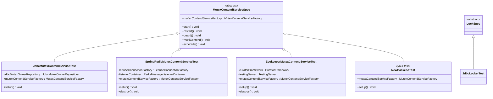
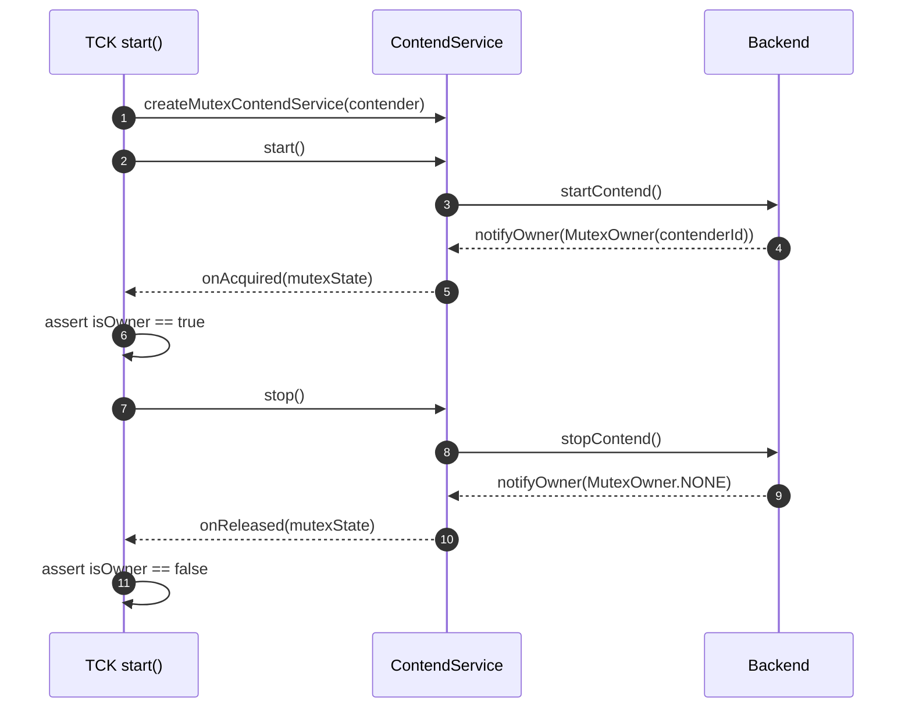
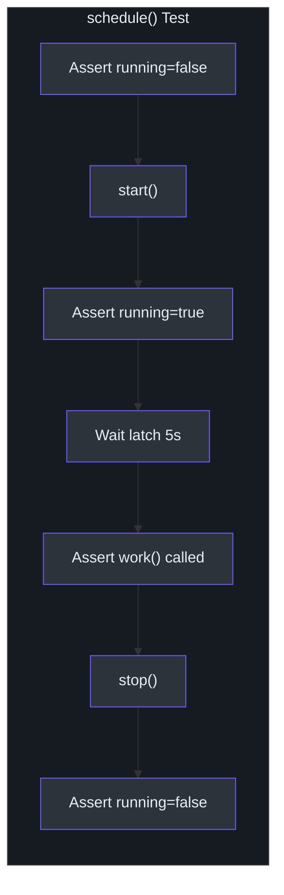

# TCK Reference

Simba provides a Technology Compatibility Kit (TCK) in the `simba-test` module (`me.ahoo.simba:simba-test`). The TCK defines abstract test base classes that enforce behavioral consistency across all backend implementations. Any new backend MUST pass all TCK test cases.

## Class Hierarchy



## MutexContendServiceSpec

[`MutexContendServiceSpec`](https://github.com/Ahoo-Wang/Simba/blob/main/simba-test/src/main/kotlin/me/ahoo/simba/test/MutexContendServiceSpec.kt) is the primary TCK class. It defines 5 test cases that validate the full lifecycle of a `MutexContendService`.

### Contract

Implementors MUST provide:

```kotlin
abstract val mutexContendServiceFactory: MutexContendServiceFactory
```

The factory is used to create `MutexContendService` instances with anonymous `AbstractMutexContender` implementations inside each test.

### Test Case 1: `start()`

**Mutex constant**: `START_MUTEX = "start"`

**Purpose**: Validates the basic acquire-release lifecycle.

**Flow**:
1. Create a contender with `onAcquired` and `onReleased` callbacks wired to `CompletableFuture`s
2. Call `contendService.start()`
3. Wait for `onAcquired` future to complete
4. Assert `contendService.isOwner == true`
5. Call `contendService.stop()`
6. Wait for `onReleased` future to complete
7. Assert `contendService.isOwner == false`



### Test Case 2: `restart()`

**Mutex constant**: `RESTART_MUTEX = "restart"`

**Purpose**: Validates that a contender can stop and re-start, re-acquiring the lock.

**Flow**:
1. Create contender with four futures (acquired1, released1, acquired2, released2)
2. Start, wait for acquired, assert owner, stop, wait for released, assert not owner
3. Start again, wait for acquired2, assert owner, stop, wait for released2, assert not owner

This tests that the internal state (status machine: `INITIAL -> STARTING -> RUNNING -> STOPPING -> INITIAL`) resets correctly and the backend allows re-entry.

### Test Case 3: `guard()`

**Mutex constant**: `GUARD_MUTEX = "guard"`

**Purpose**: Validates TTL renewal -- the owner continues to hold the lock through multiple TTL cycles.

**Flow**:
1. Start and wait for acquisition
2. Sleep 3 seconds (longer than typical TTL of 2s)
3. Assert `afterOwner.ownerId == contender.contenderId` (still owned by the same contender)
4. Assert `isOwner == true`
5. Stop and verify release

This test is critical because it proves the "guard" (TTL renewal) mechanism works. Without it, the lock would expire after the first TTL and be available for other contenders.

### Test Case 4: `multiContend()`

**Mutex constant**: `MULTI_CONTEND_MUTEX = "multiContend"`

**Purpose**: Validates true mutual exclusion across multiple concurrent contenders.

**Flow**:
1. Create 10 contenders, each with an `AtomicInteger` counter
2. On `onAcquired`: `count.incrementAndGet()` must equal 1 (exactly one holder)
3. On `onReleased`: `count.decrementAndGet()` must equal 0
4. All 10 start competing
5. Sleep 30 seconds
6. Assert `count.get() == 1` (still exactly one holder after extended time)
7. Assert all contenders that have an owner agree on the same `ownerId`
8. Assert exactly 1 contender matches the current owner ID

This is the most important concurrency test. It runs for 30 seconds to cover many contention cycles and verifies that no two contenders can simultaneously believe they hold the lock.

### Test Case 5: `schedule()`

**Mutex constant**: `SCHEDULE_MUTEX = "schedule"`

**Purpose**: Validates `AbstractScheduler` integration.

**Flow**:
1. Create a scheduler with `ScheduleConfig.delay(Duration.ZERO, 1s)` and a `work()` that counts down a latch
2. Assert `running == false` initially
3. Call `start()`, assert `running == true`
4. Wait up to 5 seconds for the latch (work must be called)
5. Call `stop()`, assert `running == false`



## LockSpec

[`LockSpec`](https://github.com/Ahoo-Wang/Simba/blob/main/simba-test/src/main/kotlin/me/ahoo/simba/test/LockSpec.kt) is currently a placeholder for locker-specific TCK tests:

```kotlin
abstract class LockSpec
```

Backend implementations can extend this to add `SimbaLocker`-specific tests (e.g., timeout behavior, double-acquire prevention).

## How to Add a New Backend

### Step 1: Implement the Core Service

Create a class extending [`AbstractMutexContendService`](https://github.com/Ahoo-Wang/Simba/blob/main/simba-core/src/main/kotlin/me/ahoo/simba/core/AbstractMutexContendService.kt):

```kotlin
class MyBackendMutexContendService(
    contender: MutexContender,
    handleExecutor: Executor,
    // your backend-specific dependencies
) : AbstractMutexContendService(contender, handleExecutor) {

    override fun startContend() {
        // Begin competing for the lock in your backend
        // When ownership changes, call notifyOwner(MutexOwner)
    }

    override fun stopContend() {
        // Release the lock and clean up resources
        // Call notifyOwner(MutexOwner.NONE) after release
    }
}
```

### Step 2: Implement the Factory

```kotlin
class MyBackendMutexContendServiceFactory(
    // your dependencies
    private val handleExecutor: Executor
) : MutexContendServiceFactory {

    override fun createMutexContendService(
        mutexContender: MutexContender
    ): MutexContendService {
        return MyBackendMutexContendService(
            mutexContender,
            handleExecutor,
            // ...
        )
    }
}
```

### Step 3: Extend MutexContendServiceSpec

```kotlin
@TestInstance(TestInstance.Lifecycle.PER_CLASS)
internal class MyBackendMutexContendServiceTest : MutexContendServiceSpec() {

    override lateinit var mutexContendServiceFactory: MutexContendServiceFactory

    @BeforeAll
    fun setup() {
        // Initialize your backend
        mutexContendServiceFactory = MyBackendMutexContendServiceFactory(
            handleExecutor = ForkJoinPool.commonPool()
        )
    }

    @AfterAll
    fun destroy() {
        // Clean up resources
    }
}
```

### Step 4: Run the TCK

```bash
./gradlew my-backend:check
```

All 5 test cases must pass. If any test fails, the backend implementation has a correctness issue.

## Backend Configuration Comparison

| Parameter | JDBC | Redis | Zookeeper |
|---|---|---|---|
| `initialDelay` | 2s | N/A (immediate) | N/A (event-driven) |
| `ttl` | 2s | 2s | N/A (ephemeral nodes) |
| `transition` | 5s | 1s | N/A |
| Contention model | Polling | Polling + Pub/Sub | Leader election |
| Lock primitive | `UPDATE WHERE version=?` | `SET NX PX` | `LeaderLatch` znode |
| Renewal mechanism | Re-poll before TTL | Lua `mutex_guard.lua` | Automatic (ZK session) |

## Key Design Decisions in the TCK

1. **`start()` test uses `CompletableFuture.join()`** -- This blocks indefinitely until the callback fires, which means the backend MUST eventually call `notifyOwner()`. If a backend has a bug that prevents this, the test hangs (and should be caught by CI timeout).

2. **`guard()` uses a 3-second sleep** -- This is intentionally longer than the standard 2-second TTL. If the backend fails to renew, the lock would expire during this window, and the `afterOwner.ownerId` assertion would fail.

3. **`multiContend()` runs for 30 seconds** -- This covers enough contention cycles to catch race conditions that might not appear in shorter tests. The `AtomicInteger` counter provides a strict mutual exclusion check that is more reliable than timing-based assertions.

4. **`schedule()` uses `CountDownLatch`** -- This avoids flaky timing assertions. The test either sees the work callback within 5 seconds or fails definitively.

## Adding to LockSpec

To add locker TCK tests, extend `LockSpec` and use the same `MutexContendServiceFactory` pattern:

```kotlin
abstract class LockSpec {
    abstract val mutexContendServiceFactory: MutexContendServiceFactory

    @Test
    fun `acquire and release via Locker`() {
        val locker = SimbaLocker("tck-lock", mutexContendServiceFactory)
        locker.acquire()
        // If we reach here, acquisition succeeded
        locker.close()
    }

    @Test
    fun `acquire with timeout throws on timeout`() {
        // Requires mocking or a backend that cannot grant the lock
    }
}
```

## Related Pages

- [Testing Overview](./index.md) -- Full testing strategy
- [Unit Testing](./unit-testing.md) -- MockK-based unit tests
- [Integration Testing](./integration-testing.md) -- Backend infrastructure setup
