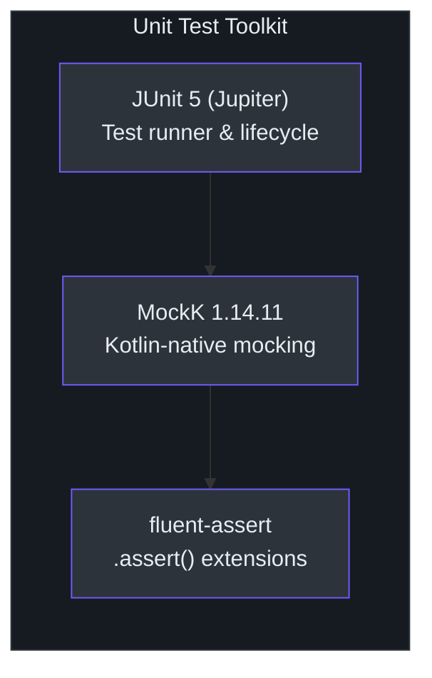
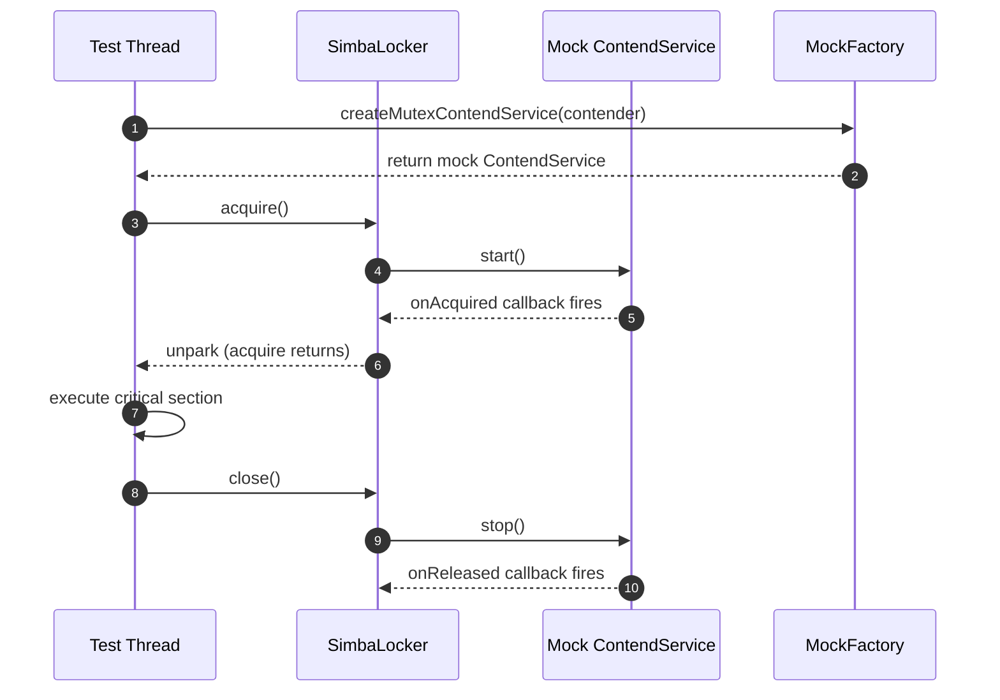
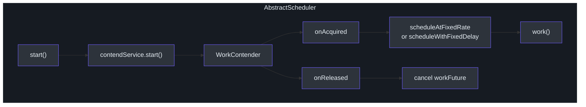

# Unit Testing Guide

This guide covers unit testing strategies for Simba's core components. Unit tests run fast, require no external infrastructure, and validate individual component behavior in isolation using MockK for mocking.

## Testing Stack



| Tool | Version | Purpose |
|---|---|---|
| JUnit 5 (Jupiter) | Bundled with Spring Boot 4.1.0 | Test runner and lifecycle |
| MockK | 1.14.11 | Kotlin-native mocking |
| fluent-assert | `me.ahoo.test:fluent-assert-core` | Kotlin-idiomatic assertions via `.assert()` |

**Important**: Always use `import me.ahoo.test.asserts.assert` instead of AssertJ's `assertThat()`. The fluent-assert library provides null-safe Kotlin extension functions that wrap AssertJ.

## Core Value Object Tests

### MutexOwner

[`MutexOwner`](https://github.com/Ahoo-Wang/Simba/blob/main/simba-core/src/main/kotlin/me/ahoo/simba/core/MutexOwner.kt) is an immutable value object representing lock ownership state. It tracks four fields:

- `ownerId` -- the contender that holds the lock
- `acquiredAt` -- timestamp when ownership was acquired
- `ttlAt` -- absolute timestamp when the TTL expires
- `transitionAt` -- absolute timestamp when the transition (grace) period expires

```kotlin
import me.ahoo.simba.core.MutexOwner
import me.ahoo.test.asserts.assert
import org.junit.jupiter.api.Test

class MutexOwnerTest {

    @Test
    fun `isOwner returns true when contenderId matches`() {
        val owner = MutexOwner(ownerId = "contender-1")
        owner.isOwner("contender-1").assert().isTrue()
    }

    @Test
    fun `isOwner returns false when contenderId does not match`() {
        val owner = MutexOwner(ownerId = "contender-1")
        owner.isOwner("contender-2").assert().isFalse()
    }

    @Test
    fun `NONE has empty ownerId and zero timestamps`() {
        MutexOwner.NONE.ownerId.assert().isEqualTo("")
        MutexOwner.NONE.acquiredAt.assert().isEqualTo(0)
        MutexOwner.NONE.ttlAt.assert().isEqualTo(0)
        MutexOwner.NONE.transitionAt.assert().isEqualTo(0)
    }

    @Test
    fun `isInTtl returns true when ttlAt is in the future`() {
        val futureTtl = System.currentTimeMillis() + 10_000
        val owner = MutexOwner("c1", ttlAt = futureTtl)
        owner.isInTtl.assert().isTrue()
    }

    @Test
    fun `isInTtl returns false when ttlAt is in the past`() {
        val pastTtl = System.currentTimeMillis() - 10_000
        val owner = MutexOwner("c1", ttlAt = pastTtl)
        owner.isInTtl.assert().isFalse()
    }

    @Test
    fun `hasOwner returns true when transitionAt is in the future`() {
        val futureTransition = System.currentTimeMillis() + 10_000
        val owner = MutexOwner("c1", transitionAt = futureTransition)
        owner.hasOwner().assert().isTrue()
    }

    @Test
    fun `isInTransitionOf returns false for non-owner`() {
        val owner = MutexOwner(
            ownerId = "c1",
            transitionAt = System.currentTimeMillis() + 10_000
        )
        owner.isInTransitionOf("c2").assert().isFalse()
    }
}
```

### MutexState

[`MutexState`](https://github.com/Ahoo-Wang/Simba/blob/main/simba-core/src/main/kotlin/me/ahoo/simba/core/MutexState.kt) represents a state transition from `before` to `after` ownership:

```kotlin
import me.ahoo.simba.core.MutexOwner
import me.ahoo.simba.core.MutexState
import me.ahoo.test.asserts.assert
import org.junit.jupiter.api.Test

class MutexStateTest {

    @Test
    fun `isChanged is true when owner changes`() {
        val state = MutexState(
            before = MutexOwner("c1"),
            after = MutexOwner("c2")
        )
        state.isChanged.assert().isTrue()
    }

    @Test
    fun `isChanged is false when owner does not change`() {
        val state = MutexState(
            before = MutexOwner("c1"),
            after = MutexOwner("c1")
        )
        state.isChanged.assert().isFalse()
    }

    @Test
    fun `isAcquired returns true only for the new owner on change`() {
        val state = MutexState(
            before = MutexOwner("c1"),
            after = MutexOwner("c2")
        )
        state.isAcquired("c2").assert().isTrue()
        state.isAcquired("c1").assert().isFalse()
    }

    @Test
    fun `isReleased returns true only for the old owner on change`() {
        val state = MutexState(
            before = MutexOwner("c1"),
            after = MutexOwner("c2")
        )
        state.isReleased("c1").assert().isTrue()
        state.isReleased("c2").assert().isFalse()
    }

    @Test
    fun `NONE has NONE owners on both sides`() {
        MutexState.NONE.before.assert().isEqualTo(MutexOwner.NONE)
        MutexState.NONE.after.assert().isEqualTo(MutexOwner.NONE)
        MutexState.NONE.isChanged.assert().isFalse()
    }
}
```

### ContendPeriod

[`ContendPeriod`](https://github.com/Ahoo-Wang/Simba/blob/main/simba-core/src/main/kotlin/me/ahoo/simba/core/ContendPeriod.kt) computes scheduling delays for the next contention cycle. Owner delay = `ttlAt - now`. Contender delay includes random jitter between -200ms and +1000ms:

```kotlin
import me.ahoo.simba.core.ContendPeriod
import me.ahoo.simba.core.MutexOwner
import me.ahoo.test.asserts.assert
import org.junit.jupiter.api.Test

class ContendPeriodTest {

    @Test
    fun `nextOwnerDelay returns time remaining until ttl`() {
        val ttlAt = System.currentTimeMillis() + 5000
        val owner = MutexOwner("c1", ttlAt = ttlAt, transitionAt = ttlAt + 3000)
        val period = ContendPeriod("c1")
        val delay = period.nextOwnerDelay(owner)
        delay.assert().isBetween(4500L, 5100L)
    }

    @Test
    fun `nextContenderDelay returns delay near transitionAt with jitter`() {
        val now = System.currentTimeMillis()
        val ttlAt = now + 2000
        val transitionAt = now + 5000
        val owner = MutexOwner("other", ttlAt = ttlAt, transitionAt = transitionAt)
        val period = ContendPeriod("c1")
        // Delay is transitionAt - now + random(-200..1000)
        val delay = period.nextContenderDelay(owner)
        delay.assert().isGreaterThanOrEqualTo(4800L) // 5000 - 200
        delay.assert().isLessThanOrEqualTo(6010L)    // 5000 + 1000 + margin
    }

    @Test
    fun `ensureNextDelay never returns negative`() {
        val pastTransition = System.currentTimeMillis() - 1000
        val owner = MutexOwner("other", ttlAt = pastTransition, transitionAt = pastTransition)
        val period = ContendPeriod("c1")
        period.ensureNextDelay(owner).assert().isGreaterThanOrEqualTo(0)
    }
}
```

## Testing MutexContender Callbacks

[`MutexContender`](https://github.com/Ahoo-Wang/Simba/blob/main/simba-core/src/main/kotlin/me/ahoo/simba/core/MutexContender.kt) defines the callback interface. The default `notifyOwner()` implementation dispatches to `onAcquired()` and `onReleased()` based on state changes:

```kotlin
import me.ahoo.simba.core.AbstractMutexContender
import me.ahoo.simba.core.MutexOwner
import me.ahoo.simba.core.MutexState
import me.ahoo.test.asserts.assert
import org.junit.jupiter.api.Test
import java.util.concurrent.atomic.AtomicBoolean

class MutexContenderTest {

    private class TestContender(mutex: String) : AbstractMutexContender(mutex) {
        val acquiredCalled = AtomicBoolean(false)
        val releasedCalled = AtomicBoolean(false)

        override fun onAcquired(mutexState: MutexState) {
            acquiredCalled.set(true)
        }

        override fun onReleased(mutexState: MutexState) {
            releasedCalled.set(true)
        }
    }

    @Test
    fun `notifyOwner fires onAcquired when this contender becomes owner`() {
        val contender = TestContender("test-mutex")
        val state = MutexState(
            before = MutexOwner("other"),
            after = MutexOwner(contender.contenderId)
        )
        contender.notifyOwner(state)
        contender.acquiredCalled.get().assert().isTrue()
        contender.releasedCalled.get().assert().isFalse()
    }

    @Test
    fun `notifyOwner fires onReleased when this contender loses ownership`() {
        val contender = TestContender("test-mutex")
        val state = MutexState(
            before = MutexOwner(contender.contenderId),
            after = MutexOwner("other")
        )
        contender.notifyOwner(state)
        contender.acquiredCalled.get().assert().isFalse()
        contender.releasedCalled.get().assert().isTrue()
    }

    @Test
    fun `notifyOwner does nothing when state is unchanged`() {
        val contender = TestContender("test-mutex")
        val state = MutexState(
            before = MutexOwner(contender.contenderId),
            after = MutexOwner(contender.contenderId)
        )
        contender.notifyOwner(state)
        contender.acquiredCalled.get().assert().isFalse()
        contender.releasedCalled.get().assert().isFalse()
    }
}
```

## Testing SimbaLocker

[`SimbaLocker`](https://github.com/Ahoo-Wang/Simba/blob/main/simba-core/src/main/kotlin/me/ahoo/simba/locker/SimbaLocker.kt) implements RAII-style locking via `AutoCloseable`. Testing it requires mocking the `MutexContendServiceFactory` to control when acquisition callbacks fire:



```kotlin
import io.mockk.every
import io.mockk.mockk
import me.ahoo.simba.core.MutexContendService
import me.ahoo.simba.core.MutexContendServiceFactory
import me.ahoo.simba.core.MutexContender
import me.ahoo.simba.core.MutexOwner
import me.ahoo.simba.core.MutexState
import me.ahoo.simba.locker.SimbaLocker
import me.ahoo.test.asserts.assert
import org.junit.jupiter.api.Test
import java.util.concurrent.CompletableFuture
import java.util.concurrent.TimeUnit

class SimbaLockerTest {

    @Test
    fun `acquire blocks until onAcquired is called`() {
        val mockService = mockk<MutexContendService>()
        val mockFactory = mockk<MutexContendServiceFactory>()

        every { mockFactory.createMutexContendService(any()) } answers {
            val contender = firstArg<MutexContender>()
            // Simulate async acquisition after start() is called
            every { mockService.start() } answers {
                Thread {
                    TimeUnit.MILLISECONDS.sleep(100)
                    contender.notifyOwner(
                        MutexState(MutexOwner.NONE, MutexOwner(contender.contenderId))
                    )
                }.start()
            }
            every { mockService.stop() } returns Unit
            every { mockService.isOwner } returns true
            mockService
        }

        val locker = SimbaLocker("test-mutex", mockFactory)
        val acquired = CompletableFuture<Boolean>()

        val thread = Thread {
            locker.acquire()
            acquired.complete(true)
            locker.close()
        }
        thread.start()

        acquired.get(5, TimeUnit.SECONDS).assert().isTrue()
    }

    @Test
    fun `double acquire on same thread throws IllegalMonitorStateException`() {
        val mockService = mockk<MutexContendService>()
        val mockFactory = mockk<MutexContendServiceFactory>()

        every { mockFactory.createMutexContendService(any()) } returns mockService
        every { mockService.start() } returns Unit
        every { mockService.stop() } returns Unit
        every { mockService.isOwner } returns true

        val locker = SimbaLocker("test-mutex", mockFactory)
        // Set the owner field directly to simulate first acquire
        // This tests the guard in acquire()
        val ownerField = SimbaLocker::class.java.getDeclaredField("owner")
        ownerField.isAccessible = true
        ownerField.set(locker, Thread.currentThread())

        org.junit.jupiter.api.assertThrows<IllegalMonitorStateException> {
            locker.acquire()
        }
    }
}
```

## Testing AbstractScheduler

[`AbstractScheduler`](https://github.com/Ahoo-Wang/Simba/blob/main/simba-core/src/main/kotlin/me/ahoo/simba/schedule/AbstractScheduler.kt) wraps a `MutexContendService` and schedules periodic `work()` calls only when leadership is held. The `WorkContender` inner class manages a `ScheduledThreadPoolExecutor`:



```kotlin
import io.mockk.every
import io.mockk.mockk
import me.ahoo.simba.core.MutexContendService
import me.ahoo.simba.core.MutexContendServiceFactory
import me.ahoo.simba.core.MutexContender
import me.ahoo.simba.core.MutexOwner
import me.ahoo.simba.core.MutexState
import me.ahoo.simba.schedule.AbstractScheduler
import me.ahoo.simba.schedule.ScheduleConfig
import me.ahoo.test.asserts.assert
import org.junit.jupiter.api.Test
import java.time.Duration
import java.util.concurrent.CompletableFuture
import java.util.concurrent.TimeUnit

class AbstractSchedulerTest {

    @Test
    fun `scheduler calls work after acquiring leadership`() {
        val workCalled = CompletableFuture<Boolean>()
        val mockService = mockk<MutexContendService>()
        val mockFactory = mockk<MutexContendServiceFactory>()

        every { mockFactory.createMutexContendService(any()) } answers {
            val contender = firstArg<MutexContender>()
            every { mockService.start() } answers {
                Thread {
                    TimeUnit.MILLISECONDS.sleep(50)
                    contender.notifyOwner(
                        MutexState(
                            MutexOwner.NONE,
                            MutexOwner(contender.contenderId)
                        )
                    )
                }.start()
            }
            every { mockService.stop() } returns Unit
            every { mockService.running } returns true
            mockService
        }

        val scheduler = object : AbstractScheduler("test-mutex", mockFactory) {
            override val config = ScheduleConfig.delay(Duration.ZERO, Duration.ofSeconds(1))
            override val worker = "TestWorker"
            override fun work() {
                workCalled.complete(true)
            }
        }

        scheduler.start()
        workCalled.get(5, TimeUnit.SECONDS).assert().isTrue()
        scheduler.stop()
    }

    @Test
    fun `scheduler reports running state correctly`() {
        val mockService = mockk<MutexContendService>()
        val mockFactory = mockk<MutexContendServiceFactory>()

        every { mockFactory.createMutexContendService(any()) } returns mockService
        every { mockService.start() } returns Unit
        every { mockService.stop() } returns Unit
        every { mockService.running } returnsMany listOf(false, true, false)

        val scheduler = object : AbstractScheduler("test-mutex", mockFactory) {
            override val config = ScheduleConfig.delay(Duration.ZERO, Duration.ofSeconds(1))
            override val worker = "TestWorker"
            override fun work() {}
        }

        scheduler.running.assert().isFalse()
        scheduler.start()
        scheduler.running.assert().isTrue()
        scheduler.stop()
        scheduler.running.assert().isFalse()
    }
}
```

## Testing ScheduleConfig

[`ScheduleConfig`](https://github.com/Ahoo-Wang/Simba/blob/main/simba-core/src/main/kotlin/me/ahoo/simba/schedule/ScheduleConfig.kt) is a data class with two factory methods:

```kotlin
import me.ahoo.simba.schedule.ScheduleConfig
import me.ahoo.test.asserts.assert
import org.junit.jupiter.api.Test
import java.time.Duration

class ScheduleConfigTest {

    @Test
    fun `rate factory creates FIXED_RATE strategy`() {
        val config = ScheduleConfig.rate(Duration.ofSeconds(1), Duration.ofSeconds(5))
        config.strategy.assert().isEqualTo(ScheduleConfig.Strategy.FIXED_RATE)
        config.initialDelay.assert().isEqualTo(Duration.ofSeconds(1))
        config.period.assert().isEqualTo(Duration.ofSeconds(5))
    }

    @Test
    fun `delay factory creates FIXED_DELAY strategy`() {
        val config = ScheduleConfig.delay(Duration.ZERO, Duration.ofSeconds(2))
        config.strategy.assert().isEqualTo(ScheduleConfig.Strategy.FIXED_DELAY)
        config.initialDelay.assert().isEqualTo(Duration.ZERO)
        config.period.assert().isEqualTo(Duration.ofSeconds(2))
    }
}
```

## ContenderIdGenerator Tests

[`ContenderIdGenerator`](https://github.com/Ahoo-Wang/Simba/blob/main/simba-core/src/main/kotlin/me/ahoo/simba/core/ContenderIdGenerator.kt) provides two strategies: `HOST` (host address + process ID + counter) and `UUID` (random UUID without dashes):

```kotlin
import me.ahoo.simba.core.ContenderIdGenerator
import me.ahoo.test.asserts.assert
import org.junit.jupiter.api.Test

class ContenderIdGeneratorTest {

    @Test
    fun `HOST generator produces unique sequential ids`() {
        val id1 = ContenderIdGenerator.HOST.generate()
        val id2 = ContenderIdGenerator.HOST.generate()
        id1.assert().isNotEqualTo(id2)
        id1.assert().isNotBlank()
    }

    @Test
    fun `UUID generator produces 32-char hex strings`() {
        val id = ContenderIdGenerator.UUID.generate()
        id.assert().hasSize(32)
        id.assert().matches("[0-9a-f]{32}")
    }

    @Test
    fun `UUID generator produces unique values`() {
        val id1 = ContenderIdGenerator.UUID.generate()
        val id2 = ContenderIdGenerator.UUID.generate()
        id1.assert().isNotEqualTo(id2)
    }
}
```

## MockK Patterns for Simba

### Mocking MutexContendServiceFactory

When testing any component that depends on `MutexContendServiceFactory`, create a mock that returns a controllable `MutexContendService`:

```kotlin
fun createMockFactory(
    onAcquiredCallback: () -> Unit = {},
    onReleasedCallback: () -> Unit = {}
): MutexContendServiceFactory {
    val factory = mockk<MutexContendServiceFactory>()
    every { factory.createMutexContendService(any()) } answers {
        val contender = firstArg<MutexContender>()
        val service = mockk<MutexContendService>()
        every { service.start() } answers {
            Thread {
                contender.notifyOwner(
                    MutexState(MutexOwner.NONE, MutexOwner(contender.contenderId))
                )
                onAcquiredCallback()
            }.start()
        }
        every { service.stop() } answers {
            contender.notifyOwner(
                MutexState(MutexOwner(contender.contenderId), MutexOwner.NONE)
            )
            onReleasedCallback()
        }
        every { service.isOwner } returns true
        every { service.running } returns true
        service
    }
    return factory
}
```

### Simulating Contention Failures

To test failure scenarios, mock the contender to never receive the `onAcquired` callback:

```kotlin
@Test
fun `acquire with timeout throws TimeoutException when lock not obtained`() {
    val factory = mockk<MutexContendServiceFactory>()
    every { factory.createMutexContendService(any()) } answers {
        val service = mockk<MutexContendService>()
        every { service.start() } returns Unit  // never fires onAcquired
        every { service.stop() } returns Unit
        every { service.isOwner } returns false
        service
    }

    val locker = SimbaLocker("timeout-mutex", factory)
    org.junit.jupiter.api.assertThrows<java.util.concurrent.TimeoutException> {
        locker.acquire(java.time.Duration.ofMillis(200))
    }
    locker.close()
}
```

## Best Practices

1. **Use `@TestInstance(TestInstance.Lifecycle.PER_CLASS)`** for integration-style tests that share expensive setup (as seen in backend tests like [`JdbcMutexContendServiceTest`](https://github.com/Ahoo-Wang/Simba/blob/main/simba-jdbc/src/test/kotlin/me/ahoo/simba/jdbc/JdbcMutexContendServiceTest.kt)).

2. **Prefer `CompletableFuture` over `Thread.sleep`** for synchronization in async tests. Use `future.get(timeout, TimeUnit)` to avoid infinite hangs.

3. **Always clean up resources** in `@AfterAll` or `@AfterEach`. Simba services hold thread pools and subscriptions that must be released.

4. **Use `.assert()` from fluent-assert** instead of `assertThat()` from AssertJ or Hamcrest for null-safe, Kotlin-idiomatic assertions.

5. **Test both success and failure paths** -- especially for timeout behavior, double-acquire prevention, and state transitions.

## Next Steps

- [Integration Testing](./integration-testing.md) -- Backend-specific infrastructure setup
- [TCK Reference](./tck.md) -- Understanding the shared test base classes
