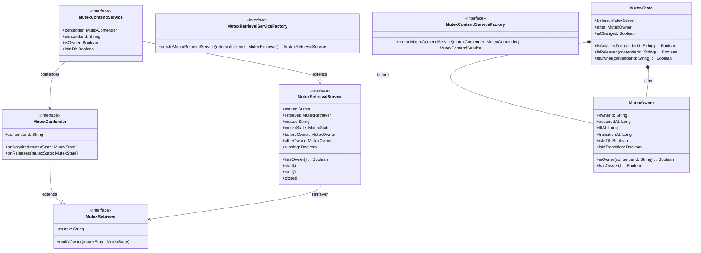
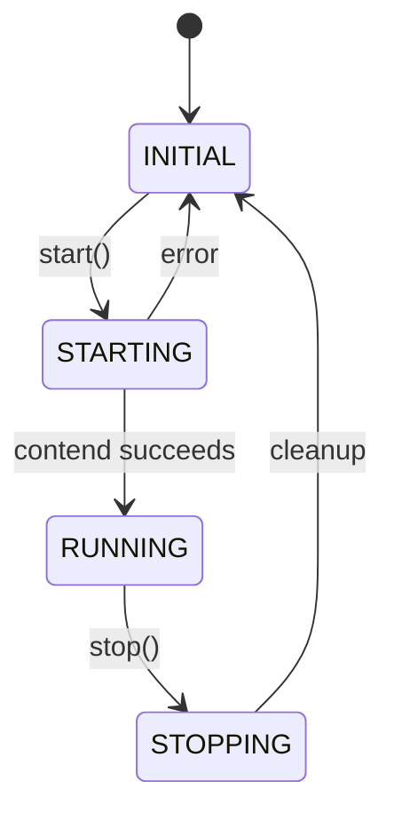
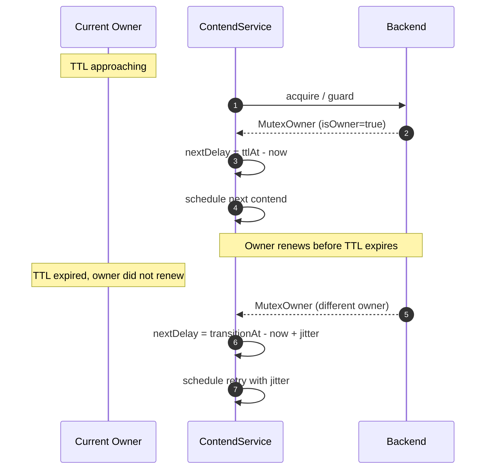
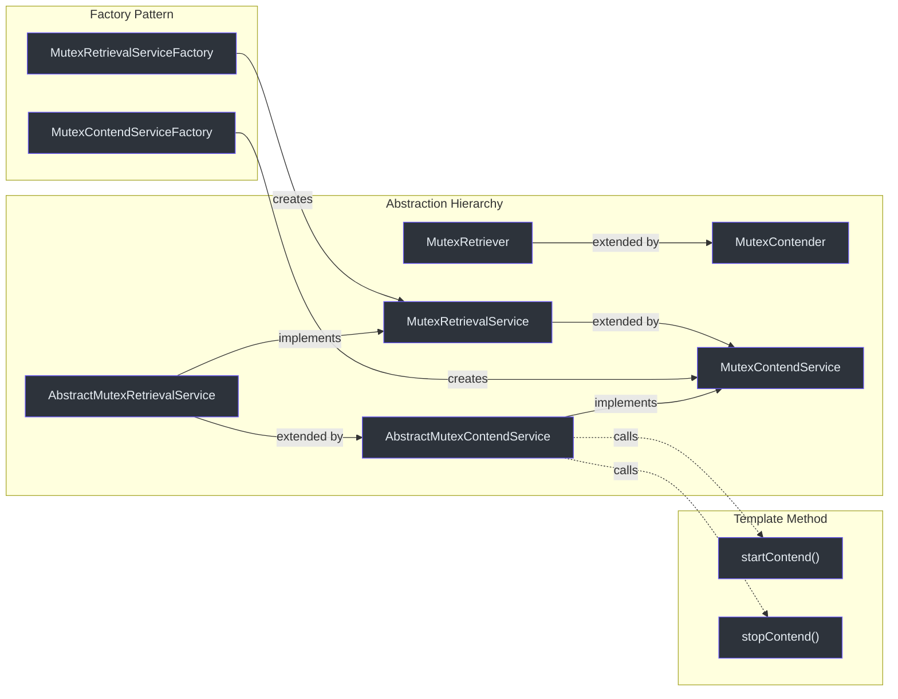

# 核心接口

核心竞争协议由 `me.ahoo.simba.core` 包中的一小组接口和抽象类定义。本页文档记录了每个类型的方法签名、关系和使用示例。

## 类图



## MutexRetriever

竞争协议中最基本的契约。任何希望参与互斥竞争的对象都必须实现此接口。

**源码：** [simba-core/.../MutexRetriever.kt:20](https://github.com/Ahoo-Wang/Simba/blob/main/simba-core/src/main/kotlin/me/ahoo/simba/core/MutexRetriever.kt#L20)

```kotlin
interface MutexRetriever {
    val mutex: String
    fun notifyOwner(mutexState: MutexState)
}
```

| 方法 | 返回值 | 描述 |
|---|---|---|
| `mutex` | `String` | 互斥资源的逻辑名称。必须非空。 |
| `notifyOwner(mutexState)` | `void` | 每当互斥锁所有者变更时由检索服务调用。`MutexState` 包含前一个和当前所有者。 |

## MutexContender

扩展 `MutexRetriever`，增加了竞争者身份标识和生命周期回调。这是应用代码主要实现的接口。

**源码：** [simba-core/.../MutexContender.kt:20](https://github.com/Ahoo-Wang/Simba/blob/main/simba-core/src/main/kotlin/me/ahoo/simba/core/MutexContender.kt#L20)

```kotlin
interface MutexContender : MutexRetriever {
    val contenderId: String
    fun onAcquired(mutexState: MutexState)
    fun onReleased(mutexState: MutexState)
}
```

| 方法 | 返回值 | 描述 |
|---|---|---|
| `contenderId` | `String` | 此竞争者实例的唯一标识符。通常由 `ContenderIdGenerator` 生成。 |
| `onAcquired(mutexState)` | `void` | 当此竞争者成为互斥锁所有者时调用。可用于启动仅领导者执行的工作。 |
| `onReleased(mutexState)` | `void` | 当此竞争者丢失互斥锁时调用（无论是由于 TTL 到期、显式停止还是其他竞争者接管）。 |
| `notifyOwner(mutexState)` | `void` | 默认实现根据变更检测分发到 `onAcquired`/`onReleased`。 |

默认的 `notifyOwner` 实现会检查 `MutexState`：

```kotlin
override fun notifyOwner(mutexState: MutexState) {
    if (!mutexState.isChanged) return
    if (mutexState.isAcquired(contenderId)) onAcquired(mutexState)
    if (mutexState.isReleased(contenderId)) onReleased(mutexState)
}
```

## MutexRetrievalService

具有生命周期管理的检索服务。提供 start/stop 语义并暴露当前互斥状态。

**源码：** [simba-core/.../MutexRetrievalService.kt:20](https://github.com/Ahoo-Wang/Simba/blob/main/simba-core/src/main/kotlin/me/ahoo/simba/core/MutexRetrievalService.kt#L20)

```kotlin
interface MutexRetrievalService : AutoCloseable {
    val status: Status
    val retriever: MutexRetriever
    val mutex: String
    val mutexState: MutexState
    val beforeOwner: MutexOwner
    val afterOwner: MutexOwner
    fun hasOwner(): Boolean
    val running: Boolean
    fun start()
    fun stop()
}
```

| 方法 / 属性 | 返回值 | 描述 |
|---|---|---|
| `status` | `Status` | 当前生命周期状态：`INITIAL`、`STARTING`、`RUNNING`、`STOPPING` |
| `retriever` | `MutexRetriever` | 此服务绑定的检索器 |
| `mutex` | `String` | 互斥锁名称，从 `retriever.mutex` 委托 |
| `mutexState` | `MutexState` | 当前状态快照（与后端弱一致） |
| `beforeOwner` | `MutexOwner` | 上次转换中的前一个所有者 |
| `afterOwner` | `MutexOwner` | 上次转换中的当前所有者 |
| `hasOwner()` | `Boolean` | 如果 `afterOwner !== MutexOwner.NONE` 则为 `true` |
| `running` | `Boolean` | 如果 `status` 为 `STARTING` 或 `RUNNING` 则为 `true` |
| `start()` | `void` | 从 `INITIAL` 转换到 `RUNNING`。如果不在 `INITIAL` 状态则抛出异常。 |
| `stop()` | `void` | 从 `RUNNING` 转换到 `INITIAL`。如果不在 `RUNNING` 状态则抛出异常。 |
| `close()` | `void` | 委托给 `stop()` |

### Status 枚举

```kotlin
enum class Status {
    INITIAL,   // 未启动
    STARTING,  // 正在启动中
    RUNNING,   // 正在积极竞争
    STOPPING;  // 正在停止中

    val isActive: Boolean
        get() = this == STARTING || this == RUNNING
}
```



## MutexContendService

扩展 `MutexRetrievalService`，增加竞争者特定的所有权查询。

**源码：** [simba-core/.../MutexContendService.kt:20](https://github.com/Ahoo-Wang/Simba/blob/main/simba-core/src/main/kotlin/me/ahoo/simba/core/MutexContendService.kt#L20)

```kotlin
interface MutexContendService : MutexRetrievalService {
    val contender: MutexContender
    val contenderId: String
    val isOwner: Boolean
    val isInTtl: Boolean
}
```

| 方法 / 属性 | 返回值 | 描述 |
|---|---|---|
| `contender` | `MutexContender` | 绑定的竞争者实例 |
| `contenderId` | `String` | 委托给 `contender.contenderId` |
| `isOwner` | `Boolean` | 如果 `afterOwner.ownerId == contenderId` 则为 `true` |
| `isInTtl` | `Boolean` | 如果竞争者是所有者且锁未超过 TTL 则为 `true` |

## MutexRetrievalServiceFactory

**源码：** [simba-core/.../MutexRetrievalServiceFactory.kt:20](https://github.com/Ahoo-Wang/Simba/blob/main/simba-core/src/main/kotlin/me/ahoo/simba/core/MutexRetrievalServiceFactory.kt#L20)

```kotlin
interface MutexRetrievalServiceFactory {
    fun createMutexRetrievalService(retrievalListener: MutexRetriever): MutexRetrievalService
}
```

## MutexContendServiceFactory

**源码：** [simba-core/.../MutexContendServiceFactory.kt:20](https://github.com/Ahoo-Wang/Simba/blob/main/simba-core/src/main/kotlin/me/ahoo/simba/core/MutexContendServiceFactory.kt#L20)

```kotlin
interface MutexContendServiceFactory {
    fun createMutexContendService(mutexContender: MutexContender): MutexContendService
}
```

每个后端模块提供一个具体实现：
- `simba-jdbc` 中的 `JdbcMutexContendServiceFactory`
- `simba-spring-redis` 中的 `SpringRedisMutexContendServiceFactory`
- `simba-zookeeper` 中的 `ZookeeperMutexContendServiceFactory`

## AbstractMutexContender

一个便捷的基类，为 `onAcquired` 和 `onReleased` 提供默认日志记录。

**源码：** [simba-core/.../AbstractMutexContender.kt:22](https://github.com/Ahoo-Wang/Simba/blob/main/simba-core/src/main/kotlin/me/ahoo/simba/core/AbstractMutexContender.kt#L22)

```kotlin
abstract class AbstractMutexContender(
    final override val mutex: String,
    final override val contenderId: String = ContenderIdGenerator.HOST.generate()
) : MutexContender
```

| 参数 | 默认值 | 描述 |
|---|---|---|
| `mutex` | -- | 互斥资源名称。必须非空。 |
| `contenderId` | `ContenderIdGenerator.HOST.generate()` | 自动生成的 `counter:pid@host` 格式 |

## AbstractMutexRetrievalService

检索服务的模板方法基类。使用 `AtomicReferenceFieldUpdater` 管理 `Status` 状态机，实现线程安全的状态转换。

**源码：** [simba-core/.../AbstractMutexRetrievalService.kt:26](https://github.com/Ahoo-Wang/Simba/blob/main/simba-core/src/main/kotlin/me/ahoo/simba/core/AbstractMutexRetrievalService.kt#L26)

```kotlin
abstract class AbstractMutexRetrievalService(
    override val retriever: MutexRetriever,
    protected val handleExecutor: Executor
) : MutexRetrievalService
```

关键行为：
- `start()` -- 通过 CAS 从 `INITIAL` 转换到 `STARTING`，调用 `startRetrieval()`，设置 `RUNNING`
- `stop()` -- 通过 CAS 从 `RUNNING` 转换到 `STOPPING`，调用 `stopRetrieval()`，设置 `INITIAL`
- `notifyOwner(newOwner)` -- 在 `handleExecutor` 上分发 `safeNotifyOwner`，更新 `mutexState` 并调用 `retriever.notifyOwner`

## AbstractMutexContendService

将 `AbstractMutexRetrievalService` 与后端特定的竞争逻辑桥接。

**源码：** [simba-core/.../AbstractMutexContendService.kt:22](https://github.com/Ahoo-Wang/Simba/blob/main/simba-core/src/main/kotlin/me/ahoo/simba/core/AbstractMutexContendService.kt#L22)

```kotlin
abstract class AbstractMutexContendService(
    override val contender: MutexContender,
    handleExecutor: Executor
) : AbstractMutexRetrievalService(contender, handleExecutor), MutexContendService {

    override fun startRetrieval() {
        resetOwner()
        startContend()
    }

    override fun stopRetrieval() {
        stopContend()
    }

    protected abstract fun startContend()
    protected abstract fun stopContend()
}
```

后端模块（`simba-jdbc`、`simba-spring-redis`、`simba-zookeeper`）继承此类并实现 `startContend()` 和 `stopContend()`。

## MutexOwner

一个不可变值对象，表示某个时间点的互斥锁所有权快照。

**源码：** [simba-core/.../MutexOwner.kt:23](https://github.com/Ahoo-Wang/Simba/blob/main/simba-core/src/main/kotlin/me/ahoo/simba/core/MutexOwner.kt#L23)

```kotlin
@Immutable
open class MutexOwner(
    val ownerId: String,
    val acquiredAt: Long = System.currentTimeMillis(),
    val ttlAt: Long = Long.MAX_VALUE,
    val transitionAt: Long = Long.MAX_VALUE
)
```

| 属性 | 类型 | 描述 |
|---|---|---|
| `ownerId` | `String` | 当前所有者的 `contenderId`。空字符串（`NONE_OWNER_ID`）表示无所有者。 |
| `acquiredAt` | `Long` | 获取锁时的时间戳（纪元毫秒） |
| `ttlAt` | `Long` | TTL 到期的时间戳。此后所有者应续期，或其他竞争者可能接管。 |
| `transitionAt` | `Long` | 转换/宽限期结束时间。在此窗口期间，当前所有者可以优先续期。 |

| 方法 | 返回值 | 描述 |
|---|---|---|
| `isOwner(contenderId)` | `Boolean` | 检查给定 ID 是否匹配 `ownerId` |
| `isInTtl` | `Boolean` | 如果 `ttlAt > System.currentTimeMillis()` 则为 `true` |
| `isInTtl(contenderId)` | `Boolean` | 如果是所有者且在 TTL 内则为 `true` |
| `isInTransition` | `Boolean` | 如果 `transitionAt >= System.currentTimeMillis()` 则为 `true` |
| `hasOwner()` | `Boolean` | 如果 `transitionAt >= System.currentTimeMillis()` 则为 `true` |
| `MutexOwner.NONE` | `MutexOwner` | 哨兵值：`ownerId = ""`，所有时间戳为 `0` |

## MutexState

表示两个所有者之间的转换。用作 `notifyOwner` 的参数。

**源码：** [simba-core/.../MutexState.kt:20](https://github.com/Ahoo-Wang/Simba/blob/main/simba-core/src/main/kotlin/me/ahoo/simba/core/MutexState.kt#L20)

```kotlin
data class MutexState(
    val before: MutexOwner,
    val after: MutexOwner
)
```

| 方法 | 返回值 | 描述 |
|---|---|---|
| `isChanged` | `Boolean` | 如果 `before.ownerId != after.ownerId` 则为 `true` |
| `isAcquired(contenderId)` | `Boolean` | `isChanged && after.isOwner(contenderId)` |
| `isReleased(contenderId)` | `Boolean` | `isChanged && before.isOwner(contenderId)` |
| `isOwner(contenderId)` | `Boolean` | `after.isOwner(contenderId)` |
| `MutexState.NONE` | `MutexState` | `MutexState(MutexOwner.NONE, MutexOwner.NONE)` |

## ContendPeriod

计算竞争循环的下一个调度延迟。所有者在 TTL 到期前续期；非所有者带随机抖动等待。

**源码：** [simba-core/.../ContendPeriod.kt:22](https://github.com/Ahoo-Wang/Simba/blob/main/simba-core/src/main/kotlin/me/ahoo/simba/core/ContendPeriod.kt#L22)

```kotlin
class ContendPeriod(private val contenderId: String) {
    fun ensureNextDelay(mutexOwner: MutexOwner): Long
    fun nextDelay(mutexOwner: MutexOwner): Long
}
```

| 场景 | 延迟计算 |
|---|---|
| **当前所有者** | `ttlAt - now`（在 TTL 到期前续期） |
| **非所有者（无转换期）** | `transitionAt - now + random(0, 1000)` |
| **非所有者（有转换期）** | `transitionAt - now + random(-200, 1000)` |

随机抖动（`-200ms` 到 `+1000ms`）防止多个竞争者同时重试时产生的惊群效应。



## ContenderIdGenerator

生成唯一竞争者标识符。

**源码：** [simba-core/.../ContenderIdGenerator.kt:24](https://github.com/Ahoo-Wang/Simba/blob/main/simba-core/src/main/kotlin/me/ahoo/simba/core/ContenderIdGenerator.kt#L24)

```kotlin
interface ContenderIdGenerator {
    fun generate(): String
}
```

| 实现 | 格式 | 示例 |
|---|---|---|
| `ContenderIdGenerator.HOST`（默认） | `{counter}:{pid}@{host}` | `0:12345@192.168.1.10` |
| `ContenderIdGenerator.UUID` | 不带连字符的 UUID | `a1b2c3d4e5f6...` |

`HOST` 策略是首选，因为它人类可读，有助于在日志中调试。计数器是进程级的 `AtomicLong`，每次创建竞争者时递增。

## 使用示例

```kotlin
import me.ahoo.simba.core.*

class MyService : AbstractMutexContender("order-settlement") {

    override fun onAcquired(mutexState: MutexState) {
        super.onAcquired(mutexState)
        println("[$contenderId] acquired leadership for ${mutex}")
        startSettlementTask()
    }

    override fun onReleased(mutexState: MutexState) {
        super.onReleased(mutexState)
        println("[$contenderId] lost leadership for ${mutex}")
        stopSettlementTask()
    }

    private fun startSettlementTask() { /* ... */ }
    private fun stopSettlementTask() { /* ... */ }
}

// 组装
val factory: MutexContendServiceFactory = JdbcMutexContendServiceFactory(
    mutexOwnerRepository = repository,
    initialDelay = Duration.ZERO,
    ttl = Duration.ofSeconds(10),
    transition = Duration.ofSeconds(6)
)

val service = factory.createMutexContendService(MyService())
service.start()
```

## 关系总结



## 另请参阅

- [Locker API](./locker-api) -- 基于 `MutexContendService` 构建的 RAII 风格锁定
- [Scheduler API](./scheduler-api) -- 领导者门控的定时任务
- [simba-core 模块](/modules/simba-core) -- 模块详情和包结构
