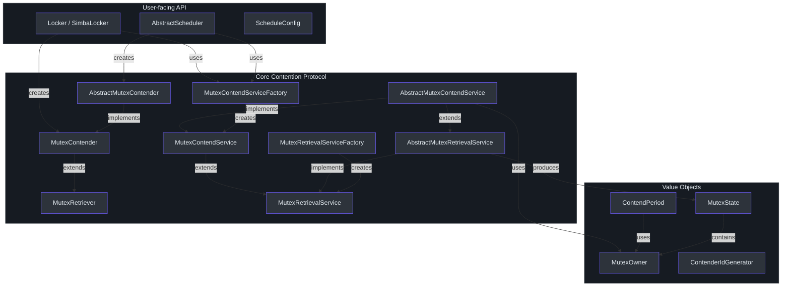
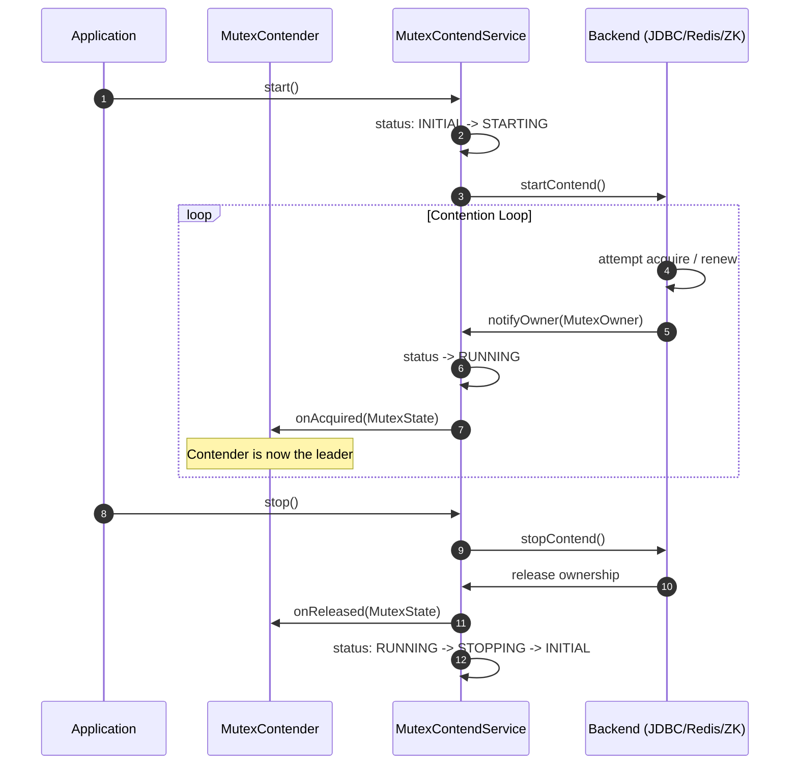
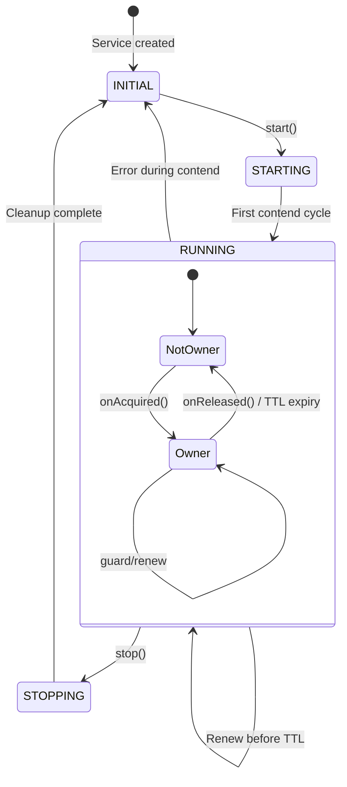
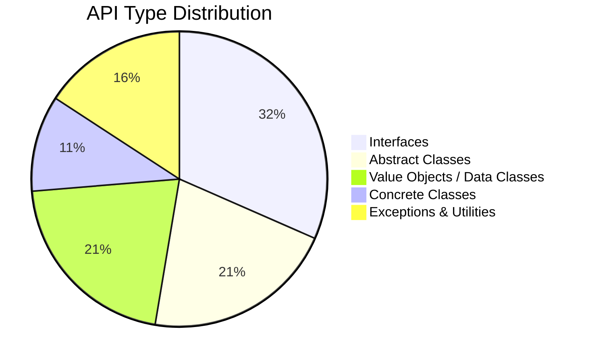

# API 参考

Simba 暴露了一套小巧的、分层的 API，围绕**互斥竞争**的概念构建：多个服务实例竞争一个命名互斥锁的独占所有权，获胜者在获取或丢失锁时收到回调。所有公共类型都位于 `simba-core` 模块下的 `me.ahoo.simba.*` 包中。

## API 层级架构

下图展示了公共 API 类型如何组织为层级结构。面向用户的抽象（Locker、Scheduler）位于顶层，核心竞争协议位于中间层，后端特定的工厂位于底层。



## 公共类型目录

### 核心接口

| 类型 | 种类 | 包 | 描述 |
|---|---|---|---|
| [`MutexRetriever`](./core-interfaces#mutexretriever) | 接口 | `me.ahoo.simba.core` | 最小契约：提供 `mutex` 名称并接收 `notifyOwner` 回调 |
| [`MutexContender`](./core-interfaces#mutexcontender) | 接口 | `me.ahoo.simba.core` | 扩展 `MutexRetriever`，增加 `contenderId` 和 `onAcquired`/`onReleased` 生命周期 |
| [`MutexRetrievalService`](./core-interfaces#mutexretrievalservice) | 接口 | `me.ahoo.simba.core` | 具有生命周期管理的检索服务，支持 `start()`/`stop()` 和状态跟踪 |
| [`MutexContendService`](./core-interfaces#mutexcontendservice) | 接口 | `me.ahoo.simba.core` | 扩展检索功能，提供绑定到竞争者的所有权查询（`isOwner`、`isInTtl`） |
| [`MutexRetrievalServiceFactory`](./core-interfaces#mutexretrievalservicefactory) | 接口 | `me.ahoo.simba.core` | 用于创建 `MutexRetrievalService` 实例的工厂 |
| [`MutexContendServiceFactory`](./core-interfaces#mutexcontendservicefactory) | 接口 | `me.ahoo.simba.core` | 用于创建 `MutexContendService` 实例的工厂 |

### 抽象基类

| 类型 | 种类 | 包 | 描述 |
|---|---|---|---|
| [`AbstractMutexContender`](./core-interfaces#abstractmutexcontender) | 抽象类 | `me.ahoo.simba.core` | 基础竞争者，为 `onAcquired`/`onReleased` 提供默认日志记录 |
| [`AbstractMutexRetrievalService`](./core-interfaces#abstractmutexretrievalservice) | 抽象类 | `me.ahoo.simba.core` | 检索生命周期和异步所有者通知的模板方法 |
| [`AbstractMutexContendService`](./core-interfaces#abstractmutexcontendservice) | 抽象类 | `me.ahoo.simba.core` | 委托给由后端实现的抽象 `startContend()`/`stopContend()` |

### 值对象

| 类型 | 种类 | 包 | 描述 |
|---|---|---|---|
| [`MutexOwner`](./core-interfaces#mutexowner) | 不可变类 | `me.ahoo.simba.core` | 锁所有权快照：`ownerId`、`acquiredAt`、`ttlAt`、`transitionAt` |
| [`MutexState`](./core-interfaces#mutexstate) | 数据类 | `me.ahoo.simba.core` | 转换对：`before` 和 `after` 所有者，带变更检测 |
| [`ContendPeriod`](./core-interfaces#contendperiod) | 类 | `me.ahoo.simba.core` | 计算所有者续期与竞争者重试的调度延迟 |
| [`ContenderIdGenerator`](./core-interfaces#contenderidgenerator) | 接口 | `me.ahoo.simba.core` | 生成唯一竞争者 ID；提供 `HOST` 和 `UUID` 策略 |

### Locker API

| 类型 | 种类 | 包 | 描述 |
|---|---|---|---|
| [`Locker`](./locker-api#locker) | 接口 | `me.ahoo.simba.locker` | RAII 风格的锁接口：`acquire()` 支持可选超时，`close()` 释放锁 |
| [`SimbaLocker`](./locker-api#simbalocker) | 类 | `me.ahoo.simba.locker` | 具体实现，使用 `LockSupport.park/unpark` 进行阻塞式获取 |

### Scheduler API

| 类型 | 种类 | 包 | 描述 |
|---|---|---|---|
| [`AbstractScheduler`](./scheduler-api#abstractscheduler) | 抽象类 | `me.ahoo.simba.schedule` | 领导者门控的定时执行器：只有互斥锁持有者才能运行任务 |
| [`ScheduleConfig`](./scheduler-api#scheduleconfig) | 数据类 | `me.ahoo.simba.schedule` | 调度参数：`FIXED_RATE`/`FIXED_DELAY` 策略、`initialDelay`、`period` |

### 异常和工具类

| 类型 | 种类 | 包 | 描述 |
|---|---|---|---|
| `SimbaException` | 开放类 | `me.ahoo.simba` | Simba 错误的根异常类型 |
| `Simba` | 对象 | `me.ahoo.simba` | 品牌常量：`SIMBA = "simba"`、`SIMBA_PREFIX = "simba."` |
| `Threads` | 对象 | `me.ahoo.simba.util` | `defaultFactory(domain)` 通过 Guava 构建命名的 `ThreadFactory` |

## 竞争协议概览



## 所有权生命周期



## 快速入门

使用 Simba 最简单的方式是通过 `MutexContendServiceFactory`：

```kotlin
// 1. 获取工厂（由 simba-jdbc、simba-spring-redis 或 simba-zookeeper 提供）
val factory: MutexContendServiceFactory = ...

// 2. 创建一个带有互斥锁名称和回调的竞争者
val contender = object : AbstractMutexContender("my-resource") {
    override fun onAcquired(mutexState: MutexState) {
        println("I am the leader: ${contenderId}")
    }
    override fun onReleased(mutexState: MutexState) {
        println("Leadership lost: ${contenderId}")
    }
}

// 3. 创建并启动竞争服务
val service = factory.createMutexContendService(contender)
service.start()

// ... 稍后
service.stop()
```

如需 RAII 风格的锁定，请参阅 [Locker API](./locker-api)。如需领导者门控的定时任务，请参阅 [Scheduler API](./scheduler-api)。

## 模块分布

上述接口和抽象类全部位于 `simba-core` 中。具体的工厂实现在各个后端模块中：

- **simba-jdbc** -- `JdbcMutexContendServiceFactory`
- **simba-spring-redis** -- `SpringRedisMutexContendServiceFactory`
- **simba-zookeeper** -- `ZookeeperMutexContendServiceFactory`

`simba-spring-boot-starter` 根据应用属性自动配置相应的工厂 Bean。详见[模块参考](/modules/)了解后端详情。



## 另请参阅

- [核心接口](./core-interfaces) -- 每个接口及其方法的详细文档
- [Locker API](./locker-api) -- RAII 风格的分布式锁定
- [Scheduler API](./scheduler-api) -- 领导者门控的周期性任务执行
