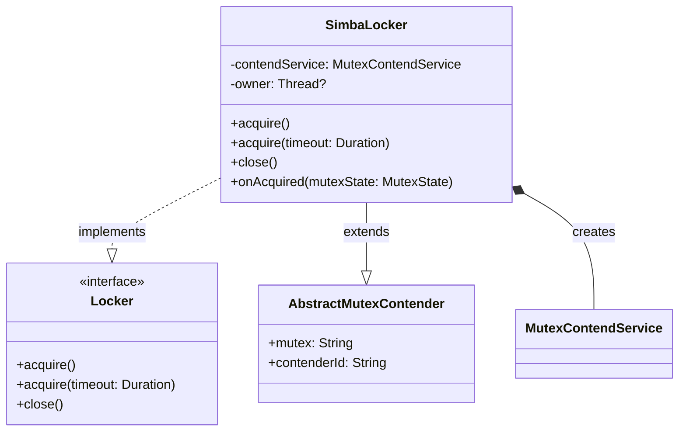
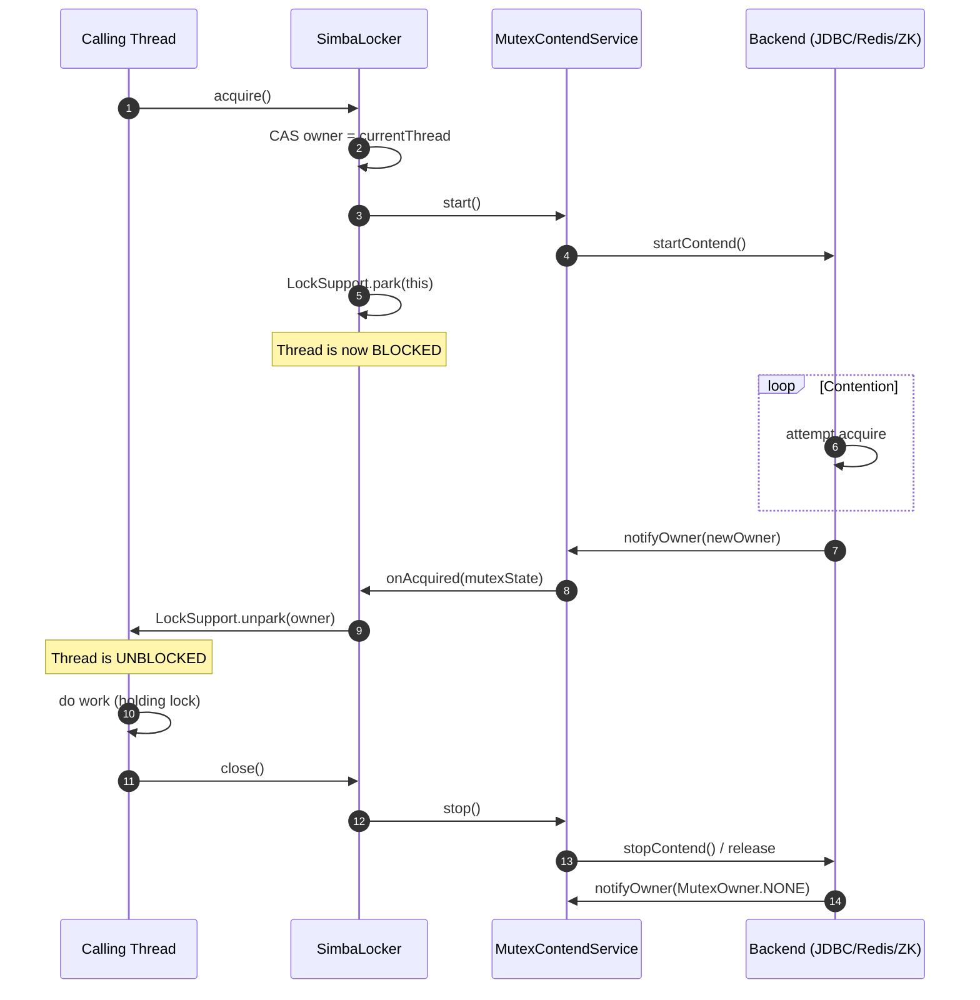
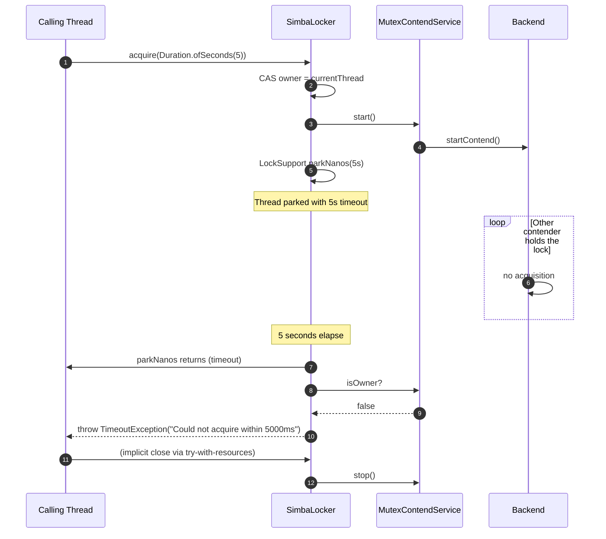
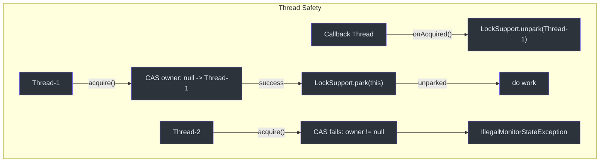

# Locker API

Locker API 提供了传统的 RAII 风格（资源获取即初始化）分布式锁。它将 `MutexContendService` 协议包装为熟悉的 `acquire`/`close` 模式，与 Kotlin 的 `use {}` 块和 Java 的 try-with-resources 兼容。

## 接口

**源码：** [simba-core/.../locker/Locker.kt:33](https://github.com/Ahoo-Wang/Simba/blob/main/simba-core/src/main/kotlin/me/ahoo/simba/locker/Locker.kt#L33)

```kotlin
interface Locker : AutoCloseable {
    fun acquire()
    @Throws(TimeoutException::class)
    fun acquire(timeout: Duration)
}
```

| 方法 | 描述 |
|---|---|
| `acquire()` | 阻塞调用线程直到获取到锁。完成后调用 `close()`。 |
| `acquire(timeout: Duration)` | 阻塞调用线程最多 `timeout` 时长。如果在超时时间内未获取到锁则抛出 `TimeoutException`。 |
| `close()` | 释放锁并停止竞争服务。在 try-with-resources / `use {}` 中自动调用。 |

## SimbaLocker

具体实现使用 `LockSupport.park` / `LockSupport.unpark` 进行线程阻塞，确保调用线程保持驻留状态直到竞争者的 `onAcquired` 回调触发。

**源码：** [simba-core/.../locker/SimbaLocker.kt:39](https://github.com/Ahoo-Wang/Simba/blob/main/simba-core/src/main/kotlin/me/ahoo/simba/locker/SimbaLocker.kt#L39)

```kotlin
class SimbaLocker(
    mutex: String,
    contendServiceFactory: MutexContendServiceFactory
) : AbstractMutexContender(mutex), Locker
```

| 参数 | 描述 |
|---|---|
| `mutex` | 互斥资源的逻辑名称。必须非空。 |
| `contendServiceFactory` | 后端特定的工厂（JDBC、Redis 或 Zookeeper）。由应用或 Spring 注入。 |

### 内部机制



`SimbaLocker` 在 `owner` 字段上使用 `AtomicReferenceFieldUpdater` 以确保线程安全：

- **`acquire()`** -- 通过 CAS 将 `owner` 字段从 `null` 设为当前线程，然后 `LockSupport.park(this)`。如果 CAS 失败，抛出 `IllegalMonitorStateException`（同一实例上的重复获取）。
- **`onAcquired()`** -- 在回调线程上由竞争服务调用。调用 `LockSupport.unpark(owner)` 唤醒驻留的线程。
- **`acquire(timeout)`** -- 使用 `LockSupport.parkNanos(this, timeout)`。唤醒后检查 `contendService.isOwner` 以区分"已获取"和"超时"。超时时抛出 `TimeoutException`。
- **`close()`** -- 停止竞争服务（这会触发 `onReleased` 通知）。

## 时序图 -- 获取流程



## 时序图 -- 超时流程



## 使用示例

### Kotlin `use {}` 块

```kotlin
val locker = SimbaLocker("order-lock", contendServiceFactory)
locker.use {
    it.acquire()
    // 临界区 -- 同一时间只有一个实例执行
    processOrders()
}
// 退出块时锁自动释放
```

### 带超时

```kotlin
val locker = SimbaLocker("order-lock", contendServiceFactory)
locker.use {
    try {
        it.acquire(Duration.ofSeconds(10))
        processOrders()
    } catch (e: TimeoutException) {
        println("Could not acquire lock within 10 seconds, skipping")
    }
}
```

### Java Try-with-Resources

```java
try (SimbaLocker locker = new SimbaLocker("order-lock", contendServiceFactory)) {
    locker.acquire(Duration.ofSeconds(10));
    processOrders();
} catch (TimeoutException e) {
    log.warn("Could not acquire lock within 10 seconds");
}
```

### 多个竞争者

```kotlin
// 同一服务的多个实例竞争一个互斥锁
fun runWorker(id: Int) {
    val locker = SimbaLocker("shared-task", contendServiceFactory)
    locker.use {
        it.acquire(Duration.ofSeconds(30))
        println("Worker $id acquired the lock")
        doExclusiveWork()
    }
}

// 启动 5 个工作者 -- 同一时间只有一个在运行
repeat(5) { runWorker(it) }
```

## 错误处理

| 场景 | 行为 |
|---|---|
| 线程已拥有此 `SimbaLocker` 实例 | `acquire()` 抛出 `IllegalMonitorStateException` |
| 超时到期前未获取到锁 | `acquire(timeout)` 抛出 `TimeoutException` |
| 竞争期间后端错误 | 内部记录日志；竞争循环在 TTL 周期后重试 |
| 非所有者调用 `close()` | 对竞争服务执行 `stop()`；多次调用安全 |

## 并发注意事项

- 每个 `SimbaLocker` 实例一次只能由一个线程获取。`owner` 字段使用 `AtomicReferenceFieldUpdater` 进行线程安全的 CAS 操作。
- 单个 `SimbaLocker` 实例**不应**跨线程共享用于并发锁定。为每个互斥锁创建独立实例。
- `onAcquired` 回调在后端的执行器线程上运行，它调用 `LockSupport.unpark(owner)` 来唤醒调用者。这是安全的，因为 `unpark` 可以在 `park` 之前调用（它充当许可证）。



## 另请参阅

- [核心接口](./core-interfaces) -- `MutexContendService`、`MutexContender` 及支撑类型
- [Scheduler API](./scheduler-api) -- 领导者门控的周期性任务（Locker 的替代方案，用于重复性工作）
- [simba-core 模块](/modules/simba-core) -- 模块包结构
