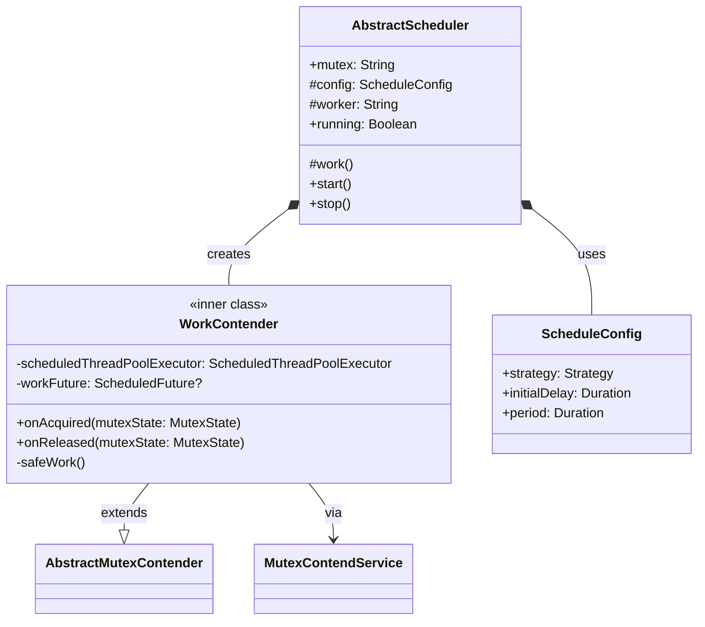
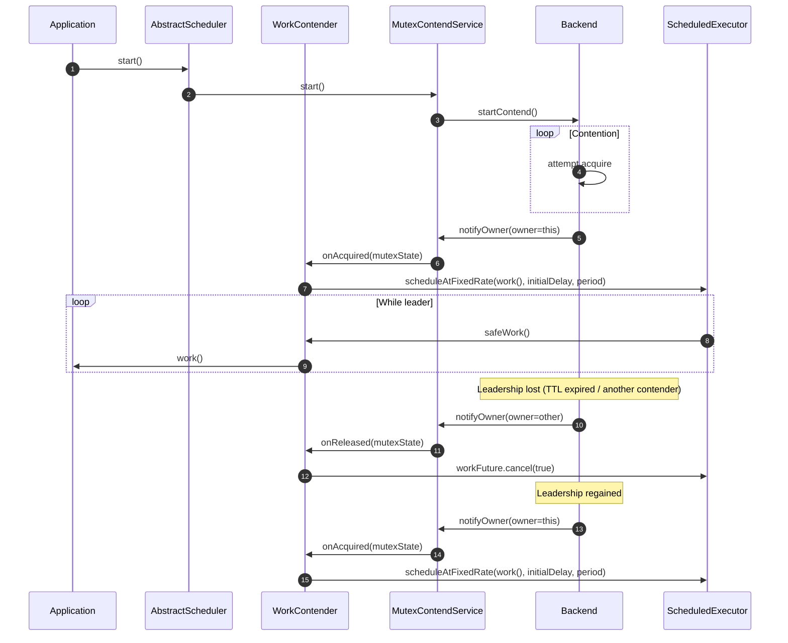
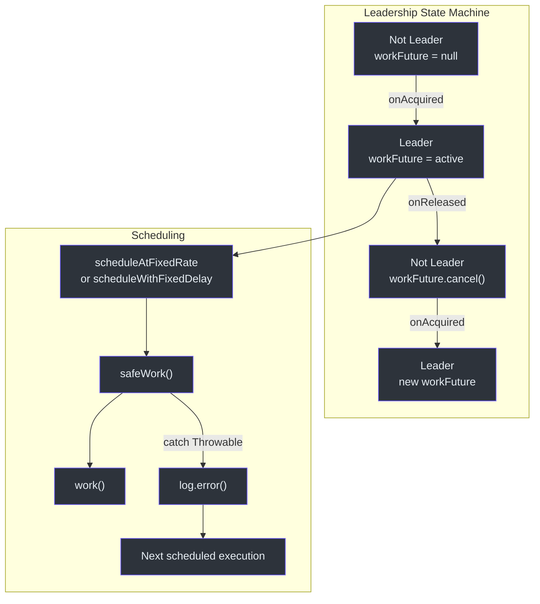

# Scheduler API

Scheduler API 提供领导者门控的周期性执行功能。只有当前持有分布式互斥锁的实例才会运行调度任务。当失去领导权时，任务被取消。当重新获得领导权时，任务恢复执行。

## AbstractScheduler

**源码：** [simba-core/.../schedule/AbstractScheduler.kt:30](https://github.com/Ahoo-Wang/Simba/blob/main/simba-core/src/main/kotlin/me/ahoo/simba/schedule/AbstractScheduler.kt#L30)

```kotlin
abstract class AbstractScheduler(
    val mutex: String,
    contendServiceFactory: MutexContendServiceFactory
)
```

| 参数 | 描述 |
|---|---|
| `mutex` | 互斥资源名称。同一 `mutex` 的所有调度器竞争同一个领导权。 |
| `contendServiceFactory` | 后端特定的工厂，用于创建底层的 `MutexContendService`。 |

### 抽象成员

```kotlin
abstract class AbstractScheduler(...) {
    protected abstract val config: ScheduleConfig
    protected abstract val worker: String
    protected abstract fun work()
}
```

| 成员 | 类型 | 描述 |
|---|---|---|
| `config` | `ScheduleConfig` | 调度策略、初始延迟和周期 |
| `worker` | `String` | 内部 `ScheduledThreadPoolExecutor` 的线程名称前缀 |
| `work()` | `() -> Unit` | 要执行的任务。仅在此实例为领导者时周期性调用。 |

### 公共 API

| 方法 | 描述 |
|---|---|
| `start()` | 启动互斥竞争，并在获取领导权后开始调度 `work()`。 |
| `stop()` | 停止竞争并取消所有已调度的工作。 |
| `running` | 如果底层竞争服务处于活跃状态则为 `true`。 |

### 内部设计

`AbstractScheduler` 创建一个内部类 `WorkContender`，继承自 `AbstractMutexContender`。该竞争者：

- 在 `onAcquired` 时 -- 创建 `ScheduledThreadPoolExecutor` 并按配置的速率/延迟调度 `work()`。
- 在 `onReleased` 时 -- 取消已调度的 future，停止周期性任务。



## ScheduleConfig

**源码：** [simba-core/.../schedule/ScheduleConfig.kt:22](https://github.com/Ahoo-Wang/Simba/blob/main/simba-core/src/main/kotlin/me/ahoo/simba/schedule/ScheduleConfig.kt#L22)

```kotlin
data class ScheduleConfig(
    val strategy: Strategy,
    val initialDelay: Duration,
    val period: Duration
)
```

| 属性 | 类型 | 描述 |
|---|---|---|
| `strategy` | `Strategy` | `FIXED_RATE` 或 `FIXED_DELAY` |
| `initialDelay` | `Duration` | 获取领导权后首次执行前的延迟 |
| `period` | `Duration` | 执行间隔 |

### Strategy 枚举

```kotlin
enum class Strategy {
    FIXED_DELAY,
    FIXED_RATE
}
```

| 策略 | 行为 |
|---|---|
| `FIXED_RATE` | 每次执行以固定间隔开始。如果任务执行时间超过周期长度，后续任务可能会堆积。 |
| `FIXED_DELAY` | 每次执行在上一次完成后间隔 `period` 开始。保证执行之间至少有 `period` 的间隔。 |

### 工厂方法

```kotlin
// 创建 FIXED_RATE 配置
val config = ScheduleConfig.rate(
    initialDelay = Duration.ZERO,
    period = Duration.ofSeconds(5)
)

// 创建 FIXED_DELAY 配置
val config = ScheduleConfig.delay(
    initialDelay = Duration.ofSeconds(1),
    period = Duration.ofSeconds(10)
)
```

## 时序图 -- 领导者门控调度



## 使用示例

### 基本调度器

```kotlin
class OrderSettlementScheduler(
    mutex: String,
    contendServiceFactory: MutexContendServiceFactory,
    private val settlementService: SettlementService
) : AbstractScheduler(mutex, contendServiceFactory) {

    override val config = ScheduleConfig.delay(
        initialDelay = Duration.ofSeconds(5),
        period = Duration.ofMinutes(1)
    )

    override val worker = "OrderSettlement"

    override fun work() {
        settlementService.settlePendingOrders()
    }
}

// 用法
val scheduler = OrderSettlementScheduler(
    mutex = "order-settlement",
    contendServiceFactory = factory,
    settlementService = settlementService
)

scheduler.start()
// ... 应用运行中 ...
scheduler.stop()
```

### FIXED_RATE 调度器

```kotlin
class MetricsCollectorScheduler(
    contendServiceFactory: MutexContendServiceFactory
) : AbstractScheduler("metrics-collector", contendServiceFactory) {

    override val config = ScheduleConfig.rate(
        initialDelay = Duration.ZERO,
        period = Duration.ofSeconds(30)
    )

    override val worker = "MetricsCollector"

    override fun work() {
        val metrics = collectSystemMetrics()
        publishToMonitoring(metrics)
    }
}
```

### 带错误处理

`work()` 方法在内部被包装在 `safeWork()` 中，它捕获所有 `Throwable` 并记录错误，不会使调度器崩溃：

```kotlin
class MyScheduler(
    contendServiceFactory: MutexContendServiceFactory
) : AbstractScheduler("my-task", contendServiceFactory) {

    override val config = ScheduleConfig.delay(
        initialDelay = Duration.ZERO,
        period = Duration.ofMinutes(5)
    )
    override val worker = "MyTask"

    override fun work() {
        // 此处的异常会被捕获并记录日志。
        // 调度器继续运行。
        riskyOperation()
    }
}
```

## 调度策略对比

```mermaid
gantt
    title FIXED_RATE vs FIXED_DELAY
    dateFormat X
    axisFormat %s

    section FIXED_RATE
    Task Execution 1  :a1, 0, 4
    Gap               :a2, 4, 5
    Task Execution 2  :a3, 5, 9
    Gap               :a4, 9, 10
    Task Execution 3  :a5, 10, 12

    section FIXED_DELAY
    Task Execution 1  :b1, 0, 4
    Delay (5s)        :b2, 4, 9
    Task Execution 2  :b3, 9, 14
    Delay (5s)        :b4, 14, 19
    Task Execution 3  :b5, 19, 22
```



使用 `FIXED_RATE`（周期 = 5s），执行在 0、5、10 时刻开始，不考虑任务时长。使用 `FIXED_DELAY`（周期 = 5s），每次执行在上一次完成后 5s 开始。

## 错误处理

| 场景 | 行为 |
|---|---|
| `work()` 抛出异常 | 被 `safeWork()` 捕获，以 ERROR 级别记录日志，调度执行继续 |
| 竞争期间后端错误 | 内部记录日志；竞争循环在 TTL 周期后重试 |
| `work()` 运行中调用 `stop()` | 已调度的 future 被取消；`work()` 可能完成当前迭代 |

## 并发注意事项

- 每个 `AbstractScheduler` 实例拥有自己的 `ScheduledThreadPoolExecutor`，线程数为 1（线程名：`{worker}-0`）。
- 只有互斥锁领导者拥有活跃的 `workFuture`。非领导者的 `workFuture = null` 或已取消的 future。
- `scheduledThreadPoolExecutor` 在获取领导权时创建，线程为守护线程（通过 `Threads.defaultFactory`）。



## 另请参阅

- [核心接口](./core-interfaces) -- `MutexContendServiceFactory`、`AbstractMutexContender`
- [Locker API](./locker-api) -- RAII 风格的一次性锁定
- [simba-core 模块](/modules/simba-core) -- 模块包结构
