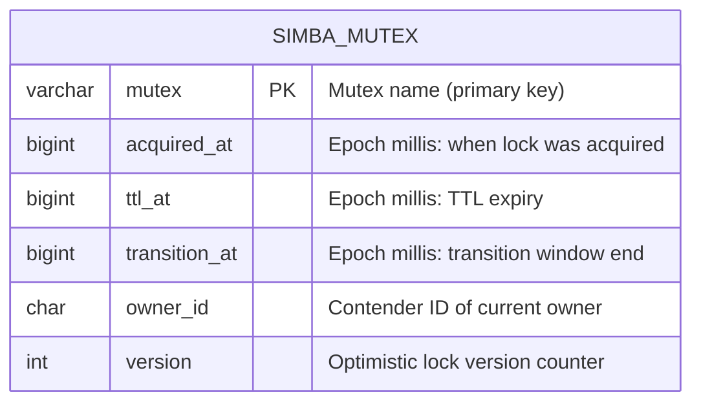
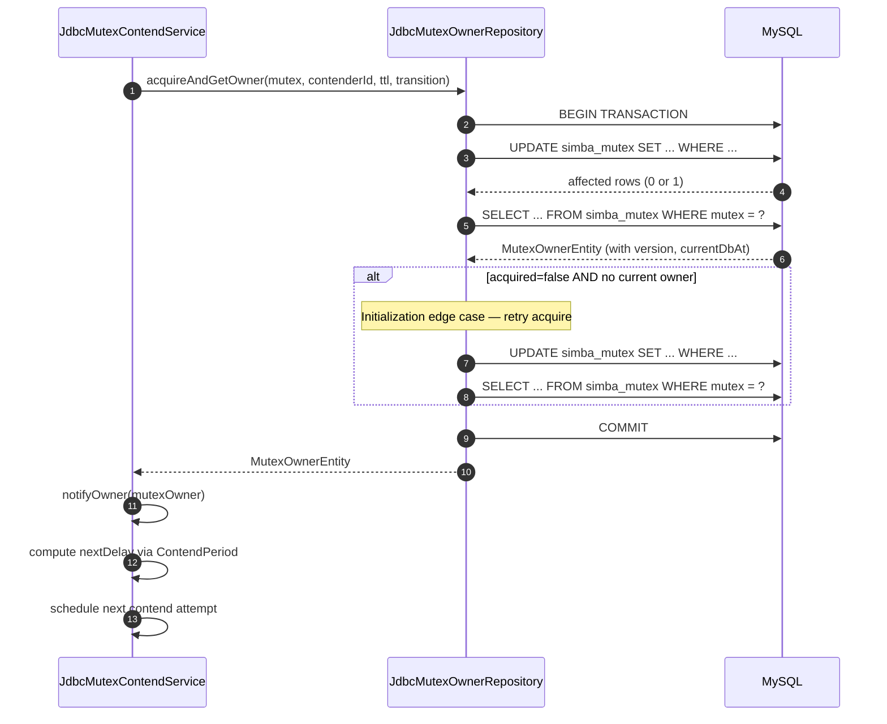
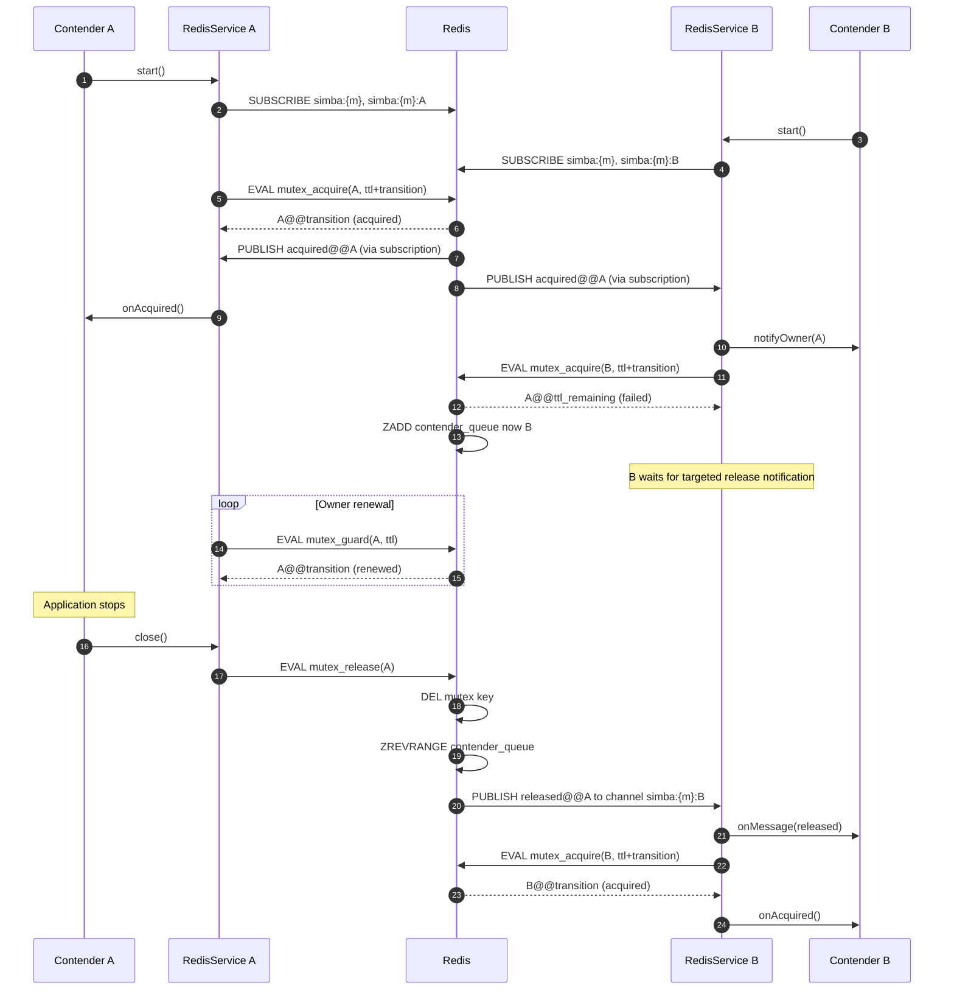
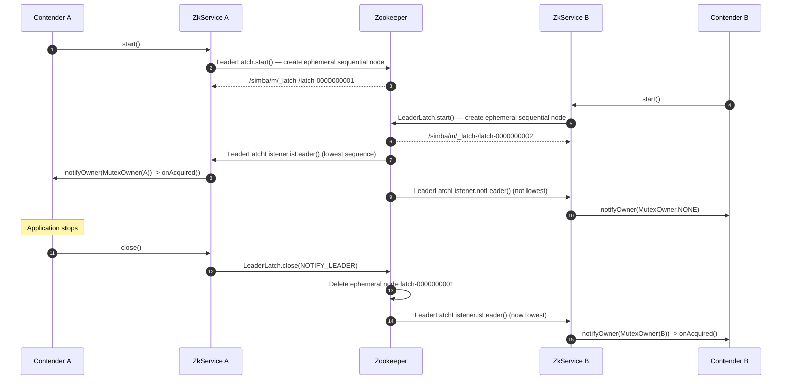
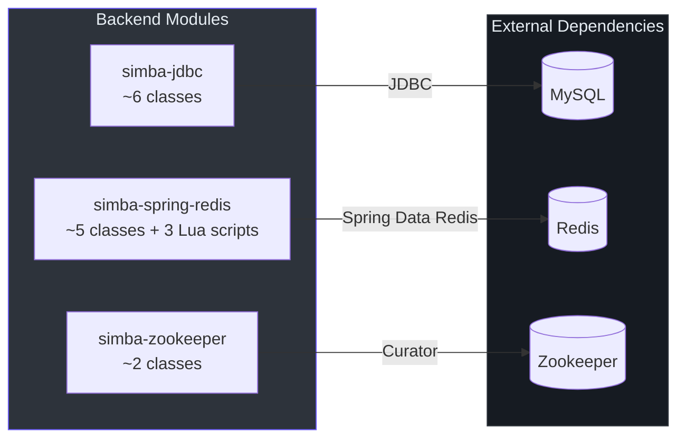
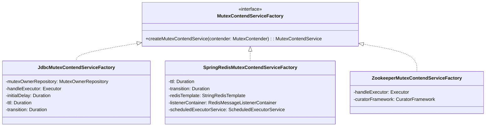
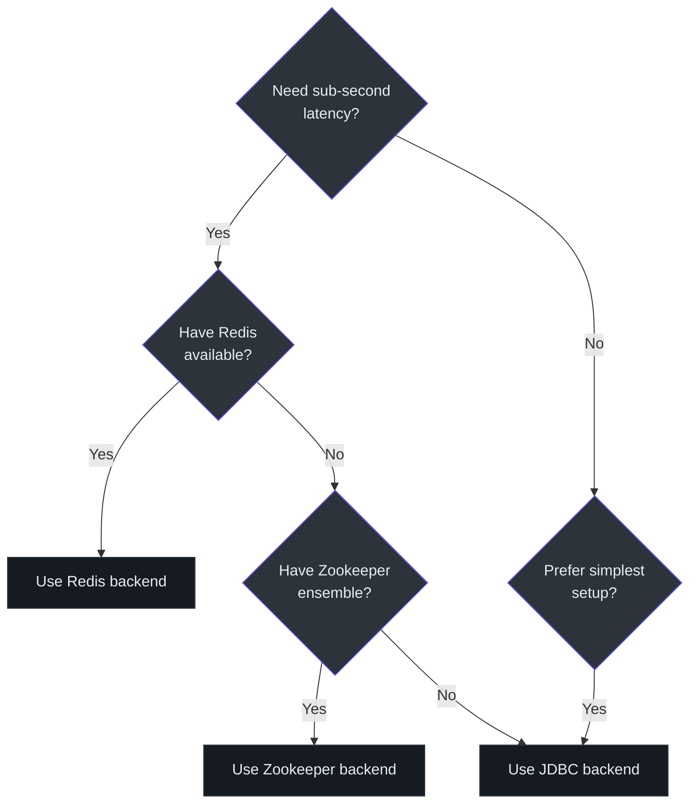

# 后端实现

Simba 提供三种可插拔的分布式互斥锁存储后端。每种后端都实现了 `AbstractMutexContendService` 并提供相应的 `MutexContendServiceFactory`。各后端在延迟特性、故障检测速度、外部依赖和运维复杂度方面各有不同。

## JDBC 后端

JDBC 后端使用 MySQL 表（`simba_mutex`），通过 `version` 列实现乐观锁。争用由 `ScheduledThreadPoolExecutor` 通过轮询驱动。

### 表结构

初始化脚本位于 [`simba-jdbc/src/init-script/init-simba-mysql.sql`](https://github.com/Ahoo-Wang/Simba/blob/main/simba-jdbc/src/init-script/init-simba-mysql.sql)，创建以下表：

```sql
CREATE TABLE IF NOT EXISTS simba_mutex (
    mutex         VARCHAR(66)    NOT NULL PRIMARY KEY COMMENT 'mutex name',
    acquired_at   BIGINT UNSIGNED NOT NULL,
    ttl_at        BIGINT UNSIGNED NOT NULL,
    transition_at BIGINT UNSIGNED NOT NULL,
    owner_id      VARCHAR(128)   NOT NULL,
    version       INT UNSIGNED   NOT NULL
);
```



`MutexOwnerEntity` 类（[`JdbcMutexOwnerRepository.kt`](https://github.com/Ahoo-Wang/Simba/blob/main/simba-jdbc/src/main/kotlin/me/ahoo/simba/jdbc/MutexOwnerRepository.kt)）在 `MutexOwner` 的基础上扩展了 `version` 字段用于乐观锁，以及一个 `currentDbAt` 字段来捕获数据库服务器的当前时间戳，从而防止应用节点之间的时钟偏移问题。

### 原子获取（乐观锁）

[`JdbcMutexOwnerRepository`](https://github.com/Ahoo-Wang/Simba/blob/main/simba-jdbc/src/main/kotlin/me/ahoo/simba/jdbc/JdbcMutexOwnerRepository.kt#L43) 中的 `SQL_ACQUIRE` 查询执行带有两个条件的原子 `UPDATE ... WHERE`：

```sql
UPDATE simba_mutex
SET acquired_at = NOW_MS,
    ttl_at      = NOW_MS + ?,
    transition_at = NOW_MS + ?,
    owner_id    = ?,
    version     = version + 1
WHERE mutex = ?
  AND (
    (transition_at < NOW_MS)             -- transition expired: anyone can acquire
    OR
    (owner_id = ? AND transition_at > NOW_MS)  -- current owner can renew
  );
```

WHERE 子句中的双重条件是 Simba 公平性保证的核心：
1. **非所有者**只有在 `transition_at` 完全过去后才能获取。
2. **当前所有者**可以在过渡窗口内的任何时候重新获取（续约/守护）。

如果 `UPDATE` 影响的行数为零，则该竞争者未获胜。方法随后通过 `SQL_GET` 读取当前所有者并返回，以便竞争者可以计算下一次延迟。

### acquireAndGetOwner 事务

`acquireAndGetOwner()` 方法（[第 185 行](https://github.com/Ahoo-Wang/Simba/blob/main/simba-jdbc/src/main/kotlin/me/ahoo/simba/jdbc/JdbcMutexOwnerRepository.kt#L185)）将获取 + 读取操作包装在一个数据库事务中：



### 释放

`SQL_RELEASE` 查询（[第 59 行](https://github.com/Ahoo-Wang/Simba/blob/main/simba-jdbc/src/main/kotlin/me/ahoo/simba/jdbc/JdbcMutexOwnerRepository.kt#L59)）清除所有权记录：

```sql
UPDATE simba_mutex
SET acquired_at=0, ttl_at=0, transition_at=0, owner_id='', version=version+1
WHERE mutex = ? AND owner_id = ?
```

`WHERE owner_id = ?` 子句确保只有实际的所有者才能释放。

### 服务生命周期

[`JdbcMutexContendService`](https://github.com/Ahoo-Wang/Simba/blob/main/simba-jdbc/src/main/kotlin/me/ahoo/simba/jdbc/JdbcMutexContendService.kt) 创建一个单线程的 `ScheduledThreadPoolExecutor`，并调度周期性的 `safeHandleContend()` 调用。每次调用执行 `acquire()`，通知检索器，并根据 `ContendPeriod.ensureNextDelay()` 调度下一次尝试。

```kotlin
// JdbcMutexContendService — simplified contention loop
private fun safeHandleContend() {
    val mutexOwner = contend()                // acquireAndGetOwner()
    notifyOwner(mutexOwner)                   // async notification
    val nextDelay = contendPeriod.ensureNextDelay(mutexOwner)
    nextSchedule(nextDelay)                   // schedule next attempt
}
```

出错时，服务会在 `ttl` 毫秒后重试（[第 81 行](https://github.com/Ahoo-Wang/Simba/blob/main/simba-jdbc/src/main/kotlin/me/ahoo/simba/jdbc/JdbcMutexContendService.kt#L81)）。

## Redis 后端

Redis 后端使用原子 Lua 脚本执行锁操作，并使用 Redis 发布/订阅进行所有权变更的即时通知。对于非所有者，它完全避免了轮询。

### Lua 脚本

三个 Lua 脚本实现了完整的锁协议：

#### mutex_acquire.lua

[`mutex_acquire.lua`](https://github.com/Ahoo-Wang/Simba/blob/main/simba-spring-redis/src/main/resources/mutex_acquire.lua) 通过 `SET ... NX PX` 尝试获取锁：

```lua
-- 1. Try SET NX (atomic acquire)
local succeed = redis.call('set', mutexKey, contenderId, 'nx', 'px', transition)
if succeed then
    -- Publish acquisition event to all listeners
    redis.call('publish', mutexKey, 'acquired@@' .. contenderId)
    return contenderId .. '@@' .. transition
end

-- 2. Failed — add self to wait queue (sorted set, scored by time)
redis.call('zadd', contenderQueueKey, 'nx', nowTime, contenderId)
-- 3. Return current owner and its remaining TTL
local ownerId = redis.call('get', mutexKey)
local ttl = redis.call('pttl', mutexKey)
return ownerId .. '@@' .. ttl
```

关键设计决策：
- 使用 `NX`（仅在键不存在时设置）进行原子获取。
- TTL 设置为 `ttl + transition`（完整的锁有效窗口）。
- 获取失败时，竞争者被添加到一个以时间戳为分数的有序集合（`{mutex}:contender`）中，形成等待队列。

#### mutex_guard.lua

[`mutex_guard.lua`](https://github.com/Ahoo-Wang/Simba/blob/main/simba-spring-redis/src/main/resources/mutex_guard.lua) 在调用者是当前所有者时续约锁：

```lua
-- Verify ownership before renewal
if redis.call('get', mutexKey) ~= contenderId then
    return getCurrentOwner(mutexKey)  -- not owner, return current state
end
-- Extend TTL with XX (only if key exists)
if redis.call('set', mutexKey, contenderId, 'xx', 'px', transition) then
    return contenderId .. '@@' .. transition
end
```

`XX` 标志确保续约仅在键仍然存在时成功（防止在过期后意外创建锁）。

#### mutex_release.lua

[`mutex_release.lua`](https://github.com/Ahoo-Wang/Simba/blob/main/simba-spring-redis/src/main/resources/mutex_release.lua) 释放锁并通知等待队列中的下一个竞争者：

```lua
-- 1. Verify ownership
if redis.call('get', mutexKey) ~= contenderId then
    redis.call('zrem', contenderQueueKey, contenderId)
    return 0
end
-- 2. Delete the lock
redis.call('del', mutexKey)
-- 3. Dequeue the next contender and notify via Pub/Sub
local contenderQueue = redis.call('zrevrange', contenderQueueKey, -1, -1)
if #contenderQueue > 0 then
    local nextContender = contenderQueue[1]
    redis.call('zrem', contenderQueueKey, nextContender)
    local channel = mutexKey .. ':' .. nextContender
    redis.call('publish', channel, 'released@@' .. contenderId)
end
```

释放脚本使用 `ZREVRANGE -1 -1` 获取分数*最低*（最早加入）的竞争者，实现了 FIFO 公平性。

### 发布/订阅通道

Redis 后端使用两种类型的通道（[SpringRedisMutexContendService，第 67 行](https://github.com/Ahoo-Wang/Simba/blob/main/simba-spring-redis/src/main/kotlin/me/ahoo/simba/spring/redis/SpringRedisMutexContendService.kt#L67)）：

| 通道 | 模式 | 用途 |
|---|---|---|
| `simba:{mutex}` | 广播 | 所有竞争者订阅。获取时发布。 |
| `simba:{mutex}:{contenderId}` | 每竞争者独立 | 定向通知。释放时发布给下一个等待者。 |

`{mutex}` 哈希标签确保在 Redis 集群中，两个通道和锁键都哈希到同一个槽。

### OwnerEvent 协议

消息编码为 `{event}@@{ownerId}` 格式（[`OwnerEvent`](https://github.com/Ahoo-Wang/Simba/blob/main/simba-spring-redis/src/main/kotlin/me/ahoo/simba/spring/redis/OwnerEvent.kt)）：

| 事件 | 含义 |
|---|---|
| `acquired@@{id}` | 某竞争者已获取锁 |
| `released@@{id}` | 锁已释放；被通知的竞争者应尝试获取 |

### Redis 争用流程



### 有序集合等待队列

等待队列使用键为 `simba:{mutex}:contender` 的 Redis 有序集合：

- **分数**：竞争者的加入时间戳（秒，来自 `TIME` 命令）。
- **NX 标志**：仅在竞争者不在队列中时添加。
- **出队**：`ZREVRANGE key -1 -1` 获取分数最低（最早加入）的成员，然后 `ZREM` 移除它。

这在保持队列轻量的同时，为等待中的竞争者提供了 FIFO 顺序。

## Zookeeper 后端

Zookeeper 后端完全委托给 Apache Curator 的 [`LeaderLatch`](https://curator.apache.org/curator-recipes/leader-latch.html) 配方。就代码量而言，它是最简单的后端实现。

### 实现

[`ZookeeperMutexContendService`](https://github.com/Ahoo-Wang/Simba/blob/main/simba-zookeeper/src/main/kotlin/me/ahoo/simba/zookeeper/ZookeeperMutexContendService.kt) 实现了 `LeaderLatchListener`，并将领导者事件转换为 Simba 的所有权模型：

```kotlin
class ZookeeperMutexContendService(
    contender: MutexContender,
    handleExecutor: Executor,
    private val curatorFramework: CuratorFramework
) : AbstractMutexContendService(contender, handleExecutor), LeaderLatchListener {

    private var leaderLatch: LeaderLatch? = null
    private val mutexPath: String = "/simba/" + contender.mutex

    override fun startContend() {
        leaderLatch = LeaderLatch(curatorFramework, mutexPath, contenderId)
        leaderLatch!!.addListener(this)
        leaderLatch!!.start()
    }

    override fun stopContend() {
        leaderLatch!!.close(CloseMode.NOTIFY_LEADER)
    }

    override fun isLeader() {
        notifyOwner(MutexOwner(contenderId))
    }

    override fun notLeader() {
        notifyOwner(MutexOwner.NONE)
    }
}
```

### ZNode 结构

每个互斥锁映射到 `/simba/{mutex}` 下的 Zookeeper 路径：

```
/simba/
  my-mutex/
    _latch-
      latch-0000000001  (contender A's ephemeral sequential node)
      latch-0000000002  (contender B's ephemeral sequential node)
```

序列号最小的节点是领导者。当它断开连接或关闭时，Zookeeper 的临时节点机制会自动移除它，下一个节点成为领导者。

### Zookeeper 争用流程



无需轮询、TTL 或过渡 — Zookeeper 的临时顺序节点和监听机制原生处理领导者选举和故障检测。

## 后端对比



| 特性 | JDBC | Redis | Zookeeper |
|---|---|---|---|
| **获取机制** | `UPDATE ... WHERE` + 乐观锁 | `SET NX PX` 原子 Lua 脚本 | Curator `LeaderLatch`（临时顺序节点） |
| **通知方式** | 通过 `ScheduledThreadPoolExecutor` 轮询 | 发布/订阅即时通知 | ZNode 监听（内置于 Curator） |
| **故障检测** | TTL 到期（轮询间隔） | 键 TTL 到期 + 发布/订阅 | 会话丢失时删除临时节点 |
| **延迟** | 轮询间隔（通常基于 ttl） | 亚毫秒级（发布/订阅推送） | 会话超时（通常 5-30 秒） |
| **公平性** | 通过数据库时间戳实现先到先服务 | FIFO 有序集合等待队列 | 顺序节点排序 |
| **外部依赖** | MySQL（或任何 JDBC 数据库） | Redis | Zookeeper 集群 |
| **代码复杂度** | 中等（约 6 个 Kotlin 类） | 较高（约 5 个类 + 3 个 Lua 脚本） | 较低（约 2 个 Kotlin 类） |
| **集群支持** | 通过共享数据库 | 通过 Redis 集群（哈希标签） | 通过 Zookeeper 集群 |
| **时钟敏感度** | 使用数据库服务器时间避免应用时钟偏移 | 使用 Redis `TIME` 命令 | 使用 ZK 的 zxid（不依赖系统时钟） |
| **最适合** | 已有 MySQL 基础设施的团队 | 低延迟需求、高吞吐量 | 已有 Zookeeper 部署、强一致性需求 |

## 工厂装配

每个后端提供一个工厂，用于装配存储特定的依赖：



| 工厂 | 所需依赖 | 可配置参数 |
|---|---|---|
| [`JdbcMutexContendServiceFactory`](https://github.com/Ahoo-Wang/Simba/blob/main/simba-jdbc/src/main/kotlin/me/ahoo/simba/jdbc/JdbcMutexContendServiceFactory.kt) | `MutexOwnerRepository`（封装 `DataSource`） | `initialDelay`、`ttl`、`transition` |
| [`SpringRedisMutexContendServiceFactory`](https://github.com/Ahoo-Wang/Simba/blob/main/simba-spring-redis/src/main/kotlin/me/ahoo/simba/spring/redis/SpringRedisMutexContendServiceFactory.kt) | `StringRedisTemplate`、`RedisMessageListenerContainer` | `ttl`、`transition` |
| [`ZookeeperMutexContendServiceFactory`](https://github.com/Ahoo-Wang/Simba/blob/main/simba-zookeeper/src/main/kotlin/me/ahoo/simba/zookeeper/ZookeeperMutexContendServiceFactory.kt) | `CuratorFramework` | 无（TTL/过渡由 ZK 管理） |

## AcquireResult 解析

Redis 后端使用 [`AcquireResult`](https://github.com/Ahoo-Wang/Simba/blob/main/simba-spring-redis/src/main/kotlin/me/ahoo/simba/spring/redis/AcquireResult.kt) 解析 Lua 脚本结果：

```
"contenderId@@transitionMs"  ->  AcquireResult(ownerId="contenderId", transitionAt=now+transitionMs)
"@@"                         ->  AcquireResult.NONE (no owner)
```

`transitionAt` 计算为 `System.currentTimeMillis() + keyTtl`，其中 `keyTtl` 是 Lua 脚本返回的剩余 TTL。这使得争用服务能够构建带有准确时间戳的 `MutexOwner`，即使 Redis 并不存储 `acquiredAt`。

## 选择后端



对于大多数生产部署，Redis 后端在延迟和运维简便性方面提供了最佳平衡。JDBC 后端适合基础设施中已包含 MySQL 且不值得额外引入 Redis 的场景。Zookeeper 后端则是已有 Zookeeper 集群（例如基于 Kafka 的架构）的系统的自然选择。
