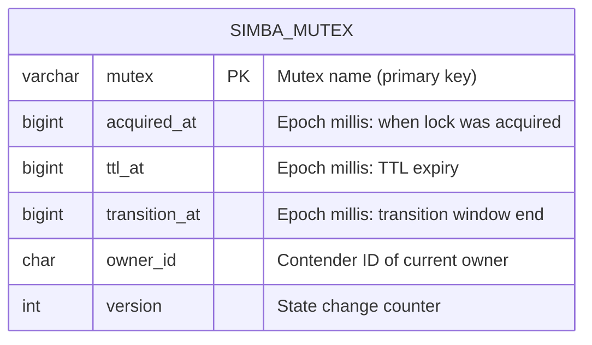
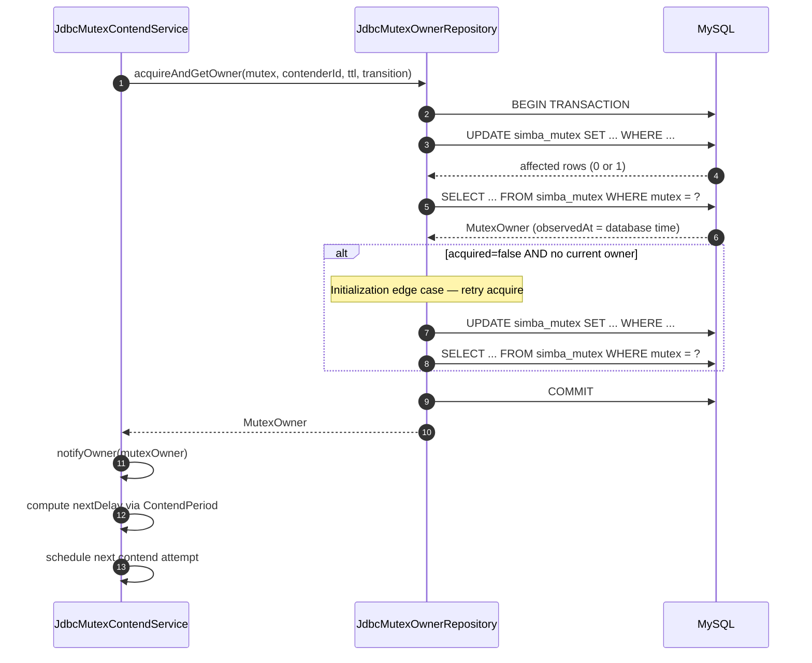
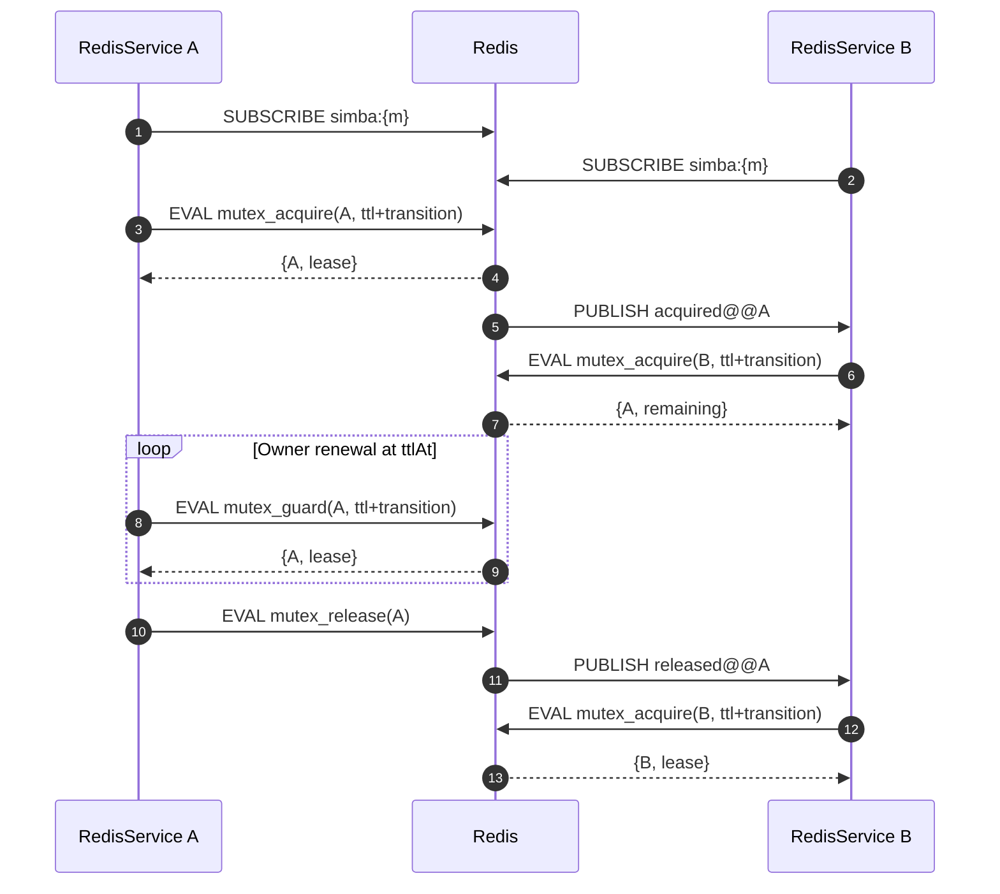
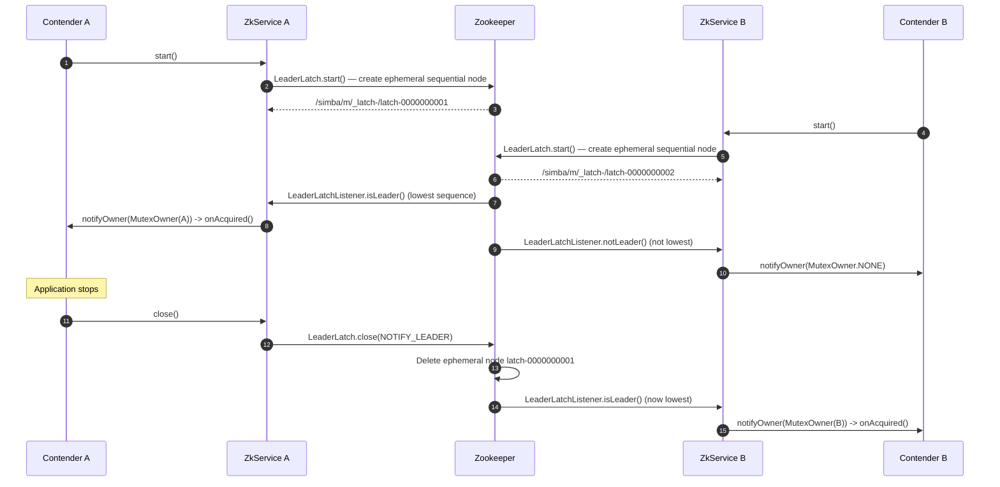
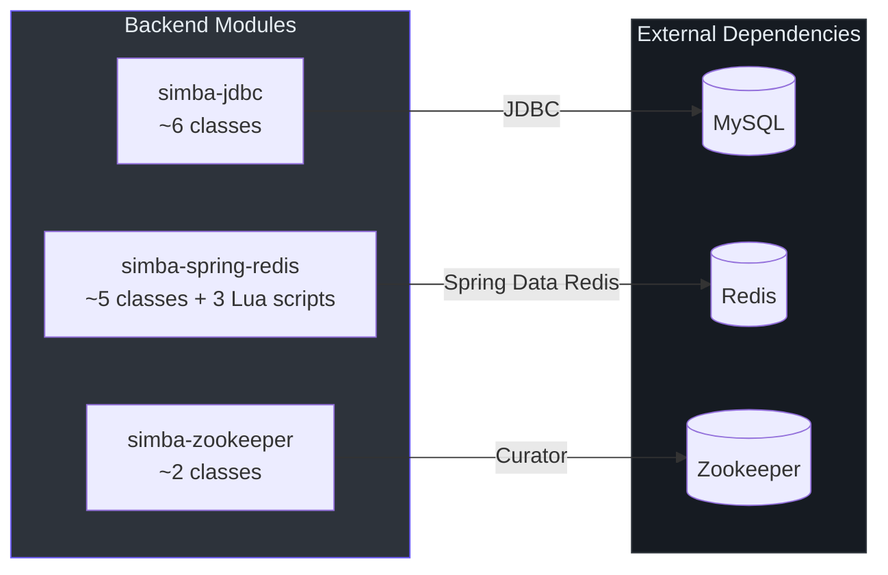
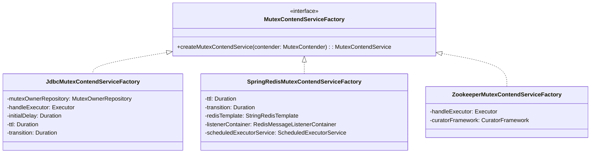
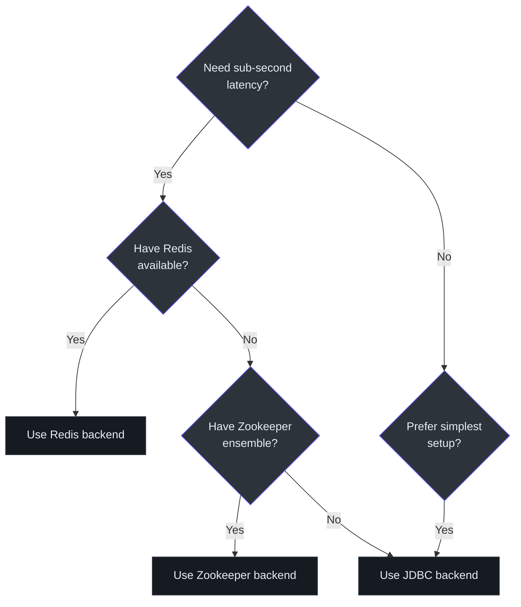

# 后端实现

Simba 提供三种可插拔的分布式互斥锁存储后端。每种后端都实现了 `AbstractMutexContendService` 并提供相应的 `MutexContendServiceFactory`。各后端在延迟特性、故障检测速度、外部依赖和运维复杂度方面各有不同。

## JDBC 后端

JDBC 后端使用 MySQL 表（`simba_mutex`），通过由 owner/transition 谓词守卫的原子条件 `UPDATE` 实现并发安全。争用由 `ScheduledThreadPoolExecutor` 通过轮询驱动。

### 表结构

初始化脚本位于 [`simba-jdbc/src/init-script/init-simba-mysql.sql`](https://github.com/Ahoo-Wang/Simba/blob/main/simba-jdbc/src/init-script/init-simba-mysql.sql)，创建以下表：

```sql
CREATE TABLE IF NOT EXISTS simba_mutex (
    mutex         VARCHAR(66)    NOT NULL PRIMARY KEY COMMENT 'mutex name',
    acquired_at   BIGINT UNSIGNED NOT NULL,
    ttl_at        BIGINT UNSIGNED NOT NULL,
    transition_at BIGINT UNSIGNED NOT NULL,
    owner_id      VARCHAR(128)   NOT NULL,
    version       INT UNSIGNED   NOT NULL
);
```


```mermaid
erDiagram
    SIMBA_MUTEX {
        varchar mutex PK "Mutex name (primary key)"
        bigint acquired_at "Epoch millis: when lock was acquired"
        bigint ttl_at "Epoch millis: TTL expiry"
        bigint transition_at "Epoch millis: transition window end"
        char owner_id "Contender ID of current owner"
        int version "State change counter"
    }
```

仓库返回的 `MutexOwner` 的 `observedAt` 是数据库服务器的当前时间，因此每个节点都按数据库时钟而不是自己的时钟判断租约。

### 原子获取（条件更新）

[`JdbcMutexOwnerRepository`](https://github.com/Ahoo-Wang/Simba/blob/main/simba-jdbc/src/main/kotlin/me/ahoo/simba/jdbc/JdbcMutexOwnerRepository.kt#L43) 中的 `SQL_ACQUIRE` 查询执行带有两个条件的原子 `UPDATE ... WHERE`：

```sql
UPDATE simba_mutex
SET acquired_at = NOW_MS,
    ttl_at      = NOW_MS + ?,
    transition_at = NOW_MS + ?,
    owner_id    = ?,
    version     = version + 1
WHERE mutex = ?
  AND (
    (transition_at < NOW_MS)             -- transition expired: anyone can acquire
    OR
    (owner_id = ? AND transition_at > NOW_MS)  -- current owner can renew
  );
```

WHERE 子句中的双重条件是 Simba 公平性保证的核心：
1. **非所有者**只有在 `transition_at` 完全过去后才能获取。
2. **当前所有者**可以在过渡窗口内的任何时候重新获取（续约/守护）。

如果 `UPDATE` 影响的行数为零，则该竞争者未获胜。方法随后通过 `SQL_GET` 读取当前所有者并返回，以便竞争者可以计算下一次延迟。

### acquireAndGetOwner 事务

`acquireAndGetOwner()` 方法（[第 185 行](https://github.com/Ahoo-Wang/Simba/blob/main/simba-jdbc/src/main/kotlin/me/ahoo/simba/jdbc/JdbcMutexOwnerRepository.kt#L185)）将获取 + 读取操作包装在一个数据库事务中：


```mermaid
sequenceDiagram
autonumber
    participant CS as JdbcMutexContendService
    participant REPO as JdbcMutexOwnerRepository
    participant DB as MySQL

    CS->>REPO: acquireAndGetOwner(mutex, contenderId, ttl, transition)
    REPO->>DB: BEGIN TRANSACTION
    REPO->>DB: UPDATE simba_mutex SET ... WHERE ...
    DB-->>REPO: affected rows (0 or 1)
    REPO->>DB: SELECT ... FROM simba_mutex WHERE mutex = ?
    DB-->>REPO: MutexOwner (observedAt = database time)

    alt acquired=false AND no current owner
        Note over REPO: Initialization edge case — retry acquire
        REPO->>DB: UPDATE simba_mutex SET ... WHERE ...
        REPO->>DB: SELECT ... FROM simba_mutex WHERE mutex = ?
    end

    REPO->>DB: COMMIT
    REPO-->>CS: MutexOwner
    CS->>CS: notifyOwner(mutexOwner)
    CS->>CS: compute nextDelay via ContendPeriod
    CS->>CS: schedule next contend attempt
```

### 释放

`SQL_RELEASE` 查询（[第 59 行](https://github.com/Ahoo-Wang/Simba/blob/main/simba-jdbc/src/main/kotlin/me/ahoo/simba/jdbc/JdbcMutexOwnerRepository.kt#L59)）清除所有权记录：

```sql
UPDATE simba_mutex
SET acquired_at=0, ttl_at=0, transition_at=0, owner_id='', version=version+1
WHERE mutex = ? AND owner_id = ?
```

`WHERE owner_id = ?` 子句确保只有实际的所有者才能释放。

### 服务生命周期

[`JdbcMutexContendService`](https://github.com/Ahoo-Wang/Simba/blob/main/simba-jdbc/src/main/kotlin/me/ahoo/simba/jdbc/JdbcMutexContendService.kt) 是基于 `JdbcMutexLeaseStore` 的轻量 [`LeaseContendService`](https://github.com/Ahoo-Wang/Simba/blob/main/simba-core/src/main/kotlin/me/ahoo/simba/core/LeaseContendService.kt)：每次竞争（获取或续期）都映射为 `MutexOwnerRepository.acquireAndGetOwner()`。引擎负责循环：竞争、通知持有者，并根据 `ContendPeriod.ensureNextDelay()` 调度下一次尝试。

```kotlin
// LeaseContendService — 简化的竞争循环
private fun contend(generation: Long) {
    var nextDelay = leaseConfig.ttlMillis                 // 失败时 ttl 后重试
    try {
        val mutexOwner = leaseStore.contend(mutex, contenderId, isOwner, leaseConfig)
        if (adopt(generation, mutexOwner)) {             // 通知，或释放过期生命周期的获取
            nextDelay = contendPeriod.ensureNextDelay(mutexOwner)
        }
    } catch (throwable: Throwable) {
        nextDelay = onFailure(generation)                // 租约内保持持有，否则撤销
    } finally {
        complete(generation, nextDelay)                  // 调度下一次尝试
    }
}
```

每次成功获取或续期后，引擎会在租约结束时刻（`transitionAt`，从发出调用时开始计算）设置看门狗。如果届时仍未续期成功（包括数据库调用卡住），就撤销本地持有。续期失败时，只要租约仍有效就保持持有，并以减半退避重试；starter 还会把仓库的 `queryTimeout` 设为 `ttl`。

由 `JdbcMutexContendServiceFactory` 创建的服务共享一个触发调度器和一个执行数据库调用的 I/O 执行器；工厂持有二者，并在 `close()` 时关闭。

## Redis 后端

Redis 后端使用原子 Lua 脚本执行租约操作，并通过 Redis 发布/订阅广播所有权变更，等待中的竞争者可以立即响应，而不必等到下一次轮询。

### Lua 脚本

所有脚本都通过 `KEYS` 接收键（符合 Redis Cluster 规范）。获取和守护脚本返回 `{ownerId, 剩余租约毫秒数, fencing token}`，没有持有者时返回 `{'', 0, 0}`。新任期会对 `simba:{mutex}:fence` 自增，并把 token 写入 `simba:{mutex}:token`（参见 [ADR 0002](https://github.com/Ahoo-Wang/Simba/blob/main/docs/adr/0002-fencing-token.md)）。

#### mutex_acquire.lua

[`mutex_acquire.lua`](https://github.com/Ahoo-Wang/Simba/blob/main/simba-spring-redis/src/main/resources/mutex_acquire.lua) 以 `ttl + transition` 为时长通过 `SET ... NX PX` 获取，并宣告新持有者：

```lua
if redis.call('set', mutexKey, contenderId, 'nx', 'px', lease) then
    local token = redis.call('incr', fenceKey)
    redis.call('set', tokenKey, token, 'px', lease)
    redis.call('publish', mutexKey, 'acquired@@' .. contenderId)
    return { contenderId, tonumber(lease), token };
end
local ownerId = redis.call('get', mutexKey)
if not ownerId then
    return { '', 0, 0 };
end
return { ownerId, redis.call('pttl', mutexKey), tonumber(redis.call('get', tokenKey) or '0') };
```

#### mutex_guard.lua

[`mutex_guard.lua`](https://github.com/Ahoo-Wang/Simba/blob/main/simba-spring-redis/src/main/resources/mutex_guard.lua) 仅在调用者仍持有租约时通过 `SET ... XX PX` 续期，否则返回当前持有者。它不会重新创建已经过期的租约。

#### mutex_release.lua

[`mutex_release.lua`](https://github.com/Ahoo-Wang/Simba/blob/main/simba-spring-redis/src/main/resources/mutex_release.lua) 只释放调用者自己的租约，并广播释放：

```lua
if redis.call('get', mutexKey) ~= contenderId then
    return 0;
end
redis.call('del', mutexKey, tokenKey)
redis.call('publish', mutexKey, 'released@@' .. contenderId)
return 1;
```

所有存活的竞争者都会收到广播并立即竞争，只有一个能 `SET NX` 成功。与定向唤醒不同，释放通知不会因为某个竞争者崩溃而丢失。

### 发布/订阅频道

| 频道 | 用途 |
|---|---|
| `simba:{mutex}` | 所有竞争者订阅，承载 `acquired@@{id}` 和 `released@@{id}`。 |

`{mutex}` 哈希标签让租约键、fencing 相关键和频道落在同一个 Redis Cluster 槽位。[`RedisMutexKeys`](https://github.com/Ahoo-Wang/Simba/blob/main/simba-spring-redis/src/main/kotlin/me/ahoo/simba/spring/redis/RedisMutexKeys.kt) 是 Kotlin 侧这些名称的唯一来源。

### OwnerEvent 协议

消息编码为 `{event}@@{ownerId}`（[`OwnerEvent`](https://github.com/Ahoo-Wang/Simba/blob/main/simba-spring-redis/src/main/kotlin/me/ahoo/simba/spring/redis/OwnerEvent.kt)）：

| 事件 | 响应 |
|---|---|
| `acquired@@{id}` | 更新观测到的持有者 |
| `released@@{id}` | 清除观测到的持有者并立即竞争（`contendNow()`） |

### Redis 争用流程


```mermaid
sequenceDiagram
autonumber
    participant SA as RedisService A
    participant REDIS as Redis
    participant SB as RedisService B

    SA->>REDIS: SUBSCRIBE simba:{m}
    SB->>REDIS: SUBSCRIBE simba:{m}
    SA->>REDIS: EVAL mutex_acquire(A, ttl+transition)
    REDIS-->>SA: {A, lease}
    REDIS->>SB: PUBLISH acquired@@A
    SB->>REDIS: EVAL mutex_acquire(B, ttl+transition)
    REDIS-->>SB: {A, remaining}
    loop Owner renewal at ttlAt
        SA->>REDIS: EVAL mutex_guard(A, ttl+transition)
        REDIS-->>SA: {A, lease}
    end
    SA->>REDIS: EVAL mutex_release(A)
    REDIS->>SB: PUBLISH released@@A
    SB->>REDIS: EVAL mutex_acquire(B, ttl+transition)
    REDIS-->>SB: {B, lease}
```

## Zookeeper 后端

Zookeeper 后端完全委托给 Apache Curator 的 [`LeaderLatch`](https://curator.apache.org/curator-recipes/leader-latch.html) 配方。就代码量而言，它是最简单的后端实现。

### 实现

[`ZookeeperMutexContendService`](https://github.com/Ahoo-Wang/Simba/blob/main/simba-zookeeper/src/main/kotlin/me/ahoo/simba/zookeeper/ZookeeperMutexContendService.kt) 实现了 `LeaderLatchListener`，并将领导者事件转换为 Simba 的所有权模型：

```kotlin
class ZookeeperMutexContendService(
    contender: MutexContender,
    handleExecutor: Executor,
    private val curatorFramework: CuratorFramework
) : AbstractMutexContendService(contender, handleExecutor), LeaderLatchListener {

    private var leaderLatch: LeaderLatch? = null
    private val mutexPath: String = "/simba/" + contender.mutex

    override fun startContend() {
        leaderLatch = LeaderLatch(curatorFramework, mutexPath, contenderId)
        leaderLatch!!.addListener(this)
        leaderLatch!!.start()
    }

    override fun stopContend() {
        leaderLatch!!.close(CloseMode.NOTIFY_LEADER)
    }

    override fun isLeader() {
        notifyOwner(MutexOwner(contenderId))
    }

    override fun notLeader() {
        notifyOwner(MutexOwner.NONE)
    }
}
```

### ZNode 结构

每个互斥锁映射到 `/simba/{mutex}` 下的 Zookeeper 路径：

```
/simba/
  my-mutex/
    _latch-
      latch-0000000001  (contender A's ephemeral sequential node)
      latch-0000000002  (contender B's ephemeral sequential node)
```

序列号最小的节点是领导者。当它断开连接或关闭时，Zookeeper 的临时节点机制会自动移除它，下一个节点成为领导者。

### Zookeeper 争用流程


```mermaid
sequenceDiagram
autonumber
    participant CA as Contender A
    participant ZA as ZkService A
    participant ZK as Zookeeper
    participant ZB as ZkService B
    participant CB as Contender B

    CA->>ZA: start()
    ZA->>ZK: LeaderLatch.start() — create ephemeral sequential node
    ZK-->>ZA: /simba/m/_latch-/latch-0000000001

    CB->>ZB: start()
    ZB->>ZK: LeaderLatch.start() — create ephemeral sequential node
    ZK-->>ZB: /simba/m/_latch-/latch-0000000002

    ZK->>ZA: LeaderLatchListener.isLeader() (lowest sequence)
    ZA->>CA: notifyOwner(MutexOwner(A)) -> onAcquired()

    ZK->>ZB: LeaderLatchListener.notLeader() (not lowest)
    ZB->>CB: notifyOwner(MutexOwner.NONE)

    Note over CA: Application stops
    CA->>ZA: close()
    ZA->>ZK: LeaderLatch.close(NOTIFY_LEADER)
    ZK->>ZK: Delete ephemeral node latch-0000000001

    ZK->>ZB: LeaderLatchListener.isLeader() (now lowest)
    ZB->>CB: notifyOwner(MutexOwner(B)) -> onAcquired()
```

无需轮询、TTL 或过渡 — Zookeeper 的临时顺序节点和监听机制原生处理领导者选举和故障检测。

## 后端对比


```mermaid
flowchart LR
    subgraph External["External Dependencies"]
        MYSQL[("MySQL")]
        REDISDB[("Redis")]
        ZKDB[("Zookeeper")]
    end

    subgraph Backends["Backend Modules"]
        JB["simba-jdbc<br>~6 classes"]
        RB["simba-spring-redis<br>~5 classes + 3 Lua scripts"]
        ZB["simba-zookeeper<br>~2 classes"]
    end

    JB -->|"JDBC"| MYSQL
    RB -->|"Spring Data Redis"| REDISDB
    ZB -->|"Curator"| ZKDB

    style External fill:#161b22,stroke:#30363d,color:#e6edf3
    style Backends fill:#2d333b,stroke:#6d5dfc,color:#e6edf3
```

| 特性 | JDBC | Redis | Zookeeper |
|---|---|---|---|
| **获取机制** | `UPDATE ... WHERE` + owner/transition 谓词守卫 | `SET NX PX` 原子 Lua 脚本 | Curator `LeaderLatch`（临时顺序节点） |
| **通知方式** | 通过 `ScheduledThreadPoolExecutor` 轮询 | 发布/订阅即时通知 | ZNode 监听（内置于 Curator） |
| **故障检测** | TTL 到期（轮询间隔） | 键 TTL 到期 + 发布/订阅 | 会话丢失时删除临时节点 |
| **延迟** | 轮询间隔（通常基于 ttl） | 亚毫秒级（发布/订阅推送） | 会话超时（通常 5-30 秒） |
| **公平性** | 无；`transitionAt` 之后（含抖动）最先轮询的竞争者获胜 | 无；最先响应释放广播的竞争者获胜 | 顺序节点排序 |
| **外部依赖** | MySQL（或任何 JDBC 数据库） | Redis | Zookeeper 集群 |
| **代码复杂度** | 中等（约 6 个 Kotlin 类） | 较高（约 5 个类 + 3 个 Lua 脚本） | 较低（约 2 个 Kotlin 类） |
| **集群支持** | 通过共享数据库 | 通过 Redis 集群（哈希标签） | 通过 Zookeeper 集群 |
| **时钟敏感度** | 使用数据库服务器时间避免应用时钟偏移 | 使用 Redis `TIME` 命令 | 使用 ZK 的 zxid（不依赖系统时钟） |
| **最适合** | 已有 MySQL 基础设施的团队 | 低延迟需求、高吞吐量 | 已有 Zookeeper 部署、强一致性需求 |

## 工厂装配

每个后端提供一个工厂，用于装配存储特定的依赖：


```mermaid
classDiagram
    class MutexContendServiceFactory {
        <<interface>>
        +createMutexContendService(contender: MutexContender): MutexContendService
    }

    class JdbcMutexContendServiceFactory {
        -mutexOwnerRepository: MutexOwnerRepository
        -handleExecutor: Executor
        -initialDelay: Duration
        -ttl: Duration
        -transition: Duration
    }

    class SpringRedisMutexContendServiceFactory {
        -ttl: Duration
        -transition: Duration
        -redisTemplate: StringRedisTemplate
        -listenerContainer: RedisMessageListenerContainer
        -scheduledExecutorService: ScheduledExecutorService
    }

    class ZookeeperMutexContendServiceFactory {
        -handleExecutor: Executor
        -curatorFramework: CuratorFramework
    }

    MutexContendServiceFactory <|.. JdbcMutexContendServiceFactory
    MutexContendServiceFactory <|.. SpringRedisMutexContendServiceFactory
    MutexContendServiceFactory <|.. ZookeeperMutexContendServiceFactory
```

| 工厂 | 所需依赖 | 可配置参数 |
|---|---|---|
| [`JdbcMutexContendServiceFactory`](https://github.com/Ahoo-Wang/Simba/blob/main/simba-jdbc/src/main/kotlin/me/ahoo/simba/jdbc/JdbcMutexContendServiceFactory.kt) | `MutexOwnerRepository`（封装 `DataSource`） | `initialDelay`、`ttl`、`transition` |
| [`SpringRedisMutexContendServiceFactory`](https://github.com/Ahoo-Wang/Simba/blob/main/simba-spring-redis/src/main/kotlin/me/ahoo/simba/spring/redis/SpringRedisMutexContendServiceFactory.kt) | `StringRedisTemplate`、`RedisMessageListenerContainer` | `ttl`、`transition` |
| [`ZookeeperMutexContendServiceFactory`](https://github.com/Ahoo-Wang/Simba/blob/main/simba-zookeeper/src/main/kotlin/me/ahoo/simba/zookeeper/ZookeeperMutexContendServiceFactory.kt) | `CuratorFramework` | 无（TTL/过渡由 ZK 管理） |

## AcquireResult 解析

Redis 后端使用 [`AcquireResult`](https://github.com/Ahoo-Wang/Simba/blob/main/simba-spring-redis/src/main/kotlin/me/ahoo/simba/spring/redis/AcquireResult.kt) 解析 Lua 脚本结果：

```
"contenderId@@transitionMs"  ->  AcquireResult(ownerId="contenderId", transitionAt=now+transitionMs)
"@@"                         ->  AcquireResult.NONE (no owner)
```

`transitionAt` 计算为 `System.currentTimeMillis() + keyTtl`，其中 `keyTtl` 是 Lua 脚本返回的剩余 TTL。这使得争用服务能够构建带有准确时间戳的 `MutexOwner`，即使 Redis 并不存储 `acquiredAt`。

## 选择后端


```mermaid
flowchart TD
    Q1{"Need sub-second<br>latency?"}
    Q2{"Have Redis<br>available?"}
    Q3{"Have Zookeeper<br>ensemble?"}
    Q4{"Prefer simplest<br>setup?"}

    REDIS_REC["Use Redis backend"]
    ZK_REC["Use Zookeeper backend"]
    JDBC_REC["Use JDBC backend"]

    Q1 -->|Yes| Q2
    Q1 -->|No| Q4
    Q2 -->|Yes| REDIS_REC
    Q2 -->|No| Q3
    Q3 -->|Yes| ZK_REC
    Q3 -->|No| JDBC_REC
    Q4 -->|Yes| JDBC_REC

    style Q1 fill:#2d333b,stroke:#6d5dfc,color:#e6edf3
    style Q2 fill:#2d333b,stroke:#6d5dfc,color:#e6edf3
    style Q3 fill:#2d333b,stroke:#6d5dfc,color:#e6edf3
    style Q4 fill:#2d333b,stroke:#6d5dfc,color:#e6edf3
    style REDIS_REC fill:#161b22,stroke:#30363d,color:#e6edf3
    style ZK_REC fill:#161b22,stroke:#30363d,color:#e6edf3
    style JDBC_REC fill:#161b22,stroke:#30363d,color:#e6edf3
```

对于大多数生产部署，Redis 后端在延迟和运维简便性方面提供了最佳平衡。JDBC 后端适合基础设施中已包含 MySQL 且不值得额外引入 Redis 的场景。Zookeeper 后端则是已有 Zookeeper 集群（例如基于 Kafka 的架构）的系统的自然选择。
