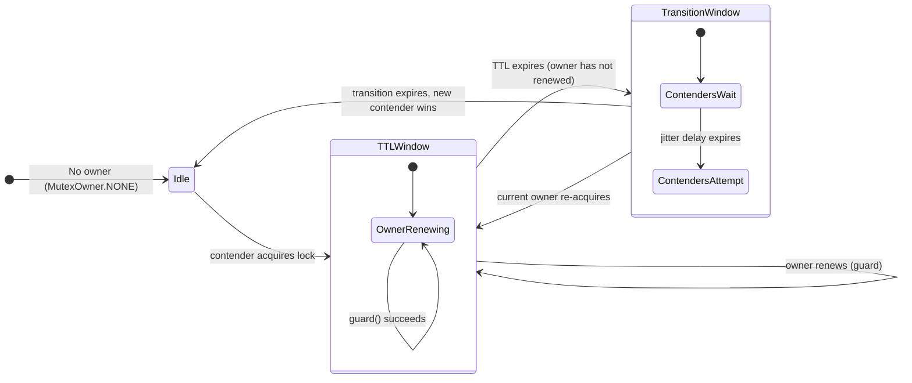
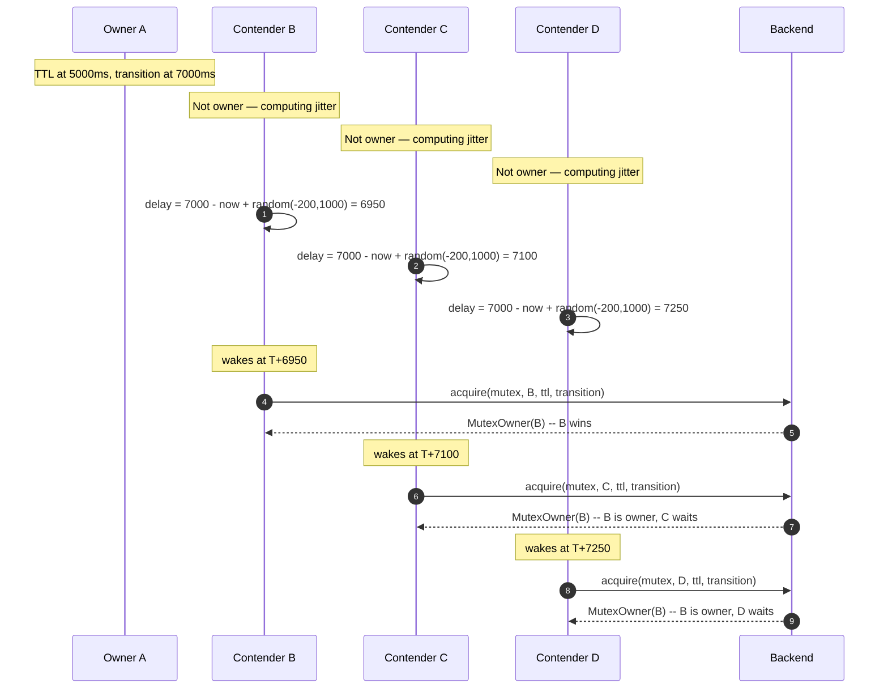
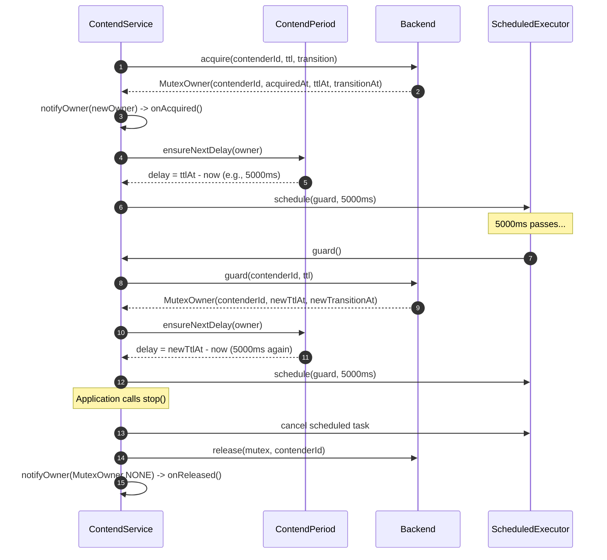
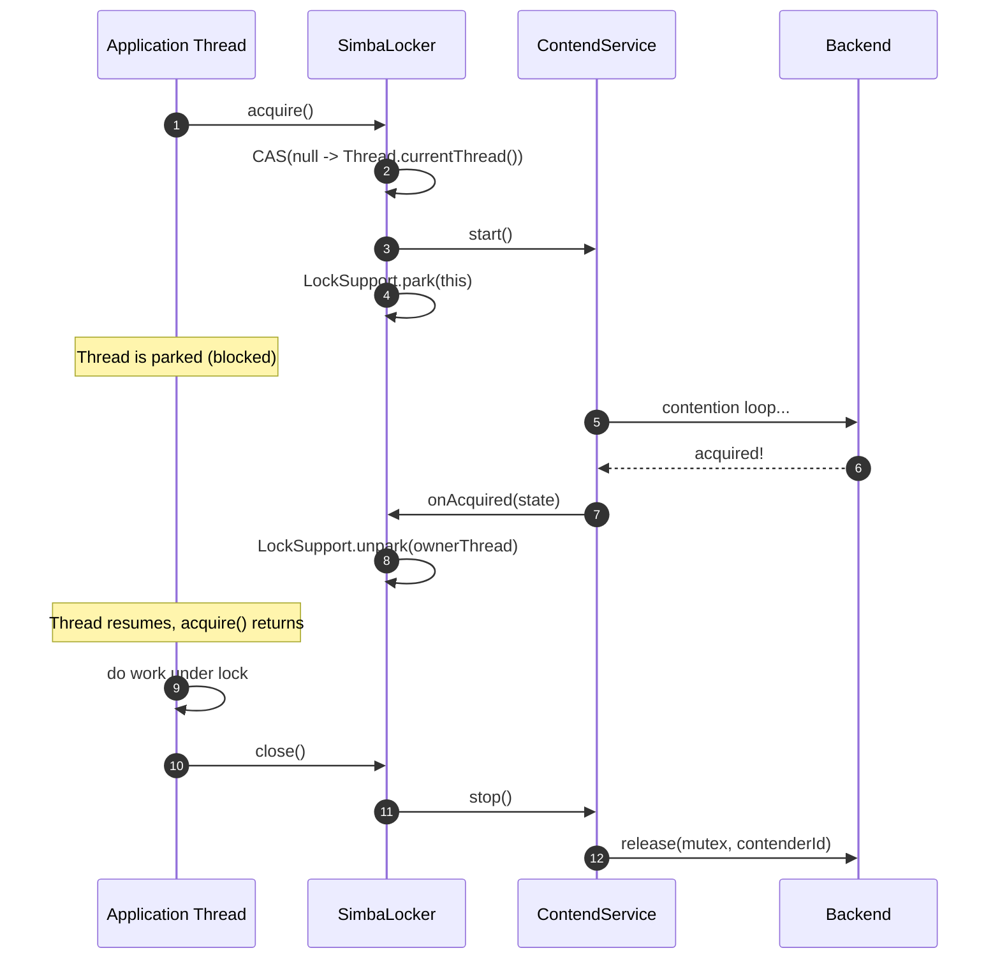
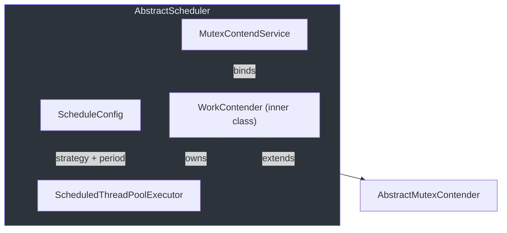
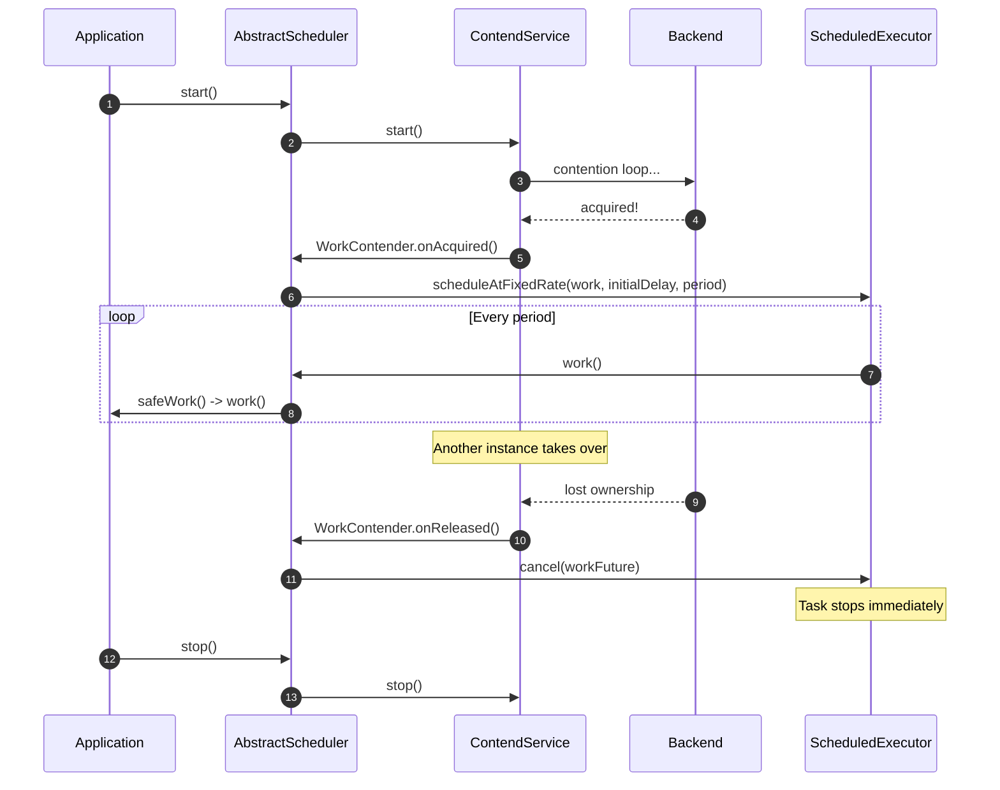

# 争用机制

本页解释驱动 Simba 分布式互斥锁争用的计时和调度逻辑。理解这些机制对于在生产环境中调优 TTL、过渡和抖动参数至关重要。

## 所有权生命周期

每个互斥锁所有权周期都有三个相对于 `acquiredAt` 时间戳定义的时间窗口：



| 窗口 | 持续时间 | 语义 |
|---|---|---|
| **TTL** | `ttl` 毫秒 | 所有者持有独占权，必须在此窗口过期前续约。非所有者不得尝试获取。 |
| **过渡** | `transition` 毫秒 | TTL 过期后的缓冲期。当前所有者仍可重新获取（防止不必要的领导权翻转）。非所有者需等待此窗口结束后再争用。 |
| **空闲** | 无界 | 无活跃所有者。任何竞争者可立即获取。 |

## ContendPeriod

[`ContendPeriod`](https://github.com/Ahoo-Wang/Simba/blob/main/simba-core/src/main/kotlin/me/ahoo/simba/core/ContendPeriod.kt) 是核心调度计算器。每个争用服务实例会创建一个绑定到其 `contenderId` 的 `ContendPeriod`。

### 所有者延迟

当当前竞争者就是所有者时，下一次调度延迟就是剩余的 TTL（[`nextOwnerDelay`，第 38 行](https://github.com/Ahoo-Wang/Simba/blob/main/simba-core/src/main/kotlin/me/ahoo/simba/core/ContendPeriod.kt#L38)）：

```
delay = mutexOwner.ttlAt - currentTimeMillis()
```

这意味着服务会在 TTL 到期前唤醒以续约（守护）锁。

### 竞争者延迟

当当前竞争者不是所有者时，延迟目标是过渡期结束加上一个随机抖动（[`nextContenderDelay`，第 43 行](https://github.com/Ahoo-Wang/Simba/blob/main/simba-core/src/main/kotlin/me/ahoo/simba/core/ContendPeriod.kt#L43)）：

```
delay = (mutexOwner.transitionAt - currentTimeMillis()) + random(-200, +1000)
```

抖动范围为 **[-200ms, +1000ms)**：
- **-200ms** 的下界意味着一些竞争者会在过渡期结束*之前*稍微醒来，获得获取的先发优势。这是有意为之的 — 它防止了所有竞争者在同一时刻醒来。
- **+1000ms** 的上界分散了较晚醒来的竞争者。
- 当过渡期为零时（`transition == 0`），抖动范围变为 **[0, +1000ms)**。

```mermaid
gantt
    title Ownership Timeline for One Mutex Cycle
    dateFormat X
    axisFormat %L ms

    section Owner (A)
    TTL Window (exclusive)           :active, ttl, 0, 5000
    Transition Window (buffer)       :trans, 5000, 7000

    section Contender (B)
    Waiting (must not contend)       :done, wait, 0, 7000
    Jitter window [-200, +1000]      :crit, jitter, 6800, 8000
```



### ensureNextDelay

`ensureNextDelay()` 方法（[第 23 行](https://github.com/Ahoo-Wang/Simba/blob/main/simba-core/src/main/kotlin/me/ahoo/simba/core/ContendPeriod.kt#L23)）封装了 `nextDelay()` 并将负值钳制为零：

```kotlin
fun ensureNextDelay(mutexOwner: MutexOwner): Long {
    val nextDelay = nextDelay(mutexOwner)
    return if (nextDelay < 0) 0 else nextDelay
}
```

这确保调度任务永远不会使用负延迟（否则会导致 `ScheduledThreadPoolExecutor` 立即执行）。

## 惊群效应防护

如果不使用抖动，所有非所有者竞争者会计算出相同的延迟并在同一时刻醒来，产生同时尝试获取锁的惊群效应。

Simba 的抖动策略在每个竞争者的延迟上添加 `ThreadLocalRandom.current().nextLong(-200, 1000)`（[第 48 行](https://github.com/Ahoo-Wang/Simba/blob/main/simba-core/src/main/kotlin/me/ahoo/simba/core/ContendPeriod.kt#L48)）：



提前唤醒（负抖动）是有意为之的：它给最快的竞争者一个在过渡窗口期间获取锁的机会，此时其他竞争者甚至还没有醒来。

## 守护（续约）机制

当所有者的调度任务在 TTL 到期前触发时，服务调用 `guard()` 而不是 `acquire()`。Guard 尝试在不释放锁的情况下延长 TTL。

在 Redis 后端中，guard Lua 脚本（[mutex_guard.lua](https://github.com/Ahoo-Wang/Simba/blob/main/simba-spring-redis/src/main/resources/mutex_guard.lua)）首先验证当前竞争者是否仍然持有锁（`GET mutexKey == contenderId`），然后通过 `SET ... XX PX transition` 延长 TTL：

```lua
-- Verify ownership
if redis.call('get', mutexKey) ~= contenderId then
    return getCurrentOwner(mutexKey)
end
-- Extend TTL (XX = only if key exists)
if redis.call('set', mutexKey, contenderId, 'xx', 'px', transition) then
    return contenderId .. '@@' .. transition
end
```

在 JDBC 后端中，`SQL_ACQUIRE` 查询的 WHERE 子句允许当前所有者在过渡窗口内重新获取（[JdbcMutexOwnerRepository 第 55 行](https://github.com/Ahoo-Wang/Simba/blob/main/simba-jdbc/src/main/kotlin/me/ahoo/simba/jdbc/JdbcMutexOwnerRepository.kt#L55)）：

```sql
AND (
    (transition_at < current_timestamp)
    OR
    (owner_id = ? AND transition_at > current_timestamp)
)
```

这种双重条件确保：
1. 非所有者只有在过渡期完全结束后才能获取。
2. 当前所有者可以在过渡窗口内的任何时候重新获取（续约）。

## 所有权生命周期时序图

一个完整争用轮次的生命周期，从获取到续约再到释放：



## SimbaLocker 内部机制

[`SimbaLocker`](https://github.com/Ahoo-Wang/Simba/blob/main/simba-core/src/main/kotlin/me/ahoo/simba/locker/SimbaLocker.kt) 提供了一个 RAII 风格（try-with-resources）的锁 API。它扩展了 `AbstractMutexContender` 并使用 `LockSupport.park` / `unpark` 进行线程同步。

### 工作原理



关键设计要点：

1. **单一所有者强制** — 名为 `OWNER` 的 `AtomicReferenceFieldUpdater<SimbaLocker, Thread>`（[第 45 行](https://github.com/Ahoo-Wang/Simba/blob/main/simba-core/src/main/kotlin/me/ahoo/simba/locker/SimbaLocker.kt#L45)）确保只有一个线程可以调用 `acquire()`。来自同一线程或不同线程的第二次调用将抛出 `IllegalMonitorStateException`。

2. **超时支持** — `acquire(timeout: Duration)`（[第 73 行](https://github.com/Ahoo-Wang/Simba/blob/main/simba-core/src/main/kotlin/me/ahoo/simba/locker/SimbaLocker.kt#L73)）使用 `LockSupport.parkNanos()` 而非 `park()`。如果线程在未获取锁的情况下被唤醒，将抛出 `TimeoutException`。

3. **不可重入** — `SimbaLocker` 不支持可重入锁。一旦挂起，同一线程在 `close()` 释放锁之前无法再次调用 `acquire()`。

### 使用模式

```kotlin
SimbaLocker(mutex, contendServiceFactory).use { locker ->
    locker.acquire()
    // ... work under distributed lock ...
} // close() releases automatically
```

## AbstractScheduler 内部机制

[`AbstractScheduler`](https://github.com/Ahoo-Wang/Simba/blob/main/simba-core/src/main/kotlin/me/ahoo/simba/schedule/AbstractScheduler.kt) 是一个基于领导者门控的调度任务运行器。它使用 Simba 的分布式互斥锁来确保集群中只有一个实例执行周期性任务。

### 内部 WorkContender

`WorkContender` 内部类（[第 55 行](https://github.com/Ahoo-Wang/Simba/blob/main/simba-core/src/main/kotlin/me/ahoo/simba/schedule/AbstractScheduler.kt#L55)）扩展了 `AbstractMutexContender`，并管理一个单线程的 `ScheduledThreadPoolExecutor`：



**获取时**（`onAcquired`，[第 66 行](https://github.com/Ahoo-Wang/Simba/blob/main/simba-core/src/main/kotlin/me/ahoo/simba/schedule/AbstractScheduler.kt#L66)）：如果没有正在运行的调度任务，它会根据 `ScheduleConfig.strategy` 使用 `scheduleAtFixedRate` 或 `scheduleWithFixedDelay` 创建一个。

**释放时**（`onReleased`，[第 89 行](https://github.com/Ahoo-Wang/Simba/blob/main/simba-core/src/main/kotlin/me/ahoo/simba/schedule/AbstractScheduler.kt#L89)）：取消调度的 Future，立即停止任务执行。

### ScheduleConfig

[`ScheduleConfig`](https://github.com/Ahoo-Wang/Simba/blob/main/simba-core/src/main/kotlin/me/ahoo/simba/schedule/ScheduleConfig.kt) 定义了两种策略：

| 策略 | 行为 |
|---|---|
| `FIXED_RATE` | `scheduleAtFixedRate` — 以固定间隔执行，不受任务时长影响 |
| `FIXED_DELAY` | `scheduleWithFixedDelay` — 在上一个任务完成*之后*等待延迟时间 |

### 调度器生命周期



## 参数调优指南

| 参数 | 效果 | 建议 |
|---|---|---|
| `ttl` | 所有者续约频率。越短 = 故障检测越快，DB/Redis 负载越大。 | 大多数场景 5-15 秒 |
| `transition` | 领导权变更前的缓冲期。防止抖动。 | 1-3 秒（必须 > 0 以确保领导权稳定） |
| `initialDelay` | 首次争用尝试前的等待时间。 | 0 表示立即开始，或设置一个小值以错开冷启动 |

`ttl` 和 `transition` 之间的关系决定了锁的总有效时长：**total = ttl + transition**。在 `ttl` 窗口期间，只有所有者可以操作。在 `transition` 窗口期间，所有者可以续约（保持领导权），但非所有者需等待。
