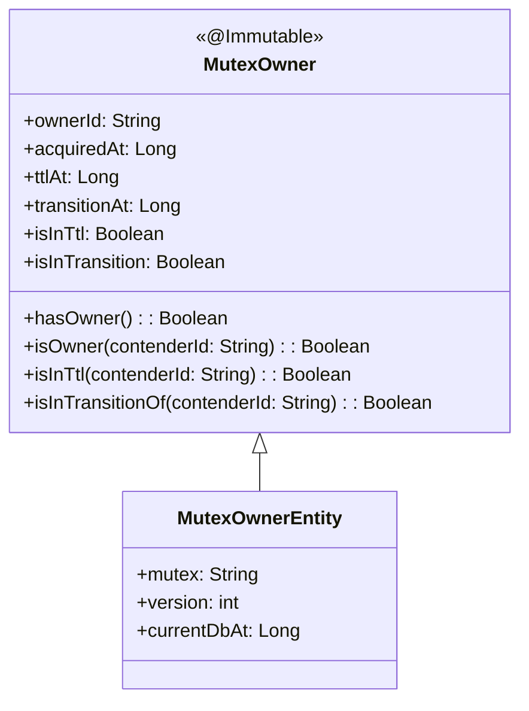
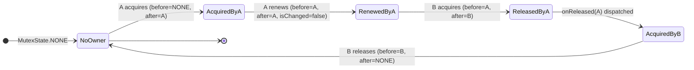
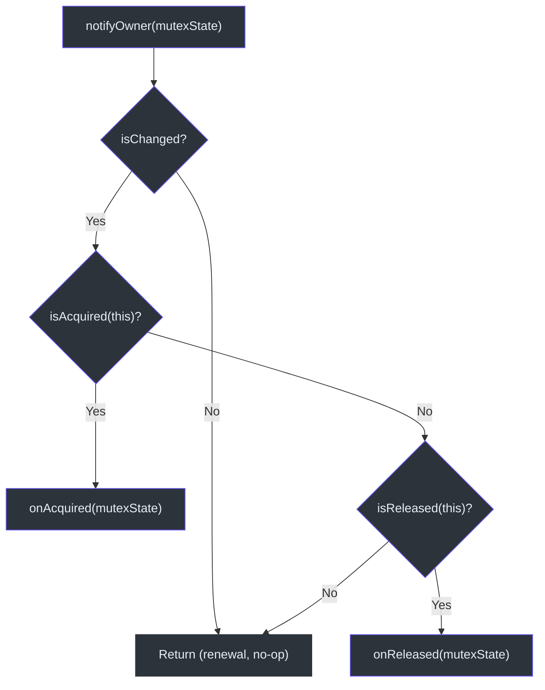
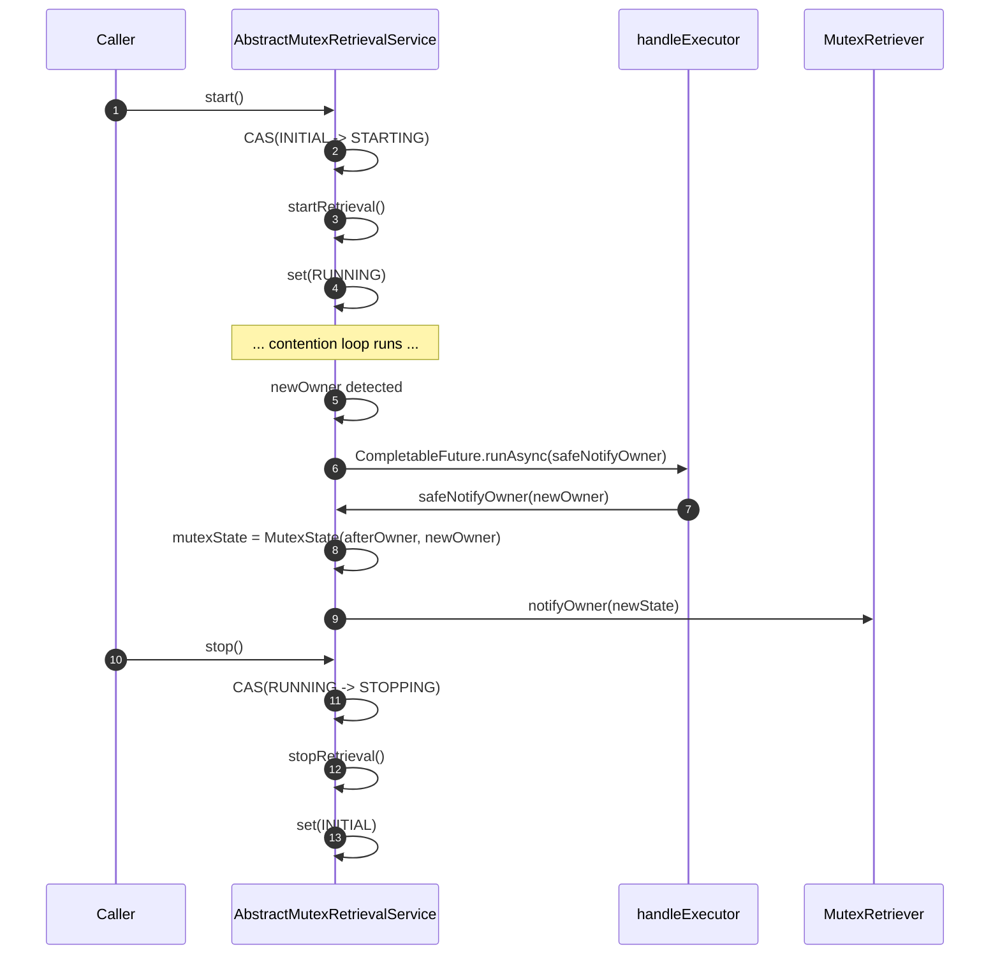
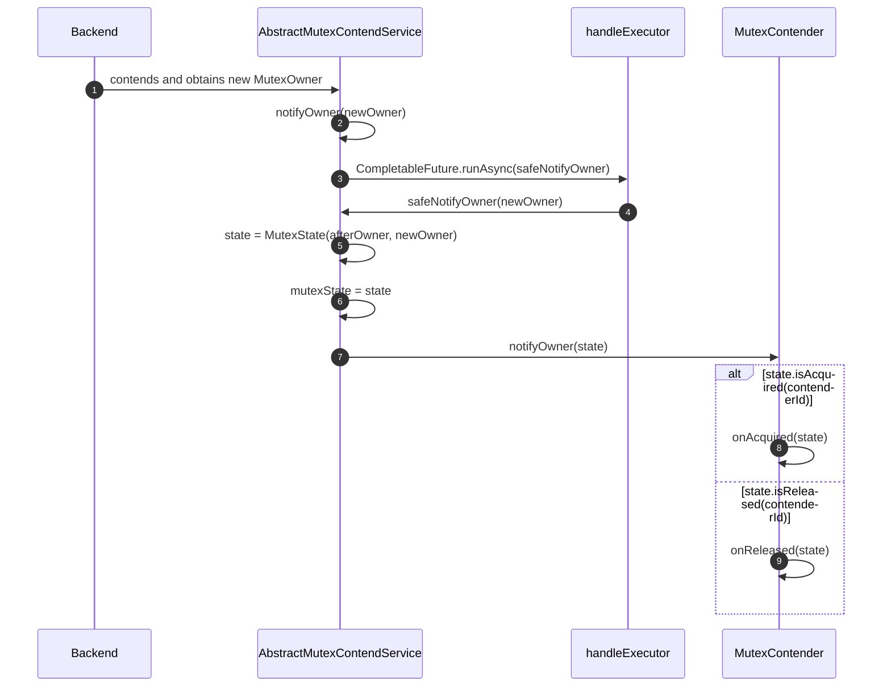
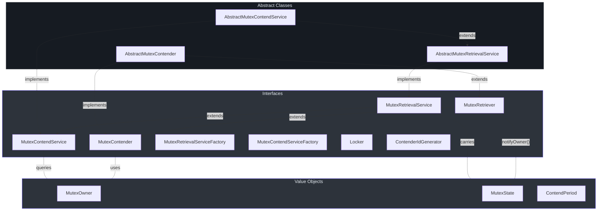

# 核心抽象

本页记录了 `simba-core` 模块中的每个类型。该模块定义了所有后端实现的接口链、表示所有权状态的值对象，以及处理调度、通知分发和生命周期管理的抽象基类。

## 值对象

### MutexOwner

[`MutexOwner`](https://github.com/Ahoo-Wang/Simba/blob/main/simba-core/src/main/kotlin/me/ahoo/simba/core/MutexOwner.kt) 是一个不可变的值对象，表示分布式互斥锁的当前持有者。它携带四个字段：

| 字段 | 类型 | 描述 |
|---|---|---|
| `ownerId` | `String` | 当前所有者的竞争者 ID |
| `acquiredAt` | `Long` | 获取锁时的纪元毫秒数 |
| `ttlAt` | `Long` | 锁的 TTL 到期时的纪元毫秒数（所有者必须在此之前续约） |
| `transitionAt` | `Long` | 过渡期结束时的纪元毫秒数（其他竞争者可在此之后尝试获取） |

关键派生属性和方法：

- **`isInTtl`** — 当 `ttlAt > currentTimeMillis()` 时返回 `true`，表示所有者仍拥有有效的 TTL。
- **`isInTransition`** — 当 `transitionAt >= currentTimeMillis()` 时返回 `true`，表示其他竞争者尚不应尝试获取。
- **`hasOwner()`** — 当 `transitionAt >= currentTimeMillis()` 时返回 `true`，表示存在活跃的领导者（即使 TTL 已过期，过渡窗口仍算作"已拥有"）。
- **`isOwner(contenderId)`** — 检查给定的竞争者 ID 是否与 `ownerId` 匹配。

该类使用 Guava 的 `@Immutable` 注解（[第 22 行](https://github.com/Ahoo-Wang/Simba/blob/main/simba-core/src/main/kotlin/me/ahoo/simba/core/MutexOwner.kt#L22)）。

**NONE 哨兵值：** 伴生对象提供了 `MutexOwner.NONE`（[第 85 行](https://github.com/Ahoo-Wang/Simba/blob/main/simba-core/src/main/kotlin/me/ahoo/simba/core/MutexOwner.kt#L85)），这是一个 `ownerId = ""`、`acquiredAt = 0`、`ttlAt = 0`、`transitionAt = 0` 的单例。它表示不存在任何所有者，用作初始和终止状态。



### MutexState

[`MutexState`](https://github.com/Ahoo-Wang/Simba/blob/main/simba-core/src/main/kotlin/me/ahoo/simba/core/MutexState.kt) 是一个 `data class`，携带一对 `MutexOwner` 值（before/after）。它捕获所有权变更并提供便捷的谓词方法来判断发生了什么。

| 字段 | 类型 | 描述 |
|---|---|---|
| `before` | `MutexOwner` | 前一个所有者（或 `MutexOwner.NONE`） |
| `after` | `MutexOwner` | 当前所有者（或 `MutexOwner.NONE`） |

关键派生属性：

- **`isChanged`**（[第 36 行](https://github.com/Ahoo-Wang/Simba/blob/main/simba-core/src/main/kotlin/me/ahoo/simba/core/MutexState.kt#L36)）— 当 `before.ownerId != after.ownerId` 时为 `true`。
- **`isAcquired(contenderId)`**（[第 38 行](https://github.com/Ahoo-Wang/Simba/blob/main/simba-core/src/main/kotlin/me/ahoo/simba/core/MutexState.kt#L38)）— 当状态变更且给定的竞争者是新所有者时为 `true`。
- **`isReleased(contenderId)`**（[第 42 行](https://github.com/Ahoo-Wang/Simba/blob/main/simba-core/src/main/kotlin/me/ahoo/simba/core/MutexState.kt#L42)）— 当状态变更且给定的竞争者是前一个所有者时为 `true`。
- **`isOwner(contenderId)`**（[第 46 行](https://github.com/Ahoo-Wang/Simba/blob/main/simba-core/src/main/kotlin/me/ahoo/simba/core/MutexState.kt#L46)）— 委托给 `after.isOwner()`。
- **`isInTtl(contenderId)`**（[第 50 行](https://github.com/Ahoo-Wang/Simba/blob/main/simba-core/src/main/kotlin/me/ahoo/simba/core/MutexState.kt#L50)）— 当竞争者是所有者且 TTL 尚未过期时为 `true`。

伴生对象提供了 `MutexState.NONE`（[第 32 行](https://github.com/Ahoo-Wang/Simba/blob/main/simba-core/src/main/kotlin/me/ahoo/simba/core/MutexState.kt#L32)），它配对了两个 `MutexOwner.NONE` 值。



## 接口

### MutexRetriever

[`MutexRetriever`](https://github.com/Ahoo-Wang/Simba/blob/main/simba-core/src/main/kotlin/me/ahoo/simba/core/MutexRetriever.kt) 是根回调接口。互斥锁争用中的每个参与者都必须实现它。

```kotlin
interface MutexRetriever {
    val mutex: String
    fun notifyOwner(mutexState: MutexState)
}
```

- `mutex` — 分布式互斥锁资源的名称。
- `notifyOwner()` — 当所有者状态变更时由争用服务调用。

### MutexContender

[`MutexContender`](https://github.com/Ahoo-Wang/Simba/blob/main/simba-core/src/main/kotlin/me/ahoo/simba/core/MutexContender.kt) 在 `MutexRetriever` 的基础上扩展了身份标识和专用回调：

```kotlin
interface MutexContender : MutexRetriever {
    val contenderId: String
    fun onAcquired(mutexState: MutexState)
    fun onReleased(mutexState: MutexState)
}
```

默认的 `notifyOwner()` 实现（[第 27-37 行](https://github.com/Ahoo-Wang/Simba/blob/main/simba-core/src/main/kotlin/me/ahoo/simba/core/MutexContender.kt#L27-L37)）过滤无变更的转换并路由回调：

1. 如果 `mutexState.isChanged` 为 `false`，立即返回（续约，非真正的转换）。
2. 如果 `mutexState.isAcquired(contenderId)` — 调用 `onAcquired()`。
3. 如果 `mutexState.isReleased(contenderId)` — 调用 `onReleased()`。



### MutexRetrievalService

[`MutexRetrievalService`](https://github.com/Ahoo-Wang/Simba/blob/main/simba-core/src/main/kotlin/me/ahoo/simba/core/MutexRetrievalService.kt) 定义了争用服务的生命周期：

```kotlin
interface MutexRetrievalService : AutoCloseable {
    val status: Status
    val mutexState: MutexState
    val running: Boolean
    fun start()
    fun stop()
}
```

`Status` 枚举跟踪生命周期阶段：

| 状态 | 含义 |
|---|---|
| `INITIAL` | 尚未启动 |
| `STARTING` | 正在转换为运行中 |
| `RUNNING` | 正在积极争用 |
| `STOPPING` | 正在关闭 |

`isActive`（[第 59 行](https://github.com/Ahoo-Wang/Simba/blob/main/simba-core/src/main/kotlin/me/ahoo/simba/core/MutexRetrievalService.kt#L59)）对 `STARTING` 和 `RUNNING` 状态均返回 `true`。

### MutexContendService

[`MutexContendService`](https://github.com/Ahoo-Wang/Simba/blob/main/simba-core/src/main/kotlin/me/ahoo/simba/core/MutexContendService.kt) 扩展了 `MutexRetrievalService` 并添加了竞争者特定的查询：

```kotlin
interface MutexContendService : MutexRetrievalService {
    val contender: MutexContender
    val isOwner: Boolean
    val isInTtl: Boolean
}
```

- `isOwner`（[第 36 行](https://github.com/Ahoo-Wang/Simba/blob/main/simba-core/src/main/kotlin/me/ahoo/simba/core/MutexContendService.kt#L36)）— 检查绑定的竞争者是否是当前所有者。
- `isInTtl`（[第 38 行](https://github.com/Ahoo-Wang/Simba/blob/main/simba-core/src/main/kotlin/me/ahoo/simba/core/MutexContendService.kt#L38)）— 检查绑定的竞争者是否是所有者且 TTL 仍然有效。

## 工厂接口

### MutexRetrievalServiceFactory

[`MutexRetrievalServiceFactory`](https://github.com/Ahoo-Wang/Simba/blob/main/simba-core/src/main/kotlin/me/ahoo/simba/core/MutexRetrievalServiceFactory.kt) 创建检索服务（仅观察，不争用）：

```kotlin
interface MutexRetrievalServiceFactory {
    fun createMutexRetrievalService(retrievalListener: MutexRetriever): MutexRetrievalService
}
```

### MutexContendServiceFactory

[`MutexContendServiceFactory`](https://github.com/Ahoo-Wang/Simba/blob/main/simba-core/src/main/kotlin/me/ahoo/simba/core/MutexContendServiceFactory.kt) 创建争用服务（完整的锁获取）：

```kotlin
interface MutexContendServiceFactory {
    fun createMutexContendService(mutexContender: MutexContender): MutexContendService
}
```

所有三个后端模块都提供了此接口的实现。

## 抽象实现

### AbstractMutexRetrievalService

[`AbstractMutexRetrievalService`](https://github.com/Ahoo-Wang/Simba/blob/main/simba-core/src/main/kotlin/me/ahoo/simba/core/AbstractMutexRetrievalService.kt) 是所有检索服务的基类。它管理：

- **状态转换** — 使用 `AtomicReferenceFieldUpdater`（[第 32 行](https://github.com/Ahoo-Wang/Simba/blob/main/simba-core/src/main/kotlin/me/ahoo/simba/core/AbstractMutexRetrievalService.kt#L32)）对 `status` 字段进行无锁 CAS 操作。`start()` 要求 `INITIAL -> STARTING`，`stop()` 要求 `RUNNING -> STOPPING`。
- **所有者状态** — `mutexState` 字段使用 `@Volatile`，在 `safeNotifyOwner()` 中更新。
- **异步通知** — `notifyOwner(newOwner)` 通过 `CompletableFuture.runAsync()` 在 `handleExecutor` 上分发，确保缓慢的回调永远不会阻塞争用线程。
- **模板方法** — 子类实现 `startRetrieval()` 和 `stopRetrieval()`。



### AbstractMutexContendService

[`AbstractMutexContendService`](https://github.com/Ahoo-Wang/Simba/blob/main/simba-core/src/main/kotlin/me/ahoo/simba/core/AbstractMutexContendService.kt) 扩展了 `AbstractMutexRetrievalService`，桥接了检索层和争用层：

```kotlin
abstract class AbstractMutexContendService(
    override val contender: MutexContender,
    handleExecutor: Executor
) : AbstractMutexRetrievalService(contender, handleExecutor), MutexContendService {

    override fun startRetrieval() {
        resetOwner()
        startContend()
    }

    override fun stopRetrieval() {
        stopContend()
    }

    protected abstract fun startContend()
    protected abstract fun stopContend()
}
```

`startRetrieval()` 在调用 `startContend()` 之前将所有者重置为 `NONE`，确保从干净状态开始。两个抽象方法（`startContend` / `stopContend`）是 JDBC、Redis 和 Zookeeper 后端实现的扩展点。

### AbstractMutexContender

[`AbstractMutexContender`](https://github.com/Ahoo-Wang/Simba/blob/main/simba-core/src/main/kotlin/me/ahoo/simba/core/AbstractMutexContender.kt) 提供了一个具体的 `MutexContender` 基类，带有日志记录默认实现：

- 在 `init` 块中验证 `mutex` 和 `contenderId` 都不为空（[第 30-32 行](https://github.com/Ahoo-Wang/Simba/blob/main/simba-core/src/main/kotlin/me/ahoo/simba/core/AbstractMutexContender.kt#L30-L32)）。
- `contenderId` 默认使用 `ContenderIdGenerator.HOST.generate()`（[第 24 行](https://github.com/Ahoo-Wang/Simba/blob/main/simba-core/src/main/kotlin/me/ahoo/simba/core/AbstractMutexContender.kt#L24)）。
- 提供仅记录日志的 `onAcquired()` / `onReleased()` 实现。

`SimbaLocker` 和 `AbstractScheduler.WorkContender` 都继承了此类。

## ContenderIdGenerator

[`ContenderIdGenerator`](https://github.com/Ahoo-Wang/Simba/blob/main/simba-core/src/main/kotlin/me/ahoo/simba/core/ContenderIdGenerator.kt) 是一个用于生成唯一竞争者标识符的策略接口。提供了两种实现：

### UUIDContenderIdGenerator

[UUIDContenderIdGenerator](https://github.com/Ahoo-Wang/Simba/blob/main/simba-core/src/main/kotlin/me/ahoo/simba/core/ContenderIdGenerator.kt#L36) 生成一个去除破折号的随机 UUID。通过 `ContenderIdGenerator.UUID` 访问。

```
a1b2c3d4e5f6789012345678abcdef01
```

### HostContenderIdGenerator

[HostContenderIdGenerator](https://github.com/Ahoo-Wang/Simba/blob/main/simba-core/src/main/kotlin/me/ahoo/simba/core/ContenderIdGenerator.kt#L42) 生成格式为 `{counter}:{processId}@{hostAddress}` 的 ID。通过 `ContenderIdGenerator.HOST` 访问，作为 `AbstractMutexContender` 中的默认值使用。

```
0:12345@192.168.1.100
1:12345@192.168.1.100
```

计数器是一个 `AtomicLong`，在每个 JVM 内递增，使 ID 人类可读且可追溯到特定的主机和进程。这是生产部署的首选策略，因为它简化了所有权问题的调试。

## 所有权通知流程

从后端检测到应用回调的完整流程：



## 接口关系图

下图展示了 `simba-core` 中完整的接口/实现关系：



## 总结

| 抽象 | 类型 | 位置 | 用途 |
|---|---|---|---|
| `MutexOwner` | 值对象 | [core/MutexOwner.kt](https://github.com/Ahoo-Wang/Simba/blob/main/simba-core/src/main/kotlin/me/ahoo/simba/core/MutexOwner.kt) | 锁所有权的不可变快照 |
| `MutexState` | 值对象 | [core/MutexState.kt](https://github.com/Ahoo-Wang/Simba/blob/main/simba-core/src/main/kotlin/me/ahoo/simba/core/MutexState.kt) | 所有权变更的前后配对 |
| `MutexRetriever` | 接口 | [core/MutexRetriever.kt](https://github.com/Ahoo-Wang/Simba/blob/main/simba-core/src/main/kotlin/me/ahoo/simba/core/MutexRetriever.kt) | 所有权变更的回调契约 |
| `MutexContender` | 接口 | [core/MutexContender.kt](https://github.com/Ahoo-Wang/Simba/blob/main/simba-core/src/main/kotlin/me/ahoo/simba/core/MutexContender.kt) | 添加身份标识 + 获取/释放钩子 |
| `MutexRetrievalService` | 接口 | [core/MutexRetrievalService.kt](https://github.com/Ahoo-Wang/Simba/blob/main/simba-core/src/main/kotlin/me/ahoo/simba/core/MutexRetrievalService.kt) | 服务生命周期 + 状态访问 |
| `MutexContendService` | 接口 | [core/MutexContendService.kt](https://github.com/Ahoo-Wang/Simba/blob/main/simba-core/src/main/kotlin/me/ahoo/simba/core/MutexContendService.kt) | 绑定竞争者的服务，支持所有权查询 |
| `MutexContendServiceFactory` | 接口 | [core/MutexContendServiceFactory.kt](https://github.com/Ahoo-Wang/Simba/blob/main/simba-core/src/main/kotlin/me/ahoo/simba/core/MutexContendServiceFactory.kt) | 创建后端特定的争用服务 |
| `AbstractMutexRetrievalService` | 抽象类 | [core/AbstractMutexRetrievalService.kt](https://github.com/Ahoo-Wang/Simba/blob/main/simba-core/src/main/kotlin/me/ahoo/simba/core/AbstractMutexRetrievalService.kt) | 基于 CAS 的生命周期 + 异步通知 |
| `AbstractMutexContendService` | 抽象类 | [core/AbstractMutexContendService.kt](https://github.com/Ahoo-Wang/Simba/blob/main/simba-core/src/main/kotlin/me/ahoo/simba/core/AbstractMutexContendService.kt) | 通过模板方法桥接检索到争用 |
| `AbstractMutexContender` | 抽象类 | [core/AbstractMutexContender.kt](https://github.com/Ahoo-Wang/Simba/blob/main/simba-core/src/main/kotlin/me/ahoo/simba/core/AbstractMutexContender.kt) | 带验证和日志记录的默认竞争者 |
| `ContenderIdGenerator` | 接口 | [core/ContenderIdGenerator.kt](https://github.com/Ahoo-Wang/Simba/blob/main/simba-core/src/main/kotlin/me/ahoo/simba/core/ContenderIdGenerator.kt) | 唯一竞争者 ID 生成策略 |
| `ContendPeriod` | 类 | [core/ContendPeriod.kt](https://github.com/Ahoo-Wang/Simba/blob/main/simba-core/src/main/kotlin/me/ahoo/simba/core/ContendPeriod.kt) | 基于所有权计算下一次调度延迟 |
