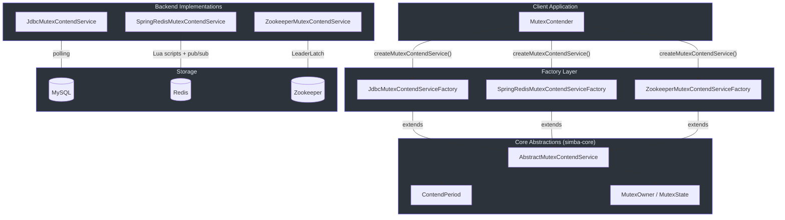
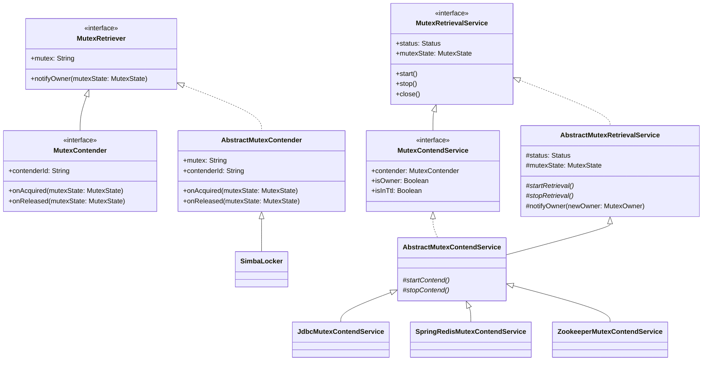
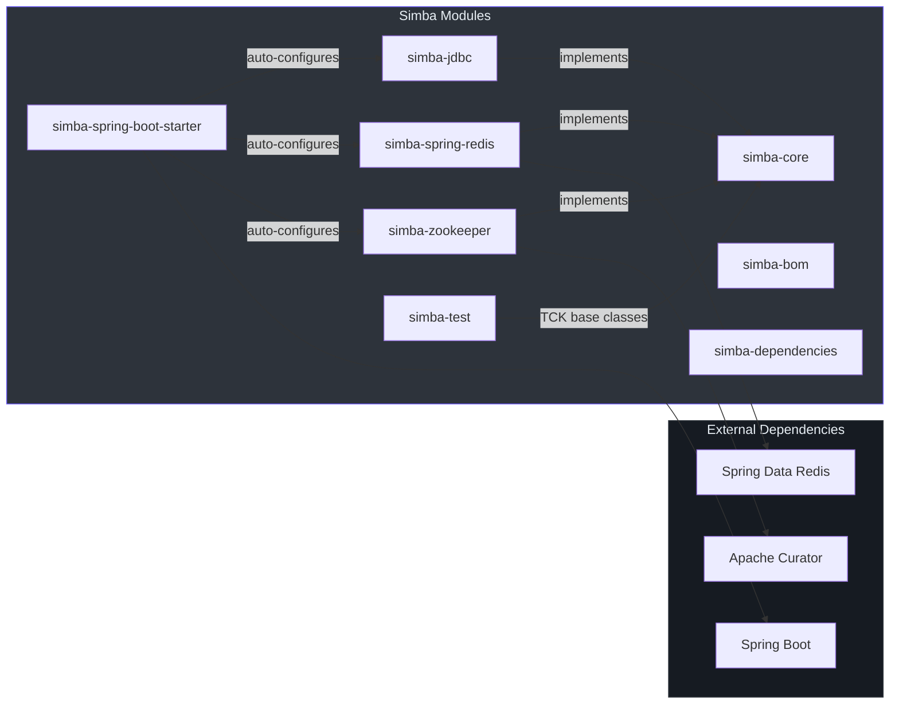
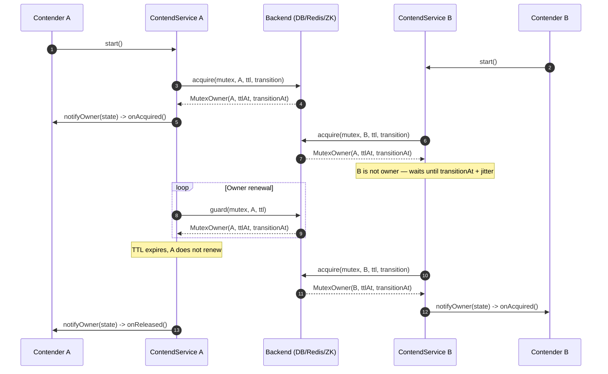

# 架构概览

Simba 是一个面向 JVM 的分布式互斥锁（分布式锁）库，使用 Kotlin 编写。它在三种后端实现 —— JDBC/MySQL、Redis 和 Zookeeper —— 之上提供了统一的争用协议，使应用代码可以在不修改业务逻辑的情况下切换存储后端。

## 高层架构

下图展示了客户端应用如何与 Simba 交互。客户端首先从后端特定的工厂获取一个 `MutexContendService`，然后该服务针对选定的存储后端驱动争用循环。

## 类层次结构

类层次结构围绕清晰的接口链组织：`MutexRetriever` 定义了回调契约，`MutexContender` 在其基础上扩展了身份标识和获取/释放钩子，而 `MutexRetrievalService` / `MutexContendService` 则管理争用的生命周期。抽象基类实现了共享的调度和通知逻辑，而后端特定的子类则插入实际的存储操作。

## 设计模式

Simba 应用了多种经典设计模式，以保持抽象的整洁和后端实现的解耦。

### 模板方法模式

[`AbstractMutexContendService`](https://github.com/Ahoo-Wang/Simba/blob/main/simba-core/src/main/kotlin/me/ahoo/simba/core/AbstractMutexContendService.kt) 定义了争用生命周期的骨架（`startRetrieval` -> `startContend` -> `stopContend` -> `stopRetrieval`）。具体的后端重写 `startContend()` 和 `stopContend()` 以提供其存储特定的逻辑，而基类则管理状态转换、所有者状态和通知分发。

### 策略模式

每个后端都是互斥锁获取算法的一种策略。[`MutexContendServiceFactory`](https://github.com/Ahoo-Wang/Simba/blob/main/simba-core/src/main/kotlin/me/ahoo/simba/core/MutexContendServiceFactory.kt) 接口充当策略选择器 —— 调用方在构造时选择一个工厂实现（JDBC、Redis 或 Zookeeper），工厂则生产相应的 `MutexContendService`。

### 观察者/回调模式

[`MutexRetriever.notifyOwner()`](https://github.com/Ahoo-Wang/Simba/blob/main/simba-core/src/main/kotlin/me/ahoo/simba/core/MutexRetriever.kt#L33) 建立了回调契约。当争用服务检测到所有权变更时，它构造一个 `MutexState` 并异步分发给检索器。[`MutexContender`](https://github.com/Ahoo-Wang/Simba/blob/main/simba-core/src/main/kotlin/me/ahoo/simba/core/MutexContender.kt) 进一步对此进行特化，根据变更是否与该竞争者相关，将回调路由到 `onAcquired()` 或 `onReleased()`。

### 工厂模式

三个工厂类实现了 [`MutexContendServiceFactory`](https://github.com/Ahoo-Wang/Simba/blob/main/simba-core/src/main/kotlin/me/ahoo/simba/core/MutexContendServiceFactory.kt) 接口，各自组装适当的仓库、模板、客户端或连接：

- [`JdbcMutexContendServiceFactory`](https://github.com/Ahoo-Wang/Simba/blob/main/simba-jdbc/src/main/kotlin/me/ahoo/simba/jdbc/JdbcMutexContendServiceFactory.kt) — 注入 `MutexOwnerRepository` + TTL/过渡时长
- [`SpringRedisMutexContendServiceFactory`](https://github.com/Ahoo-Wang/Simba/blob/main/simba-spring-redis/src/main/kotlin/me/ahoo/simba/spring/redis/SpringRedisMutexContendServiceFactory.kt) — 注入 `StringRedisTemplate` + `RedisMessageListenerContainer`
- [`ZookeeperMutexContendServiceFactory`](https://github.com/Ahoo-Wang/Simba/blob/main/simba-zookeeper/src/main/kotlin/me/ahoo/simba/zookeeper/ZookeeperMutexContendServiceFactory.kt) — 注入 `CuratorFramework`

### 保护性暂挂模式

[`SimbaLocker`](https://github.com/Ahoo-Wang/Simba/blob/main/simba-core/src/main/kotlin/me/ahoo/simba/locker/SimbaLocker.kt) 应用了保护性暂挂模式：调用线程通过 `LockSupport.park()` 挂起，并在锁获取成功时由 `onAcquired()` 回调解除挂起。这种方式在阻塞调用方的同时避免了忙等待。

### AbstractMutexRetrievalService 中的模板方法

[`AbstractMutexRetrievalService`](https://github.com/Ahoo-Wang/Simba/blob/main/simba-core/src/main/kotlin/me/ahoo/simba/core/AbstractMutexRetrievalService.kt) 在更底层应用模板方法：它强制执行基于 CAS 的状态转换（`INITIAL -> STARTING -> RUNNING -> STOPPING -> INITIAL`），并通过 `CompletableFuture.runAsync()` 在可配置的 `handleExecutor` 上分发所有者通知。子类只需实现 `startRetrieval()` / `stopRetrieval()`（以及由此延伸的 `startContend()` / `stopContend()`）。

### 异步通知分发

所有者通知始终通过 `CompletableFuture.runAsync(safeNotifyOwner, handleExecutor)` 异步分发（[第 71 行](https://github.com/Ahoo-Wang/Simba/blob/main/simba-core/src/main/kotlin/me/ahoo/simba/core/AbstractMutexRetrievalService.kt#L71)）。这确保了缓慢的 `onAcquired()` / `onReleased()` 回调永远不会阻塞争用调度线程。在 JDBC 和 Redis 工厂中，默认的 `handleExecutor` 是 `ForkJoinPool.commonPool()`。

## 核心概念

### MutexOwner

一个不可变的值对象，携带 `ownerId`、`acquiredAt`、`ttlAt` 和 `transitionAt` 四个字段。伴生对象提供了 `MutexOwner.NONE` 作为"当前无所有者"的哨兵值。`hasOwner()` 方法在 `transitionAt >= now` 时返回 `true`，这意味着即使 TTL 已过期（但在过渡窗口内）也算作"有所有者"。

### MutexState

一个 `data class`，配对 `before` 和 `after` 两个 `MutexOwner` 值。它提供了 `isChanged`、`isAcquired(contenderId)` 和 `isReleased(contenderId)` 等谓词来抽象比较逻辑。详见[核心抽象](./core-abstractions.md)。

### TTL 和过渡

每次锁获取都会相对于 `acquiredAt` 设置两个时间边界：
- **TTL**（`ttlAt = acquiredAt + ttl`）：所有者必须在此时间之前续约（守护）。
- **过渡**（`transitionAt = ttlAt + transition`）：TTL 过期后的宽限期，在此期间当前所有者仍可重新获取，但非所有者必须等待。

锁的总有效时长为 `ttl + transition`。这种两阶段设计防止了所有者续约缓慢时的领导权抖动。详见[争用机制](./contention-mechanics.md)。

### ContendPeriod

[`ContendPeriod`](https://github.com/Ahoo-Wang/Simba/blob/main/simba-core/src/main/kotlin/me/ahoo/simba/core/ContendPeriod.kt) 为每个竞争者计算下一次调度延迟：
- **所有者**：`delay = ttlAt - now`（在 TTL 到期前续约）
- **非所有者**：`delay = transitionAt - now + random(-200, +1000)`（等待过渡结束，然后添加抖动以防止惊群效应）

## 模块依赖图

| 模块 | 职责 |
|---|---|
| `simba-core` | 核心接口和抽象实现 |
| `simba-jdbc` | JDBC/MySQL 后端 — 基于乐观锁的轮询 |
| `simba-spring-redis` | Redis 后端 — Lua 脚本 + 发布/订阅通知 |
| `simba-zookeeper` | Zookeeper 后端 — Curator LeaderLatch 配方 |
| `simba-spring-boot-starter` | Spring Boot 自动配置 |
| `simba-test` | TCK（技术兼容性套件）基类 |
| `simba-bom` / `simba-dependencies` | 依赖版本管理 |

## 数据流

下面的时序图追踪了一个包含两个竞争者的完整争用周期。竞争者 A 赢得第一轮，持有锁直到 TTL 过期，然后竞争者 B 获取锁。

## 三个 API 层级

Simba 提供三个 API 层级，从低到高分别是：

| API | 类 | 使用场景 |
|---|---|---|
| **竞争者回调** | `MutexContender` + `MutexContendService` | 完全控制：实现 `onAcquired()` / `onReleased()` 回调 |
| **RAII 锁** | `SimbaLocker`（实现 `Locker`） | 简单的 try-with-resources：`locker.acquire()` 阻塞直到获取锁 |
| **领导者调度器** | `AbstractScheduler` | 基于领导者门控的周期任务：工作仅在持有锁的实例上运行 |

回调 API 是基础。`SimbaLocker` 用 `LockSupport.park/unpark` 封装它以提供阻塞语义。`AbstractScheduler` 用 `ScheduledThreadPoolExecutor` 封装它，使 `work()` 方法仅在领导者节点上触发。

## 技术栈

| 技术 | 版本 | 角色 |
|---|---|---|
| Kotlin | 2.4.0 | 实现语言 |
| JVM | 17（工具链） | 运行时目标 |
| Gradle | Kotlin DSL | 构建系统 |
| Spring Boot | 4.1.0 | 自动配置（starter 模块） |
| Spring Data Redis | （由 Boot 管理） | Redis 后端客户端 |
| Apache Curator | （由依赖管理） | Zookeeper 后端客户端 |
| JUnit 5 (Jupiter) | （由依赖管理） | 测试框架 |
| MockK | 1.14.11 | Kotlin 模拟框架 |
| Detekt | 1.23.8 | 静态分析 |

## 相关页面

- [核心抽象](./core-abstractions.md) — 深入了解 `MutexOwner`、`MutexState`、`MutexRetriever`、`MutexContender`、服务接口和工厂
- [争用机制](./contention-mechanics.md) — `ContendPeriod` 如何计算延迟、抖动范围、TTL/过渡语义、`SimbaLocker` 和 `AbstractScheduler`
- [后端实现](./backends.md) — JDBC、Redis 和 Zookeeper 后端的对比，包含时序图和数据模型
