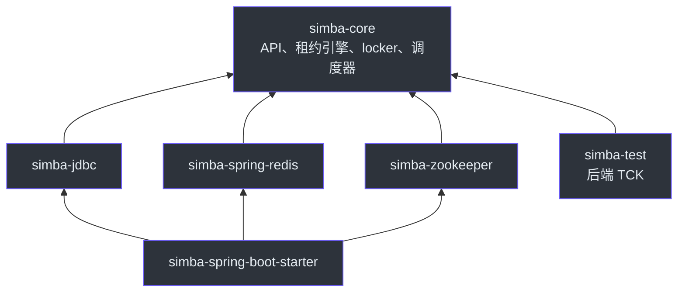
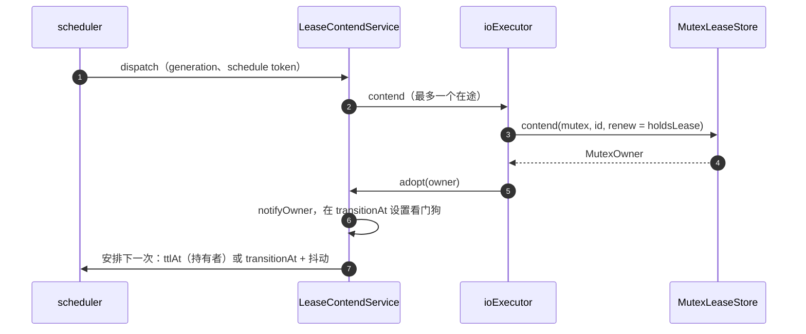

# 架构

本页面向修改 Simba 的人，说明各部分如何组合以及它们依赖的规则；设计理由记录在
[ADR](https://github.com/Ahoo-Wang/Simba/tree/main/docs/adr) 中。

## 模块

```mermaid
graph BT
    core["simba-core<br>API、租约引擎、locker、调度器"]
    jdbc["simba-jdbc"]
    redis["simba-spring-redis"]
    zk["simba-zookeeper"]
    starter["simba-spring-boot-starter"]
    tck["simba-test<br>后端 TCK"]
    jdbc --> core
    redis --> core
    zk --> core
    starter --> jdbc
    starter --> redis
    starter --> zk
    tck --> core
    style core fill:#2d333b,stroke:#6d5dfc,color:#e6edf3
    style jdbc fill:#2d333b,stroke:#6d5dfc,color:#e6edf3
    style redis fill:#2d333b,stroke:#6d5dfc,color:#e6edf3
    style zk fill:#2d333b,stroke:#6d5dfc,color:#e6edf3
    style starter fill:#2d333b,stroke:#6d5dfc,color:#e6edf3
    style tck fill:#2d333b,stroke:#6d5dfc,color:#e6edf3
```

`simba-core` 不了解任何后端，只依赖 kotlin-logging。Starter 以可选特性依赖各个后端。`simba-bom` 和 `simba-dependencies`
是发布元数据；`simba-example` 是可运行的示例。

## 竞争服务的分层

| 层 | 职责 |
|---|---|
| `AbstractMutexRetrievalService` | 生命周期（`status`、generation）、应用持有者变化、有序通知 |
| `AbstractMutexContendService` | 绑定 `MutexContender`；向 `ContendObserver` 上报 |
| `LeaseContendService` | 租约类后端的轮询引擎：调度、续期、看门狗、补偿 |
| `JdbcMutexContendService`、`SpringRedisMutexContendService` | 提供 `MutexLeaseStore` 的薄适配层（Redis 还接入 pub/sub） |
| `ZookeeperMutexContendService` | 基于 Curator `LeaderLatch` 的事件驱动适配层；不使用引擎 |

`SimbaLocker`、`SimbaScheduler` 和 `AbstractScheduler` 是构建在竞争服务之上的竞争者。

### 生命周期与通知

- `status`：`INITIAL → STARTING → RUNNING → STOPPING → INITIAL`。`start()` 失败会回到 `INITIAL`。
- 每次 `start()` 开始一个新的 **generation**。通知携带它产生时的 generation；来自旧 generation 的通知会被丢弃。
  非活动状态下只允许应用释放（`MutexOwner.NONE`）。
- 持有者变化在状态锁内计算，但通过 handle executor 之上的 `SequentialExecutor` 投递，因此回调按顺序执行且从不在锁内运行。
- `stop()` 通过同一个执行器投递最后的释放并等待它完成；若是在服务自己的回调中调用，则内联执行。

## 租约引擎

`LeaseContendService` 把一个原子存储调用（`MutexLeaseStore.contend`）变成租约协议。

```mermaid
sequenceDiagram
autonumber
    participant S as scheduler
    participant E as LeaseContendService
    participant IO as ioExecutor
    participant B as MutexLeaseStore
    S->>E: dispatch（generation、schedule token）
    E->>IO: contend（最多一个在途）
    IO->>B: contend(mutex, id, renew = holdsLease)
    B-->>IO: MutexOwner
    IO->>E: adopt(owner)
    E->>E: notifyOwner，在 transitionAt 设置看门狗
    E->>S: 安排下一次：ttlAt（持有者）或 transitionAt + 抖动
```

引擎维护的规则：

- **获取还是续期** 由存储的上一次应答（`holdsLease`）决定，而不是由异步更新的 `isOwner` 决定。
- **每个服务最多一个在途调用。** 调用期间的 `contendNow()` 请求（Redis 释放广播）会被合并，并在调用结束后立即执行。
- **看门狗。** 每次获取或续期成功后，在 `transitionAt` 设置看门狗，用 `System.nanoTime()` 从调用 *发出* 时开始计量。
  如果没有及时续期成功，即使调用仍挂起，也会撤销本地所有权。
- **失败。** 失败的调用在租约有效期内保持所有权，并在剩余时间的一半后重试（至少 100 ms）；否则撤销并在 `ttl` 后重试。
- **迟到的获取。** 在 `stop()` 之后完成且获得了租约的调用会释放该租约，除非同一 `contenderId` 已重启的生命周期正处于活动状态并依赖这个租约（`adopt`）。

## 线程

| 执行器 | 运行内容 | 默认 |
|---|---|---|
| Handle executor | `onAcquired` / `onReleased` | 库：`ForkJoinPool.commonPool()`；starter：`simbaHandleExecutor` |
| Scheduler | 竞争触发和看门狗；从不阻塞 | 每个工厂共享（`ContendExecutors.newScheduler`） |
| I/O executor | `MutexLeaseStore` 调用 | 每个工厂共享（`ContendExecutors.newIoExecutor`）；线程数 ≤ 竞争中的服务数 |
| Work executor | `SimbaScheduler` 的工作 | 每个调度器一个单线程执行器，仅在担任 leader 期间存在 |

工厂的执行器是空闲回收的守护线程；工厂在 `close()` 时关闭它们。直接构造的 `JdbcMutexContendService` 使用自己的调度器，
并在其上执行 I/O。

## 时间

租约判断使用后端时间或单调偏移，从不混用不同节点的挂钟。`MutexOwner` 记录被观察时的后端时间（`observedAt`）以及一个
`System.nanoTime()` 锚点；`currentAt` 从该锚点推进。JDBC 从数据库读取 `current_at`。Redis 根据 `PTTL` 和本地时钟推算
`transitionAt`。Zookeeper 不使用时间（`ttlAt = transitionAt = Long.MAX_VALUE`）。

## 线上契约

运行不同 Simba 版本的节点会竞争同一个 mutex，因此以下内容对兼容性敏感：

- **Redis 键：** `simba:{mutex}`（租约和 pub/sub 频道）、`simba:{mutex}:fence`、`simba:{mutex}:token`，由 `RedisMutexKeys`
  和三个 Lua 脚本共同构造。消息格式为 `{event}@@{ownerId}`，事件为 `acquired` / `released`。脚本通过 `KEYS` 接收键，返回
  `{ownerId, 剩余租约毫秒数, fencing token}`。
- **JDBC 表结构：** `simba_mutex(mutex, acquired_at, ttl_at, transition_at, owner_id, version, fencing_token)`。在获取的
  `UPDATE` 中，`fencing_token` 的赋值必须保持在 `SET` 的第一位：MySQL 从左到右用已更新的值求值。
- **Zookeeper 路径：** `/simba/{mutex}`，以 latch 节点的 `czxid` 作为 fencing token。

## 设计记录

| ADR | 决策 |
|---|---|
| [0001](https://github.com/Ahoo-Wang/Simba/blob/main/docs/adr/0001-lease-contention-engine.md) | 共享租约引擎与 `MutexLeaseStore` SPI |
| [0002](https://github.com/Ahoo-Wang/Simba/blob/main/docs/adr/0002-fencing-token.md) | 各后端的 fencing token |
| [0003](https://github.com/Ahoo-Wang/Simba/blob/main/docs/adr/0003-simba-4.md) | Simba 4.0 破坏性变更 |
| [0004](https://github.com/Ahoo-Wang/Simba/blob/main/docs/adr/0004-leader-scheduling.md) | `SimbaScheduler` 与 `@SimbaScheduled` |
| [0005](https://github.com/Ahoo-Wang/Simba/blob/main/docs/adr/0005-observability.md) | `ContendObserver` 与 Micrometer 指标 |
| [0006](https://github.com/Ahoo-Wang/Simba/blob/main/docs/adr/0006-actuator-endpoint.md) | 只读的 `simba` Actuator 端点 |
