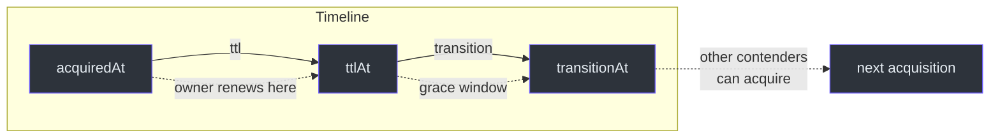
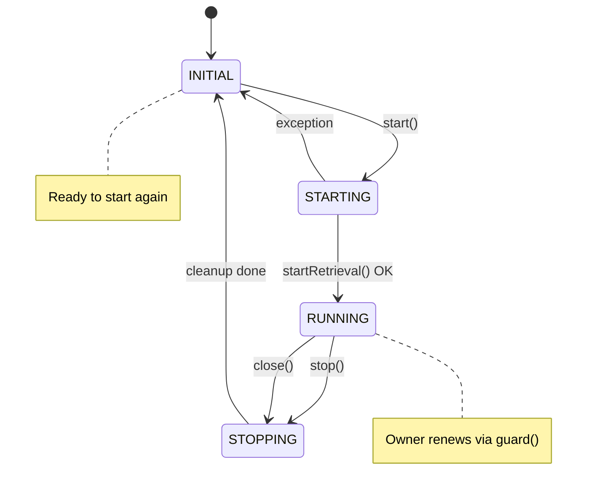
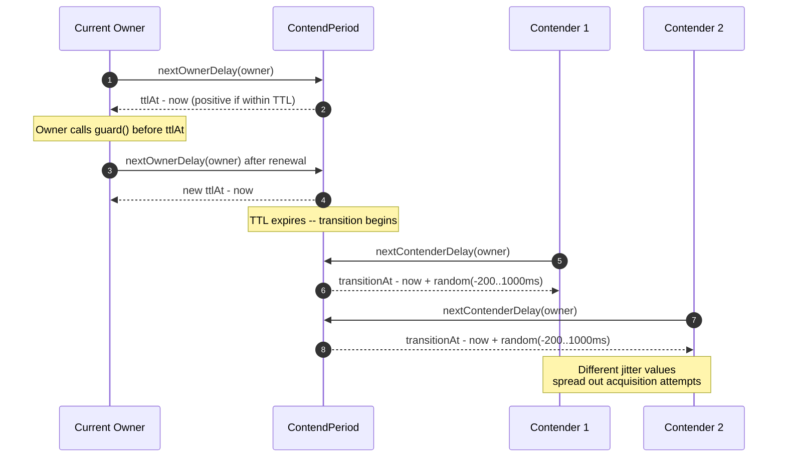
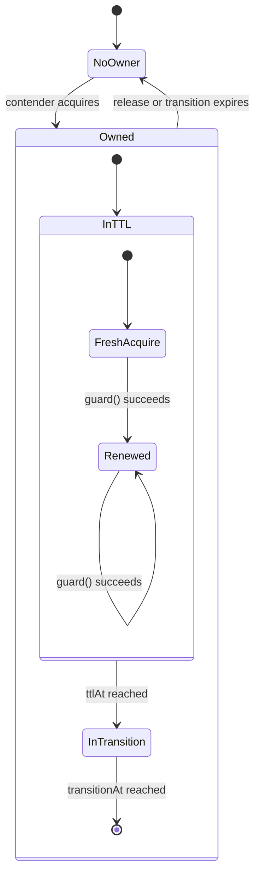

# 配置

本页涵盖 Simba 中所有可用的配置选项。你可以通过 Spring Boot 属性（推荐用于 Spring 应用）或通过工厂类以编程方式配置 Simba。

## Spring Boot 属性

所有属性都以 `simba.` 为前缀。Starter 会根据你启用的后端自动配置对应的 `MutexContendServiceFactory`。

### 全局配置

| 属性 | 类型 | 默认值 | 说明 |
|---|---|---|---|
| `simba.enabled` | `Boolean` | `true` | 所有 Simba 自动配置的主开关。 |

### JDBC 后端

属性前缀：`simba.jdbc`

定义在 [`JdbcProperties`]([file_path:simba-spring-boot-starter/src/main/kotlin/me/ahoo/simba/spring/boot/starter/jdbc/JdbcProperties.kt](https://github.com/Ahoo-Wang/Simba/blob/main/simba-spring-boot-starter/src/main/kotlin/me/ahoo/simba/spring/boot/starter/jdbc/JdbcProperties.kt)) 中。

| 属性 | 类型 | 默认值 | 说明 |
|---|---|---|---|
| `simba.jdbc.enabled` | `Boolean` | `true` | 启用 JDBC 后端。当 `simba.enabled=true` 且此标志为 `true` 时激活。 |
| `simba.jdbc.initial-delay` | `Duration` | `0s` | `start()` 后首次竞争尝试前的延迟。 |
| `simba.jdbc.ttl` | `Duration` | `10s` | 所有者租约的生存时间。所有者必须在此到期前续租。 |
| `simba.jdbc.transition` | `Duration` | `6s` | TTL 到期后的宽限期。现任所有者在此窗口期间可以优先续租。 |

**示例 `application.yml`：**

```yaml
simba:
  enabled: true
  jdbc:
    enabled: true
    initial-delay: 5s
    ttl: 30s
    transition: 10s
```

### Redis 后端

属性前缀：`simba.redis`

定义在 [`RedisProperties`]([file_path:simba-spring-boot-starter/src/main/kotlin/me/ahoo/simba/spring/boot/starter/redis/RedisProperties.kt](https://github.com/Ahoo-Wang/Simba/blob/main/simba-spring-boot-starter/src/main/kotlin/me/ahoo/simba/spring/boot/starter/redis/RedisProperties.kt)) 中。

| 属性 | 类型 | 默认值 | 说明 |
|---|---|---|---|
| `simba.redis.enabled` | `Boolean` | `true` | 启用 Redis 后端。 |
| `simba.redis.ttl` | `Duration` | `10s` | 所有者租约的生存时间。 |
| `simba.redis.transition` | `Duration` | `6s` | TTL 到期后的宽限期。 |

**示例 `application.yml`：**

```yaml
simba:
  redis:
    enabled: true
    ttl: 15s
    transition: 8s
```

### Zookeeper 后端

属性前缀：`simba.zookeeper`

定义在 [`ZookeeperProperties`]([file_path:simba-spring-boot-starter/src/main/kotlin/me/ahoo/simba/spring/boot/starter/zookeeper/ZookeeperProperties.kt](https://github.com/Ahoo-Wang/Simba/blob/main/simba-spring-boot-starter/src/main/kotlin/me/ahoo/simba/spring/boot/starter/zookeeper/ZookeeperProperties.kt)) 中。

| 属性 | 类型 | 默认值 | 说明 |
|---|---|---|---|
| `simba.zookeeper.enabled` | `Boolean` | `true` | 启用 Zookeeper 后端。 |

Zookeeper 后端将 TTL 和租约管理委托给 Curator 的 `InterProcessMutex`，因此在 Simba 层面不需要额外的时序参数。

**示例 `application.yml`：**

```yaml
simba:
  zookeeper:
    enabled: true
```

## 时序关系

理解 `ttl` 和 `transition` 如何交互对于正确配置至关重要：



**关键规则：**

- 所有者应在 `ttlAt` 之前续租。guard 操作会同时延长 `ttlAt` 和 `transitionAt`。
- 非所有者竞争者在 `transitionAt` 时唤醒，并带有 **-200ms 到 +1000ms** 的随机抖动（参见 [`ContendPeriod.nextContenderDelay()`]([file_path:simba-core/src/main/kotlin/me/ahoo/simba/core/ContendPeriod.kt](https://github.com/Ahoo-Wang/Simba/blob/main/simba-core/src/main/kotlin/me/ahoo/simba/core/ContendPeriod.kt#L43-L49))）。
- 如果 `transition` 为零，所有者没有宽限期，竞争者会在 `ttlAt` 时立即唤醒。

## 编程式配置

不使用 Spring Boot 时，可以直接创建工厂。

### JDBC 工厂

```kotlin
import me.ahoo.simba.jdbc.JdbcMutexContendServiceFactory
import me.ahoo.simba.jdbc.JdbcMutexOwnerRepository
import java.time.Duration

val repository = JdbcMutexOwnerRepository(dataSource)
val factory = JdbcMutexContendServiceFactory(
    mutexOwnerRepository = repository,
    initialDelay = Duration.ofSeconds(0),
    ttl = Duration.ofSeconds(10),
    transition = Duration.ofSeconds(6)
)
```

工厂参数与 Spring Boot 属性一一对应。[`JdbcMutexContendServiceFactory`]([file_path:simba-jdbc/src/main/kotlin/me/ahoo/simba/jdbc/JdbcMutexContendServiceFactory.kt](https://github.com/Ahoo-Wang/Simba/blob/main/simba-jdbc/src/main/kotlin/me/ahoo/simba/jdbc/JdbcMutexContendServiceFactory.kt)) 接受一个可选的 `handleExecutor`（默认为 `ForkJoinPool.commonPool()`）。

### Redis 工厂

```kotlin
import me.ahoo.simba.spring.redis.SpringRedisMutexContendServiceFactory
import org.springframework.data.redis.core.StringRedisTemplate
import org.springframework.data.redis.listener.RedisMessageListenerContainer
import java.time.Duration
import java.util.concurrent.Executors

val factory = SpringRedisMutexContendServiceFactory(
    redisTemplate = redisTemplate,
    listenerContainer = listenerContainer,
    scheduledExecutorService = Executors.newScheduledThreadPool(4),
    ttl = Duration.ofSeconds(10),
    transition = Duration.ofSeconds(6)
)
```

### Zookeeper 工厂

```kotlin
import me.ahoo.simba.zookeeper.ZookeeperMutexContendServiceFactory
import org.apache.curator.framework.CuratorFramework

val factory = ZookeeperMutexContendServiceFactory(curatorClient)
```

Zookeeper 后端将租约管理委托给 Curator，因此不需要时序参数。

## 锁生命周期状态图

`MutexContendService` 遵循严格的状态机。理解这一点有助于调试生命周期相关问题：



## 竞争时序流程

以下时序图展示了 `ContendPeriod` 如何为所有者和非所有者竞争者计算下次延迟：



## 所有者状态图

单次租约期间 `MutexOwner` 的生命周期：



## 推荐默认值

| 场景 | TTL | 过渡期 | 说明 |
|---|---|---|---|
| **短时间任务** | 5s | 3s | 快速故障转移，后端负载较高 |
| **标准工作负载** | 10s | 6s | 默认值 -- 良好的平衡 |
| **重型任务** | 30s -- 60s | 10s -- 20s | 允许在领导者上执行长时间运行的工作 |
| **1 分钟周期的调度器** | 65s+ | 20s+ | 必须超过调度周期 |

## 相关页面

- [快速开始](/zh/guide/quick-start) -- 添加依赖并编写你的第一个锁。
- [架构设计](/architecture/) -- 深入了解竞争机制。
- [参与贡献](/zh/guide/contributing) -- 开发环境设置和测试。
