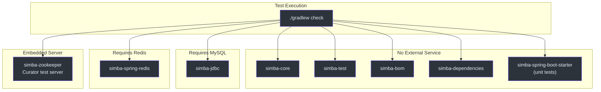
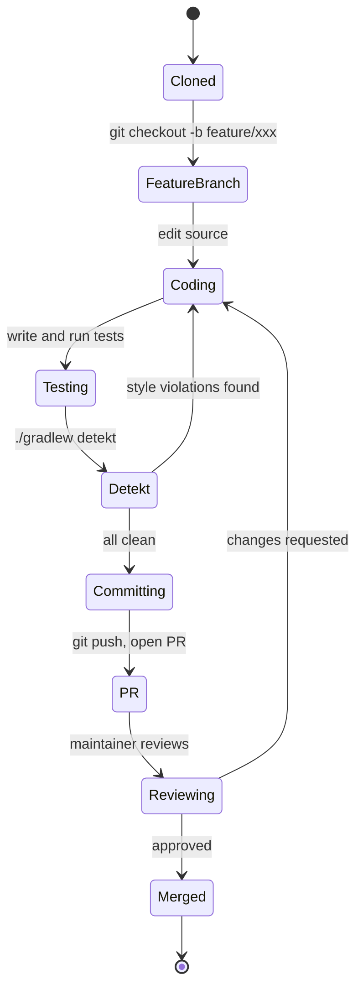
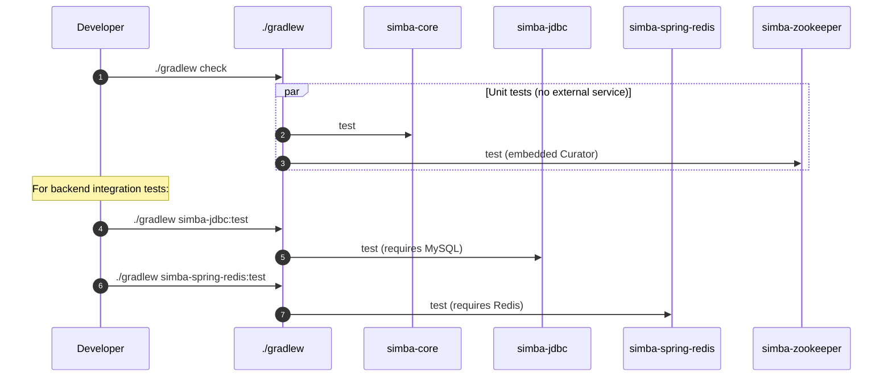
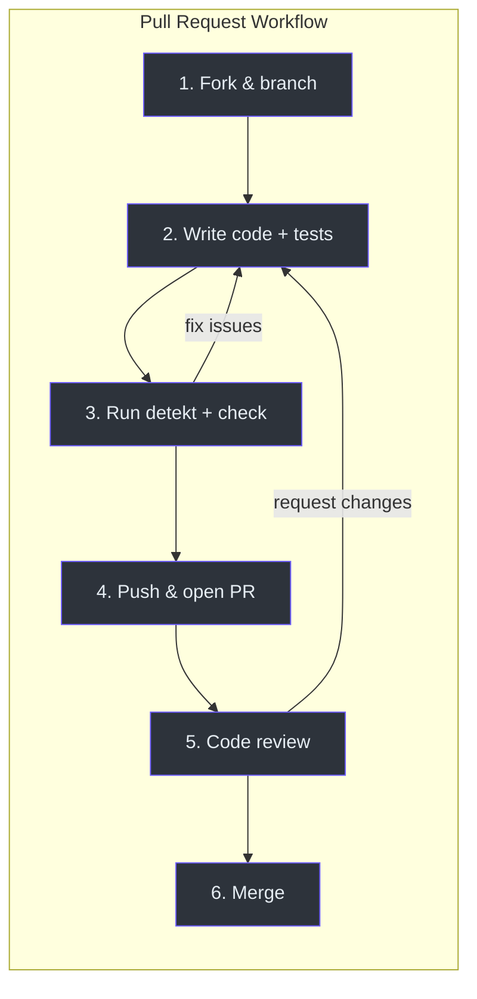

# 参与贡献

感谢你有兴趣为 Simba 做出贡献。本指南将引导你完成环境搭建、构建命令、测试要求、代码规范和 Pull Request 流程。

## 开发环境

### 前置条件

| 工具 | 版本 | 说明 |
|---|---|---|
| **JDK** | 17+ | Simba 面向 JVM 17 工具链 |
| **Gradle** | 8+（已包含 wrapper） | 使用 `./gradlew` 而非全局安装 |
| **Git** | 2.30+ | 用于克隆和分支管理 |
| **Docker**（可选） | 最新版 | 用于在本地运行 MySQL 和 Redis 容器 |
| **IntelliJ IDEA**（推荐） | 2024+ | 内置 Kotlin 和 Gradle 支持 |

### 克隆和构建

```bash
git clone https://github.com/Ahoo-Wang/Simba.git
cd Simba
./gradlew build
```

`build` 任务会编译所有模块并运行不需要外部服务的测试。

## 构建命令

| 命令 | 用途 |
|---|---|
| `./gradlew build` | 编译所有模块并运行测试 |
| `./gradlew check` | 运行所有测试（与 build 中的测试相同） |
| `./gradlew simba-core:check` | 测试单个模块 |
| `./gradlew detekt` | 使用 Detekt 进行静态分析 |
| `./gradlew codeCoverageReport` | 聚合 JaCoCo 覆盖率报告 |
| `./gradlew clean` | 清除构建产物 |

提交代码变更前请先运行 Detekt：

```bash
./gradlew detekt
```

Detekt 配置在 [`config/detekt/detekt.yml`]([file_path:config/detekt/detekt.yml](https://github.com/Ahoo-Wang/Simba/blob/main/config/detekt/detekt.yml)) 中，并启用了 `autoCorrect = true`，因此许多代码风格问题会在下次构建时自动修复。

## 各后端的测试要求

并非所有模块都能通过简单的 `./gradlew check` 来测试。每个后端有不同的要求：



### simba-jdbc（MySQL）

需要一个正在运行的 MySQL 实例。运行测试前请先执行初始化脚本：

```bash
mysql -u root -p < simba-jdbc/src/init-script/init-simba-mysql.sql
```

或使用 Docker：

```bash
docker run -d --name simba-mysql \
  -e MYSQL_ROOT_PASSWORD=root \
  -e MYSQL_DATABASE=simba \
  -p 3306:3306 \
  mysql:8.0

# Wait for startup, then:
mysql -h 127.0.0.1 -u root -proot simba < simba-jdbc/src/init-script/init-simba-mysql.sql
```

### simba-spring-redis（Redis）

需要一个正在运行的 Redis 实例：

```bash
docker run -d --name simba-redis -p 6379:6379 redis:7
```

### simba-zookeeper

无需外部服务。测试使用 Curator 的内嵌测试服务器（`TestingServer`）。

## 代码规范

### Kotlin 编码规范

- 遵循 [Kotlin 编码规范](https://kotlinlang.org/docs/coding-conventions.html)。
- 优先使用 `val` 而非 `var`。优先使用不可变数据结构。
- 单表达式函数使用表达式体。
- Lambda 参数使用描述性名称。

### Detekt 规则

Detekt 强制执行在 [`config/detekt/detekt.yml`]([file_path:config/detekt/detekt.yml](https://github.com/Ahoo-Wang/Simba/blob/main/config/detekt/detekt.yml)) 中定义的静态分析规则。关键规则：

| 规则 | 说明 |
|---|---|
| `MaxLineLength` | 每行最多 120 个字符 |
| `TooManyFunctions` | 每个类超过 11 个函数时发出警告 |
| `LongParameterList` | 超过 6 个参数时发出警告 |
| `WildcardImport` | 禁止 -- 使用显式导入 |

自动纠错已启用（`autoCorrect = true`），因此运行 `./gradlew detekt` 即可修复许多问题。

### 测试规范

- 测试使用 **JUnit 5**（Jupiter），配置 `useJUnitPlatform()`。
- 后端测试类继承 `simba-test` 中的基类。
- 使用 **fluent-assert** 库（`me.ahoo.test:fluent-assert-core`）进行断言：

```kotlin
import me.ahoo.test.asserts.assert

// Correct -- use .assert() extension
result.assert().isEqualTo(expected)

// Avoid -- verbose and not null-safe in Kotlin
assertThat(result).isEqualTo(expected)
```

- 使用 **MockK**（`io.mockk:mockk`）进行 Kotlin 中的 mock。
- 测试源文件放置在 `src/test/kotlin/me/ahoo/simba/` 目录下，镜像主源码目录结构。

## 开发工作流



## 测试执行时序



## PR 流程



### 详细步骤

1. **Fork 并创建分支** -- 在 GitHub 上 Fork 仓库，然后从 `main` 创建功能分支。
2. **编写代码和测试** -- 实现你的修改。在对应的测试源码集中添加或更新测试。
3. **运行静态分析和测试** -- 推送前执行完整的检查：

   ```bash
   ./gradlew detekt check
   ```

4. **推送并创建 PR** -- 推送你的分支并向 `main` 发起 Pull Request。在 PR 模板中填写：
   - 变更内容及其原因。
   - 相关 Issue 的链接。
   - 给审查者的备注（例如权衡取舍、后续工作）。
5. **代码审查** -- 维护者会审查 PR。通过推送额外的提交来处理反馈。
6. **合并** -- 获得批准后，PR 会被 squash 合并到 `main`。

### 提交信息格式

遵循 [Conventional Commits](https://www.conventionalcommits.org/) 规范：

```
<type>(<scope>): <description>

[optional body]
```

类型：`feat`、`fix`、`refactor`、`test`、`docs`、`chore`、`ci`。

作用域通常是模块名称：`core`、`jdbc`、`redis`、`zookeeper`、`spring-boot-starter`、`deps`。

示例：

```
feat(redis): add pub/sub notification for lock release
fix(jdbc): handle race condition in owner update
test(core): add unit tests for ContendPeriod jitter
```

## 项目结构参考

```mermaid
graph TD
    subgraph sg_72 ["Repository"]
        direction TB
        ROOT["Simba (root)"]
        SC["simba-core"]
        SJ["simba-jdbc"]
        SR["simba-spring-redis"]
        SZ["simba-zookeeper"]
        SBS["simba-spring-boot-starter"]
        ST["simba-test"]
        SB["simba-bom"]
        SD["simba-dependencies"]
        SE["simba-example"]
        CCR["code-coverage-report"]
        CFG["config/detekt"]
    end

    ROOT --> SC
    ROOT --> SJ
    ROOT --> SR
    ROOT --> SZ
    ROOT --> SBS
    ROOT --> ST
    ROOT --> SB
    ROOT --> SD
    ROOT --> SE
    ROOT --> CCR
    ROOT --> CFG

    style ROOT fill:#2d333b,stroke:#6d5dfc,color:#e6edf3
    style SC fill:#2d333b,stroke:#6d5dfc,color:#e6edf3
    style SJ fill:#2d333b,stroke:#6d5dfc,color:#e6edf3
    style SR fill:#2d333b,stroke:#6d5dfc,color:#e6edf3
    style SZ fill:#2d333b,stroke:#6d5dfc,color:#e6edf3
    style SBS fill:#2d333b,stroke:#6d5dfc,color:#e6edf3
    style ST fill:#2d333b,stroke:#6d5dfc,color:#e6edf3
    style SB fill:#2d333b,stroke:#6d5dfc,color:#e6edf3
    style SD fill:#2d333b,stroke:#6d5dfc,color:#e6edf3
    style SE fill:#2d333b,stroke:#6d5dfc,color:#e6edf3
    style CCR fill:#2d333b,stroke:#6d5dfc,color:#e6edf3
    style CFG fill:#2d333b,stroke:#6d5dfc,color:#e6edf3

```



## 相关页面

- [快速开始](/zh/guide/quick-start) -- 将 Simba 添加到你的项目中。
- [配置参考](/zh/guide/configuration) -- 调整后端和时序参数。
- [架构设计](/architecture/) -- 了解设计原理。
