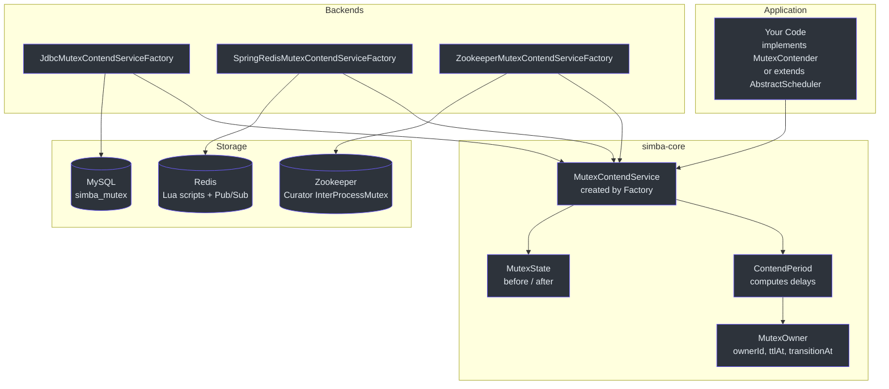
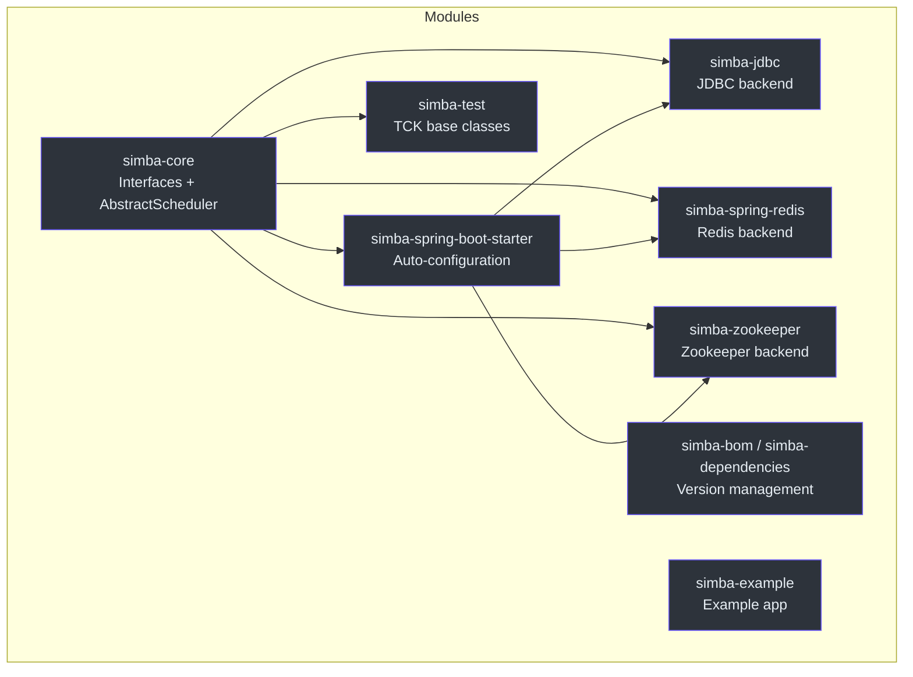
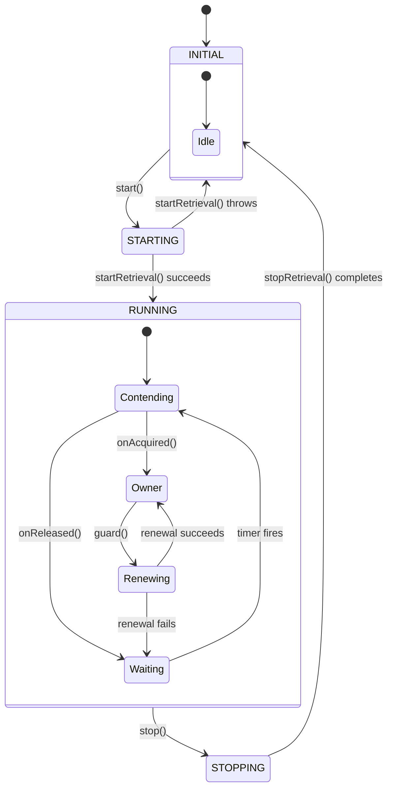

# Simba 简介

Simba 是一个面向 JVM 的分布式互斥锁（分布式锁）库，使用 Kotlin 编写。它使多个应用实例能够通过在任意时刻选举出单一领导者来协调对共享资源的访问。与重量级的协调服务不同，Simba 是一个轻量级的库，你只需将其作为依赖引入即可 -- 无需单独部署服务进程。

## 为什么需要 Simba

在水平扩展的服务中，你经常需要恰好一个实例来执行某项任务：运行定时作业、写入共享资源或协调部署。Simba 通过一个简单的协议来解决这个问题，该协议由你选择的存储方案支持：你已有的关系数据库（JDBC/MySQL）、Redis 实例，或 Zookeeper 集群。

核心设计目标：

- **简洁的 API** -- 三种抽象级别（回调式、RAII 式、调度器式），让你根据场景选择最合适的方式。
- **可插拔的存储** -- 无需修改应用代码即可切换后端。
- **公平性** -- 随机抖动防止惊群效应问题。
- **Spring 原生** -- 通过 Spring Boot starter 实现自动配置，并提供功能能力标志。

## 核心概念

### 互斥锁（Mutex）

**互斥锁**是一种命名资源，同一时刻最多只能有一个竞争者拥有它。在 Simba 中，互斥锁通过一个普通字符串来标识（例如 `"my-scheduled-job"`）。所有引用相同互斥锁字符串的竞争者都竞争同一把锁。

[`MutexRetriever`]([file_path:simba-core/src/main/kotlin/me/ahoo/simba/core/MutexRetriever.kt](https://github.com/Ahoo-Wang/Simba/blob/main/simba-core/src/main/kotlin/me/ahoo/simba/core/MutexRetriever.kt)) 接口定义了契约：

```kotlin
interface MutexRetriever {
    val mutex: String
    fun notifyOwner(mutexState: MutexState)
}
```

### 竞争者（Contender）

**竞争者**是参与互斥锁竞争的应用实例。每个竞争者都有一个唯一的 `contenderId` -- 默认通过 [`ContenderIdGenerator`]([file_path:simba-core/src/main/kotlin/me/ahoo/simba/core/ContenderIdGenerator.kt](https://github.com/Ahoo-Wang/Simba/blob/main/simba-core/src/main/kotlin/me/ahoo/simba/core/ContenderIdGenerator.kt)) 基于主机名和进程 ID 生成。[`MutexContender`]([file_path:simba-core/src/main/kotlin/me/ahoo/simba/core/MutexContender.kt](https://github.com/Ahoo-Wang/Simba/blob/main/simba-core/src/main/kotlin/me/ahoo/simba/core/MutexContender.kt)) 接口扩展了 `MutexRetriever`，并添加了 `onAcquired` / `onReleased` 回调。

### 所有者（Owner）

**所有者**是当前持有互斥锁的竞争者。所有权由 [`MutexOwner`]([file_path:simba-core/src/main/kotlin/me/ahoo/simba/core/MutexOwner.kt](https://github.com/Ahoo-Wang/Simba/blob/main/simba-core/src/main/kotlin/me/ahoo/simba/core/MutexOwner.kt)) 记录表示，包含以下字段：

| 字段 | 含义 |
|---|---|
| `ownerId` | 当前所有者的 `contenderId`（如果没有所有者则为空字符串）。 |
| `acquiredAt` | 获取所有权的时间戳。 |
| `ttlAt` | TTL 窗口到期的绝对时间。 |
| `transitionAt` | 过渡（宽限）窗口到期的绝对时间。 |

### TTL（生存时间）

**TTL** 是竞争者持有独占所有权的持续时间。在 TTL 到期之前，所有者必须通过调用 guard 操作来**续租**。如果续租成功，TTL 会被延长；如果续租失败或所有者崩溃，所有权将失效。

### 过渡期（Transition）

**过渡期**是 TTL 到期后开始的宽限期。在过渡期间：

1. 当前所有者可以优先续租（使领导权保持稳定）。
2. 非所有者竞争者在随机抖动后等待，然后再尝试获取。

这种两阶段设计（TTL + 过渡期）既给了现任所有者公平的续租机会，又保证了当所有者失去响应时系统最终的可用性。

## 概览速查

| 方面 | 详情 |
|---|---|
| **语言** | Kotlin（JVM 17+） |
| **制品** | `me.ahoo.simba:simba-core` + 后端模块 |
| **后端** | JDBC/MySQL、Redis、Zookeeper |
| **API** | `MutexContender`（回调式）、`SimbaLocker`（RAII 式）、`AbstractScheduler`（调度式） |
| **Spring Boot** | 通过 `simba-spring-boot-starter` 自动配置 |
| **许可证** | Apache 2.0 |
| **版本** | 3.0.2 |

## 架构概览

下图展示了主要组件之间的连接关系：



## 模块地图



## 锁生命周期状态图

下图展示了 `MutexContendService` 所经历的状态：



## 对比：Simba 与其他方案

| 特性 | Simba | Redisson | Curator | ShedLock |
|---|---|---|---|---|
| **存储** | JDBC、Redis、Zookeeper | 仅 Redis | 仅 Zookeeper | JDBC、Redis、Mongo |
| **API 风格** | 回调式、RAII 式、调度器式 | Lock、Semaphore 等 | InterProcessMutex | 基于注解 |
| **领导者选举** | 内置（TTL + 过渡期） | 基于锁 | 临时节点 | 不适用 |
| **定时任务支持** | `AbstractScheduler` | 未内置 | 未内置 | 核心功能 |
| **惊群效应缓解** | 随机抖动（-200ms..+1s） | 发布/订阅等待 | 基于 Watch | 不适用 |
| **Spring Boot Starter** | 是 | 是 | 否 | 是 |
| **Kotlin 优先** | 是 | Java 优先 | Java 优先 | Java 优先 |
| **许可证** | Apache 2.0 | Apache 2.0 | Apache 2.0 | Apache 2.0 |

## 相关页面

- [快速开始](/zh/guide/quick-start) -- 添加依赖并运行你的第一个分布式锁。
- [配置参考](/zh/guide/configuration) -- Spring Boot 属性和编程式配置的完整参考。
- [架构概览](/architecture/) -- 深入了解抽象链和竞争机制。
- [参与贡献](/zh/guide/contributing) -- 设置开发环境并提交 PR。
