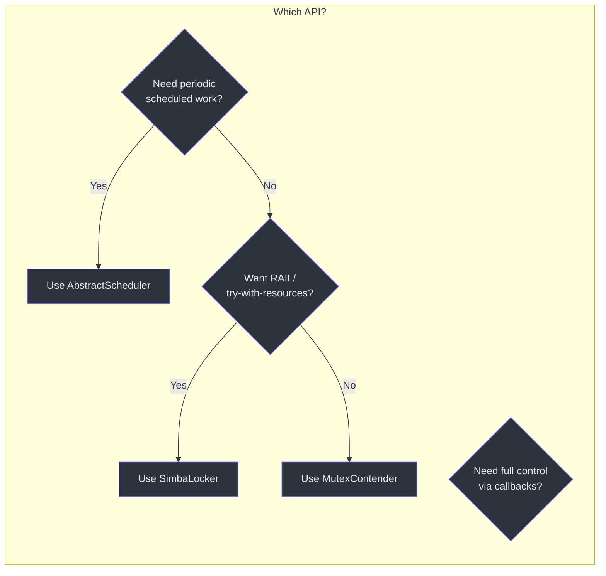
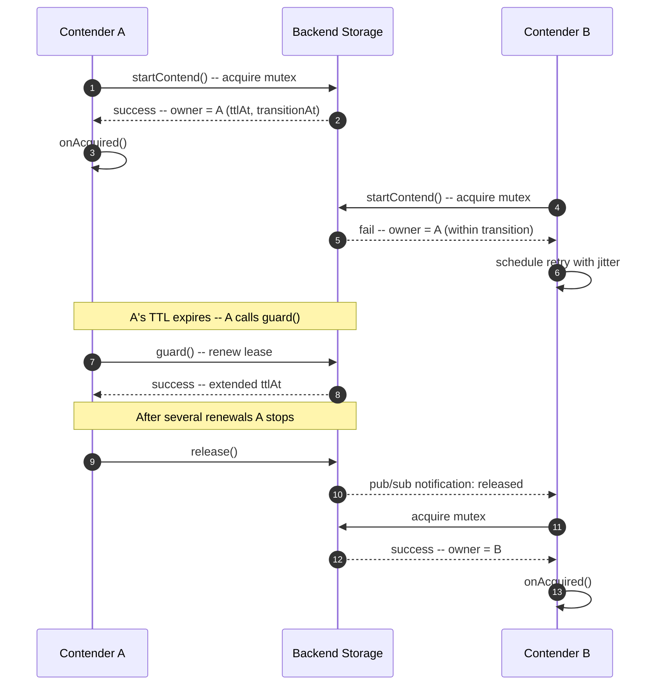
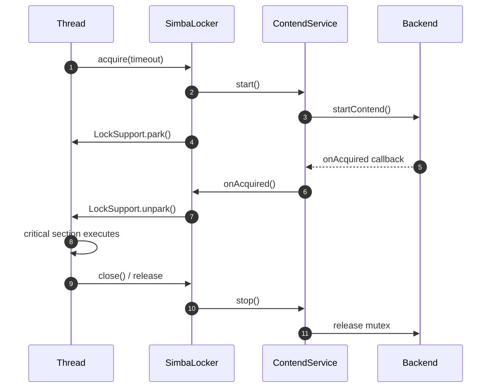
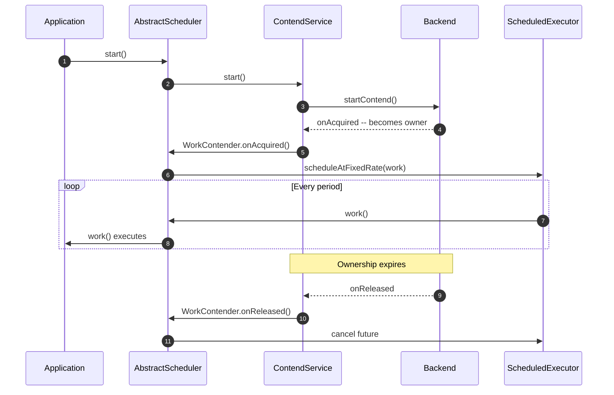

# 快速开始

本指南将带你完成 Simba 的项目集成、后端配置，以及用几行代码获取分布式锁的全过程。

## 前置条件

- **JDK 17** 或更高版本（Simba 面向 JVM 17 工具链）
- **Gradle 8+**（推荐使用 Kotlin DSL）或 **Maven 3.9+**
- 一个已运行的后端实例：MySQL、Redis 或 Zookeeper

## 添加依赖

Simba 采用多模块组织。你需要核心模块加上恰好一个后端模块。如果使用 Spring Boot，starter 会处理自动配置。

### Gradle Kotlin DSL

::: code-group

```kotlin [JDBC/MySQL]
implementation("me.ahoo.simba:simba-jdbc:3.1.0")
```

```kotlin [Redis]
implementation("me.ahoo.simba:simba-spring-redis:3.1.0")
```

```kotlin [Zookeeper]
implementation("me.ahoo.simba:simba-zookeeper:3.1.0")
```

```kotlin [Spring Boot Starter（还需添加一个后端）]
implementation("me.ahoo.simba:simba-spring-boot-starter:3.1.0")
implementation("me.ahoo.simba:simba-jdbc:3.1.0")  // 或 simba-spring-redis，或 simba-zookeeper
```

:::

### Maven XML

::: code-group

```xml [JDBC/MySQL]
<dependency>
    <groupId>me.ahoo.simba</groupId>
    <artifactId>simba-jdbc</artifactId>
    <version>3.1.0</version>
</dependency>
```

```xml [Redis]
<dependency>
    <groupId>me.ahoo.simba</groupId>
    <artifactId>simba-spring-redis</artifactId>
    <version>3.1.0</version>
</dependency>
```

```xml [Zookeeper]
<dependency>
    <groupId>me.ahoo.simba</groupId>
    <artifactId>simba-zookeeper</artifactId>
    <version>3.1.0</version>
</dependency>
```

```xml [Spring Boot Starter]
<dependency>
    <groupId>me.ahoo.simba</groupId>
    <artifactId>simba-spring-boot-starter</artifactId>
    <version>3.1.0</version>
</dependency>
```

:::

## 选择你的 API 级别

Simba 提供三个 API 级别。根据你的使用场景选择合适的：



## 使用 MutexContender 的基本用法

使用 Simba 最简单的方式是实现 [`MutexContender`]([file_path:simba-core/src/main/kotlin/me/ahoo/simba/core/MutexContender.kt](https://github.com/Ahoo-Wang/Simba/blob/main/simba-core/src/main/kotlin/me/ahoo/simba/core/MutexContender.kt))。你会在获取或丢失锁时收到回调通知。

```kotlin
import me.ahoo.simba.core.AbstractMutexContender
import me.ahoo.simba.core.MutexContendServiceFactory
import me.ahoo.simba.core.MutexState

class LeaderContender(mutex: String) : AbstractMutexContender(mutex) {
    override fun onAcquired(mutexState: MutexState) {
        println("[$contenderId] acquired leadership for mutex: $mutex")
    }

    override fun onReleased(mutexState: MutexState) {
        println("[$contenderId] lost leadership for mutex: $mutex")
    }
}
```

创建竞争者并启动竞争：

```kotlin
val factory: MutexContendServiceFactory = /* obtain from backend, e.g. JdbcMutexContendServiceFactory */
val contender = LeaderContender("my-task-lock")
val service = factory.createMutexContendService(contender)
service.start()

// When done:
service.stop()
```

## 使用 SimbaLocker

[`SimbaLocker`]([file_path:simba-core/src/main/kotlin/me/ahoo/simba/locker/SimbaLocker.kt](https://github.com/Ahoo-Wang/Simba/blob/main/simba-core/src/main/kotlin/me/ahoo/simba/locker/SimbaLocker.kt)) 实现了 `AutoCloseable` 接口，因此你可以在 try-with-resources 代码块中使用它。调用线程会阻塞直到获取锁为止。

```kotlin
import me.ahoo.simba.locker.SimbaLocker
import java.time.Duration

val factory: MutexContendServiceFactory = /* ... */

SimbaLocker("my-task-lock", factory).use { locker ->
    locker.acquire()
    println("Lock acquired -- doing critical work")
    // lock is released automatically when the block exits
}

// With a timeout:
SimbaLocker("my-task-lock", factory).use { locker ->
    locker.acquire(Duration.ofSeconds(30))
    println("Lock acquired within 30s")
}
```

## 使用 AbstractScheduler

[`AbstractScheduler`]([file_path:simba-core/src/main/kotlin/me/ahoo/simba/schedule/AbstractScheduler.kt](https://github.com/Ahoo-Wang/Simba/blob/main/simba-core/src/main/kotlin/me/ahoo/simba/schedule/AbstractScheduler.kt)) 非常适合只需在当前领导者实例上执行的周期性任务。它会在领导权变更时自动启动和停止调度工作。

```kotlin
import me.ahoo.simba.core.MutexContendServiceFactory
import me.ahoo.simba.schedule.AbstractScheduler
import me.ahoo.simba.schedule.ScheduleConfig
import java.time.Duration

class MyCleanupScheduler(
    contendServiceFactory: MutexContendServiceFactory
) : AbstractScheduler("cleanup-task", contendServiceFactory) {

    override val config: ScheduleConfig = ScheduleConfig.rate(
        initialDelay = Duration.ofSeconds(0),
        period = Duration.ofMinutes(5)
    )

    override val worker: String = "cleanup-worker"

    override fun work() {
        println("Running cleanup on leader instance...")
    }
}

// Start the scheduler
val scheduler = MyCleanupScheduler(factory)
scheduler.start()

// Stop when shutting down
scheduler.stop()
```

## Spring Boot 自动配置

使用 Spring Boot starter 后，Simba 会自动配置一切。你只需为你选择的后端设置启用标志即可。

**application.yml**

```yaml
simba:
  jdbc:
    enabled: true
    initial-delay: 0s
    ttl: 10s
    transition: 6s
```

自动配置会为你创建 `MutexContendServiceFactory` Bean。注入它即可直接使用：

```kotlin
import org.springframework.stereotype.Component
import me.ahoo.simba.core.AbstractMutexContender
import me.ahoo.simba.core.MutexContendServiceFactory
import me.ahoo.simba.core.MutexState
import jakarta.annotation.PostConstruct
import jakarta.annotation.PreDestroy

@Component
class MyLeaderTask(
    private val contendServiceFactory: MutexContendServiceFactory
) : AbstractMutexContender("spring-task-lock") {

    private val service = contendServiceFactory.createMutexContendService(this)

    @PostConstruct
    fun onStart() = service.start()

    @PreDestroy
    fun onStop() = service.stop()

    override fun onAcquired(mutexState: MutexState) {
        println("This instance is now the leader!")
    }

    override fun onReleased(mutexState: MutexState) {
        println("Leadership lost.")
    }
}
```

## 锁获取时序图

下图展示了两个竞争者竞争同一互斥锁的完整时序：



## Locker 获取时序图



## 调度器生命周期时序图



## 后续步骤

- [配置参考](/zh/guide/configuration) -- 调整每个后端的 TTL、过渡期和初始延迟。
- [架构概览](/architecture/) -- 深入了解抽象链的工作原理。
- [参与贡献](/zh/guide/contributing) -- 设置开发环境并运行测试套件。
