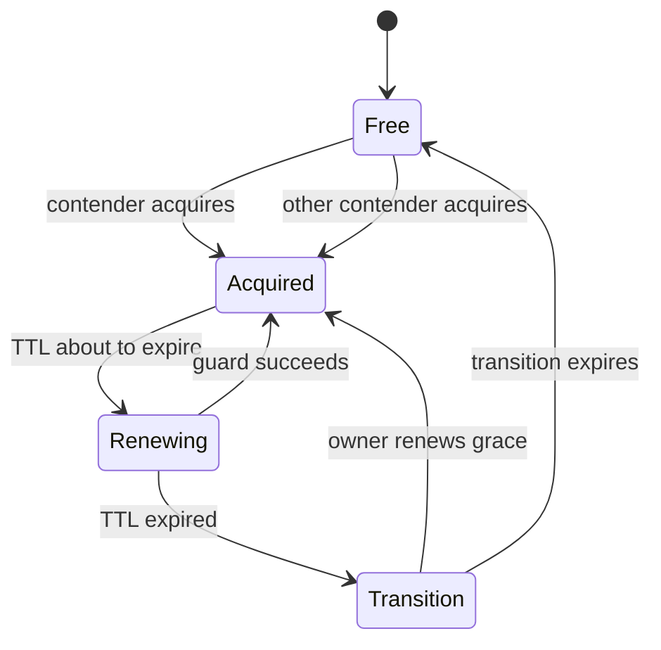
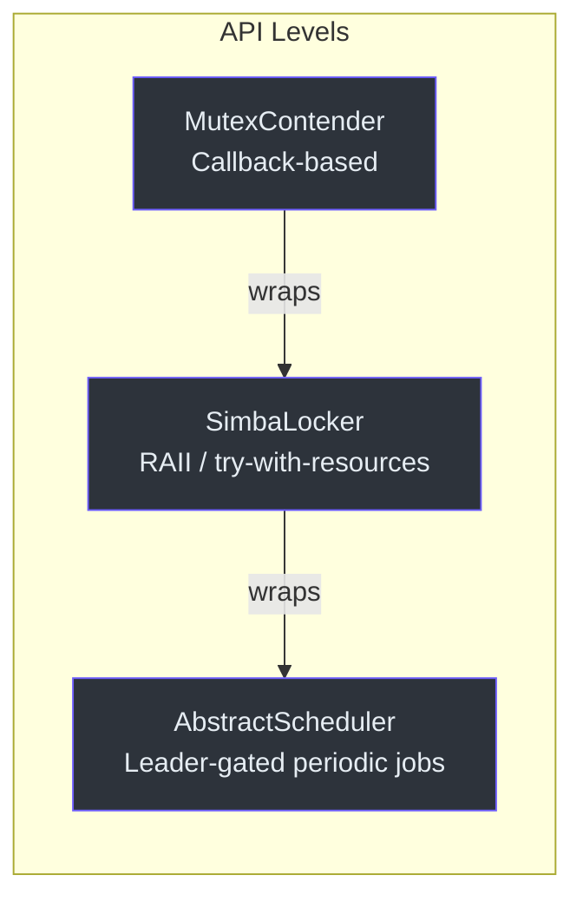
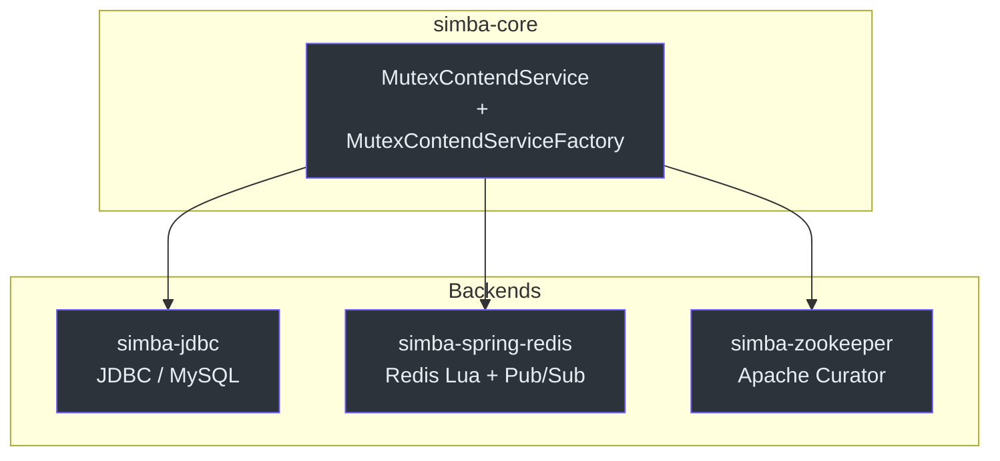

## 工作原理

Simba 采用协作式领导者选举协议。每个竞争者争夺一个命名的互斥锁，获胜者在可配置的 TTL 窗口内成为所有者。当 TTL 到期时，进入过渡期，当前所有者可以优先续租。非所有者竞争者使用随机抖动唤醒，以减少冲突。



## 三种锁 API

Simba 提供三个层次的抽象，你可以根据使用场景选择最合适的：



## 后端存储



## 快速示例

```kotlin
class MyContender : AbstractMutexContender("my-mutex") {
    override fun onAcquired(mutexState: MutexState) {
        println("I am the owner!")
    }
    override fun onReleased(mutexState: MutexState) {
        println("Lost leadership.")
    }
}
```
