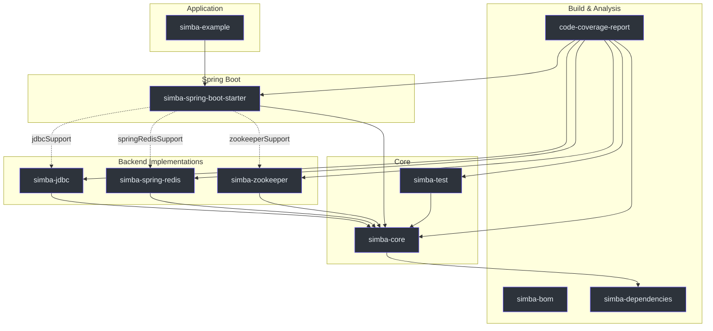
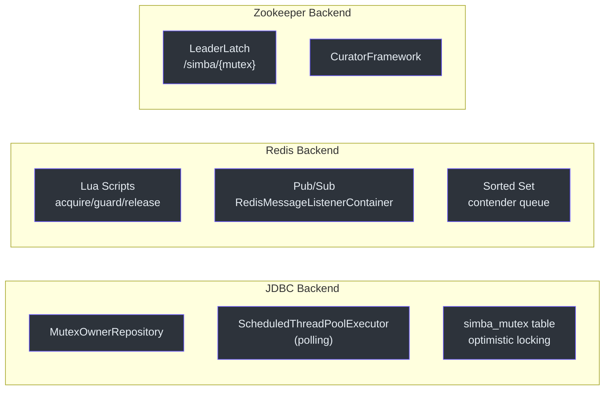

# 模块概览

Simba 组织为多模块 Gradle 项目。每个模块职责明确，从核心抽象到后端特定实现以及 Spring Boot 自动配置。

## 模块依赖关系图



## 模块目录

| 模块 | 职责 | 关键类型 | 依赖 |
|---|---|---|---|
| **simba-core** | 核心接口、抽象类、值对象 | `MutexContender`、`MutexContendService`、`SimbaLocker`、`AbstractScheduler` | kotlin-logging、cosid-core、guava |
| **simba-jdbc** | JDBC/MySQL 后端，使用乐观锁 | `JdbcMutexContendService`、`JdbcMutexOwnerRepository` | simba-core、JDBC 驱动 |
| **simba-spring-redis** | Redis 后端，使用 Lua 脚本和发布/订阅 | `SpringRedisMutexContendService`、Lua 脚本 | simba-core、spring-data-redis |
| **simba-zookeeper** | Zookeeper 后端，使用 Curator LeaderLatch | `ZookeeperMutexContendService` | simba-core、curator-recipes |
| **simba-spring-boot-starter** | 所有后端的自动配置 | `SimbaJdbcAutoConfiguration`、`SimbaSpringRedisAutoConfiguration`、`SimbaZookeeperAutoConfiguration` | simba-core + 条件性后端依赖 |
| **simba-test** | TCK（技术兼容性套件） | `MutexContendServiceSpec`、`LockSpec` | simba-core、JUnit 5 |
| **simba-bom** | BOM（物料清单），用于版本管理 | -- | -- |
| **simba-dependencies** | 依赖版本约束 | -- | -- |
| **simba-example** | 示例应用 | `ExampleApp` | simba-spring-boot-starter |
| **code-coverage-report** | JaCoCo 聚合报告 | -- | 所有模块 |

## 后端对比



| 特性 | JDBC | Redis | Zookeeper |
|---|---|---|---|
| **协调机制** | 使用 `ScheduledThreadPoolExecutor` 轮询 | Lua 脚本 + 发布/订阅 | Curator `LeaderLatch` |
| **锁存储** | `simba_mutex` 表 | Redis 键（`simba:{mutex}`） | ZNode（`/simba/{mutex}`） |
| **所有权转移** | 通过 `version` 列进行乐观锁 | 有序集合等待队列 + 发布/订阅通知 | ZK 对 latch 参与者的 watcher |
| **时间源** | MySQL `current_timestamp(3)` | 系统时钟（客户端侧） | ZK 服务器时间 |
| **外部依赖** | MySQL 实例 | Redis 实例 | ZooKeeper 集群 |
| **最适合** | 已有关系型数据库基础设施 | 高吞吐量、低延迟 | 强一致性保证 |

## Gradle 功能变体

`simba-spring-boot-starter` 使用 Gradle 功能变体，使消费者只需引入所需的后端依赖：

```kotlin
dependencies {
    // 仅引入 Redis 后端
    implementation("me.ahoo.simba:simba-spring-boot-starter") {
        capabilities {
            requireCapability("me.ahoo.simba:spring-redis-support")
        }
    }
}
```

可用的功能变体：

| 变体 | 功能标识 | 后端模块 |
|---|---|---|
| `springRedisSupport` | `me.ahoo.simba:spring-redis-support` | simba-spring-redis |
| `jdbcSupport` | `me.ahoo.simba:jdbc-support` | simba-jdbc |
| `zookeeperSupport` | `me.ahoo.simba:zookeeper-support` | simba-zookeeper |

## 另请参阅

- [simba-core](./simba-core) -- 核心抽象和设计模式
- [simba-jdbc](./simba-jdbc) -- JDBC/MySQL 后端
- [simba-spring-redis](./simba-spring-redis) -- Redis 后端
- [simba-zookeeper](./simba-zookeeper) -- Zookeeper 后端
- [simba-spring-boot-starter](./simba-spring-boot-starter) -- Spring Boot 自动配置
- [simba-test](./simba-test) -- TCK 测试基类
